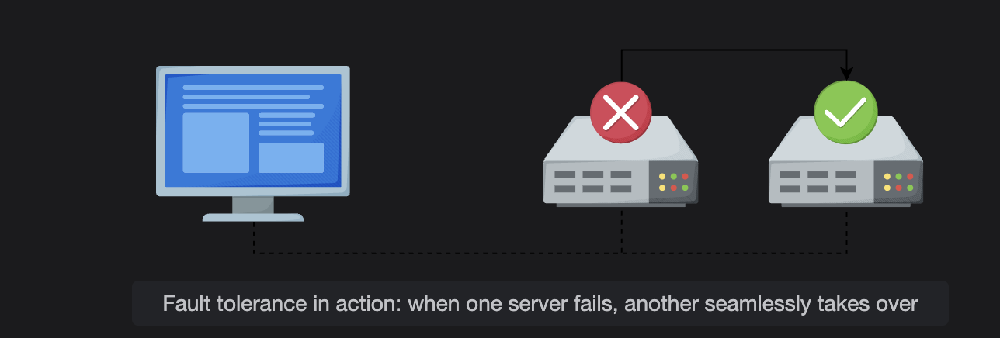
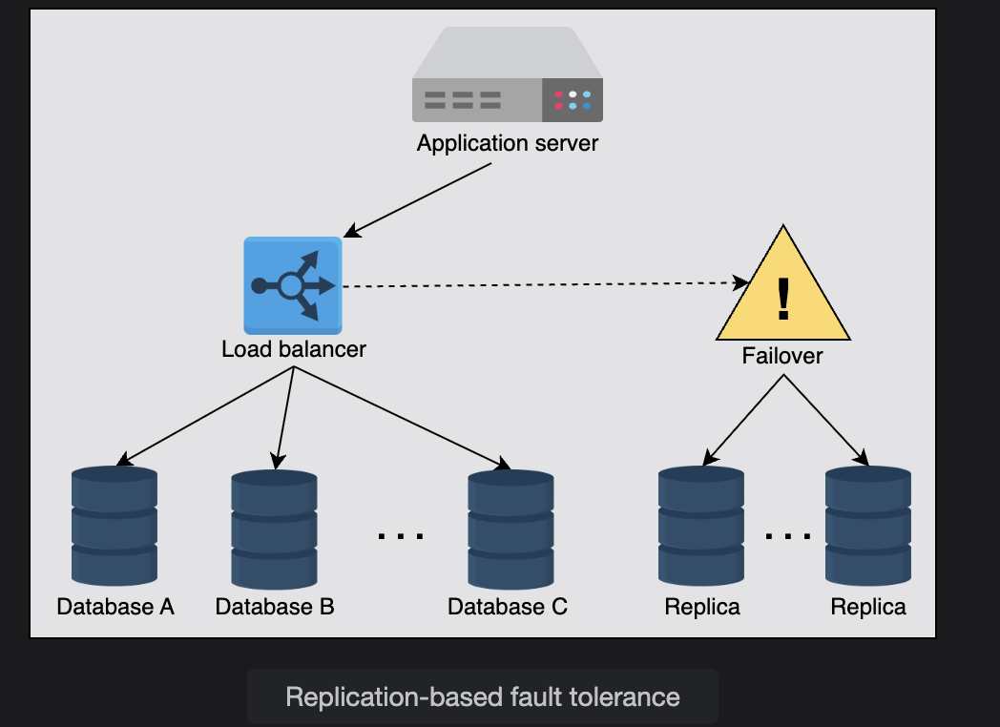
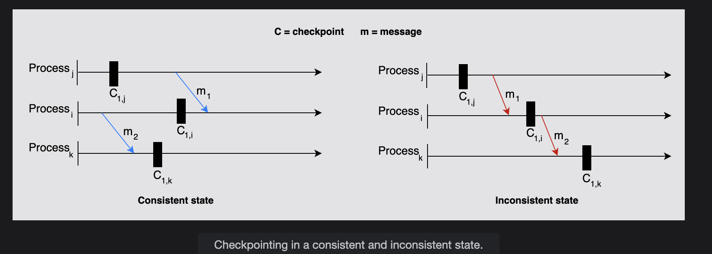

# Fault Tolerance
Learn about fault tolerance, how to measure it, and its importance.

---

## What is Fault Tolerance?
Real-world, large-scale applications run hundreds of servers and databases to accommodate billions of users' requests and store significant data. These applications need a mechanism that helps with **data safety** and avoids recalculation of computationally intensive tasks by preventing a **single point of failure**.

**Fault tolerance** refers to a system’s ability to continue executing persistently even if one or more of its components fail. These components can be **software** or **hardware**. Designing a system that is **100% fault-tolerant** is practically very difficult.

---

## Why is Fault Tolerance Important?
Two key qualities make fault tolerance essential:  

- **Availability** → ensures the system remains accessible and can receive client requests anytime.  
- **Reliability** → ensures the system consistently processes requests and performs the correct actions.  

---

## Fault Tolerance in Action
👉 When one server fails, another seamlessly takes over.  

---

## Fault Tolerance Techniques
Failures occur at the hardware or software level, which eventually affect the data. Fault tolerance can be achieved using different approaches depending on the system structure.  

### 1. Replication
One of the most widely used techniques is **replication-based fault tolerance**.  

- Both **services** and **data** are replicated.  
- Failed nodes or data stores can be swapped with healthy replicas.  
- Large services can transparently switch over without impacting customers.  

**How it works:**  
- Multiple copies of data are stored separately.  
- All replicas must be updated regularly.  

**Types of replication updates:**  
- **Synchronous updates** → Strong consistency but lower availability.  
- **Asynchronous updates** → Eventual consistency (stale reads possible until replicas converge).  

⚖️ **Trade-off:** We compromise between **availability** and **consistency** (as per the **CAP theorem**).  

---

### 2. Checkpointing
**Checkpointing** saves the system’s state in stable storage for later recovery in case of failures.  

- If the system fails, it can resume from the last saved state instead of restarting from scratch.  
- Checkpointing represents a **global state** of the system execution.  

#### Types of Checkpointing States:
- **Consistent State** →  
  - All completed updates before checkpoint are saved.  
  - In-progress updates are rolled back.  
  - Includes all sent/received messages (no in-transit messages).  
  - Relationships between components remain valid.  

- **Inconsistent State** →  
  - Different processes have mismatched checkpoint states.  
  - Example: one process records a received message, but another does not record sending it.  

---

# Checkpointing in Distributed Systems

This diagram is about **checkpointing** in distributed systems.  
The goal is to capture the **global state** of all processes in such a way that it is **consistent** (no contradictions across processes).

---

## Key Concepts

- **Checkpoint (C):** A saved snapshot of a process's state at a particular time.  
- **Message (m):** Communication between processes.  

### Consistency Rule
👉 For the checkpoints of all processes together to form a **consistent global state**, the following must hold:  

- If a message is recorded as **received** in one process’s checkpoint, then the corresponding **send** must also appear in the sender’s checkpoint.  

If not, the state is **inconsistent**.

---

## Left Side (Consistent State ✅)

- Process **j** takes checkpoint `C1,j`.  
- Process **i** takes checkpoint `C1,i`.  
- Process **k** takes checkpoint `C1,k`.  

### Messages:
- `m1` (from j → i) happens **after** both checkpoints.  
- `m2` (from i → k) also happens **after** both checkpoints.  

✅ Result:  
None of the checkpoints "miss" a part of the communication history.  
The state is **consistent**.  

---

## Right Side (Inconsistent State ❌)

- Process **j** takes checkpoint `C1,j` **before** sending `m1`.  
- Process **i** takes checkpoint `C1,i` **after** receiving `m1`.  

### ⚠️ Problem:
- From **j’s checkpoint view**: message `m1` hasn’t been sent.  
- From **i’s checkpoint view**: message `m1` has already been received.  

This creates a **contradiction** → an orphan message situation (receive without send).  

- Similarly, `m2` causes the same issue between **i** and **k**.  

❌ Result:  
The global state is **inconsistent**.  

---

## ✅ Rule of Thumb

A global checkpoint state is **consistent** if there are **no orphan messages** (messages that are received but not recorded as sent).  

⚠️ Inconsistent states can lead to **incorrect recovery** after failures, because the system may “think” a message arrived when it actually hadn’t.

✅ **Summary**  
Fault tolerance ensures systems remain **available and reliable** even during failures.  
Common techniques:  
- **Replication** (data/services duplication, synchronous vs asynchronous)  
- **Checkpointing** (saving states for recovery, consistent vs inconsistent)  
