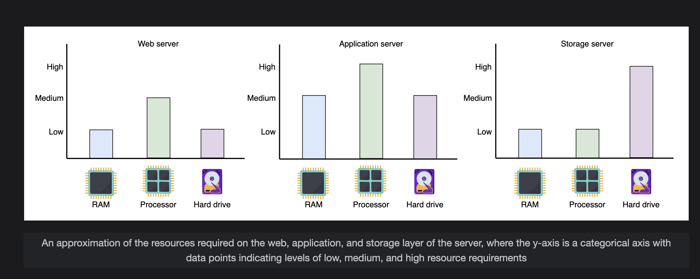
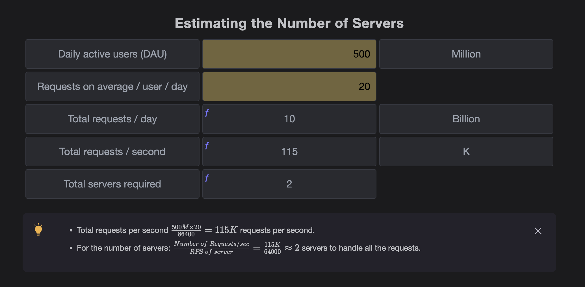
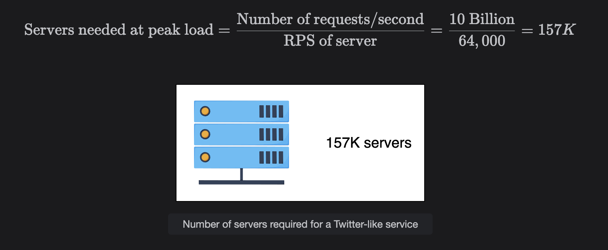
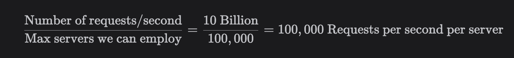
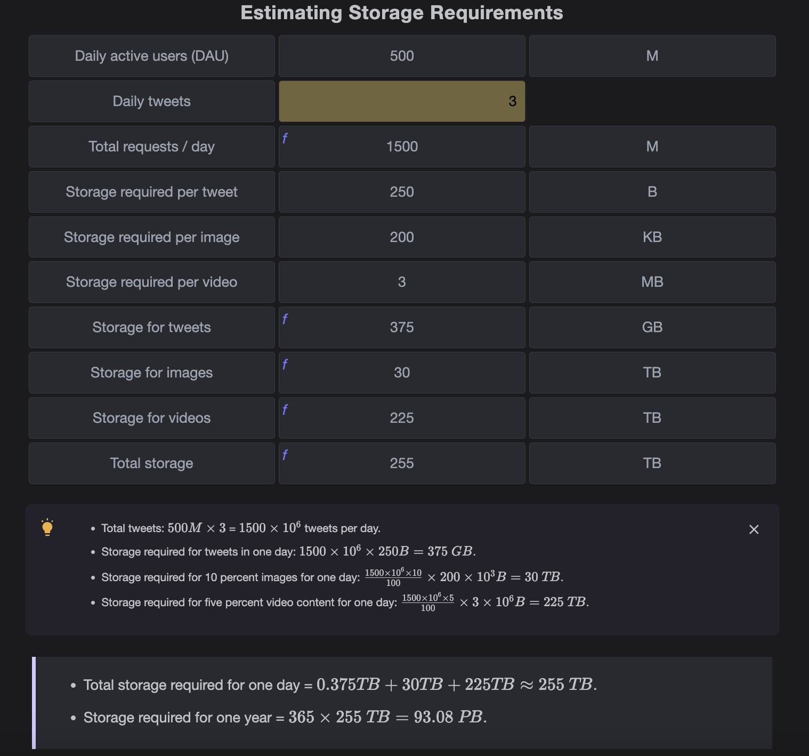
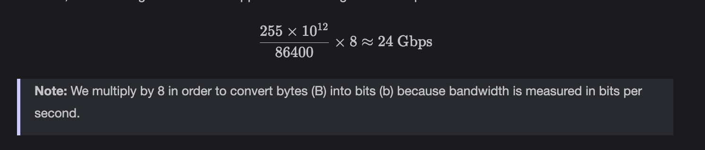
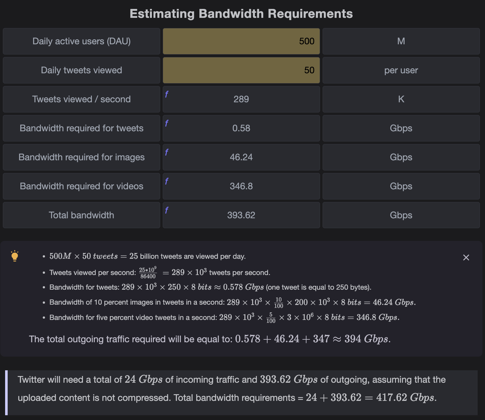
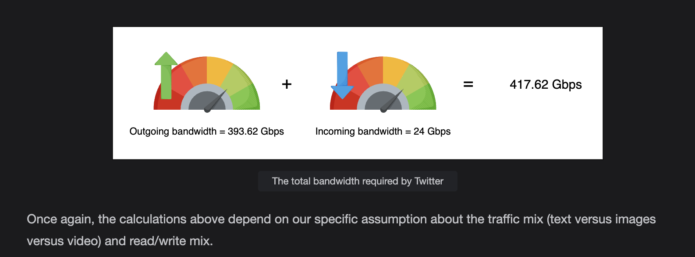

# Back-of-the-envelope Numbers (BOTECs) in System Design

## What are BOTECs?
- **Back-of-the-envelope calculations (BOTECs)** are:
  - Quick, approximate, simplified estimations.
  - Done to check feasibility or reason about a system.
  - Not meant for precise results.

👉 Think of them as a "sanity check" for large-scale systems.

### Example:
Estimating population in a neighborhood:
1. Count houses in a sample area.  
2. Estimate average people per house.  
3. Extrapolate to the full neighborhood.  

---

## BOTECs in System Design
- Modern systems are **complex webs of computational resources** connected via networks.
- Include:
  - Load balancers
  - Web servers
  - Application servers
  - Caches
  - Databases (in-memory & storage nodes)

### Why BOTECs?
- Full detail (monolithic, modular, microservices) is too complex to design on the spot.  
- BOTECs let us **ignore low-level details** and focus on **big-picture feasibility**.

### Common use-cases of BOTECs:
1. Estimating number of **concurrent TCP connections** a server can support.
2. Estimating **requests per second (RPS)** a web/app/database server can handle.
3. Estimating **storage requirements** of a service.

---

## Abstractions in BOTECs
- We hide:
  - Server-specific details.
  - Different latencies (RAM vs SSD vs network).
  - Different throughput numbers.
  - Request type variations.
- Focus only on **order-of-magnitude estimations**.

---

## Types of Data Center Servers
Data centers don’t rely on a single type of server.  
👉 Enterprises use **commodity hardware** for cost savings and scalability.

### Categories:
1. **Web Servers**
   - First point of contact after load balancers.
   - Handle **API calls from clients**.
   - Resource requirements:
     - Memory: Small → Medium  
     - Storage: Small → Medium  
     - CPU: **High processing resources needed**
   - Example: Facebook has used web servers with:
     - **32 GB RAM**
     - **500 GB storage**
   - Typically deployed in **racks of many servers**.

2. *(Application servers & storage servers would follow here — not included in your snippet but usually explained next).*

---

## Visualization (Conceptual)
- **Y-axis:** Resource needs (Low / Medium / High).  
- **X-axis:** Server types (Web / Application / Storage).  
- Each layer has **different levels of CPU, memory, and storage requirements**.

# Application Servers

Application servers run the core application software and business logic. Application servers primarily provide dynamic content, whereas web servers mostly serve static content to the client. They can require extensive computational and storage resources. Storage resources can be volatile and nonvolatile. 

Facebook has used application servers with a RAM of up to **256 GB** and two types of storage—traditional rotating disks and flash—with a capacity of up to **6.5 TB**.

---

# Storage Servers

With the explosive growth of Internet users, the amount of data stored by giant services has multiplied. Additionally, various types of data are now being stored in different storage units. For instance, YouTube uses the following data stores:

- **Blob storage** → for encoded videos  
- **Temporary processing queue storage** → holds a few hundred hours of video content uploaded daily to YouTube for processing  
- **Bigtable** → for storing a large number of video thumbnails  
- **Relational database management system (RDBMS)** → for users’ and videos’ metadata (comments, likes, user channels, etc.)  
- **Other data stores** → for analytics (e.g., Hadoop’s HDFS)  

Returning to the example of Facebook:  
They’ve used servers with a storage capacity of up to **120 TB**. With the number of servers in use, Facebook is able to house **exabytes of storage**. (One exabyte is 10^18 bytes).  

⚡ **Note**: Storage and network bandwidth are measured in **base 10**, not base 2.  
However, the RAM of these servers is only **32 GB**.

---

# Other Servers

The servers described above aren’t the only types of servers in a data center. Organizations also require servers for:

- Configuration  
- Monitoring  
- Load balancing  
- Analytics  
- Accounting  
- Caching  
- …and more  

---

# Typical Server Specifications

| **Component**   | **Count** |
|-----------------|-----------|
| **Processor**   | Intel Xeon (Sapphire Rapids 8488C) |
| **Number of cores** | 64 cores |
| **RAM**         | 256 GB |
| **Cache (L3)**  | 112.5 MB |
| **Storage capacity** | 16 TB |

---

# Standard Numbers to Remember

A lot of effort goes into the planning and implementation of a service. But without any basic knowledge of the kinds of workloads machines can handle, this planning isn’t possible. Latencies play an important role in deciding the amount of workload a machine can handle.  

The table below depicts some important numbers system designers should know for **resource estimation**.

---

## Important Latencies

| **Component** | **Time (nanoseconds)** |
|---------------|-------------------------|
| L1 cache reference | 0.9 ns |
| L2 cache reference | 2.8 ns |
| L3 cache reference | 12.9 ns |
| Main memory reference | 100 ns |
| Compress 1KB with Snzip | 3,000 ns (3 µs) |
| Read 1 MB sequentially from memory | 9,000 ns (9 µs) |
| Read 1 MB sequentially from SSD | 200,000 ns (200 µs) |
| Round trip within same datacenter | 500,000 ns (500 µs) |
| Read 1 MB sequentially from SSD (~1GB/sec SSD) | 1,000,000 ns (1 ms) |
| Disk seek | 4,000,000 ns (4 ms) |
| Read 1 MB sequentially from disk | 2,000,000 ns (2 ms) |
| Send packet SF → NYC | 71,000,000 ns (71 ms) |

⚡ **Key Insight**:  
The **order of magnitude difference** between components matters more than exact numbers.  
For example:  
- **IO-bound work** (reading 1 MB from SSD) is **100x slower** than  
- **CPU-bound work** (compressing 1 KB with snzip).

👉 Data up to the size of **L3 cache (~45 MB)** can be compressed at almost constant time since it fits entirely in the cache.

---

# Throughput Numbers

Throughput is often measured as **queries per second (QPS)** that a typical single-server datastore can handle.

| **System**          | **QPS** |
|----------------------|---------|
| MySQL (RDBMS)        | ~1,000 |
| Key-value store      | ~10,000 |
| Cache server         | 100,000 – 1,000,000 |

⚡ **Note**: These numbers are approximations and vary based on:
- Query type (point query vs range query)  
- Machine specification  
- Database design & indexing  
- Server load  

---

# Practical Note

For **real projects**:
- Initial designs use **BOTECs** (Back-of-the-Envelope Calculations), similar to system design interviews.  
- Later iterations use **synthetic benchmarks** (e.g., SPECint for CPU, TPC-C for databases).  
- Prototypes validate assumptions.  
- Monitoring & demand analysis help detect bottlenecks and plan capacity.

---

**Question :** 
With reference to the throughput numbers given above, what will be your reply if an interviewer says that they think that for a MySQL database, the average count of queries per second handled is 2000?  

**Ans**-: 2000 is in the same order of magnitude as 1000. If, for some use cases, we need more precision, we might use a range such as, say, 250 queries for complex queries, 1750 for simpler queries, and 1000 on average.

**Question:**
With reference to the table above, why does a key-value store serve an order of magnitude more queries per second as compared to a MySQL database?  

**Ans**-: 
A typical key-value store has a simpler API (put and get) compared to a relational database query that needs to go through query planning before query execution. On the same lines, in-memory caches have read and write operations, which are again simpler than a database query. If such a cache is primarily used for reading, it can serve even more requests per second.

Like the memory hierarchy inside a server, we need to keep the relative benefits of these systems (relational database, key-value store, and in-memory caches) in perspective. Doing so allows us to use some reasonable number for databases and then use the order of magnitude difference to develop related numbers for key-value stores and caches.  

# Request Types

While estimating the number of requests a server can handle, we usually don’t get into the details of the **type of request**.  
But in reality, all requests are not the same. Workloads (clients’ requests) can be broadly classified into three categories:

---

### CPU-bound Requests
- Depend primarily on the **processor** of a node.  
- Example: compressing **1 KB of data** using snzip.  
- From the table above, this operation takes **3 microseconds**.

---

### Memory-bound Requests
- Bottlenecked by the **memory subsystem**.  
- Example: reading **1 MB of data sequentially from RAM**.  
- This operation takes **9 microseconds** (≈ 3× slower than CPU-bound).

---

### IO-bound Requests
- Bottlenecked by the **I/O subsystem** (disks or network).  
- Example: reading **1 MB of data sequentially from disk**.  
- This operation takes **200 microseconds** (≈ 66× slower than CPU-bound).

---

### Simplification (BOTEC Assumptions)
- If a CPU-bound request takes **X** units of time:
  - Memory-bound ≈ **10X**  
  - IO-bound ≈ **100X**  

These simplifications help make calculations easier.

---

# Abstracting Away Real System Complexity

Real systems are far more complex. Requests often pass through multiple **microservices** before completion.  
Considering all complexities at the design level (especially in a short interview) is **impractical**.

👉 **BOTECs (Back-of-the-Envelope Calculations)** provide **quick, high-level estimates** that are good enough for early design and rapid assessments.

---

# Request Estimation in System Design

This section discusses how many requests a **typical server** can handle per second.

A real request may touch many nodes in a datacenter for different kinds of processing before a reply is sent to the client.  
We accumulate all such work for estimation.

---

## CPU Time Equation

The CPU time to execute a program (request) is calculated as:

CPU time per program = Instructions per program × CPI × CPU time per clock cycle   

CPU time per clock cycle = 1 / (3.5 × 10^9)  

### Step 2: CPU time per program  

CPU time per program = (3.5 × 10^6) × 1 × (1 / 3.5 × 10^9)
CPU time per program = 0.001 second  

### Step 3: Total Requests per CPU per Second
1 / 0.001 = 1000 requests per second  

### Step 4: Total Requests per 64-core Server
64 × 1000 = 64,000 requests per second  

---

# Notes

- Different assumptions (e.g., number of instructions per request) will change the final numbers.  
- Our estimates are **reasonable in the absence of real measurements**.  
- Notice how we avoided CPU/memory/I/O complexities → this simplification is the hallmark of **BOTECs**.

---

# What’s Next
In the next section, we’ll use **RPS (Requests Per Second)** numbers for server estimation with other resources such as **storage** and **network bandwidth**.

# Examples of Resource Estimation

Now that we’ve laid the foundation for **resource estimation**, let’s use the knowledge from the previous lesson to estimate **servers, storage, and bandwidth**.  

We’ll take **Twitter** as an example, make some assumptions, and based on those assumptions, perform back-of-the-envelope calculations.

---

# Number of Servers Required

### Assumptions:
- **500 million (M) daily active users (DAU)**  
- Each user makes **20 requests per day (avg.)**  
- A single **64-core server** can handle **64,000 requests per second (RPS)**  

---

## Step 1: Total Requests Per Day

500M × 20 = 10,000M = 10 billion requests/day

---

## Step 2: Average Requests Per Second (RPS)

Since there are **86,400 seconds in a day**,  

Average RPS = (10 billion) / 86,400
Average RPS ≈ 115,740 requests/second

---

## Step 3: Number of Servers Needed

One server can handle **64,000 RPS**.  

---

## Step 3: Number of Servers Needed

One server can handle **64,000 RPS**.  

Servers required = (115,740) / (64,000)
Servers required ≈ 1.8  

Since we can’t have fractional servers → **2 servers minimum** are needed.  

⚠️ But this is only for **average load**. In reality, we need to consider **peak load, redundancy, and fault tolerance**, which increases the required server count.

---

# Key Takeaways
- **BOTEC (Back-of-the-envelope calculations)** help get a quick sense of scale.  
- Our calculation ignores **peak vs average**, **caching**, **replication**, and **network/storage bottlenecks**.  
- Even with simplified assumptions, this method gives a **solid starting point** for capacity planning.

  

**Question**  
Can you identify a hidden assumption in our calculations above?

**Ans**
When we divided the daily user requests by the number of seconds in a day, we assumed that those requests were uniformly distributed over those seconds.

This raises the question if the above assumption is reasonable? Rarely will a service get such a nice, uniform distribution of requests.

Doing the above is a simple strategy; what we get can be considered a lower bound on the respective resource.  

## Plausibility Test
For all BOTECs, we need to judge if our numbers seem reasonable.  
For example, if the estimate we obtained was **two servers for a large service with millions of DAUs**, that number can be a lower bound but seems far from reality.

---
Peak capacity
Often, large services need to be ready for any flash crowds. We can get an estimate for the peak capacity. We assume that there’s a specific second in the day when all the requests of all the users arrive at the service simultaneously. We use it to get the capacity estimation for a peak load. To do better, we’ll need request and response distributions, which might be available at the prototyping level. We might assume that requests follow a particular type of distribution, for example, the Poisson distribution.

By using DAU as a proxy for peak load for a specific second, we’ve avoided difficulties finding the distributions of requests. Therefore, the DAU will then become the number of requests per second. So the number of servers at peak load can be calculated as follows:   

  

If our assumption is correct that all of the workloads can show up simultaneously in a specific second and each of our servers can handle 64,000 requests per second, we’ll need the astronomical count of 157K servers! If that’s not feasible, then we have two potential paths forward now, as explained below.

Improving the RPS of a server
First, if we think our assumption for the peak load is correct, we can work out how many servers at max we can commission. Let’s assume we can employ 100,000 servers at most. That implies:    

    

We’ll need extensive engineering to bump the RPS we can extract from a server from 64,000 to 100,000!

There are many examples where organizations relied on extensive engineering to improve the RPS of servers.

**First example:** WhatsApp reported in 2012 that it could manage 2 million concurrent TCP connections on one server. A report in 2017 mentioned that WhatsApp uses ~ 700 servers from IBM for its service. It’s not clear what the specific specification of a server was.

**Second example:** A research system that was extensively optimized for IO won multiple sorting competitions in 2010. They sorted one trillion data records in 172 minutes using just a quarter of the computing resources of the other record holder, which means they improved the RPS three times more than the other record holder.

The examples above highlight that improving RPS for specific use cases is possible, though at the expense of focused R&D efforts and related dollar expenses.  

## Improving over the Peak Load Assumption  

The second choice for us is to change our assumption for the peak load.  

Using the **Pareto principle**, also known as the **80/20 rule**, estimating peak traffic can be a reasonable approach in many cases.  

The Pareto principle suggests that approximately **80% of the effects come from 20% of the causes**.  

In the context of estimating peak traffic, we can make the assumption that:  

- **80% of our peak traffic occurs within 20% of the time**  
- This corresponds to a **4.8-hour window in 24 hours**.  

   

Once again, we’ve assumed that requests are equally distributed in the 4.8-hour window. The examples above show us that it makes a huge difference if the requests show up concurrently versus requests spread out over time. When systems are built on such assumptions, monitoring systems are in effect to make sure such assumptions are never violated. If the load gets higher than we predict, techniques like load-shedding, circuit-breakers, and throttling can be employed. Dealing with an unexpected traffic peak is a difficult problem.  

**Question:**
Let’s consider a service hosting the dynamic and personalized website of a large news organization. Due to some unexpected events, such as 9/11, flash crowds are coming to the website to find out updates. It might be a situation where all the DAUs come in simultaneously.

Such a situation will clearly break our usual load assumptions. Can you think of some way to gracefully degrade the service to meet such an unexpected load?  

**Ans**

We can abandon per-user personalization for the time being because probably everyone cares about current events. Additionally, we can shift to a static-like website where content is pushed to CDN nodes and updated by the service when new updates come in.

Doing so makes each request/response fast, and users get their data from the CDN, which will have multiple edge nodes near the customers.

Service can also reduce the use of multimedia content or use it judiciously so the clients, whose networks might also be congested, could get the information in fewer bytes.

The strategy suggested above will help the website go through the excessive load.  

## Cost of Servers  

We picked an EC2 instance type called **m7i.16xlarge** with a 64-core processor and 256 GB of RAM to get a handle on the dollar cost of servers.  
It’s powered by **4th-Generation Intel Xeon Scalable processors**.  
The hourly cost of one such instance is **$3.54816** with a 1-year contract plan.  

---

### EC2 Instance Specifications  

| Instance Size  | vCPU | Memory (GiB) | Instance Storage (GB) | Network Bandwidth (Gbps) | EBS Bandwidth (Gbps) |
|----------------|------|--------------|------------------------|--------------------------|-----------------------|
| m7i.16xlarge   | 64   | 256          | EBS-Only              | 25                       | 20                    |

---

### Cost of Servers  

The following table shows the cost of **m7i.16xlarge instances** for two, eight, and 157K servers.  
The cost can quickly pile up, as we can see for the **peak load case**.  
In real projects, the **dollar budget** available for specific items (like servers) is a hard constraint that the engineering team needs to meet.  

| Scenario                          | Calculation                | Cost per Hour   |
|-----------------------------------|----------------------------|-----------------|
| Low bound server cost per hour    | 2 × $3.548                 | **$7.096**      |
| Cost under 80–20 assumptions/hour | 8 × $3.548                 | **$28.38**      |
| Peak load cost per hour           | 157K × $3.548              | **$557,061**    |

## Storage Requirements  

In this section, we attempt to understand how **storage estimation** is done by using **Twitter** as an example.  
We estimate the amount of storage space required by Twitter for **new tweets in a year**.  

---

### Assumptions  

- Total **500M daily active users**  
- Each user posts **3 tweets per day**  
- **10%** of the tweets contain images  
- **5%** of the tweets contain a video  
- Any tweet containing a **video won’t contain an image**, and vice versa  
- Average image size = **200 KB**  
- Average video size = **3 MB**  
- Tweet text + metadata = **250 bytes**  

---

### Storage Space Required per Day  

We need to calculate storage based on the above assumptions.  
The breakdown will look like this:  

- **Number of tweets/day** = `500M × 3 = 1.5B`  
- **Image tweets** = `10% of 1.5B = 150M`  
- **Video tweets** = `5% of 1.5B = 75M`  
- **Text-only tweets** = `1.5B – (150M + 75M) = 1.275B`  

Now applying storage sizes:  

| Tweet Type      | Count     | Size per Tweet | Total Storage Needed |
|-----------------|-----------|----------------|----------------------|
| Text + Metadata | 1.5B      | 250 bytes      | ~375 GB              |
| Image Tweets    | 150M      | 200 KB         | ~28.6 TB             |
| Video Tweets    | 75M       | 3 MB           | ~214 TB              |

---

### Total Storage per Day  

**~243 TB/day (approx)**  

To estimate for **1 year**:  

`243 TB × 365 ≈ 88.8 PB` (Petabytes)  

     

# Bandwidth Requirements  

In order to estimate the **bandwidth requirements** for a service, we use the following steps:  

1. **Estimate the daily amount of incoming data** to the service.  
2. **Estimate the daily amount of outgoing data** from the service.  
3. **Estimate the bandwidth in Gbps** (Gigabits per second) by dividing the incoming and outgoing data by the number of seconds in a day.  

---

## Incoming Traffic  

Let’s continue from our previous example of **Twitter**, which requires **255 TBs of storage each day**.  

Therefore, the incoming traffic should support the following **bandwidth per second**:  

\[
\text{Bandwidth (Gbps)} = \frac{\text{Total Daily Data (in bits)}}{\text{Seconds per day}}
\]  

---
  

**Outgoing traffic:** Assume that a single user views 50 tweets in a day. Considering the same ratio of five percent and 10 percent for videos and images, respectively, for the 50 tweets, 2.5 tweets will contain video content, whereas five tweets will contain an image. Considering that there are 500M active daily users, we come to the following estimations:  

    
     

**Question:**
We came up with the number of 93 PB for storage needs per year. Is this number plausible?

**Ans:**
In 2023, 20 TB disks are readily available. That means we need about 5,000 disks to host 93 PB. Even if we incorporate three-way replication, we’ll need just 15,000 disks. These many disks at a retail price of $400 will cost $6 million (though often organizations get robust volume discounts on such items).  

**Question**
Isn’t need for the network bandwidth of ~ 400 Gbps too high?

**Ans**
Many data centers of an organization are connected with high speed networks such as 1Tbps. Though our bandwidth needs towards the global Internet might be high. But Twitter like organizations will have multiple, geographically dispersed data centers whose collective bandwidth can easily be matched what we calculated.  

This lesson is a template for resource estimations in the rest of the course. We’ll use numbers from this lesson throughout the course. BOTECs enable us to show the system’s feasibility under a specific design. During interviews, the ability to do such calculations exhibits a candidate’s problem-solving skills in the face of the unknown. There’s only so much we can do in an interview. In the real world, however, organizations rely on real measurements for their specific workload and input to their back-of-the-envelope calculations.   

