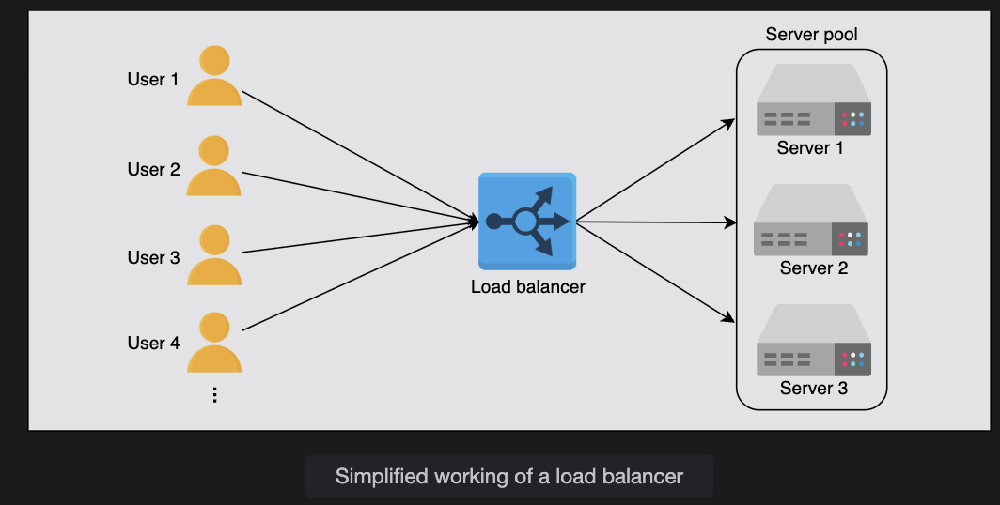
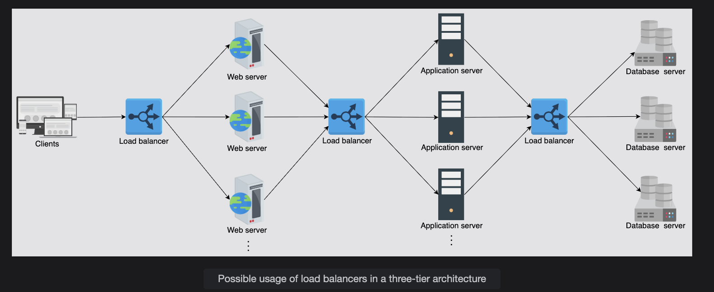

# Introduction to Load Balancers

Learn about the basics of load balancers and the services offered by them.

---

## What is Load Balancing?

Millions of requests could arrive per second in a typical data center. To serve these requests, thousands (or a hundred thousand) servers work together to share the load of incoming requests.

> **Note:** Here, it’s important that we consider how the incoming requests will be divided among all the available servers.

A **load balancer (LB)** is the answer to this question.  
The job of the load balancer is to fairly divide all clients’ requests among the pool of available servers.  
Load balancers perform this job to **avoid overloading or crashing servers.**

The **load balancing layer** is the first point of contact within a data center after the firewall.  
A load balancer may not be required if a service entertains a few hundred or even a few thousand requests per second.  
However, for increasing client requests, load balancers provide the following capabilities:

### Capabilities of Load Balancers
- **Scalability:** By adding servers, the capacity of the application/service can be increased seamlessly. Load balancers make such upscaling or downscaling transparent to the end users.
- **Availability:** Even if some servers go down or suffer a fault, the system still remains available. One of the jobs of the load balancers is to hide faults and failures of servers.
- **Performance:** Load balancers can forward requests to servers with a lesser load so the user can get a quicker response time. This not only improves performance but also improves resource utilization.

### Load Balancer Request Distribution

The requests received by a load balancer are distributed among multiple servers using a configured algorithm that we’ll discuss in the upcoming lessons:

- Round-robin
- Weighted round-robin
- Least response time
- Least connections

Load balancers ensure reliability and availability by continuously monitoring server health and directing traffic only to servers capable of responding efficiently. We’ll explore these algorithms and their impact on system performance in more detail in the [Advanced Details of Load Balancers]

---

## Placing Load Balancers

Generally, LBs sit between **clients and servers**.  
Requests go through to servers and back to clients via the load balancing layer.  
However, that isn’t the only point where load balancers are used.

Let’s consider the three well-known groups of servers:  
**Web**, **Application**, and **Database** servers.  
To divide the traffic load among the available servers, load balancers can be used between the server instances of these three services in the following way:

- Place LBs between **end users** of the application and **web servers/application gateway.**
- Place LBs between the **web servers** and **application servers** that run the business/application logic.
- Place LBs between the **application servers** and **database servers.**

In reality, load balancers can potentially be used between any two services with multiple instances within a system's design.

---

## Services Offered by Load Balancers

LBs not only enable services to be **scalable, available, and highly performant**,  
they also offer some key services like the following:

- **Health checking:** LBs use the heartbeat protocol to monitor the health and reliability of end-servers. This also improves user experience.
- **TLS termination:** LBs reduce the burden on end-servers by handling TLS termination with the client.
- **Predictive analytics:** LBs can predict traffic patterns through analytics performed over traffic passing through them or using statistics of traffic obtained over time.
- **Reduced human intervention:** Because of LB automation, reduced system administration efforts are required in handling failures.
- **Service discovery:** LBs can inquire about the service registry to forward clients’ requests to appropriate hosting servers.
- **Security:** LBs may also improve security by mitigating attacks like denial-of-service (DoS) at different layers of the OSI model (layers 3, 4, and 7).

> As a whole, load balancers provide **flexibility, reliability, redundancy, and efficiency** to the overall design of the system.

---

## 💭 Question: What if Load Balancers Fail? Are They Not a Single Point of Failure (SPOF)?

**Answer:**  
Load balancers are usually deployed in **pairs** as a means of **disaster recovery**.  
If one load balancer fails, and there’s nothing to failover to, the overall service will go down.  
Generally, to maintain **high availability**, enterprises use **clusters of load balancers** that use **heartbeat communication** to check the health of load balancers at all times.  
On failure of the primary LB, the **backup can take over**.  
But, if the entire cluster fails, **manual rerouting** can also be performed in case of emergencies.

---
