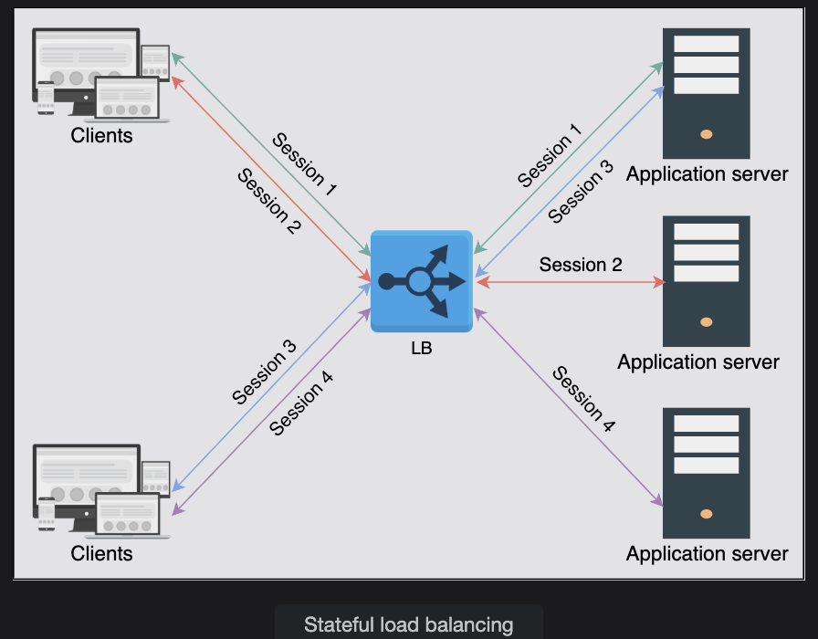
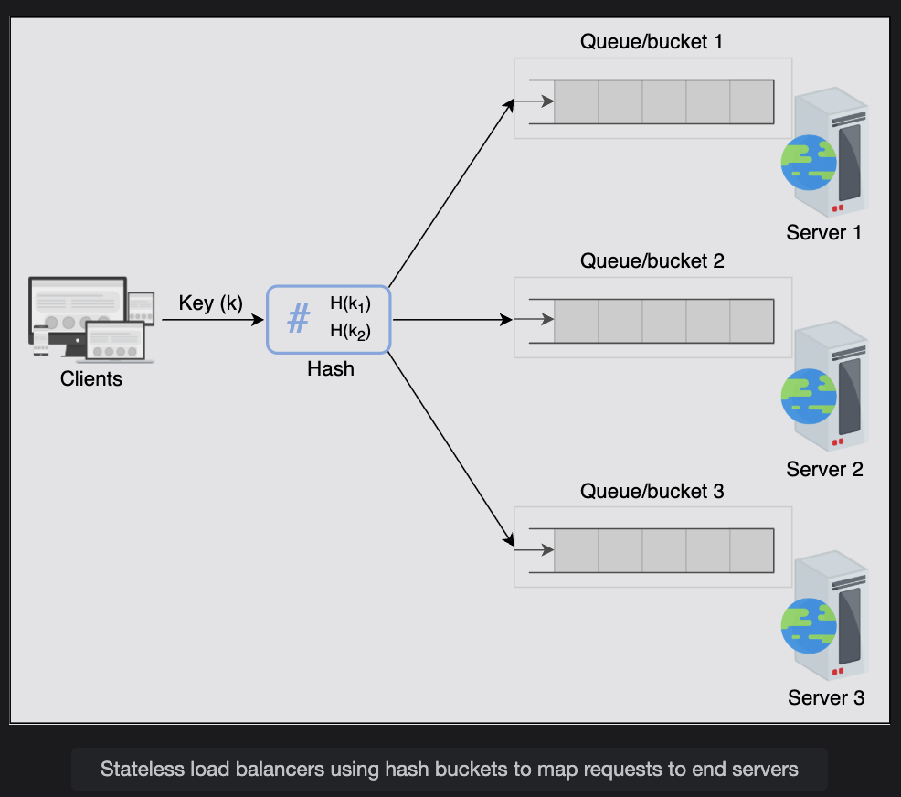
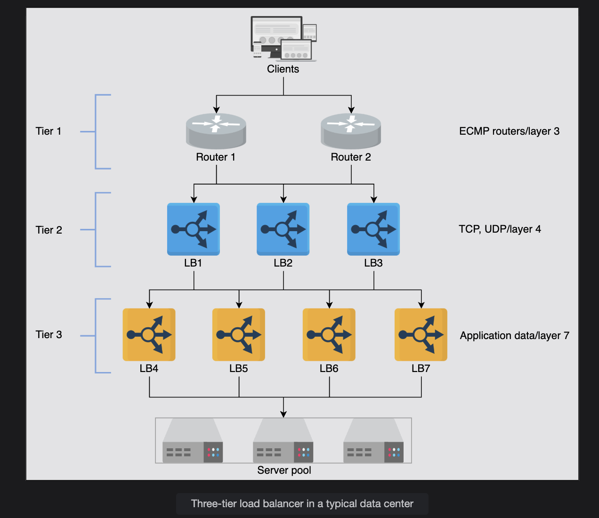
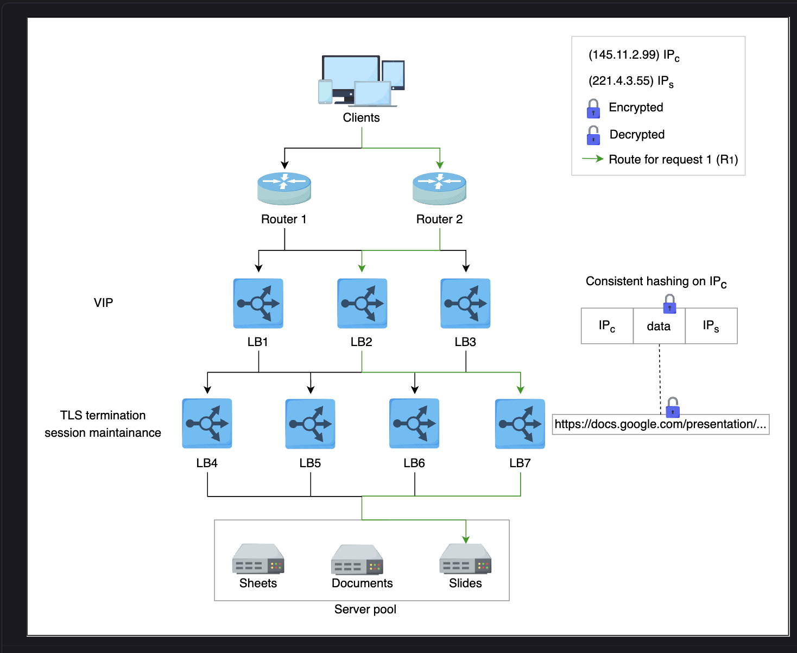

## Advanced Details of Load Balancers

This lesson will focus on some of the well-known algorithms used in the local load balancers. We’ll also understand how load balancers are connected to form a hierarchy, sharing work across different tiers of LBs.  

## Algorithms of load balancers

## 1. Round-Robin Scheduling

**How it works:**
- Each request is sent to the next server in the list, in order.
- When the end is reached, it loops back to the first.

**Example:**
- Servers: S1, S2, S3  
- Requests: R1, R2, R3, R4, R5, R6  

**Distribution:**
R1 → S1
R2 → S2
R3 → S3
R4 → S1
R5 → S2
R6 → S3   

**Use case:** When all servers are of equal capacity and request load is uniform.

---

## 2. Weighted Round-Robin

**How it works:**
- Similar to round-robin, but some servers get more requests because they are more powerful.
- Each server has a weight, and requests are distributed based on these weights.

**Example:**
- Servers: S1 (weight 3), S2 (weight 1)  
- Requests: R1–R8

**Distribution:**
R1 → S1
R2 → S1
R3 → S1
R4 → S2
R5 → S1
R6 → S1
R7 → S1
R8 → S2  


**Use case:** When servers have different CPU/RAM power.

---

## 3. Least Connections

**How it works:**
- Requests are sent to the server that currently has the fewest active connections.
- Good when some requests take longer than others.

**Example:**
- Current active connections:  
  - S1: 5  
  - S2: 2  
  - S3: 3  
- Next request (R1): goes to **S2** because it has the least connections (2).

**Use case:** When request duration is unpredictable.

---

## 4. Least Response Time

**How it works:**
- Requests go to the server that is responding fastest currently.
- The LB measures response times regularly and chooses the fastest.

**Example:**
- Measured average response times:  
  - S1: 250 ms  
  - S2: 120 ms  
  - S3: 400 ms  
- Next request goes to **S2** because it’s the fastest (120 ms).

**Use case:** For performance-critical systems where latency matters.  

 **What You’re Thinking (Potential Problem)**

> “If one server has the least response time, then it will keep getting all the traffic, and others will stay idle. Is that a problem?”

---

#### ⚡ Why This Could Happen Temporarily

- One server is **very powerful** (high CPU/RAM), so it stays fast even under load.  
- Other servers are **slower and respond late**, so the load balancer avoids them.

---

#### ⚖️ Why It Usually Doesn’t Overload One Server

- As the fast server starts getting more requests, its **response time will increase slightly** (due to higher load).  
- The load balancer will **detect this and start routing requests to other servers** with lower response times.  
- This creates a **dynamic balancing effect** where load is spread automatically over time.

---

#### ⚠️ When It *Can* Become a Problem

- One server is **much more powerful** than the others → it might keep getting most of the requests.  
- **Response time calculation is poor** (not averaged well or measured too frequently) → may cause oscillation or overload.

---

#### 🛠️ Fixes

- Combine **least response time** algorithm with **connection limits** or **weights**.  
- Use **weighted least response time**, where you assign weights based on each server’s capacity.


---

## 5. IP Hash

**How it works:**
- The client’s IP address is hashed.
- Based on the hash result, the client is always directed to a specific server.

**Example:**
hash("192.168.1.10") % 3 → 1 → S1
hash("192.168.1.11") % 3 → 2 → S2
hash("192.168.1.10") % 3 → 1 → S1 (always same)  


**Use case:** When you need session stickiness (same client always hits same server).

---

## 6. URL Hash

**How it works:**
- The requested URL is hashed and routed to a server based on the hash result.
- Useful when specific URLs are served by specific server groups.

**Example:**
hash("/video") % 2 → 0 → Video Server Cluster
hash("/images") % 2 → 1 → Image Server Cluster  


**Use case:** When different types of content are served by different server groups.

---

## 📝 Quick Summary Table

| Algorithm             | Decision Based On            | Example Use Case                          |
|------------------------|-------------------------------|--------------------------------------------|
| Round-Robin             | Simple sequence                | Equal-capacity servers                       |
| Weighted Round-Robin    | Sequence + server weights      | Different server capacities                  |
| Least Connections       | Current connection counts      | Long-running or uneven workloads             |
| Least Response Time     | Fastest response time           | Performance-sensitive systems                |
| IP Hash                  | Client IP                       | Sticky sessions / consistent routing         |
| URL Hash                 | Requested URL                   | Content-based routing                        |


# ⚖️ Static vs Dynamic Load Balancing Algorithms

## 📍 Static Algorithms

**How they work:**
- Use **predefined rules** to assign requests to servers.
- They **do NOT consider current server load or performance**.
- Decision is made **without monitoring servers’ state**.
- Usually implemented in a **single load balancer/router**.

**Example:**  
**Round-Robin Algorithm**  
- Suppose we have 3 servers: `S1`, `S2`, `S3`.
- Requests come in: `R1, R2, R3, R4, R5, R6`

**Distribution:**
- `R1 → S1`
- `R2 → S2`
- `R3 → S3`
- `R4 → S1`
- `R5 → S2`
- `R6 → S3`

✅ **Key point:** The load balancer does **not care** if `S2` is already busy or slow — it just follows the fixed pattern.  

**Pros:**
- Simple to implement.
- Very low overhead.

**Cons:**
- Can lead to overload on some servers if request durations are uneven.
- Doesn’t adapt to failures — if `S2` goes down, traffic might still go to it.

---

## ⚡ Dynamic Algorithms

**How they work:**
- Make decisions **based on real-time or recent server state**.
- **Monitor metrics** like active connections, CPU load, or response time.
- Requires **communication between load balancers and servers** to exchange state info.
- More **complex** but much **smarter**.

**Example:**  
**Least Connections Algorithm**  
- Current connections:
  - `S1 → 7 active`
  - `S2 → 2 active`
  - `S3 → 4 active`

- Next request `R1` will go to `S2` because it has **fewer active connections**.

✅ **Key point:** The load balancer **actively checks server load** before deciding.  

**Pros:**
- Adapts to uneven workloads.
- Handles slow servers or failed servers automatically.
- Distributes load more fairly.

**Cons:**
- Needs constant communication → more overhead.
- More complex to design and maintain.

---

## 📝 Quick Summary

| Type          | Checks Server State? | Example                           | Complexity | Adaptability |
|---------------|----------------------------|-------------------------------------|----------------|-----------------|
| **Static**      | ❌ No                                 | Round-Robin, IP Hash                     | Simple            | Low |
| **Dynamic** | ✅ Yes                                | Least Connections, Least Response Time | Complex          | High |


# ⚖️ Stateful vs Stateless Load Balancers (LBs)

This concept is about how LBs handle session information of clients.

When a user (client) connects to a backend server through a load balancer, there are two main ways to manage their session:

---

## 🧠 Stateful Load Balancing

### 📌 What it is
A stateful LB remembers which client was sent to which backend server.

It keeps a mapping table like:


Client A → Server S1
Client B → Server S2
Client C → Server S1


If the same client sends more requests, the LB checks its mapping table and sends the request to the same server.

All LBs in the cluster must share this mapping table with each other to make consistent decisions.

---

### 💡 Example
Imagine an e-commerce site where the user’s shopping cart is stored in memory on the server (not in a shared DB or cache).

- First request from Client A goes to Server S1.  
- S1 stores Client A’s cart in memory.  
- The LB remembers this mapping: `Client A → Server S1`.  
- When Client A makes another request (e.g. view cart), the LB again sends it to S1 so the session continues.

> ❗ If the LB sent the request to another server S2, that server wouldn’t have the cart in memory, and the user would lose their session/cart.

---

### ⚠️ Why/When to Use
- Needed when your application stores session data on the **server side** (not shared anywhere)
- Makes sure a user always goes back to the same server

**Downsides:**
- More complex
- Not easily scalable because every LB must share state across each other
- If one LB fails, its session table is lost unless synced

 

---

## ⚡ Stateless Load Balancing

### 📌 What it is
A stateless LB does **not** remember any client-to-server mapping.  
Every request is treated as completely new.

- Uses hashing (like IP hash, cookie hash, or URL hash) to calculate which server to send the request to — but does not store anything.
- Since it doesn’t need to sync session state with other LBs, it’s fast, simple, and scalable.

---

### 💡 Example
Imagine a video streaming site where all user sessions are stored in a **shared database or cache**.

The LB uses IP hash:
hash(192.168.1.10) % 3 = 1 → S1
hash(192.168.1.11) % 3 = 2 → S2  


- When `192.168.1.10` sends another request, the LB again calculates the hash and sends it to S1.
- It doesn’t actually remember anything, just recalculates each time.
- If a new server is added, hash results may change, so some users may get routed to new servers (which is fine because their session data is in the shared DB).

---

### ⚡ Why/When to Use
- Works well when session data is stored in a **shared distributed cache/DB** (not in the server memory)
- Much simpler and faster than stateful
- Highly scalable because no session table sharing is needed

> ⚠️ But less resilient when servers are added/removed (hash remapping issue)

 

---

## 📝 Key Difference Table

| Feature                     | Stateful LB                         | Stateless LB                        |
|------------------------------|------------------------------------|-------------------------------------|
| Stores session mapping       | ✅ Yes                              | ❌ No                                 |
| Needs LB-to-LB sync           | ✅ Yes (share state)                | ❌ No                                 |
| Performance                   | ⚡ Slower (extra overhead)           | ⚡ Faster (lightweight)                |
| Scalability                    | ⚠️ Harder (sync needed)              | ✅ Easier (no sync needed)              |
| Session storage needed        | On the server memory                | In shared DB/cache                     |
| Example use case               | Shopping cart stored in memory     | Video streaming with DB-backed sessions |

---

## 🧠 One-Liner to Remember
- **Stateful LB** = "Remembers" client → server mapping  
- **Stateless LB** = "Calculates" server on every request


---
# ⚖️ Types of Load Balancers

Load balancers can work at **different layers of the OSI model**, mainly:

- **Layer 4 (Transport layer)**
- **Layer 7 (Application layer)**

This just means:  
**How deep they look into the network traffic to decide where to send it.**


## 🌐 Layer 4 Load Balancers (Transport Layer)

### 📌 What it does
- Operates at **Layer 4 of OSI** (Transport) — looks at **TCP or UDP** information (IP address + port).
- It does **not look inside the content** of the request.
- Makes routing decisions based on:
  - Source IP
  - Destination IP
  - Source port
  - Destination port
  - TCP/UDP connection info

### 💡 Example flow
- Client connects to LB on TCP port 443.
- LB picks a backend server (say Server A) and creates a TCP connection.
- All packets for this TCP session are sent to Server A.

### ⚡ Key points
- Can maintain session stickiness by tracking TCP/UDP connections.
- Very **fast and lightweight** — just forwards packets.
- Some Layer 4 LBs can also do **TLS termination** (decrypt HTTPS traffic), but usually this is done at Layer 7.

### 💭 Analogy
> Think of it like a **traffic cop** who only sees the **license plate and road number**, not what’s inside the car.

### 📍 Use case
- When you only need to spread network connections (not care about content).
- Good for database connections, game servers, streaming servers.


## 🧠 Layer 7 Load Balancers (Application Layer)

### 📌 What it does
- Operates at **Layer 7 of OSI** (Application) — looks at **actual content/data** inside the request.
- Makes routing decisions based on:
  - HTTP headers
  - URL path
  - Cookies
  - Query params
  - Even user IDs or API tokens

### 💡 Example flow
- LB inspects HTTP request:  
  - If `Host: api.example.com` → route to API server  
  - If `Host: www.example.com` → route to Web server
- Can do **content-based routing** (like `example.com/images → image servers`)

### ⚡ Extra capabilities
- TLS termination (decrypt HTTPS traffic)
- Rate limiting users
- Header rewriting
- Authentication checks
- A/B testing and traffic splitting

### 💭 Analogy
> Think of it like a **post office sorter** who opens envelopes and decides where each letter goes based on what’s inside.

### 📍 Use case
- When you want to make smart, content-aware routing.
- Common for web applications and APIs.

---

## ⚡ Quick Comparison

| Feature                       | Layer 4 LB                        | Layer 7 LB                              |
|-------------------------------|----------------------------------|------------------------------------------|
| OSI layer                     | Transport (L4)                    | Application (L7)                          |
| Looks at                      | IP, port, TCP/UDP                 | HTTP headers, URLs, cookies, etc.         |
| Understands application data  | ❌ No                              | ✅ Yes                                    |
| Performance                   | ⚡ Faster (less overhead)          | ⚠️ Slower (more processing)                 |
| Can do TLS termination        | ⚠️ Sometimes                      | ✅ Yes                                    |
| Use cases                     | Game servers, DB, streaming       | Web apps, APIs, smart routing              |


## 🧠 One-liner to Remember

- **Layer 4 LB** = Routes based on **connection info** (IP + port)  
- **Layer 7 LB** = Routes based on **content info** (headers, URLs, cookies)


---

# Load Balancer Deployment

In large data centers, using a single layer of load balancer (LB) isn’t enough to handle massive amounts of traffic efficiently. Instead, multiple layers of load balancers are deployed to work together and make smarter forwarding decisions.  
A traditional data center commonly uses a **three-tier load balancer architecture** as explained below.

 

---

## 🧩 Tier-0 and Tier-1 LBs

- **Tier-0 (DNS):**  
  - DNS acts as the first layer of load balancing.  
  - It distributes client requests among multiple data centers or entry points.

- **Tier-1 (ECMP Routers):**  
  - Equal Cost Multipath (ECMP) routers distribute traffic based on IP or algorithms like **round-robin** or **weighted round-robin**.  
  - They balance the load across different paths leading to the higher-tier load balancers.

✅ **Purpose:** Tier-1 improves **horizontal scalability** by spreading incoming traffic across multiple Tier-2 LBs.

---

## ⚙️ Tier-2 LBs (Layer 4 Load Balancers)

- Tier-2 load balancers operate at **Layer 4 (Transport Layer)**.
- They ensure that **all packets of a particular connection go to the same Tier-3 LB**.
- **Techniques used:**
  - **Consistent hashing** to map connections to specific Tier-3 LBs.
- However, if the infrastructure changes (like LBs added/removed), consistent hashing alone may not be enough.  
  - In such cases, a **local or global state** is maintained to make correct forwarding decisions.

✅ **Purpose:** Tier-2 acts as a **bridge between Tier-1 and Tier-3**, ensuring stable connection routing even during failures or scaling events.

---

## 💻 Tier-3 LBs (Layer 7 Load Balancers)

- Tier-3 load balancers work at **Layer 7 (Application Layer)**.
- They are **closest to the backend servers**.
- **Responsibilities:**
  - Perform **health monitoring** of backend servers at the HTTP level.
  - **Distribute requests** evenly across healthy servers.
  - Provide **high availability** by routing traffic only to healthy servers.
  - Handle low-level details like:
    - TCP congestion control  
    - Path MTU discovery  
    - Protocol conversion between clients and backend servers

✅ **Purpose:** Tier-3 does the **actual load balancing among backend servers** while offloading trivial tasks from the application servers.

---

## 📝 Summary

| Tier     | Type                   | Role                                                    |
|----------|-------------------------|------------------------------------------------------------|
| Tier-0   | DNS                     | Distributes traffic to different data centers              |
| Tier-1   | ECMP Routers (Layer 3)  | Balances traffic among Tier-2 load balancers                |
| Tier-2   | Layer 4 LBs              | Ensures all packets of a connection go to the same Tier-3 LB |
| Tier-3   | Layer 7 LBs              | Balances traffic among backend servers and monitors health |

- **Tier-1**: Balances load among load balancers themselves.  
- **Tier-2**: Provides a smooth handoff from Tier-1 to Tier-3 during scaling or failures.  
- **Tier-3**: Distributes client requests among backend servers for high availability and performance.

---

# 🧪 Practical Example of Three-Tier Load Balancer

Let’s walk through a practical flow showing how a **client request travels through the three tiers of load balancers** in a data center.

 

---

## 🛣 Step-by-Step Request Flow

### Step 1: Client → Tier-1 (ECMP Routers)
- A client sends **Request R₁**.
- This request reaches one of the **ECMP routers (Tier-1 LBs)**.
- The ECMP router uses a **round-robin algorithm** to forward R₁ to one of the available **Tier-2 LBs**.

### Step 2: Tier-1 → Tier-2 (Layer 4 LBs)
- Tier-2 LBs receive R₁ from Tier-1.
- Tier-2 calculates a **hash of the client’s source IP (IPₛ)** to decide **which Tier-3 LB** should handle the connection.
- This ensures that all packets of the same connection are sent to the **same Tier-3 LB** (connection consistency).

### Step 3: Tier-2 → Tier-3 (Layer 7 LBs)
- The chosen Tier-3 LB receives R₁.
- Tier-3 LB:
  - **Offloads TLS/SSL** encryption.
  - **Reads the HTTP(S) data** from the request.
  - **Checks the requested URL** (for example: `/presentation`).
- Based on URL routing rules, the Tier-3 LB forwards R₁ to the correct **application server** (for example: `slides1`).

### Step 4: Another Request R₂
- Another client request **R₂** follows the same Tier-1 and Tier-2 path.
- But this time, the **requested URL is `/document`**, so the Tier-3 LB forwards it to the **document servers** instead of slides servers.

---

## ⚙️ Sample Tier-3 (Layer 7) LB Configuration — HAProxy

Here’s how a Tier-3 LB can be configured using **HAProxy** to route based on application data (HTTP path):

    ```haproxy
    mode http                                 # Work at Layer 7 (HTTP mode)
    acl slidesApp path_end -i /presentation   # Match requests ending with /presentation
    use_backend slidesServers if slidesApp    # Use slidesServers for slidesApp requests

    backend slidesServers
        server slides1 192.168.12.1:80         # Server handling slides application

    acl docApp path_end -i /document           # Match requests ending with /document
    use_backend docServers if docApp           # Use docServers for docApp requests

    backend docServers
        server doc1 192.168.12.2:80             # Server handling document application

---  
### Q1: After a request reaches a back-end server, should the response be routed back through each tier of the load balancers?

**Answer:**  
No, the server can send the response directly to the routers (tier-1 LBs) through tier-3 LBs, which can forward the response from the data center.  
Such a response path is called **Direct Routing (DR)** or **Direct Server Return (DSR).**

#### ✅ Why?
- In normal mode: responses travel back **Tier-3 → Tier-2 → Tier-1 → Client**.  
- With DSR: the backend server can **respond directly** via Tier-1, skipping extra hops.  
- This reduces **latency** and **processing overhead**.

#### ⚠️ Caveat
- **DSR works best for non-HTTPS traffic.**  
- For HTTPS, the response must pass back through Tier-3 so that the **data can be encrypted again** before being sent to the client.

---

### Q2: Why don’t the servers directly send the response to the routers (tier-1 LBs) instead of tier-3 LBs?

**Answer:**  
Because **Tier-3 LBs maintain state information**, such as **SSL encryption/decryption**.

#### ✅ Why?
- Tier-3 tracks:
  - Encryption keys  
  - Session details  
  - Cookies and headers  
- If backend servers bypassed Tier-3, the client would receive responses it **couldn’t decrypt**.  
- Tier-3 ensures a **seamless and consistent session** for the client.

---

### Q3: Which tier of LBs is more prone to bugs?

**Answer:**  
**Tier 3 (Layer 7 LBs)** is more prone to bugs.

#### ✅ Why?
- Tier-1 and Tier-2:
  - Mostly **stateless or minimally stateful**.  
  - Handle simple tasks like IP routing, hashing, or round-robin.  
- Tier-3:
  - Reads **HTTP headers, cookies, URLs**.  
  - Maintains **SSL sessions, health checks, rate limiting**.  
  - Involves **application-specific logic**.  

⚠️ **More complexity → More chances of bugs.**

---

### Q4: Why are there more Tier-3 LBs than Tier-2 LBs in the diagram?

**Answer:**  
Because **Tier-3 performs resource-heavy tasks** and needs **more machines** to handle the load.

#### ✅ Why?
- **Tier-2 (Layer 4 LBs):**
  - Handle **connection consistency** (TCP/UDP).  
  - Lightweight tasks → fewer servers needed.  
- **Tier-3 (Layer 7 LBs):**
  - Perform **deep packet inspection** (HTTP-level checks).  
  - Handle **TLS termination, routing, rewriting, session tracking**.  
  - Maintain **state for many clients**.  

⚡ **Tier-3 is CPU-intensive → needs horizontal scaling with more servers.**

---

##### 📌 Final Summary

- **Q1 (Response path):** Use **Direct Server Return (DSR)** for non-HTTPS to skip extra hops.  
- **Q2 (Why not bypass Tier-3):** Tier-3 holds **critical session/SSL state**.  
- **Q3 (Bug-prone tier):** **Tier-3** (due to higher complexity).  
- **Q4 (Why more Tier-3 LBs):** Tier-3 needs **more servers** for heavy computations and state management.  


# ⚙️ Implementation of Load Balancers

Different kinds of load balancers can be implemented depending on the number of incoming requests, organization size, and application-specific requirements:

---

## 🖥️ Hardware Load Balancers
- Introduced in the **1990s** as **stand-alone hardware devices**.  
- **Pros:**
  - Very high performance.
  - Can handle a large number of concurrent users.  
- **Cons:**
  - Expensive and less flexible.  
  - Require human resources for configuration.  
  - Availability issues (need additional hardware for failover).  
  - High maintenance and operational costs.  
  - Vendor lock-in problems.  

➡️ **Not preferred today**, even for large enterprises that can afford them.

---

## 💻 Software Load Balancers
- Implemented on **commodity hardware** (regular servers).  
- **Pros:**
  - Cost-effective, flexible, and programmable.  
  - Scale easily as requirements grow.  
  - Easy to deploy additional “shadow” load balancers for high availability.  
  - Can provide **predictive analysis** to handle future traffic patterns.  
- **Cons:**
  - Performance depends on underlying hardware.  

➡️ **Most widely adopted solution today.**

---

## ☁️ Cloud Load Balancers
- Introduced with **cloud computing** → offered as **LBaaS (Load Balancer as a Service)**.  
- **Users pay** based on usage or SLA with the cloud provider.  
- **Pros:**
  - Easy to use and manage.  
  - Metered cost (pay-as-you-go).  
  - Provides global traffic management across different zones.  
  - Flexibility, auditing, and monitoring built-in.  
- **Example:**  
  - Cloud-based LBs can provide **GSLB (Global Server Load Balancing)** to distribute traffic between different regions.  

📌 Cloud LBs usually complement, not replace, on-premise load balancers.

---

## 📱 Client-Side Load Balancing (Special Case)
- Another interesting implementation.  
- The client (application) decides which server instance to send the request to.  
- Useful when there are **many services with many instances** (e.g., Twitter).  

➡️ Our focus remains on **traditional load balancers** used in **three-tier applications**.

---

## 📝 Conclusion
- Load balancers started as **hardware devices** in the 1990s.  
- Evolved into **software implementations** and now offered as **cloud services (LBaaS)**.  
- They are a **critical part of enterprise systems** because:  
  - Enable **horizontal scalability**.  
  - Provide **session maintenance, TLS offloading, service discovery, health checks**, and more.  

⚡ **Modern enterprises almost always rely on a combination of software and cloud load balancers for flexibility and scalability.**


### Question
In this chapter, we have explored various functions of load balancing. In addition to different roles, load balancers are often responsible for mitigating distributed denial-of-service (DDoS) attacks. How can they distinguish between legitimate traffic and malicious traffic during such incidents?

### Answer

During a **DDoS (Distributed Denial-of-Service) attack**, load balancers help mitigate the flood of malicious traffic while still serving **legitimate users**.  
They do this by analyzing **traffic patterns, behavior, and request characteristics**.


##### 1. Rate Limiting & Traffic Shaping
- **What happens:**  
  If a single IP or client sends **too many requests per second**, beyond a normal user’s behavior, the LB flags or blocks it.  
- **Why it works:**  
  Normal users generate requests at a human pace, while bots flood traffic rapidly.  

##### 2. Connection Behavior Analysis
- **What happens:**  
  Legitimate clients complete proper **TCP handshakes** and send well-formed requests.  
  Malicious bots often open connections without finishing them (SYN floods) or send malformed packets.  
- **Why it works:**  
  Load balancers drop incomplete or suspicious connections automatically.  


##### 3. Geolocation & IP Reputation Filtering
- **What happens:**  
  LBs check the **source of traffic** (IP reputation databases, geolocation).  
  Known bad IP ranges or sudden spikes from unusual regions can be flagged.  
- **Why it works:**  
  Legitimate traffic usually comes from expected geographies; attackers may come from botnets worldwide.  


##### 4. Challenge-Response Mechanisms (Human vs Bot)
- **What happens:**  
  LBs can insert **CAPTCHAs, JavaScript challenges, or cookie-based challenges**.  
  Bots often fail these tests, but real browsers/users succeed.  
- **Why it works:**  
  Separates automated bot traffic from genuine human users.  


##### 5. Application-Level Inspection
- **What happens:**  
  Layer 7 (application-level) load balancers inspect **HTTP headers, request rates, URL patterns**.  
  Abnormal or repetitive requests to the same resource (like `/login` or `/search`) can be flagged.  
- **Why it works:**  
  Attack traffic often has predictable or repetitive patterns.  


##### 6. Anomaly Detection & AI/ML Models
- **What happens:**  
  Advanced load balancers use **machine learning** to detect abnormal spikes, unusual request patterns, or deviations from baseline user behavior.  
- **Why it works:**  
  Normal traffic is “bursty but predictable,” while attack traffic is abnormal, massive, and unnatural.  


##### Example Scenario
- An **e-commerce site** normally gets ~500 requests/sec.  
- Suddenly, traffic spikes to 50,000 requests/sec from random global IPs.  
- The LB notices:  
  - IPs have no session history.  
  - Many incomplete TCP handshakes.  
  - Excessive requests for `/login`.  
- **Action taken:**  
  - LB rate-limits suspicious IPs.  
  - For others, it inserts a CAPTCHA challenge.  
  - Legitimate users pass and continue shopping.  
  - Bot traffic is blocked or dropped.  


##### Summary
Load balancers distinguish between **legitimate vs malicious traffic** using:  
- 📊 Traffic rate & behavior monitoring  
- 🔍 Connection handshake validation  
- 🌍 IP reputation & geolocation checks  
- 🤖 Human-vs-bot challenges  
- 🧠 Application-level deep inspection  
- 🤝 AI/ML anomaly detection  

👉 The goal: **Block the bad traffic, let real users in.**
