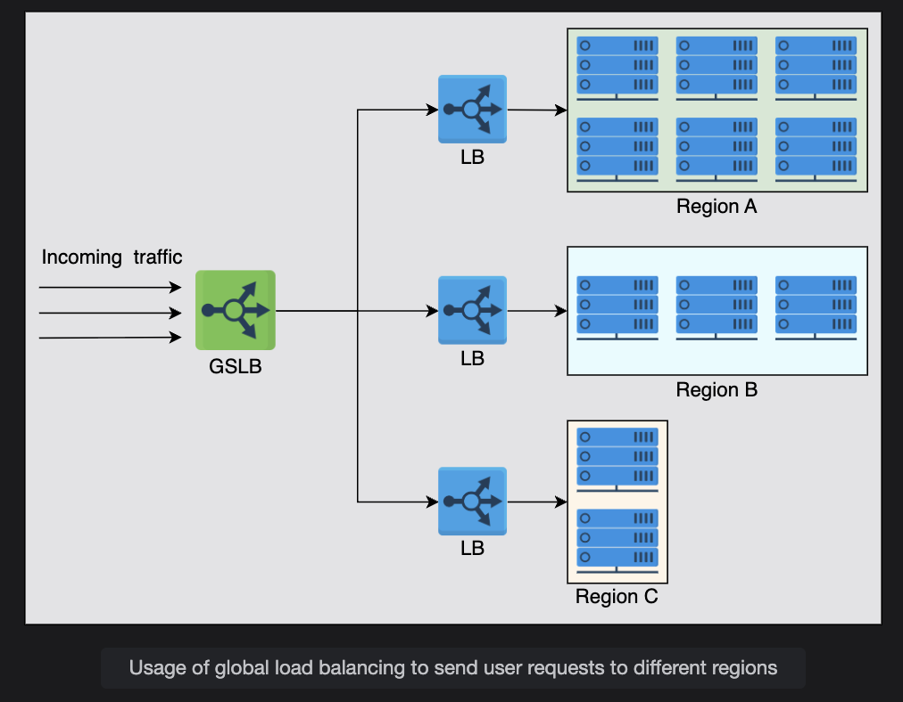
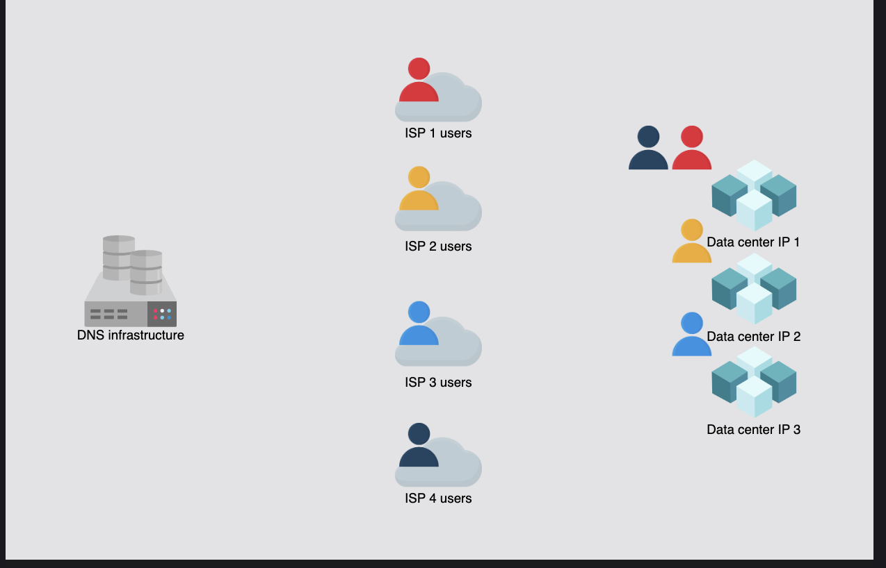

# Global and Local Load Balancing

Understand how global and local load balancing is performed.

---

## 📝 Introduction
From the previous lesson, it may seem like load balancing is performed only within the data center. However, load balancing is required at a **global** and a **local** scale. Let’s understand the function of each of the two:

- **Global server load balancing (GSLB):** GSLB involves the distribution of traffic load across multiple geographical regions.
- **Local load balancing:** This refers to load balancing achieved within a data center. This type of load balancing focuses on improving efficiency and better resource utilization of the hosting servers in a data center.

Let’s understand each of the two techniques below.

---

## 🌍 Global Server Load Balancing (GSLB)

GSLB ensures that globally arriving traffic load is intelligently forwarded to a data center.  
For example, power or network failure in a data center requires that all the traffic be rerouted to another data center.  

**GSLB takes forwarding decisions based on:**
- The users’ geographic locations
- The number of hosting servers in different locations
- The health of data centers
- Other region-specific factors

In the next lesson, we’ll also learn how GSLB offers **automatic zonal failover**.  
GSLB service can be **installed on-premises** or obtained through **Load Balancing as a Service (LBaaS)**.

---

## 🏢 Local Load Balancing

Each data center that receives traffic from GSLB has its own local load balancers.  
**Local load balancing focuses on:**
- Improving efficiency of request handling
- Better resource utilization
- Distributing load evenly across servers in the same data center

---

## 📌 How They Work Together

The illustration below shows that the GSLB can forward requests to three different data centers.  
Each local load balancing layer within a data center maintains a **control plane connection** with the GSLB, providing information about:
- The health of the local LBs
- The status of the server farm

**GSLB uses this information** to drive traffic decisions and forward traffic load based on each region’s configuration and monitoring data.

 

# Load Balancing in DNS

## Introduction
DNS can respond with multiple IP addresses for a DNS query.  
This makes it possible to do **load balancing through DNS**.

DNS uses a simple technique of **reordering the list of IP addresses** in response to each DNS query.  
Therefore, different users get a different ordering of IPs, resulting in them visiting **different servers**.  
In this way, DNS distributes the load of requests across **different data centers**.  

This is a form of **Global Server Load Balancing (GSLB)**.  
In particular, DNS uses a **round-robin** technique to perform load balancing.

 

## DNS Round-Robin

- DNS responds with multiple IP addresses for the same domain.
- Each time a user makes a DNS request, the order of the IP addresses is **rotated**.
- So, different users get **different first IPs** in the list and connect to different data centers.

**Example:**
- User from ISP 1 → Data Center A  
- User from ISP 2 → Data Center B  
- User from ISP 3 → Data Center C  
- User from ISP 4 → Data Center A (cycle repeats)

This ensures traffic is distributed across data centers.

---

## Limitations of DNS Round-Robin

1. **Uneven load distribution**
   - Different ISPs serve different numbers of users.
   - ISP DNS caching means many users may get the **same cached IP**.
   - This can overload a particular data center.

2. **No crash awareness**
   - DNS keeps returning the IPs of crashed servers until their **TTL expires**.
   - This can reduce service availability.

3. **Slow recovery**
   - If a data center fails, DNS may still direct traffic to it until TTLs expire.

4. **Small packet size**
   - DNS packet size (512 Bytes) may not fit all IPs.

5. **Limited client control**
   - Clients can choose **any** IP from the list; might pick busy/slow data centers.

---

## Techniques to Improve GSLB

### Anycast

- **Same IP is assigned to multiple servers** across different locations.
- Traffic is routed to the **nearest server** based on routing table.

**Advantages over traditional DNS-based GSLB:**
- Doesn’t depend on DNS caching (TTL)
- Automatically reroutes traffic if one server goes down
- Distributes traffic more evenly
- Improves response time (closest server is used)
- Simplifies DNS configuration (no round-robin or geo-aware DNS needed)

---

## Application Delivery Controllers (ADCs)

- ADCs are part of the **Application Delivery Network (ADN)**.
- They can act as **supersets of load balancers** with extra features:
  - Web acceleration
  - SSL offloading
  - Caching
  - Proxy/reverse proxy services
  - IP traffic optimization

- ADCs can implement **GSLB** by forwarding requests based on:
  - Server health
  - Data center capacity
  - Latency or routing policies

---

## The Need for Local Load Balancers

DNS-based GSLB has limitations, so we need **local load balancing** inside data centers.

---

## What is Local Load Balancing?

- Local Load Balancers sit **inside a data center**.
- They behave like **reverse proxies**.
- They receive incoming traffic and distribute it among **multiple internal servers**.
- Users connect to a **virtual IP (VIP)** of the LB, not the actual server.

**Benefits:**
- Better resource utilization
- Improved efficiency
- Fault tolerance

---

## Can DNS be considered a Global Server Load Balancer (GSLB)?

**Yes**, DNS can be part of GSLB, usually implemented in two ways:

1. **GTM through ADCs**
   - Application Delivery Controllers can forward traffic based on:
     - Real-time server health
     - Data center capacity

2. **GTM through DNS**
   - Authoritative DNS servers respond based on:
     - Location of the DNS resolver (close to the user)
     - Policies like latency or availability
   - Typically done using:
     - Custom DNS infrastructure
     - Managed DNS providers like AWS Route 53 or Cloudflare

---

## ✅ Summary
- DNS-based load balancing = Global Load Balancing (GSLB)
- Has limitations (TTL, no crash awareness, uneven load)
- Anycast and ADCs improve global load balancing
- Local LBs work inside data centers for efficient traffic distribution

