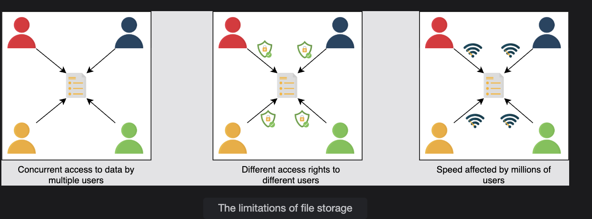
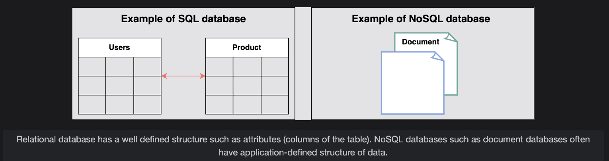

# Introduction to Databases

Understand what a database is and its use cases in the system design.

---

## Problem Statement

Let’s start with a simple question:  
**Can we make a software application without using databases?**

Suppose we have an application like **WhatsApp**. People use it to communicate with their friends.  
Now, where and how can we store information (a list of people’s names and their respective messages) permanently and retrieve it?

- We can use a simple **file** to store all the records on separate lines and retrieve them.  
- But using a file for storage has some **limitations**.

---

## Limitations of File Storage

1. We can’t offer **concurrent management** to separate users accessing the same files from different locations.  
2. We can’t grant **different access rights** to different users.  
3. Scalability and availability are challenging when adding thousands of entries.  
4. Searching content for different users quickly becomes inefficient.  

  

## Solution

The above limitations can be addressed using **databases**.

- A **database** is an organized collection of data that can be managed and accessed easily.  
- Databases make it easier to **store, retrieve, modify, and delete** data in connection with different processes.

**Real-world usage examples:**  
- Banking systems  
- Online shopping stores  
- Enterprise record-keeping  

Different organizations use different sizes of databases depending on their needs.

> 📌 According to a source, the **World Data Center for Climate (WDCC)** hosts the largest database in the world:  
> ~220 terabytes of web data and 6 petabytes of additional data.

---

## Types of Databases

There are two basic types of databases:

1. **SQL (Relational databases)**  
2. **NoSQL (Non-relational databases)**  

They differ in terms of:  
- Intended use case  
- Type of information stored  
- Storage method employed  

### Relational Databases
- Have a **well-defined structure** (attributes/columns in a table).  
- Example: A **phone book** with names, contact numbers, and addresses.  
- Organized with predetermined schemas.  

### NoSQL Databases
- Often have **application-defined structures**.  
- Example: A **file directory** storing anything from contact info to shopping preferences.  
- Unstructured, scattered, and feature **dynamic schemas**.  

  

## Advantages of Databases

1. **Managing large data:** Handle huge amounts of data efficiently.  
2. **Accurate data retrieval (consistency):** Constraints ensure reliable and accurate data.  
3. **Easy updates:** Updating is simplified using **DML (Data Manipulation Language)**.  
4. **Security:** Only authorized users can access the database.  
5. **Data integrity:** Maintained via constraints and rules.  
6. **Availability:** Replicas on multiple servers ensure high availability.  
7. **Scalability:** Data partitioning helps distribute load and scale effectively.  

## How Will We Explain Databases?

We have divided the **database chapter** into four lessons:

1. **Types of Databases**  
   - Different types, their advantages, and disadvantages.  

2. **Data Replication**  
   - What it is, models, pros, and cons.  

3. **Data Partitioning**  
   - What it is, models, pros, and cons.  

4. **Cost-Benefit Analysis**  
   - Which database sharding approach fits different scenarios.  

---
