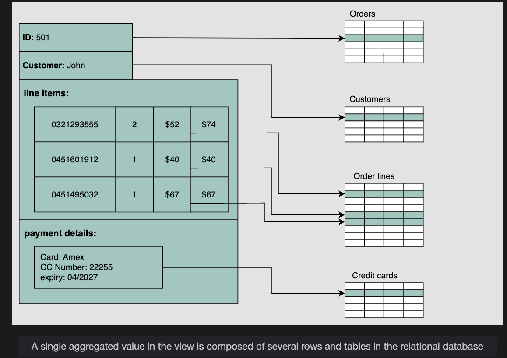
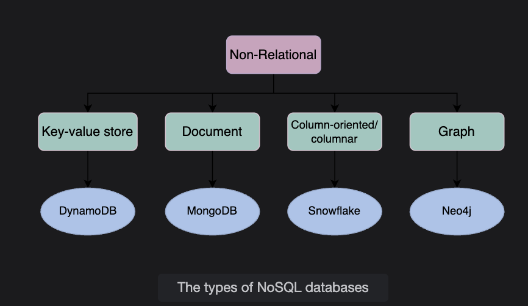

# Types of Databases

Understand various types of databases and their use cases in system design.

As we discussed earlier, databases are divided into two types: **relational** and **non-relational**. Let’s discuss these types in detail.

---

## Relational Databases

Relational databases adhere to particular **schemas** before storing the data. The data stored in relational databases has prior structure.  
Mostly, this model organizes data into one or more **relations** (also called tables), with a **unique key** for each tuple (instance).  

- Each entity of the data consists of **instances** and **attributes**.  
- Instances are stored in **rows**, and the attributes of each instance are stored in **columns**.  
- Since each tuple has a unique key, a tuple in one table can be linked to a tuple in other tables by storing the **primary keys** in other tables (generally known as **foreign keys**).  

A **Structured Query Language (SQL)** is used for manipulating the database. This includes insertion, deletion, and retrieval of data.

---

### Why Relational Databases Are Popular
Relational databases are widely used because of their:  
- Simplicity  
- Robustness  
- Flexibility  
- Performance  
- Scalability  
- Compatibility in managing generic data  

---

## ACID Properties

Relational databases provide the **Atomicity, Consistency, Isolation, and Durability (ACID)** properties to maintain the integrity of the database.  

ACID is a powerful abstraction that:  
- Simplifies complex interactions with the data  
- Hides many anomalies (dirty reads, dirty writes, read skew, lost updates, write skew, phantom reads) behind a simple **transaction abort**

⚠️ However, ACID is like a **big hammer** by design, making it generic enough for all problems.  
If an application only needs to deal with a few anomalies, there is an opportunity to use a **custom solution** for higher performance, though with added complexity.

---

### Let’s Discuss ACID in Detail:

- **Atomicity**:  
  A transaction is considered an atomic unit.  
  Either **all the statements** within a transaction will successfully execute, or **none** of them will execute.  
  If a statement fails within a transaction, it should be aborted and rolled back.  

- **Consistency**:  
  At any given time, the database should be in a **consistent state**, and it should remain consistent after every transaction.  
  Example: If multiple users want to view a record from the database, it should return the same result each time.  

- **Isolation**:  
  If multiple transactions run concurrently, they shouldn’t interfere with each other.  
  The final state of the database should be the same as if the transactions were executed **sequentially**.  

- **Durability**:  
  The system should guarantee that **completed transactions will survive permanently**, even in case of system failures.  

---

## Popular Relational DBMS

Various **Database Management Systems (DBMS)** are used to define relational database schemas and perform operations like storing, retrieving, and running SQL queries on data.  

Some popular DBMS include:  
- MySQL  
- Oracle Database  
- Microsoft SQL Server  
- IBM DB2  
- Postgres  
- SQLite

---
# Why Relational Databases — Deep Examples

Relational databases are the default for structured data. Below are clear, in-depth examples that show *how* and *why* key features work in practice.

---

# 1. Flexibility (DDL while running)

You can change schema online in most RDBMSs (add columns, rename tables) without stopping queries.

## Example: Add a `discount` column to `products` while traffic is live
```sql
-- Current table
CREATE TABLE products (
  product_id SERIAL PRIMARY KEY,
  name TEXT NOT NULL,
  price NUMERIC(10,2) NOT NULL
);

-- Add a column safely (online in most DBs)
ALTER TABLE products ADD COLUMN discount_percent NUMERIC(5,2) DEFAULT 0;

-- Backfill (optional) without downtime
UPDATE products SET discount_percent = 0 WHERE discount_percent IS NULL;
```

**Why this matters:** A running e-commerce site can add new features (discounts, tags) without downtime. DDL operations are implemented carefully (locks, online schema change mechanisms) so reads/writes continue.

---

# 2. Reduced Redundancy (Normalization) — deep example

## Bad (denormalized) single table
```
students_and_courses
| student_id | student_name | course_name      | instructor    |
|-----------:|--------------|------------------|---------------|
| 1          | Alice        | Database 101     | Prof. Smith   |
| 2          | Bob          | Database 101     | Prof. Smith   |
| 3          | Charlie      | Data Structures  | Prof. David   |
| 4          | Alice        | Data Structures  | Prof. David   |
```

**Problems:**
- Repeated student_name, instructor.
- Update anomaly: change instructor name → must update many rows.
- Insert anomaly: cannot add a course unless a student exists.
- Delete anomaly: removing last student of a course removes the course record.

## Normalized design (3NF-ish)
```sql
CREATE TABLE students (
  student_id SERIAL PRIMARY KEY,
  name TEXT NOT NULL
);

CREATE TABLE courses (
  course_id SERIAL PRIMARY KEY,
  name TEXT NOT NULL,
  instructor TEXT NOT NULL
);

CREATE TABLE enrollments (
  student_id INT REFERENCES students(student_id),
  course_id  INT REFERENCES courses(course_id),
  PRIMARY KEY (student_id, course_id)
);
```

## Operations and benefits

**Insert new course (no student required):**
```sql
INSERT INTO courses (name, instructor) VALUES ('Machine Learning', 'Dr. Ada');
```

**Enroll Alice into the course:**
```sql
-- Alice already exists in students
INSERT INTO enrollments (student_id, course_id) VALUES (1, 10);
```

**Update instructor's name once:**
```sql
UPDATE courses SET instructor = 'Dr. Smith' WHERE course_id = 1;
-- All displays and joins now show updated name automatically
```

**Why normalized is better:**
- Single source of truth for each entity.
- Updates are atomic and consistent.
- No wasted space or inconsistent rows.

---

# 3. Concurrency — deep example (hotel booking)

Concurrent access is the norm. RDBMSs use transactions, locks, MVCC, and isolation levels.

## Scenario: Two users try to book the last room (room_id = 101) concurrently.

**Table:**
```sql
CREATE TABLE rooms (
  room_id INT PRIMARY KEY,
  status  TEXT CHECK (status IN ('available','booked'))
);
```

## Correct approach (pessimistic locking)

**Transaction A:**
```sql
BEGIN;
-- lock the row for update so others wait
SELECT status FROM rooms WHERE room_id = 101 FOR UPDATE;
-- check status in app logic
UPDATE rooms SET status = 'booked' WHERE room_id = 101;
COMMIT;
```

Transaction B (starts at same time) will block on the `SELECT ... FOR UPDATE` until Transaction A commits or rolls back. After A commits, B's SELECT will see status='booked' and its attempt to book will fail or return an appropriate message.

## Optimistic approach (versioning)

**Add a version column:**
```sql
ALTER TABLE rooms ADD COLUMN version INT DEFAULT 0;
```

**Booking pseudocode:**
```sql
-- read current status and version
SELECT status, version FROM rooms WHERE room_id = 101;
-- attempt update only if version still same
UPDATE rooms SET status='booked', version = version + 1
 WHERE room_id = 101 AND version = <read_version>;
-- if updated rows = 0 -> conflict: someone else changed it
```

**Why use optimistic:** Good when conflicts are rare; avoids locking overhead.

## Isolation levels and effects - Deep Dive

## Why Do We Need Isolation Levels?

Because multiple users hit the same database at the same time, causing:

- Same row read at different times
- Same row updates
- New rows appearing
- Inconsistent results

**Isolation levels tell the database how strict it should be when handling concurrent transactions.**

---

## 🟡 LEVEL 1 — READ COMMITTED

### 👉 "Give me whatever is most recently committed."

### ❌ What problem happens here?

**Non-repeatable read** → Same SELECT returns different values inside same transaction.

### ✔ SIMPLE REAL LIFE EXAMPLE (PAYTM / PHONEPE WALLET)

**User A (you) opens wallet:**

Balance shows ₹500.

```sql
BEGIN;
SELECT balance WHERE user = A;  --> 500
```

**At the same time, User B sends you ₹100:**

Balance becomes ₹600 in DB.

```sql
UPDATE wallet SET balance = 600 WHERE user = A;
COMMIT;
```

**User A again refreshes wallet:**

Now it shows ₹600.

```sql
SELECT balance WHERE user = A; --> 600
```

Same query → different answers → **non-repeatable read**.

👉 This is allowed in READ COMMITTED.

### 📌 Used where?

- Normal OLTP apps
- E-commerce
- Banking UIs (not core banking)
- Payment apps (non-critical checks)
- Most systems use this by default (PostgreSQL, Oracle)

---

## 🟠 LEVEL 2 — REPEATABLE READ

### 👉 "Freeze what I saw in the beginning. Even if others change it, I should not see it."

### 🔥 Example: Amazon Shopping Cart - Item Price Check

**Transaction A:**

You open a product page. Price = ₹1000.

```sql
SELECT price WHERE product = 'Laptop';  --> 1000
```

**Transaction B:**

Another process updates the price to ₹1200.

```sql
UPDATE products SET price = 1200 WHERE id=1;
COMMIT;
```

**Transaction A checks again:**

Still sees ₹1000, because snapshot is frozen inside this transaction.

👉 **Prevents non-repeatable reads.**

### 📌 Where is REPEATABLE READ used?

- MySQL InnoDB default
- Inventory systems
- Billing systems where mid-transaction consistency is important
- Systems reading same data multiple times (reports, summaries)

---

## 🔴 LEVEL 3 — SERIALIZABLE

### 👉 "Behave like only ONE user is using the system at a time."

This prevents:

- Dirty reads
- Non-repeatable reads
- **Phantom reads** (new rows added during a transaction)

### 🔥 SUPER SIMPLE REAL EXAMPLE (Zomato / Swiggy Restaurant Orders)

**Transaction A:**

Admin checking number of pending orders:

```sql
SELECT COUNT(*) FROM orders WHERE status='pending'; --> 10
```

**Transaction B:**

A new customer places an order (order #11)

```sql
INSERT INTO orders (status='pending');
COMMIT;
```

**Transaction A queries again:**

- **Without serializable** → sees 11 → phantom read
- **With serializable** → still sees 10 (because DB pretends B didn't happen yet)

👉 Database blocks/rolls back B or A later.

### 📌 Where SERIALIZABLE is used?

- Core banking systems
- Financial ledger systems
- Airline seat booking
- Stock trading systems
- Any place where data must NEVER be inconsistent

---

## ⭐ THE BEST ANALOGY YOU WILL NEVER FORGET

- 🟡 **READ COMMITTED** → Watching CCTV live
  - What happens now, you see now.

- 🟠 **REPEATABLE READ** → Watching a recorded video clip
  - Once you play it, nothing inside changes.

- 🔴 **SERIALIZABLE** → Only one person allowed in CCTV room
  - No one can change anything until you finish seeing everything.

---

## ⭐ Real System Example (Bank)

Imagine 2 systems:

1. Mobile App (User visible)
2. Core Banking system (ledger updates)

### READ COMMITTED
Mobile app balance refresh shows real-time committed changes.

### REPEATABLE READ
A batch job checking same user's transactions keeps a stable snapshot.

### SERIALIZABLE
Money transfer between accounts — must avoid:
- Double spending
- Phantom entries
- Inconsistent debit/credit

---

## 🧩 Quick Comparison Table

| Isolation Level | Prevents | Good For | Not Good For |
|----------------|----------|----------|--------------|
| Read Committed | Dirty read | Web apps, e-commerce | Strict consistency |
| Repeatable Read | Dirty + non-repeatable | Summaries, reports, inventory | High concurrency |
| Serializable | Dirty + non-repeatable + phantom | Banking, trading | Performance |

---

# ✅ REPEATABLE READ vs SERIALIZABLE - Exact Difference

Both prevent inconsistent reads inside a transaction, but they protect against different levels of anomalies.

## 🔥 1. REPEATABLE READ

### ✔ Guarantees:
If you read the same row twice → you always get the same value (even if another transaction modifies it in between).

### ❌ Does NOT guarantee:
The set of rows returned from a query will remain stable.

➡️ **Phantom rows can appear.**

### 📌 Think of it like:
"You see the same values on rows you have already looked at. But new rows matching your search can appear."

---

## 🔥 2. SERIALIZABLE

### ✔ Guarantees:
- Same row gives same value
- The set of rows is fixed → no phantom rows
- The whole system behaves as if one transaction is running at a time (serial order)

### ❌ Cost:
- More blocking
- More rollbacks
- Slowest
- Hardest to scale

### 📌 Think of it like:
"No one can insert/update rows that affect your queries until you finish."

---

## 🎯 THE EXACT DIFFERENCE IN ONE LINE

⭐ **REPEATABLE READ**
- Prevents non-repeatable reads but phantoms may occur.

⭐ **SERIALIZABLE**
- Prevents non-repeatable reads AND phantom reads by locking the entire search range.

---

## 🔍 Comparison Using the SAME Example

### Scenario

Orders table:

| order_id | status |
|----------|--------|
| 1 | pending |
| 2 | pending |
| 3 | done |

### 🟩 Under REPEATABLE READ

**Transaction A:**
```sql
BEGIN;
SELECT COUNT(*) FROM orders WHERE status = 'pending'; 
-- returns 2
```

**Transaction B inserts a new pending order:**
```sql
INSERT INTO orders (status) VALUES ('pending');
COMMIT;
```

**Transaction A again:**
```sql
SELECT COUNT(*) FROM orders WHERE status = 'pending';
-- returns 3  (PHANTOM!)
```

**🔥 Reason:**
A prevents changes on rows it already saw, but not new rows inserted later that also match the condition.

So REPEATABLE READ cannot stop phantom rows.

---

### 🟥 Under SERIALIZABLE

**Transaction A:**
```sql
BEGIN;
SELECT COUNT(*) FROM orders WHERE status = 'pending';
-- returns 2
```

**Now transaction B tries:**
```sql
INSERT INTO orders (status) VALUES ('pending');
```

**❌ DB blocks or rolls back Transaction B**

**🔥 Reason:**
A "logically owns" the range of rows matching `status='pending'`. No one else can insert rows that would change A's result set.

➡️ So no phantom can appear.

---

## ✔ Real-world Example to Make it 100% Clear

### 🟩 REPEATABLE READ Example

You are checking bank transactions from: **1 Jan → 10 Jan**

- You see 5 entries.
- While you're still checking, someone posts a new transaction on 5 Jan.
- Next time you refresh inside the same session → you may now see 6 entries.

👉 Old rows remain same, but new rows can appear.  
👉 **Phantom read allowed**

---

### 🟥 SERIALIZABLE Example

Same scenario, but:

- You see 5 entries.
- No one is allowed to add/modify entries from 1–10 Jan until you finish.

👉 New rows cannot appear  
👉 **No phantom reads**

---

## 🧠 Quick Memory Trick

**REPEATABLE READ = row stability**
- Protects only rows already read

**SERIALIZABLE = result-set stability**
- Protects entire search range

---

## 🚀 Final Summary Table

| Feature | READ COMMITTED | REPEATABLE READ | SERIALIZABLE |
|---------|---------------|-----------------|--------------|
| Dirty reads | ❌ | ❌ | ❌ |
| Non-repeatable reads | ❌ | ✔ | ✔ |
| Phantom reads | ❌ | ❌ | ✔ |
| Performance | Fast | Medium | Slow |
| Conflicts/rollbacks | Low | Medium | High |

---

## Key Takeaways

1. **READ COMMITTED**: Real-time data, but same query can return different results
2. **REPEATABLE READ**: Stable row values, but new rows can appear (phantoms)
3. **SERIALIZABLE**: Complete isolation, no phantoms, but slowest performance

Choose based on your application's consistency requirements vs. performance needs!

### 4. Deadlock Handling

#### What is a Deadlock?
When two (or more) transactions wait for each other's locks in a cycle → both stuck.

#### Example:
**Transaction A:**
```sql
BEGIN;
UPDATE accounts SET balance = balance - 100 WHERE id = 1; -- locks row 1
-- now wants row 2
UPDATE accounts SET balance = balance + 100 WHERE id = 2; -- waits...
```

**Transaction B:**
```sql
BEGIN;
UPDATE accounts SET balance = balance - 50 WHERE id = 2; -- locks row 2
-- now wants row 1
UPDATE accounts SET balance = balance + 50 WHERE id = 1; -- waits...
```

- A has lock on row1, wants row2.
- B has lock on row2, wants row1.
- Both wait forever → deadlock.

#### How DB handles it:
1. Database detects deadlocks automatically by analyzing lock graph.
2. One transaction is chosen as a victim and is rolled back.
3. The other continues.

**Example DB message:**
```
ERROR: deadlock detected
DETAIL: Process 123 waits for ShareLock on transaction 456; blocked by process 789.
HINT: Restart the transaction.
```

**App responsibility:**
- Catch the rollback error.
- Retry the failed transaction.

### Isolation Level Trade-offs

| Isolation Level | Prevents | Still Allows | Performance impact |
|---|---|---|---|
| READ COMMITTED | Dirty reads | Non-repeatable, Phantom | Low (default in many DBs) |
| REPEATABLE READ | Dirty, Non-repeatable | Phantom | Medium |
| SERIALIZABLE | Dirty, Non-repeatable, Phantom | None | High (more rollbacks, less concurrency) |

---

# 4. Integration — deep example (e-commerce)

Integration = shared DB / aggregated data for multiple apps.

## Tables (shared DB)
```sql
-- Customers, Orders, Inventory, Payments
CREATE TABLE customers (
  customer_id SERIAL PRIMARY KEY,
  name TEXT, email TEXT
);

CREATE TABLE inventory (
  product_id SERIAL PRIMARY KEY,
  name TEXT,
  qty INT
);

CREATE TABLE orders (
  order_id SERIAL PRIMARY KEY,
  customer_id INT REFERENCES customers(customer_id),
  status TEXT
);

CREATE TABLE order_items (
  order_item_id SERIAL PRIMARY KEY,
  order_id INT REFERENCES orders(order_id),
  product_id INT REFERENCES inventory(product_id),
  quantity INT
);

CREATE TABLE payments (
  payment_id SERIAL PRIMARY KEY,
  order_id INT REFERENCES orders(order_id),
  amount NUMERIC
);
```

## Transaction: Place an order (example flow)

All done inside one DB transaction to keep integrity:

```sql
BEGIN;

-- 1. Create order
INSERT INTO orders (customer_id, status) VALUES (123, 'pending') RETURNING order_id;

-- 2. Add items
INSERT INTO order_items (order_id, product_id, quantity) VALUES (order_id, 10, 2);

-- 3. Decrease inventory (atomic)
UPDATE inventory SET qty = qty - 2 WHERE product_id = 10 AND qty >= 2;
-- check affected rows = 1 (else rollback and notify out-of-stock)

-- 4. Process payment (call payment gateway), then record
INSERT INTO payments (order_id, amount) VALUES (order_id, 99.98);

-- 5. Set order status to confirmed
UPDATE orders SET status = 'confirmed' WHERE order_id = order_id;

COMMIT;
```

## When services own their own DB (distributed)

If Order service and Inventory service have separate databases, you need distributed coordination:

1. **Two-phase commit (2PC)** — strong, but complex and blocks resources.
2. **Saga pattern** (recommended for many microservices) — break work into steps with compensations.

**Saga example (compensating action):**

1. Create order (order service)
2. Reserve inventory (inventory service) — if fails, compensate by cancelling order
3. Charge payment (payment service) — if fails, compensate by releasing inventory and cancelling order

Sagas relax ACID across services in favor of eventual consistency and better availability.

---

# 5. Backup and Disaster Recovery — deep example

Relational DBs provide consistent backups + point-in-time recovery.

## Mechanisms
1. **Full snapshot** (dump / snapshot) — periodic full backups.
2. **Write-Ahead Log (WAL)** / transaction log — every change logged before applied.
3. **Continuous replication** — streaming WAL to replicas (hot standby).
4. **Point-in-time recovery (PITR)** — replay WAL to a chosen time.

## Example: Postgres style flow

1. **Periodic base backup**
   ```bash
   pg_basebackup -D /var/lib/postgres/base_backup
   ```

2. **Keep WAL segments** (archived)

3. **Restore:**
   - Restore base backup files.
   - Configure recovery.conf to fetch WAL segments and replay up to a point.
   - Start DB — WAL replay reconstructs committed transactions.

4. **Crash scenario:**
   - Some transactions were in WAL but not flushed to data files. On restart, DB replays WAL to ensure durability of committed txns and rolls back incomplete txns.

**Cloud RDBMS:** often provide automated continuous replication across AZs/regions and snapshot + PITR via UI.

---

# 6. Impedance Mismatch — deep example (objects vs tables)

Relational model expects tabular primitive values; in-memory code uses rich nested objects.

## Example: Java object
```java
class User {
  int id;
  String name;
  List<Order> orders;
}

class Order {
  int id;
  Date createdAt;
  List<OrderItem> items;
}
```

  

## Mapping to relational tables (manual / ORM)

**Tables:**
- users (id, name)
- orders (id, user_id, created_at)  
- order_items (id, order_id, product_id, qty)

**Insert flow (ORM does behind the scenes):**
1. Insert user → get user_id
2. For each order → insert order with user_id → get order_id  
3. For each item → insert order_item with order_id

**Complexity / Mismatch examples:**
- Object graph depth → many inserts/joins.
- Collections (List<Order>) → require separate table or serialized JSON.
- Transactional boundaries in code vs DB calls need careful handling.

## Options to reduce impedance mismatch

1. **Use an ORM** (e.g., Hibernate) to map objects to tables (cost: potential N+1 queries, lazy loading pitfalls).

2. **Store complex structures in JSON columns** (Postgres jsonb) for flexible schemas:
   ```sql
   CREATE TABLE events (
     id SERIAL PRIMARY KEY,
     payload JSONB
   );
   ```
   - **Pros:** flexible, easy to store nested structures.
   - **Cons:** less performant for relational queries, harder to enforce relational constraints.

---

# Summary (practical takeaways)

- **Flexibility:** DDL can be performed online; good for evolving products.
- **Reduced redundancy (Normalization):** eliminates anomalies, promotes single source of truth.
- **Concurrency:** use transactions + locks or MVCC; pick pessimistic or optimistic concurrency according to workload.
- **Integration:** single shared DB makes cross-app queries easy; distributed systems need sagas or 2PC.
- **Backup & DR:** WAL + snapshots + replication enable durability and quick recovery.
- **Impedance mismatch:** object models vs tables require mapping (ORMs) or hybrid approaches (JSONB) — each with tradeoffs.

---

**Isolation Levels Summary:**
- **READ COMMITTED:** Safe from dirty reads. Good default for many apps.
- **REPEATABLE READ:** Adds stability (same rows in a txn). Useful for reports.
- **SERIALIZABLE:** Absolute safety; costly. Good for financial operations.
- **Deadlocks:** Unavoidable in concurrent systems; DB resolves them automatically → apps must retry.


---


# Why Non-relational (NoSQL) Databases?

A **NoSQL database** is designed for a variety of data models to access and manage data.

These databases are used in applications that require:
- Large volumes of semi-structured and unstructured data
- Low latency
- Flexible data models

This is achieved by relaxing some of the **strict data consistency restrictions** of relational databases.

---

## Characteristics of NoSQL Databases

### 1. Simple Design

- Unlike relational databases, NoSQL doesn't require dealing with **impedance mismatch**.
- Example: Instead of splitting employee data across multiple tables (`Employee`, `Address`, `Salary`, `Department`) and performing **joins**, we can store all of an employee's information in **one document**:

```json
{
  "employee_id": 123,
  "name": "Alice",
  "department": "Engineering",
  "salary": 95000,
  "addresses": [
    {"type": "home", "city": "New York"},
    {"type": "office", "city": "Boston"}
  ]
}
```

👉 This makes applications simpler to code, debug, and maintain.

### 2. Horizontal Scaling

- **Horizontal scaling (scale out)** means adding **more servers (nodes)** to handle load.
- Opposite is **vertical scaling (scale up)** = adding more CPU, RAM to one server.
- NoSQL databases can run on a large cluster of commodity servers.
- This is crucial when the number of concurrent users increases.

#### Why NoSQL Fits Horizontal Scaling Better?

**In Relational DB (SQL):**
- Data for one entity (e.g., employee) is spread across multiple tables:
  - `Employee`
  - `Address` 
  - `Department`
  - `Salary`
- Joining these tables requires complex queries.
- Splitting across multiple machines (sharding) becomes difficult because joins across shards are slow and complex.

**In NoSQL (Document DB like MongoDB):**
- All related info about an employee can be stored **inside one JSON-like document**.
- No need for cross-node joins.
- Data can be easily partitioned across nodes.

#### Deep Example: Scaling an HR System with 10M Employees

**In Relational DB:**
- Employee info is normalized:
  - `Employees(id, name, dept_id)`
  - `Departments(dept_id, name)`
  - `Salaries(emp_id, amount)`
- To fetch 1 employee's full info → you must join across 3–4 tables.
- If employees are split across shards, these joins may require fetching from multiple nodes = slow and complex.

**In NoSQL (MongoDB):**
Store one employee as a single **document**:

```json
{
  "employee_id": 123,
  "name": "Alice",
  "department": {
    "id": 45,
    "name": "Engineering"
  },
  "salary": 95000,
  "addresses": [
    {"type": "home", "city": "New York"},
    {"type": "office", "city": "Boston"}
  ]
}
```

👉 All needed info is in **one place**. No joins.

#### Scaling Across Nodes

**Without scaling:**
- One server stores all 10M employees.
- Too much load → server becomes bottleneck.

**With Horizontal Scaling (NoSQL):**
Employees are partitioned (sharded) across 5 nodes:
- **Node 1**: employee_id 1–2,000,000
- **Node 2**: employee_id 2,000,001–4,000,000
- **Node 3**: employee_id 4,000,001–6,000,000
- **Node 4**: employee_id 6,000,001–8,000,000
- **Node 5**: employee_id 8,000,001–10,000,000

- Query for Alice (id=123) → directly routed to Node 1.
- Each node handles a subset of queries, so **concurrent users scale easily**.

#### Node Failure Handling

Let's say **Node 3** goes down.
- NoSQL databases (like Cassandra, MongoDB, DynamoDB) usually replicate data across multiple nodes.
- So Node 2 or Node 4 can take over until Node 3 recovers.
- To the **application layer**, nothing breaks → failover is transparent.

#### Analogy to Understand

Think of:
- **Relational DB scaling** = one giant library. To find a book, you need to go through multiple sections (joins). Hard to split across branches.
- **NoSQL scaling** = multiple small libraries, each holding complete books about a topic (employee). Easy to split across branches since each library is self-contained.

✅ **Result**: Queries are distributed, performance scales linearly, and adding new nodes increases capacity.

**NoSQL supports horizontal scaling because:**
1. Data is stored in **self-contained documents** (no heavy joins).
2. Data can be **partitioned across nodes** automatically.
3. Queries are distributed, so more nodes = more capacity.
4. Failures are handled transparently with replication.

### 3. Availability

- NoSQL supports high availability through replication.
- If Node 3 fails, other replicas automatically handle requests until Node 3 recovers.
- To the application, this is transparent → no downtime.

### 4. Support for Unstructured & Semi-structured Data

- Many NoSQL databases don't require a predefined schema.
- Example with JSON documents in a document store:

```json
// Document 1
{"id": 1, "name": "Alice", "skills": ["Java", "MongoDB"]}

// Document 2
{"id": 2, "name": "Bob", "experience": 5, "location": "London"}
```

👉 Both are valid in the same collection, even though their fields differ.

### 5. Cost

- Many NoSQL databases are open-source (MongoDB, Cassandra, Couchbase).
- They run on commodity servers, unlike some RDBMSs that need expensive proprietary hardware.

---

## Types of NoSQL Databases

NoSQL databases can be divided into several categories based on how they store and manage data:

### 1. Document Store
- Store data as JSON/XML documents.
- **Example**: MongoDB, CouchDB.
- **Use case**: User profiles, catalogs, CMS.

### 2. Columnar Database
- Data stored in columns instead of rows.
- **Example**: Cassandra, HBase.
- **Use case**: Analytics, time-series data.

### 3. Key-Value Store
- Store data as simple key-value pairs.
- **Example**: Redis, DynamoDB.
- **Use case**: Caching, session storage.

### 4. Graph Database
- Store entities and relationships as nodes and edges.
- **Example**: Neo4j.
- **Use case**: Social networks, fraud detection, recommendation systems.

---

## Final Takeaway

- **NoSQL databases are best when you need scalability, flexibility, and high availability.**
- They trade off some strict consistency for performance and ease of scaling.
- Each type of NoSQL database (document, key-value, columnar, graph) serves specific use cases in system design.

  

# NoSQL Databases Comprehensive Guide

## Key-Value Databases (Explained in Depth)

### 1. What They Are
* A **key-value database** stores data as a **pair**:
   * **Key** = unique identifier (like a primary key in RDBMS).
   * **Value** = actual data (can be simple text, number, JSON object, or even binary files).
* Internally, they use **hash tables** or similar structures for **fast lookups**.
* Think of them like a giant **dictionary** or **map** (`Map<Key, Value>` in Java).

### 2. How It Works (Concept)
Imagine you are building an **e-commerce website**:
* Every user who logs in gets a **session ID** (unique key).
* You want to store user-specific session data (cart items, preferences, recommendations).

In a **key-value store**, it looks like this:

```json
{
  "session_12345": {
    "user_id": 101,
    "name": "Alice",
    "cart": ["Laptop", "Mouse"],
    "discounts": ["10%OFF", "FREESHIP"]
  },
  "session_67890": {
    "user_id": 202,
    "name": "Bob",
    "cart": ["Phone"],
    "discounts": ["5%OFF"]
  }
}
```

* Here `session_12345` and `session_67890` are **keys**.
* Their associated JSON objects are the **values**.

### 3. Why Key-Value Databases Shine
* **Extremely Fast Lookups** → finding a value by key is O(1) in hash tables.
* **Horizontal Scaling** → data is easy to partition (shard) because keys can be distributed across nodes.
* **Flexible Values** → values don't need a schema (can be any type: text, JSON, binary).
* **High Throughput** → supports thousands/millions of reads and writes per second.

### 4. Real-World Use Case: Session Management in Web Applications
Let's take a **web app like Amazon**:
* A user logs in → server generates `sessionID=abc123`.
* Server stores session data in a **key-value database** (like Redis):

```redis
SET "session:abc123" "{userId: 101, cart: ['Laptop', 'Mouse'], discounts: ['10%OFF']}"
```

* When the user browses, the app quickly retrieves session data:

```redis
GET "session:abc123"
```

* If the user logs out, the session is deleted:

```redis
DEL "session:abc123"
```

👉 This process is **fast, simple, and scalable** compared to querying multiple relational tables.

### 5. Popular Key-Value Databases
* **Redis** → in-memory key-value store (super fast, often used for caching & sessions).
* **Amazon DynamoDB** → fully managed key-value + document database, scales globally.
* **Memcached** → lightweight in-memory caching system.

### 6. Example of Horizontal Scaling
Imagine your key-value database is spread across **3 servers**:
* Server 1 handles keys starting with `a–h`.
* Server 2 handles keys starting with `i–p`.
* Server 3 handles keys starting with `q–z`.

If you store:
* `"session_alice"` → goes to Server 1.
* `"session_ironman"` → goes to Server 2.
* `"session_zoe"` → goes to Server 3.

✅ This makes it easy to **scale out** and balance the load.

### 7. Advanced Concept: Composite Keys in DynamoDB

Normally, in a key-value DB, a single unique key points to a value.
Example: `session_123 → {user data}`

But in some cases (like DynamoDB), instead of one simple key, you can use a **composite key** (made from two attributes combined).

Here:
* **Product ID** = unique identifier for a product.
* **Type** = category/type of that product.
* Together, **(ProductID + Type)** form the key.

👉 This ensures uniqueness and allows more flexibility in queries.

#### Example in Depth

| ProductID | Type    | Attributes (Value)                                           |
|-----------|---------|-------------------------------------------------------------|
| 101       | Mobile  | {"brand": "Apple", "model": "iPhone 15", "price": 1200}    |
| 101       | Cover   | {"brand": "Spigen", "color": "Black", "price": 20}         |
| 102       | Laptop  | {"brand": "Dell", "model": "XPS 13", "price": 1500}        |
| 102       | Charger | {"brand": "Dell", "wattage": "65W", "price": 50}           |

Here the key = (ProductID + Type)
* (101, Mobile)
* (101, Cover)
* (102, Laptop)
* (102, Charger)

#### Why Use Composite Keys?
* **Uniqueness** → prevents clashes (you can have multiple entries with same ProductID but different Type).
* **Flexibility** → easy to query by ProductID and filter by Type.
* **Scalability** → DynamoDB automatically partitions data based on keys, so composite keys help distribute evenly.

### 8. Summary
* **Key** = unique ID for quick lookup.
* **Value** = the actual data (no schema restrictions).
* Best suited for **session management, caching, user profiles, shopping carts**.
* Popular tools: Redis, DynamoDB, Memcached.

👉 In short: A **key-value database** is like a **giant hashmap for your application**, but distributed across many servers for **scalability** and **availability**.

---

## Document Databases

### 1. What They Are
Document databases store data as **documents** (typically JSON-like structures) that can contain:
* Nested objects
* Arrays
* Different field structures per document
* No rigid schema requirements

### 2. Example Document Structure

```json
{
  "id": 1001,
  "name": "Brown",
  "title": "Mr.",
  "email": "brown@anyEmail.com",
  "cell": "123-465-9999",
  "likes": [
    "designing",
    "cycling",
    "skiing"
  ],
  "businesses": [
    {
      "name": "ABC co.",
      "partner": "Vike",
      "status": "Bankrupt",
      "date_founded": {
        "$date": "2021-12-10"
      }
    }
  ]
}
```

### 3. Document DB vs Redis (Key-Value)

#### Why Not Redis for Complex Data?

If you tried to store the above JSON in Redis:
* You'd have to serialize it as a string (like JSON string or hash).
* Redis won't let you query deep inside (find all users who like skiing).
* You can only retrieve the entire value by key (`GET user:1001`).
* No secondary indexes → you can't say "get user by email".
* Updating nested structures requires replacing the entire string or carefully manipulating hashes.

Redis is not meant for complex, semi-structured JSON documents.

#### Redis Way:
```redis
SET user:1001 "{'id':1001,'name':'Brown','likes':['skiing']}"
GET user:1001
```

✅ Fast to store/retrieve by ID.
❌ Can't query: "give me all users who like skiing" without scanning all keys manually.

#### Document DB (MongoDB) Way:
```javascript
db.users.insertOne({
   id: 1001,
   name: "Brown",
   likes: ["designing", "cycling", "skiing"],
   businesses: [{ name: "ABC co.", status: "Bankrupt" }]
})
```

Query examples:
```javascript
db.users.find({ "likes": "skiing" })
db.users.find({ "businesses.status": "Bankrupt" })
```

✅ Can search inside nested fields.
✅ Supports indexes for speed.
✅ Flexible structure per document.

### 4. Document DB Capabilities
A document DB can:
* Store nested fields (like `businesses.date_founded`).
* Let you query inside JSON → e.g., find all users whose `"businesses.status" = "Bankrupt"`.
* Create indexes on `email` or `likes` for fast lookups.
* Support partial updates (e.g., update only `businesses.status` without rewriting the whole doc).

### 5. Key Differences Summary

| Feature | Redis (Key-Value) | Document DB |
|---------|-------------------|-------------|
| **Purpose** | Simple lookups (get by key) | Complex, semi-structured JSON documents |
| **Querying** | No deep queries | Nested queries, indexes |
| **Speed** | Super fast | Fast with indexing |
| **Schema** | No schema for values | Flexible schema per document |
| **Use Cases** | Caching, sessions, leaderboards | User profiles, catalogs, blogs, content management |

👉 **Document DB is best for**: user profiles, catalogs, blogs, content management, semi-structured data.

---

## Graph Databases

### 1. What is a Graph Database?
Graph databases use the graph data structure to store data, where:
* **Nodes** → represent entities (e.g., a person, a company, a product).
* **Edges (relationships)** → connect nodes and describe how they relate (e.g., "FRIEND_OF", "WORKS_AT").
* **Properties** → both nodes and edges can have key-value pairs (like name, date, etc.).

The power of graph DBs is that you don't have to compute relationships on the fly (like SQL joins) — they are first-class citizens in the data model.

### 2. Example: Social Network (Neo4j style)

Imagine a social media app:

**Nodes:**
* Alice (User)
* Bob (User) 
* Charlie (User)
* Netflix (Company)

**Edges:**
* Alice → FRIEND_OF → Bob
* Bob → FRIEND_OF → Charlie
* Alice → WORKS_AT → Netflix

**How it looks in Graph DB:**
```
(Alice) -[:FRIEND_OF]-> (Bob)
(Bob)   -[:FRIEND_OF]-> (Charlie)
(Alice) -[:WORKS_AT]-> (Netflix)
```

Each node/edge can have properties:
* Alice → `{ name: "Alice", age: 29 }`
* FRIEND_OF → `{ since: "2020" }`

### 3. Queries in Graph DB

**Example Query 1: Find Alice's friends**
```cypher
MATCH (a:Person {name: "Alice"})-[:FRIEND_OF]->(friends)
RETURN friends;
```
👉 Result: Bob

**Example Query 2: Find "friends of friends" of Alice**
```cypher
MATCH (a:Person {name: "Alice"})-[:FRIEND_OF]->(:Person)-[:FRIEND_OF]->(fof)
RETURN fof;
```
👉 Result: Charlie

**Example Query 3: Where does Alice work?**
```cypher
MATCH (a:Person {name:"Alice"})-[:WORKS_AT]->(company)
RETURN company;
```
👉 Result: Netflix

### 4. Why Graph DB over Relational DB?

In SQL, representing this would require multiple join tables like:
* Users table
* Friendship table  
* Employment table

Querying friends of friends would mean nested joins, which get slower as data grows.

In a Graph DB, relationships are direct pointers → queries are fast even with millions of nodes.

### 5. Real-World Use Cases

Graph databases can be used in:
* **Social applications** → friends, likes, follows (Facebook, LinkedIn).
* **Recommendation engines** → "People who bought X also bought Y."
* **Fraud detection** → detect suspicious connections between accounts.
* **Data privacy & regulations** → track how data flows across systems.
* **Machine learning research** → build knowledge graphs for AI reasoning.
* **Financial services** → analyze transaction patterns and relationships.

### 6. Popular Graph Databases
* **Neo4J** → most popular graph database
* **OrientDB** → multi-model database with graph capabilities
* **InfiniteGraph** → distributed graph database

### 7. Storage
Graph data is kept in store files for persistent storage. Each of the files contains data for a specific part of the graph, such as nodes, links, properties, and so on.

✅ **Summary in simple words:**
Graph DBs shine when relationships between data are as important as the data itself. Instead of storing Alice, Bob, and Charlie in separate rows and joining them later, you store their connections natively and query them like a map.

---

## Columnar vs Wide-Column Databases

### 1. Columnar Databases
* **Storage layout**: Data is stored **column by column** on disk.
* **Goal**: Optimize **read-heavy, analytical queries** (OLAP).
* **Why?**
   * If you only query `salary` and `department` out of a 100-column table, the database can read **just those two columns**, skipping the rest.
   * This makes aggregations (SUM, AVG, COUNT) very fast.
* **Examples**: Amazon Redshift, Apache Parquet, Google BigQuery.

**Use Case**: 👉 Data warehousing, business intelligence, analytics dashboards.
👉 Example: "Give me the average sales per region for the last 12 months."

### 2. Wide-Column Databases
* **Storage layout**: Data is stored **row by row**, but each row is divided into **column families** (groups of related columns).
* **Goal**: Handle **write-heavy, real-time workloads** with semi-structured data.
* **Why?**
   * Rows don't need the same schema → one row can have 5 columns, another can have 50.
   * Optimized for **fast writes & distributed scalability**.
* **Examples**: Apache Cassandra, HBase, ScyllaDB.

**Use Case**: 👉 Messaging apps, IoT sensor data, time-series events.
👉 Example: "Store user activity logs (login, clicks, purchases) across millions of users, with different data attributes per event."

### 3. Key Difference (in simple words)
* **Columnar DB** → Think **Excel columns stored separately** for fast reads.
* **Wide-Column DB** → Think **giant Google Sheets** where each row can have its own structure, grouped into families, great for writes.

### 4. Example Comparison

**Columnar Database Table (stored column-wise)**

```
UserID | Age | Salary
---------------------
1      | 25  | 5000
2      | 30  | 7000
3      | 35  | 9000
```

On disk:
```
UserID → [1,2,3]  
Age    → [25,30,35]  
Salary → [5000,7000,9000]
```

👉 Very fast if you only query `AVG(Salary)`.

**Wide-Column Database (Cassandra style)**

```
RowKey: user123
ColumnFamily: Profile → {name: "Alice", age: 25}
ColumnFamily: Activity → {lastLogin: "2025-09-24", purchases: 10}

RowKey: user456
ColumnFamily: Profile → {name: "Bob"}
ColumnFamily: Activity → {lastLogin: "2025-09-23", clicks: 34, likes: 7}
```

👉 Each row can have different columns, grouped logically.
👉 Great for flexible semi-structured data.

✅ **In summary:**
* **Columnar DB** → optimized for **analytics & queries**.
* **Wide-Column DB** → optimized for **scalable writes & semi-structured data**.

---

## Database Selection Guide

| Database Type | Best For | Examples | Key Strengths |
|---------------|----------|----------|---------------|
| **Key-Value** | Caching, Sessions, Simple Lookups | Redis, DynamoDB, Memcached | Speed, Scalability, Simplicity |
| **Document** | User Profiles, Content Management, Catalogs | MongoDB, CouchDB | Flexible Schema, Rich Queries |
| **Graph** | Social Networks, Recommendations, Fraud Detection | Neo4j, OrientDB | Relationship Queries, Pattern Discovery |
| **Columnar** | Analytics, Data Warehousing, BI | Redshift, BigQuery | Fast Analytics, Compression |
| **Wide-Column** | IoT, Time-Series, Activity Logs | Cassandra, HBase | High Write Throughput, Flexible Schema |

Choose based on your specific use case, query patterns, and scalability requirements!

---

# Drawbacks of NoSQL Databases

## 1. Lack of Standardization
- NoSQL doesn’t follow any specific standard, unlike relational databases that rely on relational algebra.
- Different NoSQL products have their own query languages, APIs, and models.
- **Challenge**: Porting applications from one NoSQL type to another is not straightforward.

---

## 2. Consistency
- NoSQL databases make trade-offs between **consistency** and **availability** (as explained in the CAP theorem).
- Unlike relational databases, NoSQL does not always provide **strong data integrity** such as:
  - Primary key constraints
  - Referential integrity
- Many NoSQL systems use **eventual consistency**:  
  Data may not be immediately consistent but eventually becomes consistent over time.

---

# 📝 Practice Question

**Scenario:**  
Imagine we’re designing a **recommendation engine** for a social networking platform with millions of users.  
The goal is to provide personalized recommendations for users to connect with others based on their **interests, activities, and connections**.

**Question:**  
👉 Which database would be a natural fit for modeling and querying the complex relationships in a social network, and why?

---

## ✅ Suggested Answer
We can use a **Graph Database** because:
- **Nodes** store user information.  
- **Edges** represent relationships and activities (such as following, liking posts, or sharing).  
- Graph databases are built for **complex relationship queries**, making traversals like “friends of friends” or “users with similar interests” efficient.

---

## 💡 Evaluation
You’re on the right track by thinking about nodes and edges representing users and activities.  

It’s worth noting:
- Graph databases are **optimized for relationship queries**, common in social networks.  
- Traversing and finding relevant connections (e.g., suggesting new friends or communities) is far more efficient than in relational or document databases.  

Keep exploring graph data models for recommendation systems!

---

# Choose the Right Database

When choosing between relational and non-relational databases, consider the following factors:

| Relational Database | Non-relational Database |
|----------------------|--------------------------|
| Data is **structured** | Data is **unstructured** |
| Requires **ACID** properties | Needs to **serialize/deserialize** data |
| Data size is relatively **small** and can fit on a single node | Data size is **large** and may need horizontal scaling |

---

# Note
When NoSQL databases first appeared, they were **very different** from traditional databases, both in usage and programming model.  

But today, due to academic and industrial research:
- The gap is **blurring**.  
- Many NoSQL systems now support SQL-like queries and provide performance/consistency comparable to relational databases.  

**Example:**  
Google Cloud Spanner  
- Geo-replicated  
- Automatic horizontal sharding  
- High-speed global snapshots of data  
- Provides strong consistency *and* scalability.
