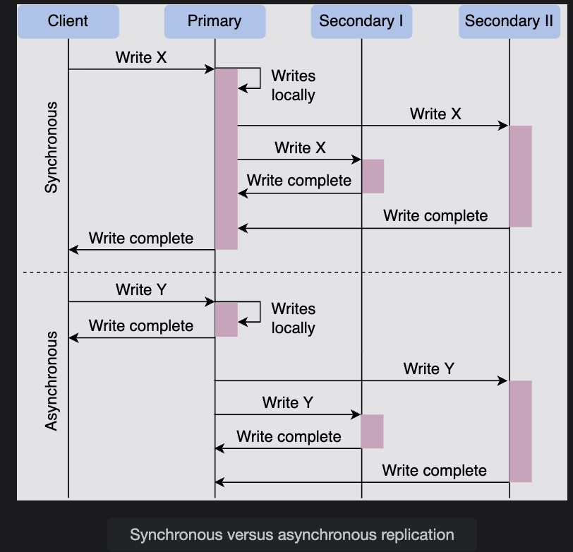
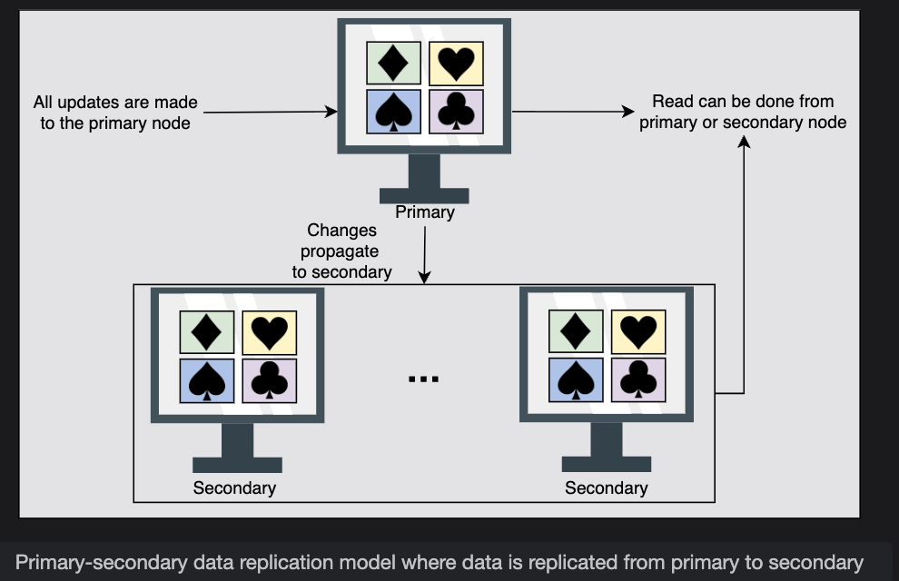
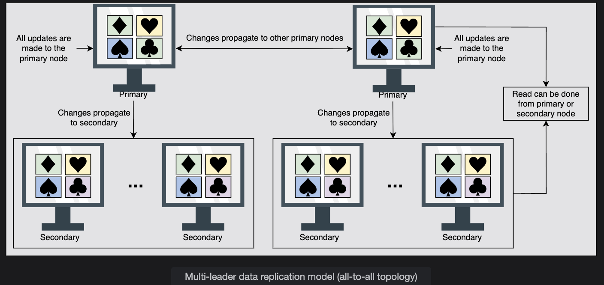
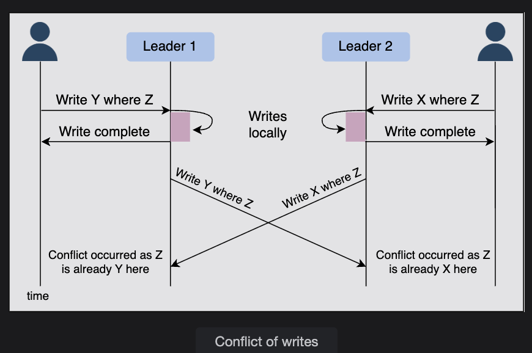
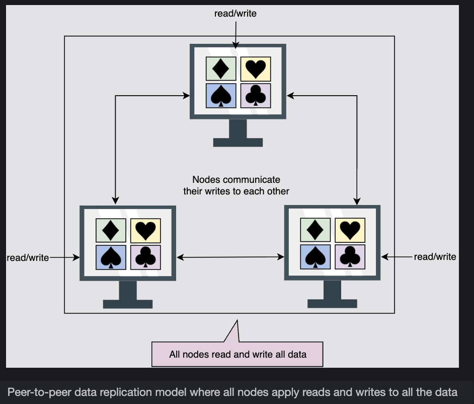
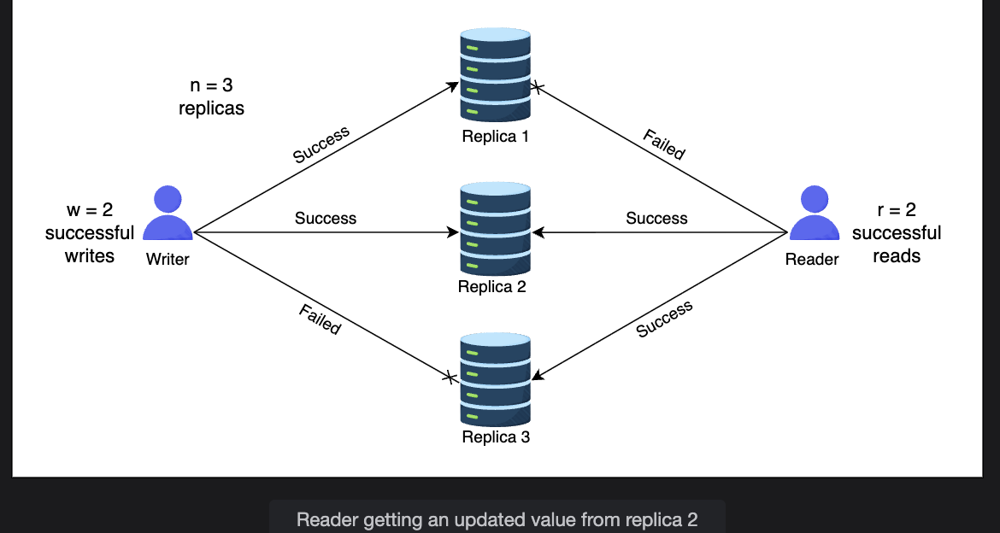

# Data Replication

## Why Replication?
Data is a critical asset for organizations. It provides:
- **Business insights** into what’s important and what needs to change.
- **Security and reliability** for client data.
- **On-demand access** under varying conditions, such as:
  - Increasing reads and writes
  - Disk and node failures
  - Network or power outages

To successfully run an online business, our datastore must provide:
1. **Availability under faults** (e.g., hardware or network failure).  
2. **Scalability** (handle increasing reads/writes smoothly).  
3. **Performance** (low latency and high throughput).  

It’s very hard—or even impossible—to achieve all of this on a **single node**.

---

## What is Replication?
Replication means **keeping multiple copies of data on different nodes** (often geographically distributed).  

Replication improves:
- **Availability** → if one node fails, another can serve requests.  
- **Scalability** → multiple nodes can share read/write load.  
- **Performance** → clients can connect to the nearest replica.  

> In this lesson, we assume a single node can hold the entire dataset (partitioning comes later).  
Replication and partitioning are often combined in real-world systems.

---

## Challenges with Replication
Replication isn’t free — it introduces complexity:

- How do we keep multiple copies **consistent**?  
- How do we handle **failed replica nodes**?  
- Should replication be **synchronous or asynchronous**?  
- How do we deal with **replication lag** (async delay)?  
- How do we handle **concurrent writes** on multiple nodes?  
- What **consistency model** should we expose to programmers?

---

# Synchronous vs Asynchronous Replication

## 1. Synchronous Replication
- The **primary node** waits for acknowledgments from **all secondary nodes** before confirming success to the client.
- Ensures replicas are **always consistent**.

**✅ Advantages:**
- Strong consistency (all nodes up-to-date).  
- No data loss if the primary crashes.  

**❌ Disadvantages:**
- **High latency**: if any replica is slow or down, the client must wait.  
- System may stall under failures.  

---

## 2. Asynchronous Replication
- The **primary node** updates itself and reports success **without waiting** for replicas.  
- Replicas are updated **later**, in the background.  

**✅ Advantages:**
- **Low latency** → fast response to the client.  
- System remains available even if replicas are down.  

**❌ Disadvantages:**
- Replicas may lag behind the primary.  
- If the primary crashes, **unreplicated writes may be lost**.  

---

  

## Trade-Off
This reflects the **Consistency vs Availability** trade-off:
- **Synchronous replication** → stronger consistency, weaker availability.  
- **Asynchronous replication** → stronger availability/latency, weaker consistency.  

---

# 📝 Practice Question

**Scenario:**  
You are leading the **database architecture** for a **real-time financial trading platform** that operates globally.  

- The platform demands **extremely low-latency updates** so traders get information instantly.  
- **Eventual consistency** is acceptable.  

**Question:**  
👉 Which replication strategy would you choose for database updates, and why?

- **Synchronous updates**  
- **Asynchronous updates**  

---

## ✅ Suggested Answer
I would choose **Asynchronous updates** because:  
- The system demands **low latency**, which is critical for real-time trading.  
- It is acceptable if replicas temporarily lag (eventual consistency).  
- Asynchronous replication avoids waiting for acknowledgments from all nodes, keeping the trading platform **fast and responsive**.

---

## 💡 Evaluation
Good job if you picked asynchronous!  
- Asynchronous replication is the right fit here because **speed > strict consistency**.  
- This reduces response time, even though replicas may not always be perfectly up-to-date.  
- In trading systems, **freshness matters**, but **availability and low latency** matter more for user experience.  


---
# Data Replication Models

Now, let’s discuss various mechanisms of data replication. In this section, we’ll cover the following models along with their strengths and weaknesses:

- Single leader or primary-secondary replication  
- Multi-leader replication  
- Peer-to-peer or leaderless replication  

---

## Single Leader / Primary-Secondary Replication

In **primary-secondary replication**, data is replicated across multiple nodes:  

- One node is designated as the **primary** (or leader).  
- The primary node is responsible for processing **all writes** to the data stored in the cluster.  
- It also **sends updates (writes)** to the **secondary nodes** (followers) and keeps them in sync.  

### Strengths
- **Read scalability**: Workload that is **read-heavy** benefits greatly because we can add more secondary nodes and distribute the read load across them.  
- **Read resilience**: If the **primary node fails**, secondary nodes can still handle read requests.  
- **Good for read-intensive applications** like reporting systems or content delivery platforms.  

### Weaknesses
- **Write bottleneck**: All writes go to the primary, so the system can become a bottleneck under heavy write workloads.  
- **Replication lag**: In asynchronous setups, clients reading from different replicas may see **inconsistent data**.  
- **Data loss risk**: If the primary fails before propagating updates, those writes may be **lost**.  

  

---

### What Happens When the Primary Node Fails?

When the **primary node fails**, the system must promote a secondary node to take over as the new primary.  

There are two approaches:

1. **Manual Failover**  
   - An operator (human admin) manually decides which secondary node should be promoted.  
   - The operator notifies all other nodes about the new primary.  
   - Slower but provides more control.  

2. **Automatic Failover (Leader Election)**  
   - Secondary nodes detect the failure of the primary.  
   - They conduct a **leader election** among themselves.  
   - One secondary is chosen as the new primary automatically.  
   - Faster but requires robust coordination algorithms (e.g., Raft, Paxos, or Zookeeper).  

---

✅ **Summary:**  
Primary-secondary replication works well for **read-heavy** workloads but struggles under **write-heavy** loads. It also introduces challenges with consistency and failover, especially if replication is asynchronous.  

---

# Primary–Secondary Replication — Deep Explanation (with Examples)

When people say **primary–secondary** (aka master–slave) replication they mean one node accepts writes (the primary) and one or more nodes apply copies of those writes (the secondaries).

There are several ways to implement the replication stream; the three common approaches are:

1. **Statement-based replication (SBR)**
2. **Write-Ahead Log (WAL) shipping / physical replication**
3. **Logical (row-based / logical change) replication**

Below I explain each approach, show examples, list pros/cons, and give operational tips so you can choose and operate them safely.

## Quick Conceptual Summary

- **SBR (statement-based)**: primary logs SQL statements and secondaries replay those statements.
- **WAL shipping / physical**: secondaries receive the same exact low-level WAL/redo bytes (physical copy); secondaries are bit-identical replicas of the primary data files.
- **Logical (row-based) replication**: primary logs changes at a logical level (row images or change sets). Secondaries apply logical changes — allows filtering, partial replication, cross-version replication.

---

## 1) Statement-Based Replication (SBR)

### How it Works

- The primary node records the SQL statements executed (e.g. INSERT, UPDATE, DELETE) to a replication log.
- Secondary nodes read the log and re-execute the same SQL statements locally.
- Historically common in early MySQL versions (before row-based or mixed logging).

### Example (MySQL)

On primary, `binlog_format=STATEMENT`. A transaction runs:

```sql
BEGIN;
INSERT INTO orders (user_id, total) VALUES (101, 500);
UPDATE inventory SET qty = qty - 1 WHERE sku = 'X1';
COMMIT;
```

The binlog contains those SQL statements. A secondary reads that binlog and executes the same statements.

### Why it Can Fail (Non-determinism!)

If a statement is non-deterministic or depends on local environment, primary and secondary can diverge:

```sql
INSERT INTO t (ts) VALUES (NOW());
```
Primary will log the statement `INSERT ... NOW();` when replayed on the secondary `NOW()` evaluates at the secondary's clock — **different timestamp**.

```sql
UPDATE counters SET v = v + RAND() * 10;
```
`RAND()` results differ.

Statements relying on non-deterministic ordering (no ORDER BY) or different server settings can lead to different results.

### Pros ✅
- Binlog is often compact (statements are small).
- Easy to read and debug (you see the original SQL).
- Works well for deterministic queries.

### Cons ❌
- Risk of divergence for non-deterministic statements.
- Not safe for complex schema or UDFs that behave differently on replicas.
- Some statements (e.g. multi-row INSERT with triggers) can be hard to replay deterministically.
- Hard to replicate partial subsets of data.

### Common Mitigations
- Avoid non-deterministic SQL in production (or configure MySQL to use MIXED or ROW format).
- Use MIXED or ROW binlog formats instead. MySQL supports STATEMENT, ROW, and MIXED.
- Use careful testing and deterministic SQL.

---

## 2) Write-Ahead Log (WAL) Shipping / Physical Replication

This is the default replication method in many systems (Postgres physical streaming, MariaDB/MySQL physical replication in certain setups). It's a byte-level or block-level replication of the database's transaction log.

### How it Works (Postgres-like)

- The database writes a record of every change to the WAL (write-ahead log).
- Secondaries either:
  - Stream WAL records from the primary in near real-time (streaming replication), or
  - Receive archived WAL segments (WAL shipping) and apply them.
- Because secondaries apply the same WAL bytes, they end up being exact physical copies of the primary (at the storage level).

### Example (High Level)

- Primary writes WAL segment `00000001000000000000001` containing XID 1234.
- Secondary streams and replays the WAL bytes: it ends up with the same pages changed in the same order.

### Pros ✅
- **Exact copies**: secondaries are physical replicas — no risk of SQL replay non-determinism.
- Fast and efficient for replication of all data; minimal interpretation overhead.
- Good for failover: you can promote a secondary to primary quickly since the data files are the same.
- Minimal application-level configuration.

### Cons ❌
- **Not flexible**: you replicate whole instance; cannot easily replicate a subset of tables or transform data.
- Often requires same major version of database on primary and secondary (physical compatibility).
- WAL/physical replication doesn't let you change schema on primary without coordinating secondaries.
- Secondary is typically read-only (until promoted).

### Operational Notes

**For Postgres**: set `wal_level = replica` (or logical if logical replication needed), configure `max_wal_senders`, and use `pg_basebackup` to create base backup for secondary. Streaming replication via `primary_conninfo`.

WAL shipping + streaming is used to provide synchronous or asynchronous replication modes:

- **Asynchronous**: primary doesn't wait for replica ack — low latency, some data loss risk.
- **Synchronous**: primary waits for at least one replica to confirm commit — stronger durability, higher latency.

### Use Cases
- High-availability, warm standby, disaster recovery.
- Systems that need exact filesystem-state replication.

---

## 3) Logical (Row-based / Logical Change) Replication

Logical replication sits between SBR and physical WAL shipping: it records logical changes (e.g., row images or change records) rather than raw SQL statements or raw WAL bytes.

There are two common flavors:

1. **Row-based logical** (log the before/after row images) — MySQL's ROW binlog format is an example.
2. **Higher-level change events** (logical decoding in Postgres) — events include table name, changed columns, primary keys, etc.

### How it Works

- Primary formats change events as logical records (e.g., `UPDATE table SET col=val WHERE id=…` could be logged with before and after row images).
- Secondary (or subscriber) receives those logical events and applies the corresponding row changes.

### Example (MySQL ROW Format)

Primary runs:
```sql
UPDATE users SET name='Bob' WHERE id=5;
```

Binlog contains the row event: `before {id:5, name:'Robert'}` `after {id:5, name:'Bob'}`.

Replica applies the row image — no function evaluation occurs, so no non-determinism.

### Example (Postgres Logical Replication)

On primary:
```sql
-- prepare primary
ALTER SYSTEM SET wal_level = logical;
SELECT pg_reload_conf();

-- create publication
CREATE PUBLICATION mypub FOR TABLE orders;
```

On subscriber:
```sql
CREATE SUBSCRIPTION mysub
  CONNECTION 'host=primary host=... dbname=app user=repl password=secret'
  PUBLICATION mypub;
```

The subscriber receives row-level change events for `orders`.

### Pros ✅
- **Deterministic**: because row images are applied, functions and non-determinism are not re-evaluated on the subscriber.
- **Flexible**: logical replication can target specific tables, allow column filtering, route to different schema, or even transform data.
- **Cross-version upgrades easier**: logical replication often lets you replicate between major versions.
- Supports one-way replication, partial replication and can be used to feed downstream systems (search index, analytics).

### Cons ❌
- Larger log volume than SBR when rows are large (log stores row images).
- More CPU to decode and apply changes.
- May not replicate DDL (schema changes) automatically — you often must apply schema changes manually to subscriber(s).
- Ordering and transactional guarantees are preserved per transaction but certain complex sequences may need care.

### Mixed Modes (MySQL)

MySQL supports **MIXED** binlog format: use statement-based logging for safe statements and row-based for unsafe ones. This provides a compromise.

---

## Comparison Table

| Feature | Statement-based | WAL shipping (physical) | Logical / Row-based |
|---------|----------------|------------------------|-------------------|
| **Logs** | SQL statements | WAL bytes | Logical change events / row images |
| **Determinism** | Risk of divergence (non-deterministic SQL) | Deterministic (exact copy) | Deterministic (applies row images) |
| **Filter/partial replication** | Hard | No | Yes (by table/column) |
| **Cross-version upgrades** | Hard | Hard (binary compatibility required) | Easier |
| **DDL replication** | Yes (statements) | No (physical copy) | Typically no (DDL must be applied separately) |
| **Log size** | Small | Medium/Small | Can be large (row images) |
| **Use cases** | Small scale, simple deterministic workloads | HA / warm standby / exact replicas | ETL, partial replication, heterogenous systems |

---

## Practical Examples of Gotchas & How to Handle Them

### 1. NOW() Divergence in SBR

**Problem**: `INSERT logs (created) VALUES (NOW());` executed on primary; secondary replays `NOW()` — it will be evaluated at replay time → different timestamps.

**Fixes**:
- Use row-based or logical replication so the timestamp value (actual row image) is recorded and replayed.
- Or ensure deterministic SQL: drive timestamp in app server and use literal timestamp in SQL.

### 2. Auto-increment / Sequence Divergence

If secondaries replay statements that create new auto-increment ids, you must ensure same seq behavior — MySQL has `auto_increment_increment`/`offset` settings for multi-master; with SBR this can break.

With row-based or physical WAL replicas the actual id values are preserved.

### 3. DDL Changes

**Physical replicas**: DDL on primary will be reflected because data files change. For logical replication often DDL is not replicated automatically — you must apply changes to subscribers manually or via a coordinated migration process.

Test schema migrations in pre-prod and use logical replication for rolling major version upgrades.

### 4. Replication Lag & Failover

**Asynchronous replication** → lag possible. Monitor `seconds_behind_master` (MySQL) or replication lag metrics. For critical writes consider semi-synchronous mode: primary waits for at least one replica ack (MySQL semi-sync plugin; Postgres `synchronous_commit`).

**Failover**: when primary fails, promote a secondary. Use GTID (MySQL) or WAL positions and ensure all required WAL has been applied. After promotion, re-point clients and reconfigure other nodes to replicate from the new primary.

---

## Operational Best Practices & Tips

### General Guidelines
- **Prefer row-based or logical** for correctness unless you are 100% confident all statements are deterministic. Row-based removes many subtle bugs.
- Use **semi-synchronous** when you need stronger durability — primary waits for at least one replica ack before returning success.
- **Monitor replication lag** and set alerts. Use monitoring on apply lag, network, disk I/O.
- **Test failover and promotion** regularly in an automated playbook (runbooks). Validate GTIDs or WAL positions before switching.

### Schema Changes
- For **logical replication**, apply DDL to subscribers first or coordinate rolling schema changes with tools (or use backward-compatible migrations).
- For **physical replicas**, be mindful of storage-level copies.

### Additional Tips
- Use **GTID** (global transaction IDs) if your DB supports them (MySQL) — they simplify failover and ensure transactional continuity.
- Use **checksums & verification** to detect divergent replicas: e.g., periodic `CHECKSUM TABLE` or Percona Toolkit `pt-table-checksum` for MySQL, or custom row counts/hashes.
- **Archive WAL / binlogs** for point-in-time recovery and disaster recovery.
- **Beware of cross-datacenter latency** — synchronous replication across long distances will be slow. Typically keep synchronous within an AZ and async across regions.

### Choose the Right Replication Mode
- **Exact standby/failover** → WAL/physical streaming.
- **Partial/table-level replication, transformation, heterogeneous replication** → logical replication.
- **Simplicity/low volume deterministic writes** → statement-based can be ok historically, but consider row-based.

---

## Which Method Should You Pick?

- **You need exact binary copy + fastest failover** → use **WAL/physical replication** (streaming).
- **You need to replicate a subset of tables, between versions, or feed downstream services** → use **logical replication** (or row-based logical).
- **You want compact logs and your writes are deterministic** → statement-based could work but it's brittle — modern advice is to prefer row-based or logical to avoid subtle divergence.

---

## Short Checklists

### If You Use MySQL:
- Set `binlog_format=ROW` for correctness (or `MIXED` if you trust it).
- Consider `gtid_mode=ON` for easier failover.
- Use semi-sync plugin if some durability is required.
- Test `pt-table-checksum` periodically.

### If You Use Postgres:
- **For physical replicas**: `wal_level = replica`, `max_wal_senders`, streaming replication or WAL shipping + `pg_basebackup`.
- **For logical replication** (table-level): `wal_level = logical`, `CREATE PUBLICATION` / `CREATE SUBSCRIPTION`.
- Monitor `pg_stat_replication` and `pg_wal_lsn_diff()`.

---

## Final Takeaway

Primary–secondary replication has multiple implementation styles. The two broad axes are:

1. **Physical vs logical** (byte-level exact copy vs interpreted change events)
2. **Statement vs row** (replay SQL vs apply row images)

**Row-based / logical replication** and **WAL/physical shipping** are much safer and more flexible than pure statement-based replication in modern production usage. 

Choose the method that matches your needs for:
- Durability
- Performance  
- Flexibility
- Operational complexity

**Always test failover and replication integrity.**

---
# 🌍 Multi-Leader Replication

## 🔹 Problem with Single Leader
In **single leader replication**:
- Only one node (leader/primary) accepts writes.
- Followers replicate from the leader.
- This creates a **bottleneck** for write-heavy applications.
- If the leader crashes, some writes may be **lost**.

👉 Solution: allow **multiple leaders** to handle writes.

---

## 🔹 What is Multi-Leader Replication?
- Multiple nodes act as **leaders** (primaries).
- Each leader can accept **read and write requests**.
- Every leader replicates its changes to:
  - Other leaders
  - Their secondary followers

📌 Think of it like **multiple branches of a bank**:  
Any branch can accept deposits, and later all branches sync.

---

## 🔹 Example Use Case
### Calendar Application
- Laptop and mobile both act as leaders.
- You can add/edit meetings **offline**.
- Once online, they sync changes with each other and the cloud.
- This works because **both devices are allowed to write**.

---

## 🔹 The Big Challenge → Conflicts
Since multiple leaders handle writes at the same time, **conflicts** can occur.

### Example:
1. Laptop → “Meeting at 10 AM”
2. Phone → “Meeting at 11 AM”
3. Both succeed locally.
4. On sync, the system sees **two conflicting updates**.


  

---

## 🔹 Conflict Handling Strategies

### 1. ✅ Conflict Avoidance
- Route all writes for a given record through the **same leader**.  
- Example: All "User123" writes go to **Data Center A**.  
- ⚠️ Problem: Adds latency when user moves geographically.


  

---

### 2. ✅ Last-Write-Wins (LWW)
- Each update has a **timestamp**.  
- Latest timestamp wins when conflicts occur.  
- ⚠️ Challenge: **Clock skew** in distributed systems → may cause wrong overwrites.

---

### 3. ✅ Custom Conflict Resolution Logic
- Developers define their own **merge rules**.  
- Example (Calendar app):  
  - Keep both updates, mark one as “conflict.”  
  - Merge overlapping events.  

---

## 🔹 Multi-Leader Topologies

### 1. Circular Topology
- Leaders connected in a ring.  
- ⚠️ Failure in one node can break the chain.

### 2. Star Topology
- Central hub distributes updates.  
- ⚠️ If hub fails, replication stops.

### 3. All-to-All Topology (**Most Common**)
- Every leader communicates with every other leader.  
- ✅ Reliable, but increases **network overhead**.

---

## 🔹 Strengths
- **High availability** (no single point of failure).
- **Offline support** (sync later when online).
- **Better write scalability** (load shared across leaders).

---

## 🔹 Weaknesses
- **Conflict resolution is difficult**.
- **Complex replication topologies**.
- **Eventual consistency**, not strong consistency.

---

## ✅ Summary
Multi-leader replication is best when:
- Applications are **geo-distributed** (multiple data centers, offline devices).
- **Eventual consistency** is acceptable.
- Conflicts can be **avoided or resolved**.

⚠️ Not suitable for use cases like **banking transactions** where strong consistency is required.

---

# 🔄 Peer-to-Peer (Leaderless) Replication

## 🔹 Why Leaderless?
- In **primary-secondary replication**:
  - All writes must go to the **primary** node.
  - This creates a **bottleneck**.
  - If the primary crashes, the system suffers downtime.
  - It scales **reads well** but not **writes**.

👉 **Leaderless replication** fixes this by removing the concept of a “primary.”  
Here:
- All nodes are **equal peers**.  
- Each node can **accept both reads and writes**.  
- Example systems: **Cassandra, Amazon DynamoDB, Riak**.

---

## 🔹 How It Works
- Suppose we have a cluster of **3 nodes**.  
- Any client can send **read or write requests** to **any node**.  
- Nodes **gossip** (share updates) with each other to keep data in sync.  

📌 This makes the system:
- **Highly available** (no single point of failure).  
- **Write-scalable** (writes can go to any node).  


  

---

## 🔹 The Inconsistency Problem
- Since **any node** can accept writes, conflicts may occur.  
- Example:  
  - Node A → User1’s name = “Alice”  
  - Node B → User1’s name = “Alicia”  
  - Both writes happen **at the same time**.  

👉 Question: Which one is correct? Both succeeded locally, but cluster must **resolve conflict**.

---

## 🔹 Conflict Handling → Quorums

To solve inconsistencies, **Dynamo-style databases** use **quorums**.

### 1. The Formula
If we have **n nodes**:  
- **w = number of nodes that must acknowledge a write**  
- **r = number of nodes we must read from**  

Rule:  
```
w + r > n
```

This ensures that at least **one node has the latest version** in every read.

---

### 2. Example with 3 Nodes
- Total nodes (**n**) = 3  
- Write quorum (**w**) = 2  
- Read quorum (**r**) = 2  

Now:  
- Every write must update **2 out of 3 nodes** to succeed.  
- Every read must fetch from **2 out of 3 nodes**.  
- Since `w + r = 4 > 3`, **overlap is guaranteed** → at least one node has the latest data.

---

### 3. Walkthrough
📌 Example scenario:  
- Write request → “balance = 1000”  
- Node A and Node B confirm (w = 2).  
- Node C was down, missed update.  

Now, a **read request** comes in:  
- Client reads from Node B and Node C (r = 2).  
- Node B says “balance = 1000” ✅  
- Node C says “balance = 900” ❌ (stale value).  
- Since **at least one has the latest**, client uses **1000**.  
- System continues working without downtime.  

---

  
## 🔹 Strengths
- ✅ No single point of failure.  
- ✅ High write scalability (all nodes accept writes).  
- ✅ Configurable trade-offs between **consistency, availability, latency**.  

---

## 🔹 Weaknesses
- ⚠️ Conflicts are **more common** (since multiple nodes accept writes).  
- ⚠️ Conflict resolution may be complex (last-write-wins, vector clocks, or custom logic).  
- ⚠️ Reads may need to merge results from multiple nodes.  

---

## ✅ Summary
Peer-to-peer replication (leaderless) is best for:
- **High availability systems** where downtime is not acceptable.  
- **Geo-distributed databases** where clients may be closer to different nodes.  
- Use cases like **shopping carts, social media feeds, IoT, recommendation engines**, where **eventual consistency** is acceptable.  

⚠️ Not suitable for **banking transactions** or systems requiring **strong ACID guarantees**.

Quorum-->
https://how.dev/answers/what-is-a-quorum  
https://how.dev/answers/what-is-quorum-in-distributed-systems
