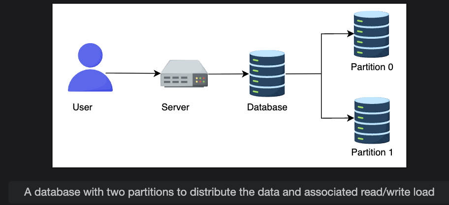
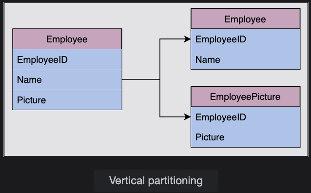
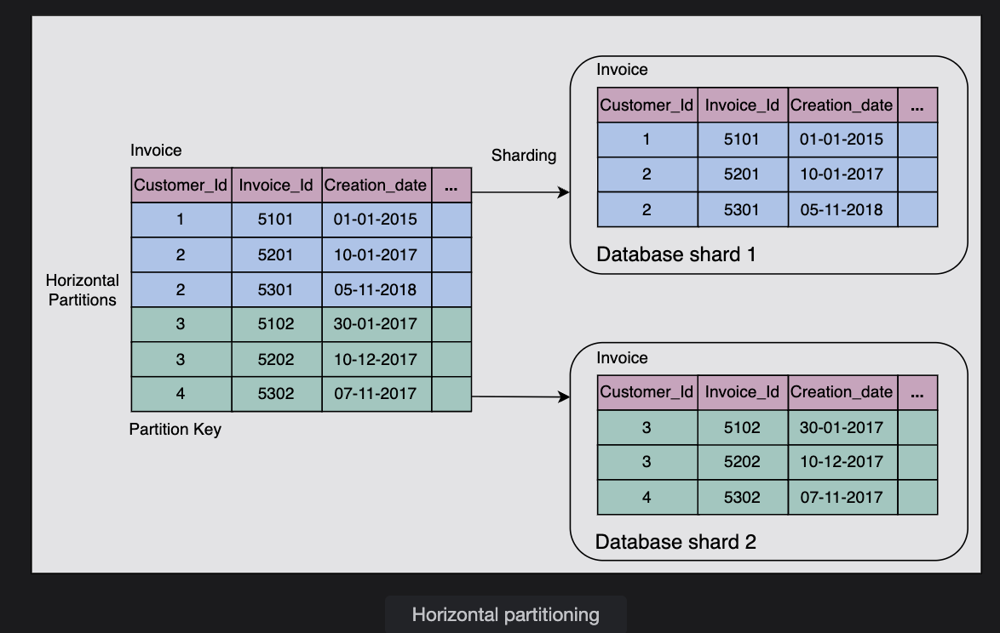
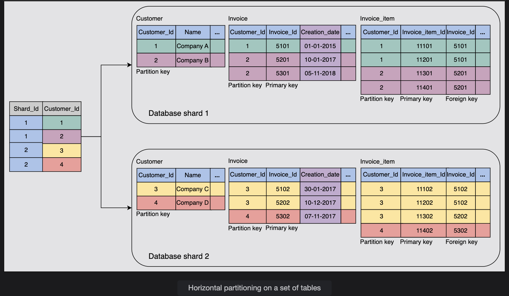
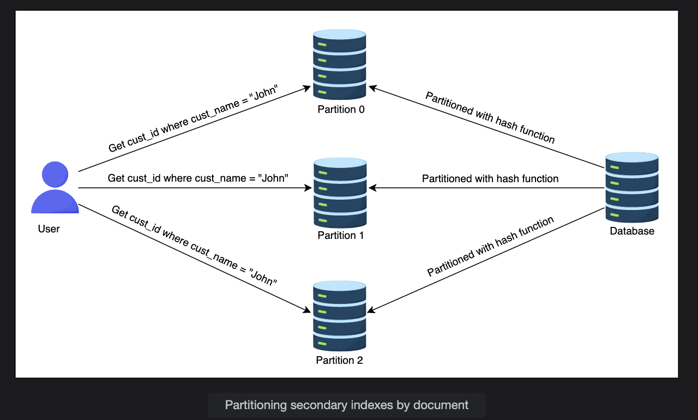
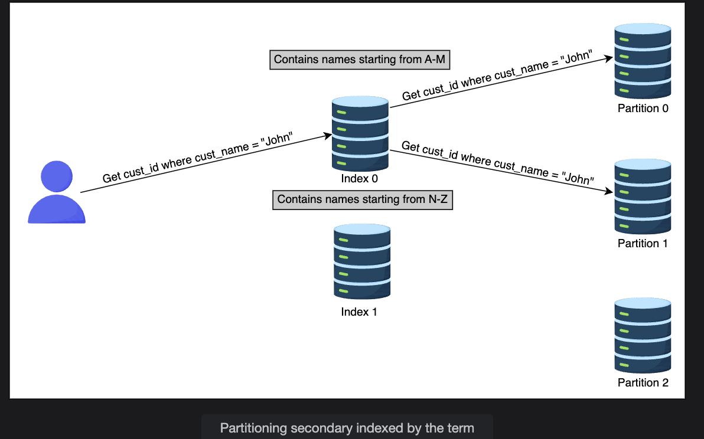

# Data Partitioning

Learn about data partitioning models along with their pros and cons.

---

## Why do we partition data?

Data is an **asset** for any organization. As data grows and concurrent read/write traffic increases, it puts **scalability pressure** on traditional databases. As a result:

- Latency increases  
- Throughput decreases  

Traditional databases are attractive because they support:  
- Range queries  
- Secondary indices  
- Transactions with **ACID properties**  

However, at some point, a **single-node database** is no longer enough to handle the load.

---

## The challenge with scaling

When data volume or traffic exceeds the capacity of a single server:  
- We might need to **distribute data over multiple nodes**.  
- But we still want to preserve relational database properties.  

In practice, it’s **challenging** to provide single-node database-like guarantees in a distributed setup.

---

## Possible solutions

1. **Move to a NoSQL-like system**  
   - Designed for distributed scalability.  
   - But migrating legacy systems is costly because of existing code tightly coupled with relational databases.  

2. **Use a third-party scaling solution for relational databases**  
   - Helps scale without fully redesigning.  
   - However, integration is often complex.  
   - General-purpose solutions may not be as efficient as custom optimizations.  

---

## Partitioning as a solution

**Data partitioning (or sharding)** allows us to:  
- Use **multiple nodes**, where each node manages a subset of data.  
- Handle **increasing query rates** and **large data volumes**.  
- Achieve **balanced partitions** and distribute read/write load evenly.  

Partitioning ensures the system scales horizontally while maintaining performance.  

---
  

---
# Sharding (Data Partitioning)

**Sharding** (or partitioning) is the process of splitting a large
dataset into **smaller, manageable pieces** called **shards**, and
storing them on different nodes (servers).

The goal is to:\
- Balance load across nodes\
- Avoid hotspots (where one node gets overloaded)\
- Improve scalability and performance

If partitioning is **unbalanced**, most queries will hit only a few
partitions → those nodes become bottlenecks → called **hotspots**.

------------------------------------------------------------------------

## Two Types of Sharding

### 1. Vertical Sharding

-   Split data **by columns (attributes)**.\
-   Example: An `Employee` table with columns\
    `(EmployeeID, Name, Age, Department, Picture)`\
    can be split into:
    -   `Employee(EmployeeID, Name, Age, Department)`\
    -   `EmployeePicture(EmployeeID, Picture)`
-   Why?
    -   Columns like **BLOBs** (images, large text) can slow queries.\
    -   By separating them, queries on main table become faster.
-   Notes:
    -   Primary key (`EmployeeID`) must exist in both tables for
        reconstruction.\
    -   More **manual**, requires thoughtful design (stakeholders decide
        which columns/tables to move).\
    -   Useful when queries don't always need the "heavy" columns.

👉 **Analogy**: Think of vertical sharding as splitting a **book** into
*chapters by topic*. If you only need "text," you don't carry the bulky
"picture section."

  

------------------------------------------------------------------------

### 2. Horizontal Sharding

-   Split data **by rows** into multiple smaller tables.\
-   Each partition (shard) contains a **subset of rows** from the
    original table.\
-   Common strategies:
    -   **Key-range based sharding**\
    -   **Hash-based sharding**

#### a. Key-Range Based Sharding

-   Each shard is assigned a **continuous range of keys**.\

-   Example: Customer database partitioned by `CustomerID`

    -   Shard 1: IDs `1–1000`\
    -   Shard 2: IDs `1001–2000`\
    -   Shard 3: IDs `2001–3000`

-   Works well for **range queries** (e.g., find customers with ID
    between `1500–1600`).

-   **Multi-table sharding** (with foreign keys):

    -   Use the **same partition key** (e.g., `CustomerID`) across
        related tables.\
    -   Ensures related data stays together in the same shard.

-   Additional design considerations:

    -   **Partition mapping table**: Keeps track of which partition key
        belongs to which shard.\
    -   **Unique primary keys** across shards: Prevents collisions.\
    -   **Timestamps (`Creation_date`)**: Used for merging across shards
        in analytics.

  
  

------------------------------------------------------------------------

## Advantages of Sharding

### Vertical Sharding

-   Makes queries on "lightweight" columns faster.\
-   Reduces load when big columns (e.g., images, blobs) aren't always
    needed.

### Horizontal (Key-Range) Sharding

-   Easy to implement.\
-   Great for **range queries** (since data is sorted and partitioned by
    range).\
-   Each shard can be queried independently.

------------------------------------------------------------------------

## Disadvantages of Sharding

### Vertical Sharding

-   More **manual work** to decide which columns/tables to split.\
-   Can complicate joins if split tables are used together often.

### Horizontal (Key-Range) Sharding

-   Only supports efficient queries using the **partition key**.\
-   Poor choice of key can cause **uneven data distribution** →
    hotspots.\
-   Range imbalance (e.g., most new customers fall into shard 3) can
    overload some shards.

------------------------------------------------------------------------

👉 **Summary Analogy**:\
- **Vertical sharding** = splitting a book by *topics/chapters*.\
- **Horizontal sharding** = splitting a book by *page numbers*.

Both help manage the book, but the method depends on whether your issue
is **big chapters (wide rows)** or **too many pages (too many rows)**.

---
# Hash-based Sharding

## 🔹 Concept

Hash-based sharding is a technique used to evenly distribute data across multiple nodes by applying a **hash function** on a chosen attribute (typically the partition key).

1. A **hash function** is applied to the key.
2. The hash result is taken **modulo (mod) the number of partitions/nodes**.
3. Based on this result, the record is assigned to a specific node.

This ensures that data is spread fairly uniformly across all available shards.

## 🔹 Example

Suppose we have 4 nodes (`n = 4`) and we use the formula:

Number of shards = Total database size / Shard size
Number of shards = 10 TB / 50 GB
Number of shards = 200

👉 So, the database should be split into **200 shards**.

✅ This ensures each shard is manageable, and no single node becomes overloaded.

---
# Consistent Hashing

Consistent hashing is a partitioning technique that places both **servers (nodes)** and **keys (items)** on an abstract circle called a **hash ring**.  
Keys are assigned to nodes by moving clockwise around the ring until we find the first node.

Unlike **hash mod n** approaches, consistent hashing works efficiently when nodes are added or removed, since only a small portion of keys need to be reassigned.

---

## 🔄 How It Works
1. Apply a hash function to both **nodes** and **keys**.
2. Place nodes and keys on the hash ring based on their hash values.
3. For each key, find the nearest node **clockwise** on the ring.
4. If a node is added/removed, only the keys near that node are redistributed.

---

## 📌 Example

Suppose we have **3 nodes** and **6 keys**:

- Nodes: `N1, N2, N3`  
- Keys: `K1, K2, K3, K4, K5, K6`

Both nodes and keys are hashed and placed on the ring:

   K1   N1
     \  |
K6 ---   --- K2
     /      \
   N3        N2
     \      /
      K5  K3,K4

- `K1` belongs to `N1`
- `K2, K3, K4` belong to `N2`
- `K5, K6` belong to `N3`

➡️ If we add a new node `N4`, only a small set of keys near `N4` move to it, not all keys.

---

## ✅ Advantages
- Easy to **scale horizontally** (add/remove nodes).  
- Reduces **data movement** during node changes.  
- Improves **throughput** and **latency**.

---

## ❌ Disadvantages
- Random placement may cause **non-uniform distribution**.  
- Needs **rebalancing** to handle uneven load.  

---

## ⚖️ Rebalancing Strategies

### 1. Avoid Hash Mod n
- Hash mod n reassigns most keys when `n` changes.
- Example:  
  - Key hash = `1235`, with 5 nodes → `1235 mod 5 = 0` → goes to Node0.  
  - Add 6th node → `1235 mod 6 = 5` → key moves unnecessarily.  
- ❌ Expensive and inefficient.

---

### 2. Fixed Number of Partitions
- Predefine partitions > number of nodes.  
- Assign partitions to nodes.  
- New node "steals" partitions from existing ones.  
- Used in **Elasticsearch**, **Riak**.  

⚠️ Trade-off:  
- Too few partitions → imbalance.  
- Too many partitions → overhead.

---

### 3. Dynamic Partitioning
- Partition splits when size exceeds a threshold.  
- One half goes to another node.  
- Used in **HBase, MongoDB**.  

⚠️ Challenge:  
- Splitting during reads/writes causes **latency** and **consistency issues**.

---

### 4. Partition Proportional to Nodes
- Each node has a **fixed number of partitions**.  
- Adding a node splits existing partitions randomly.  
- Used in **Cassandra, Ketama**.  

⚠️ Risk:  
- May result in **unfair splits**.

---

## 🔧 Who Performs Rebalancing?
- **Automatic**: The system detects imbalance and redistributes keys (e.g., Cassandra).  
- **Manual**: Admin controls when/how rebalancing happens (used in some enterprise setups).  

---

## 📌 Secondary Index Partitioning
So far, partitioning assumes **primary key lookups**.  
But with **secondary indexes** (e.g., "find all customers created in 2020"), partitioning is trickier.  

Strategies:
- **Broadcast query** → send query to all partitions.  
- **Partition index itself** → maintain mapping from secondary index to partition.  

---

## ✅ Summary
- Consistent hashing minimizes key movements when nodes change.  
- Different strategies (fixed partitions, dynamic, proportional) balance scalability vs overhead.  
- Systems like Cassandra, MongoDB, and Elasticsearch rely on these techniques for **efficient, scalable, fault-tolerant storage**.  

---
# Partitioning Secondary Indexes

We’ve discussed key-value data model partitioning schemes in which records are retrieved with **primary keys**.  
But what if we need to access records using **secondary indexes**?  

Secondary indexes are fields other than the primary key that allow searching for values (e.g., search all customers by `creation_year`).

---

## 📌 Partition Secondary Indexes by Document (Local Index)

- Each **partition** maintains its **own secondary index**, covering only the documents in that partition.  
- Writes affect only the partition containing the document ID.  
- Also known as a **local index**.

### Example
- Suppose we have **3 partitions**, each with its own independent index.  
- If we want all customers named **John**, we must query **all partitions**, since each index only knows about its local data.

### ⚠️ Downsides
- **Querying is expensive**:  
  - Reads must contact all partitions.  
  - The slowest partition determines query latency.  

  

---

## 📌 Partition Secondary Indexes by Term (Global Index)

- Instead of separate indexes per partition, create a **global index** for terms across all partitions.  
- Each term (e.g., name) is mapped to a specific index partition.  
- More **read-efficient**, since queries go directly to the relevant index partition.

### Example
- Index `0` → Names A–M  
- Index `1` → Names N–Z  
- To find **John**, we go directly to Index `0` and fetch all `cust_id` for John.

### ⚠️ Downsides
- **Writes are expensive**:  
  - A single write may affect multiple partitions.  
  - More complex than local indexes.  

  

---

# Request Routing

When data is partitioned, **how does a client know which node to contact?**

This problem is also known as **service discovery**.  

### Approaches:
1. **Any Node Forwarding**  
   - Clients can contact any node.  
   - If the node doesn’t own the data, it forwards the request to the correct node.  

2. **Routing Tier**  
   - A dedicated **routing service** receives requests.  
   - Determines the correct partition and forwards the query.  

3. **Client-Aware Partitioning**  
   - Clients are aware of partition-to-node mapping.  
   - They connect directly to the correct node.  

⚠️ Challenge: keeping routing information up-to-date when partitions/nodes change.

---

# ZooKeeper

- Distributed systems like **HBase, Kafka, SolrCloud** use **ZooKeeper** for cluster management.  
- ZooKeeper tracks:  
  - Node membership  
  - Partition mappings  
  - Node additions/removals  
- When partitioning changes, ZooKeeper updates the routing tier and notifies nodes.

---

# 📝 Case Study Question

Imagine you’re a database architect for a **global e-commerce platform**.  
The platform faces:  
- Regional differences in activity.  
- Increasing load on a monolithic database.  
- Need for scalability and performance.  

### Options:
- **Database Sharding**  
- **Database Replication**

### ✅ Suggested Answer
We should use **Database Sharding**:
- Distributes load across partitions.  
- Enables **scalability** and **high performance**.  
- Can shard data based on **regionality** to optimize for local user behavior.  

Replication may still be used **in combination** with sharding for:  
- Fault tolerance  
- Read scalability  

---

# 📌 Conclusion

- Partitioning is now the **standard protocol** in distributed systems.  
- As data volume increases, partitioning improves:  
  - **Writes** (distributes load)  
  - **Reads** (parallel access)  
- Increases **availability**, **scalability**, and **performance**.  

