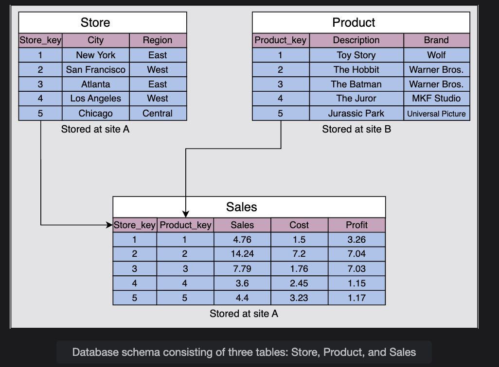

# Trade-offs in Databases

When designing a database system, one of the biggest decisions is whether to use a **centralized database** (all data on a single machine) or a **distributed database** (data spread across multiple machines). Each has its **advantages** and **disadvantages**, and the choice depends on **scalability, performance, and business needs**.

## ⚖️ Centralized Database

A **centralized database** stores all data in a **single node/server**.

### ✅ Advantages:

1. **Easy Maintenance**
   * Updates, patches, and backups are simpler since there's only one system to maintain.
   * Example: Updating a user's profile schema only needs changes on one server.

2. **Strong Consistency (ACID)**
   * Centralized DBs can easily provide **ACID transactions** (Atomicity, Consistency, Isolation, Durability).
   * Example: In a bank database, transferring ₹1000 from Account A to B can be safely ensured in a single transaction.

3. **Simpler Programming Model**
   * Developers don't have to worry about complex things like **replication, partitioning, or distributed transactions**.
   * Example: Writing a SQL query in MySQL on one node is straightforward.

4. **Efficient for Small Data**
   * If the dataset is small and fits into one server's memory/disk, centralized DBs work great.
   * Example: A startup managing customer orders with < 10GB of data.

### ❌ Disadvantages:

1. **Performance Bottleneck**
   * As queries per second (QPS) increase, one node eventually **can't handle the load**.
   * Example: If millions of users are hitting the same DB for transactions, latency increases.

2. **Single Point of Failure (SPOF)**
   * If the centralized DB server crashes, the entire system goes down.
   * Example: If Amazon had a single DB for orders and it failed on Black Friday, orders would stop worldwide.


---
## Distributed Database

A **distributed database** spreads data across multiple nodes (servers) while still giving users the illusion of a single, unified system.  
Data can be **sharded, replicated, or partitioned** across nodes depending on scalability and fault-tolerance needs.

---

### ✅ Advantages

1. **Scalability**  
   - We can add more nodes to handle more queries and store larger datasets.  
   - Example: Facebook stores petabytes across thousands of servers.

2. **Fault Tolerance**  
   - Replication ensures the system continues to function even if some nodes fail.  
   - Example: Cassandra replicas allow uninterrupted service when a node goes down.

3. **Geographical Performance**  
   - Data is often retrieved from the nearest shard (low latency).  
   - Example: Netflix metadata is served from data centers closest to users.

4. **Distribution Transparency**  
   Users interact with the system as if it’s a **single logical database**, even though data is distributed.  
   This abstraction is achieved via three levels of transparency:
   - **Location Transparency** → Users can query any shard/table without knowing its physical location.  
   - **Partition Transparency** → Users can query a table as if it’s unpartitioned, even if split across shards.  
   - **Replication Transparency** → Users query replicated tables as if only one copy exists, even during writes.  

5. **Parallel Query Processing**  
   - Large, intensive queries can be split into **optimized subqueries** across nodes.  
   - Example: Analytics workloads distributed across clusters for faster results.

---

### ❌ Disadvantages

1. **Cross-Site Latency**  
   - Queries needing data from multiple sites may take longer than expected.  
   - Example: An order query requiring user info from one shard and product data from another.

2. **Complex Joins**  
   - Relations are partitioned (horizontally or vertically) across nodes.  
   - Joins must reconstruct complete relations, making queries **slower and more complex**.  
   - Example: Joining "users" in Shard A with "orders" in Shard B.

3. **Consistency Challenges**  
   - Harder to maintain **strong consistency** across multiple sites.  
   - Extra mechanisms like **two-phase commit** or **consensus algorithms (Raft/Paxos)** are needed.  

4. **Synchronization Overhead**  
   - Updates and backups require syncing across all nodes.  
   - This takes time and adds operational complexity.  

---

### 🔑 Summary

- **Distributed DB = Scalable + Fault-Tolerant + Transparent abstraction**  
- But it comes with **higher query complexity, consistency trade-offs, and synchronization costs**.

## In Practice:

* Most **large-scale systems** use **horizontal sharding** + **replication**.
* Example: Twitter shards tweets by user_id range, so different servers handle different user groups.

---
# Query Optimization and Processing Speed in Distributed Databases

## 🔹 What does query optimization mean?

In a **centralized database**, the query optimizer's job is to figure out the best way to:

* Choose indexes
* Arrange joins
* Decide scan order

In a **distributed database**, query optimization becomes harder because:

* Data lives across **multiple nodes/shards**
* Each node may contain only **part of the data**
* Querying may require **network communication**

So, optimization here means: 👉 *Reducing network calls + balancing work across nodes + minimizing data movement*.

## 🔹 Example Scenario

Imagine an **e-commerce platform** with a **distributed database**:

* **Shard A** → Stores `Users` (user_id, name, region)
* **Shard B** → Stores `Orders` (order_id, user_id, amount, date)
* **Shard C** → Stores `Products` (product_id, category, price)

Now, consider this query:

```sql
SELECT u.name, SUM(o.amount)
FROM Users u
JOIN Orders o ON u.user_id = o.user_id
WHERE u.region = 'Asia'
GROUP BY u.name;
```

## 🔹 Naive Execution (Slow Approach)

1. **Users are in Shard A**, Orders in Shard B.
2. If we run the query naively:
   * Fetch *all users* from Shard A.
   * Send them to Shard B to match with Orders.
   * Perform join + grouping.

👉 Problem: We are moving **huge amounts of data** across the network.  
👉 Latency skyrockets 🚀 because joins across shards = expensive.

## 🔹 Optimized Execution (Better Approach)

A **smart distributed query optimizer** will break this query into steps:

### 1. **Push Down Filtering (Predicate Pushdown)**

* Instead of fetching all users, Shard A first filters:

```sql
SELECT user_id, name FROM Users WHERE region = 'Asia';
```

* Now we only get a subset (say 10K users, not 10M).

### 2. **Semi-Join Optimization**

* Instead of sending all users to Shard B, we only send **user_ids of Asian users**.
* Shard B runs:

```sql
SELECT user_id, SUM(amount)
FROM Orders
WHERE user_id IN (list of Asian user_ids)
GROUP BY user_id;
```

* This reduces unnecessary data movement.

### 3. **Local Aggregation First**

* Shard B computes **partial sums per user_id** locally.
* Sends back only **aggregated results**, not raw orders.

### 4. **Final Join + Aggregation**

* Optimizer joins `user_id` + `name` (from Shard A) with aggregated results (from Shard B).
* Final grouping is applied centrally or in a coordinating node.

👉 **Result:**

* Instead of sending millions of rows across shards, only **filtered + aggregated results** move.
* Processing is **parallelized**: each shard works on its piece, then results are merged.

## 🔹 Speed Analysis

| Step | Naive Execution | Optimized Execution |
|------|----------------|---------------------|
| Data transfer | 10M Users + 100M Orders moved across network | Only 10K Users + aggregated results moved |
| Network cost | Very high 🚨 | Much lower ✅ |
| Query latency | Seconds to minutes | Milliseconds to seconds |
| CPU usage | Heavy on coordinator node | Distributed across shards |

## 🔹 Real-World Analogy

Think of this like an **airport security check**:

* **Naive way** → Every passenger from all terminals walks to one counter → long lines, chaos.
* **Optimized way** → Each terminal has its own security check (local filtering), then passengers board buses only if cleared. The final gate (coordinator) only processes **filtered, verified passengers**.

## 🔑 Key Techniques Used in Distributed Query Optimization

1. **Predicate Pushdown** → Apply filters early in the shard.
2. **Projection Pushdown** → Only fetch required columns.
3. **Local Aggregation** → Compute partial results locally before merging.
4. **Parallel Execution** → Run queries in multiple shards simultaneously.
5. **Semi-Join Optimization** → Send only keys for filtering, not full datasets.

## ✅ In summary:

Distributed query optimization = **minimizing data movement + maximizing local processing + parallel execution**.

---
# Parallel Execution in Distributed Queries

When we say **"parallel execution"**, it doesn't mean *every single shard always works completely independently*. It means:

👉 Each shard executes **as much of the query as possible** on its **local dataset** at the same time, **before waiting** for results from other shards.

So, the **degree of parallelism** depends on the type of query:

## 1. Queries That Can Run Fully in Parallel (No Dependencies)

**Example:**

```sql
SELECT COUNT(*) FROM Orders;
```

* Each shard computes its **local count** at the same time.
* Then, the coordinator just **sums up the partial counts**.

✅ Here, there is **no waiting between shards** — *true parallelism*.

## 2. Queries With Partial Dependencies (Semi-Join Example)

**Example:**

```sql
SELECT u.name, SUM(o.amount)
FROM Users u
JOIN Orders o ON u.user_id = o.user_id
WHERE u.region = 'Asia'
GROUP BY u.name;
```

* **Shard A (Users)** → applies the filter `region = 'Asia'`. This step is local, **runs in parallel with Shard B** doing some preparatory scan.
* Once filtered user IDs are ready, Shard B applies the join.
* **Shard B's join is dependent on Shard A's output**, but still:
   * Shard B can scan its orders table **in parallel** while Shard A is filtering.
   * When the user IDs arrive, it only needs to check matches (not start from scratch).

So → part of Shard B's work (scanning, indexing, partial grouping) happens **concurrently** with Shard A's work.

## 3. Queries With Strong Dependencies (Blocking Steps)

Some queries require **one shard's data before another can even begin**.

**Example:**

```sql
SELECT *
FROM Orders
WHERE user_id IN (
   SELECT user_id FROM Users WHERE region = 'Asia'
);
```

Here:

* Shard B (Orders) **cannot start filtering** until Shard A gives the list of `user_id`s.
* This creates a **blocking step** (sequential dependency).

But optimizers often **restructure queries** (turn subqueries into joins, push filters down) so that shards can still do partial work in parallel.

## 🔑 How Parallelism Actually Works

* **Local tasks** (filtering, scanning, partial aggregation) → run in parallel across shards.
* **Dependent tasks** (like joins across shards) → may involve *wait points*, but the DB engine tries to overlap as much work as possible.
* The **coordinator node** pipelines tasks: while one shard is finishing, others can already stream their results.

So parallelism = **not "everything at once,"** but **"everything that can safely be done at once."**

## 🔹 Real-World Analogy

Think of a **group project** in a company:

* Everyone works on their **local tasks** in parallel.
* At some point, one team might need another's data (dependency).
* But instead of sitting idle, they **prepare drafts, run tests, or precompute** while waiting.
* Final integration (merging results) requires waiting, but the **overall timeline is shorter** because a lot of work was already done in parallel.

## ✅ In short:

Even if **some steps depend on others**, parallel execution is possible because shards:

* Perform **independent parts** at the same time,
* **Pipeline work** so waiting time is reduced,
* And only **block at the final merge or dependency point**.

---
# Query Optimization and Processing Speed in a Distributed Database

A transaction in the distributed database depends on the type of query, number of sites (shards) involved, communication speed, and other factors, such as underlying hardware and the type of database used. However, as an example, let's assume a query accessing three tables, `Store`, `Product`, and `Sales`, residing on different sites.

The number of attributes in each table is given in the following figure:

  

Let's assume the distribution of both tables on different sites is the following:

* The `Store` table has 10,000 tuples stored at site A.
* The `Product` table has 100,000 tuples stored at site B.
* The `Sales` table has one million tuples stored at site A.

## Query Example

Now, assume that we need to process the following query:

```sql
SELECT Store_key
FROM Store, Sales, Product
WHERE Store.Store_key = Sales.Store_key
  AND Sales.Product_key = Product.Product_key
  AND Product.Brand = 'Wolf'
  AND Store.Region = 'East';
```

The above query performs the join operations on the `Store`, `Sales`, and `Product` tables and retrieves the `Store_key` values from the table generated in the result of join operations.

## Assumptions

Next, assume every stored tuple is 200 bits long. That's equal to 25 Bytes. Furthermore, estimated cardinalities of certain intermediate results are as follows:

* The number of the `Wolf` brand is 10.
* The number of `East` region stores is 3000 (since there are 10,000 rows in the store table, and 3000 have region as east).

Communication assumptions are the following:

* Data rate = 50M bits per second
* Access delay = 0.1 second

## Parameters Assumption

Before processing the query using different approaches, let's define some parameters:

* *a* = Total access delay
* *b* = Data rate
* *v* = Total data volume

Now, let's compute the total communication time, *T*, according to the following formula:

```
T = a + (v/b)
```

Let's try the following possible approaches to execute the query.

## Possible Approaches

### Approach 1: Move the `Product` table to site A and process the query at A

```
T = 0.1 + (100,000 × 200) / 50,000,000 = 0.5 seconds
```

Here, 0.1 is the access delay of the table on site A, and 100,000 is the number of tuples in the `Product` table. The size of each tuple in bits is 200, and 50,000,000 is the data rate. The 200 and 50,000,000 figures are the same for all of the following calculations.

### Approach 2: Move `Store` and `Sales` to site B and process the query at B

```
T = 0.2 + ((10,000 + 1,000,000) × 200) / 50,000,000 = 4.24 seconds
```

Here, 0.2 is the access delay of the `Store` and `Sales` tables. The numbers 10,000 and 1,000,000 are the number of tuples in the `Store` and `Sales` tables, respectively.

### Approach 3: Restrict `Brand` at site B to `Wolf` (called selection) and move the result to site A

```
T = 0.1 + (10 × 200) / 50,000,000 ≈ 0.1 seconds
```

Here, 0.1 is the access delay of the `Product` table. The number of the `Wolf` brand is 10, hence the number of tuples.

## Comparison

When we compare the three approaches, the **third approach provides us the least latency (0.1 seconds)**. 

We didn't calculate filtering at site A because the number of rows will be much larger, and hence data volume will be more than the third case (filtering at the site B and then fetching data). 

This example shows that **careful query optimization is also critical in the distributed database**.

### Conclusion
Data distribution (vertical and horizontal sharding) across multiple nodes aims to improve the following features, considering that the queries are optimized:  

* Reliability (fault-tolerance)  
* Performance  
* Balanced storage capacity and dollar costs  

Both centralized and distributed databases have their pros and cons. We should choose them according to the needs of our application.  

