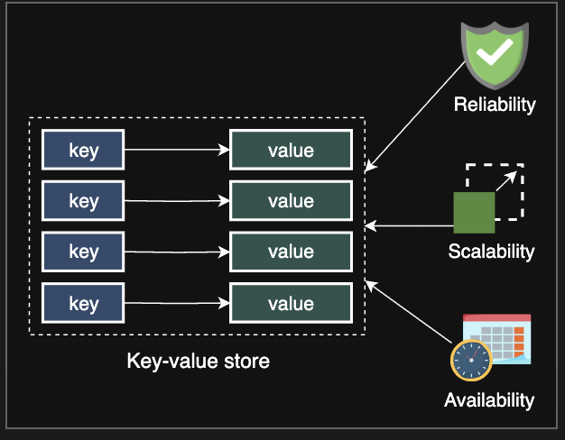

# System Design: The Key-value Store

Let's understand the basics of designing a key-value store.

---

## 📌 Introduction to Key-value Stores
- Key-value stores are **distributed hash tables (DHTs)**.  
- A **key** is generated by the hash function and should be **unique**.  
- A **key** binds to a specific **value** and doesn’t assume anything about the structure of the value.  
- A **value** can be:
  - A blob  
  - An image  
  - A server name  
  - Or anything the user wants to store against a unique key  

 
---

### 💡 Design Note
- It’s preferred to keep the **size of values relatively small** (KB to MB).  
- For large data → use a **blob store** and put **links** in the value field.  

---

## ✅ Use Cases of Key-value Stores
Key-value stores are useful in many situations, such as:
- Storing **user sessions** in a web application  
- Building **NoSQL databases**  
- **Bestseller lists**  
- **Shopping carts**  
- **Customer preferences**  
- **Session management**  
- **Sales rank**  
- **Product catalogs**  

---

## ⚡ Why Key-value Stores Instead of RDBMS?
- Traditional databases are **hard to scale** with strong consistency and high availability in a distributed environment.  
- Many real-world services like **Amazon, Facebook, Instagram, Netflix**, and more use **primary-key access** instead of OLTP databases.  
- **RDBMS** provides a rich programming model, but:
  - Often **expensive** in terms of **cost** and **performance** for simple use cases.  

---

## 🏗️ Designing a Key-value Store
We’ll divide the system design into **four lessons**:

1. **Design a Key-value Store**  
   - Define the **requirements** of a key-value store  
   - Design the **API**

2. **Ensure Scalability and Replication**  
   - Achieve scalability using **consistent hashing**  
   - Replicate the partitioned data  

3. **Versioning Data and Achieving Configurability**  
   - Resolve **conflicts** caused by multiple entities updating data  
   - Make the system more **configurable** for different use cases  

4. **Enable Fault Tolerance and Failure Detection**  
   - Make the key-value store **fault-tolerant**  
   - Detect failures in the system  

---
