# Ensure Scalability and Replication in Key-value Stores

## 1. The Problem: Scaling with Modulus-based Partitioning

Imagine we have **4 nodes** (servers) in a key-value store:

* Node 0
* Node 1
* Node 2
* Node 3

We use this formula to decide where a key goes:

```
node = hash(key) % m
```

where `m = number of nodes`.

### 👉 Example:

* Suppose `hash("apple") = 10`.
* With 4 nodes: `10 % 4 = 2 → Node 2` stores "apple".

Now, what happens if we **remove a node** (say Node 2)?

* The new modulus is `m = 3`.
* Now, `10 % 3 = 1 → Node 1` should store "apple".
* ❌ This means **all keys may need to be remapped** to new nodes → **huge data movement**.

### This causes:

* High **latency** during migration
* Overloaded nodes during rebalancing
* Cache invalidation

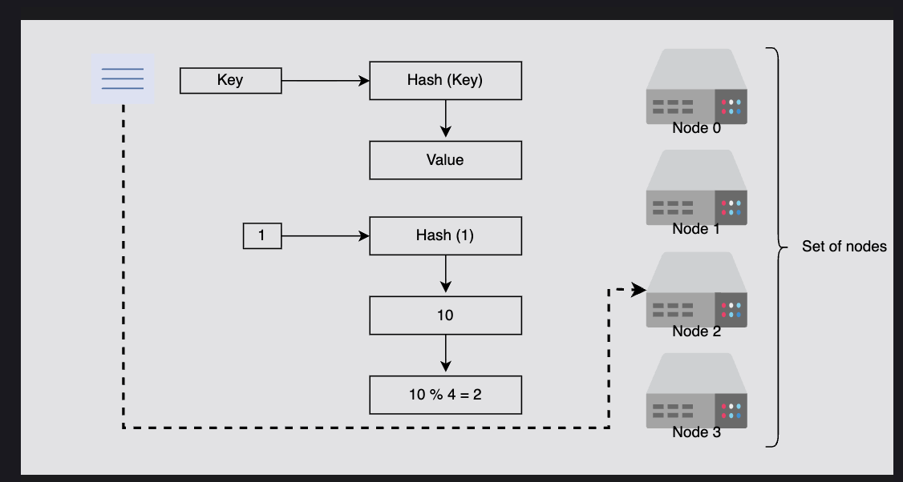 

---

## ❓ Question

**Why didn't we use load balancers to distribute the requests to all nodes?**

## ✅ Answer

Load balancers are **not typically used in key-value stores with consistent hashing** because the **hash of the key itself determines the target node**.

### 1. Key-based Routing vs Load Balancing

#### **Consistent hashing**:

* The system computes `node = hash(key)` (or places it on the ring).
* Requests go **directly to the responsible node**.
* Ensures **data locality** → the node already stores the required data.

#### **Load balancer**:

* A load balancer blindly spreads requests across all nodes (round-robin, least connections, etc.).
* But here, only **one specific node has the data for a key**.
* This means the request may be sent to the wrong node → leading to **extra hops** and **cross-node communication**.

### 2. Example

Suppose we have 4 nodes:

* Node A, Node B, Node C, Node D

Key `"apple"` hashes to Node C.

* With **consistent hashing**: request → directly goes to Node C → data found.
* With **load balancer**: request → might go to Node A. But Node A doesn't have `"apple"`.
   * Node A now has to **forward the request** internally to Node C.
   * ❌ This adds latency, network overhead, and complexity.

### 3. Scaling Perspective

* **Consistent hashing** allows smooth scaling → only a small portion of keys need to be moved when nodes are added or removed.
* **Load balancer** has no awareness of data placement → it cannot help rebalance data efficiently.

### 4. Conclusion

Using a **load balancer conflicts with the design of distributed key-value stores** because:

* It breaks **direct key-to-node mapping**.
* Adds **unnecessary routing overhead**.
* Reduces the benefit of **scalability** achieved with consistent hashing.

Instead, **consistent hashing + replication** provides both **efficient routing** and **fault tolerance**.

---
# Consistent Hashing and Virtual Nodes

## Consistent Hashing

Consistent hashing is an effective way to manage the load over the set of nodes. In consistent hashing, we consider that we have a conceptual ring of hashes from **0 to n - 1**, where **n** is the number of available hash values. 

### How It Works

1. We use each node's ID, calculate its hash, and map it to the ring.
2. We apply the same process to requests.
3. Each request is completed by the next node that it finds by moving in the **clockwise direction** in the ring.

### Benefits of Adding/Removing Nodes

Whenever a new node is added to the ring, the immediate next node is affected. It has to share its data with the newly added node while other nodes are unaffected. 

**It's easy to scale** since we're able to keep changes to our nodes minimal. This is because only a small portion of overall keys need to move. The hashes are randomly distributed, so we expect the load of requests to be random and distributed evenly on average on the ring.

### The Hotspot Problem

The primary benefit of consistent hashing is that as nodes join or leave, it ensures that a minimal number of keys need to move. However, the request load isn't equally divided in practice. 

**Any server that handles a large chunk of data can become a bottleneck** in a distributed system. That node will receive a disproportionately large share of data storage and retrieval requests, reducing the overall system performance. As a result, these are referred to as **hotspots**.

#### Example:

As shown in the figure below, most of the requests are between the N4 and N1 nodes. Now, N1 has to handle most of the requests compared to other nodes, and it has become a hotspot. That means **non-uniform load distribution** has increased load on a single server.

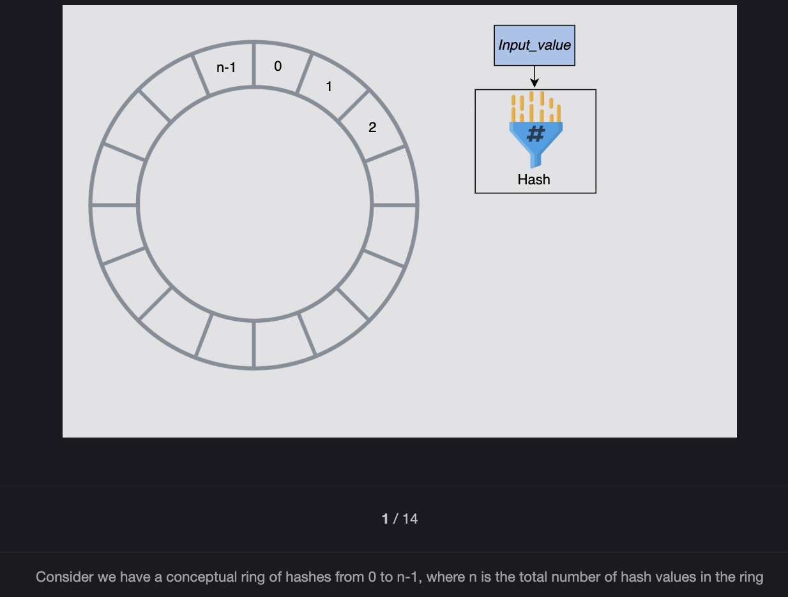 
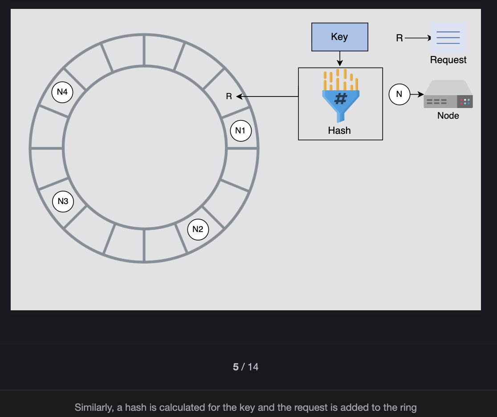 
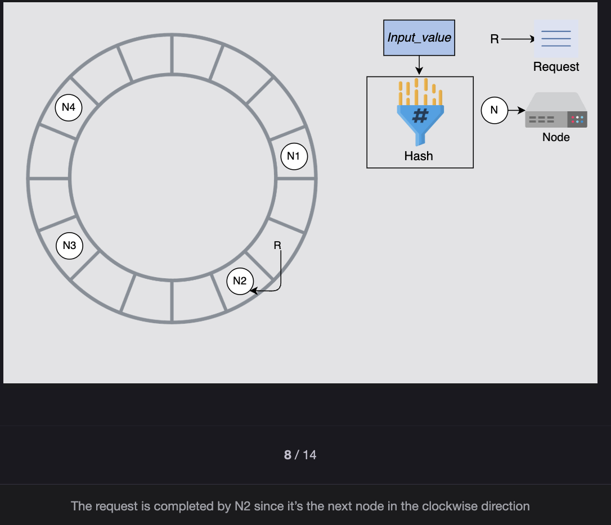 
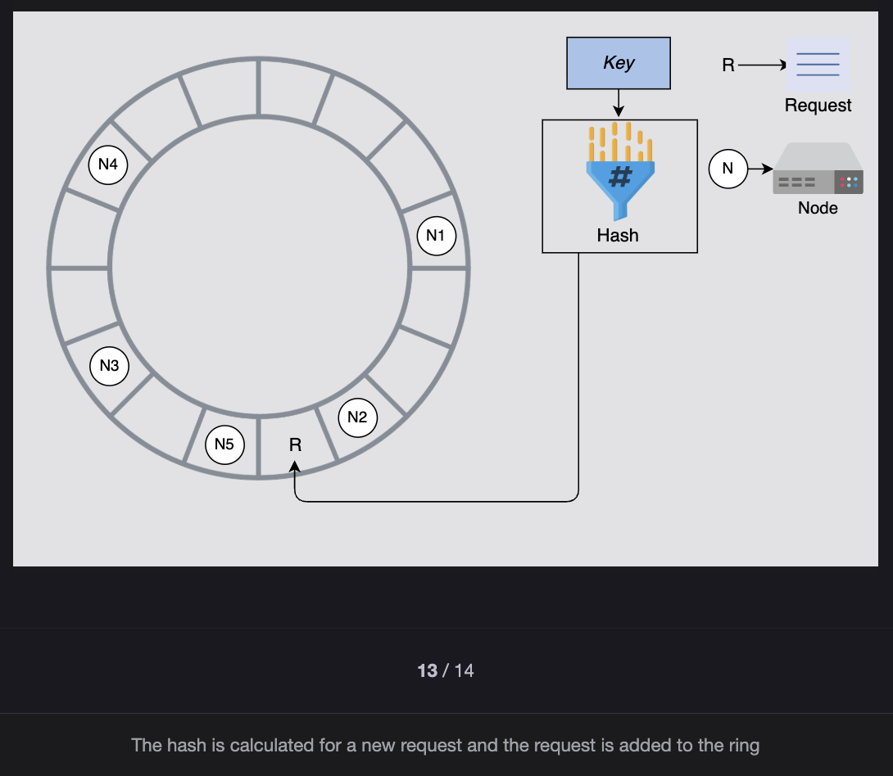 
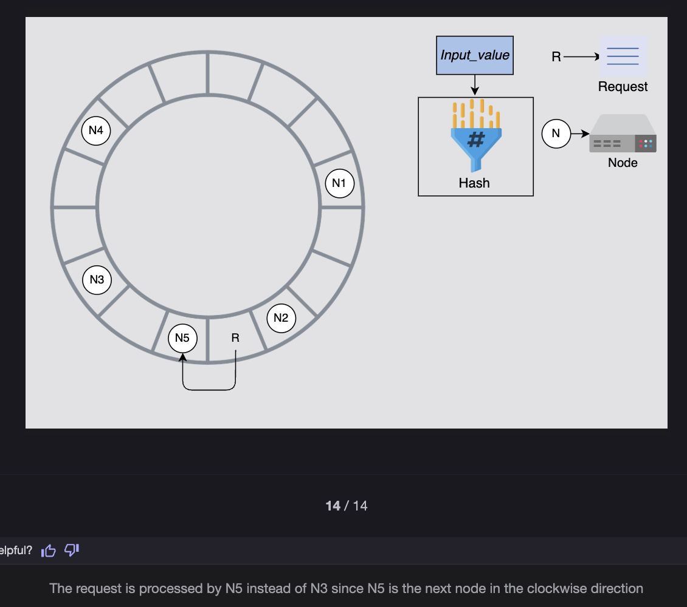 


> **Note:** It's a good exercise to think of possible solutions to the non-uniform load distribution before reading on.
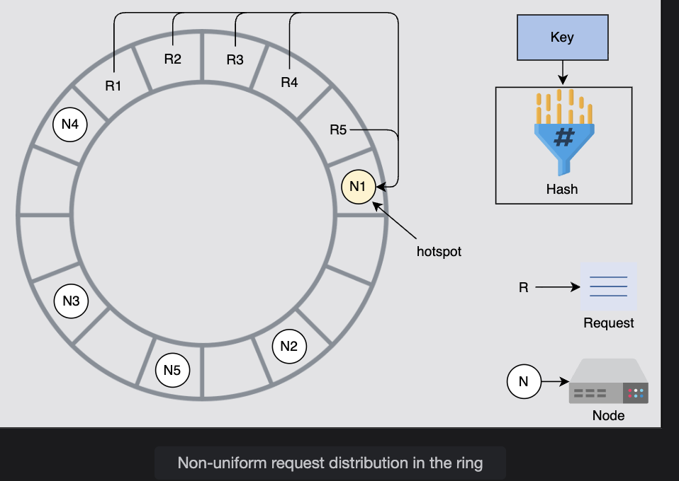


---

## Use Virtual Nodes

We'll use **virtual nodes** to ensure a more evenly distributed load across the nodes. Instead of applying a single hash function, we'll apply **multiple hash functions** onto the same key.

### Example

Let's take an example. Suppose we have **three hash functions**:

1. For each node, we calculate three hashes and place them into the ring.
2. For the request, we use only one hash function.
3. Wherever the request lands onto the ring, it's processed by the next node found while moving in the clockwise direction.

Each server has three positions, so the load of requests is more uniform. Moreover, if a node has more hardware capacity than others, we can add more virtual nodes by using additional hash functions. This way, it'll have more positions in the ring and serve more requests.

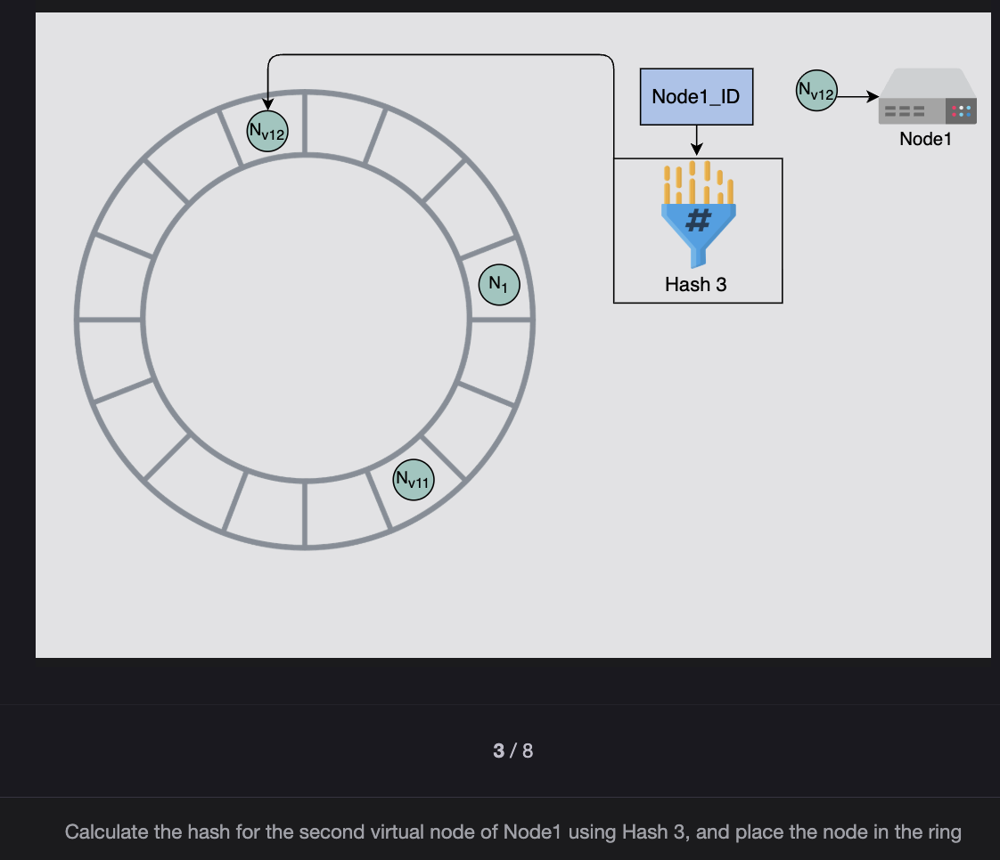 
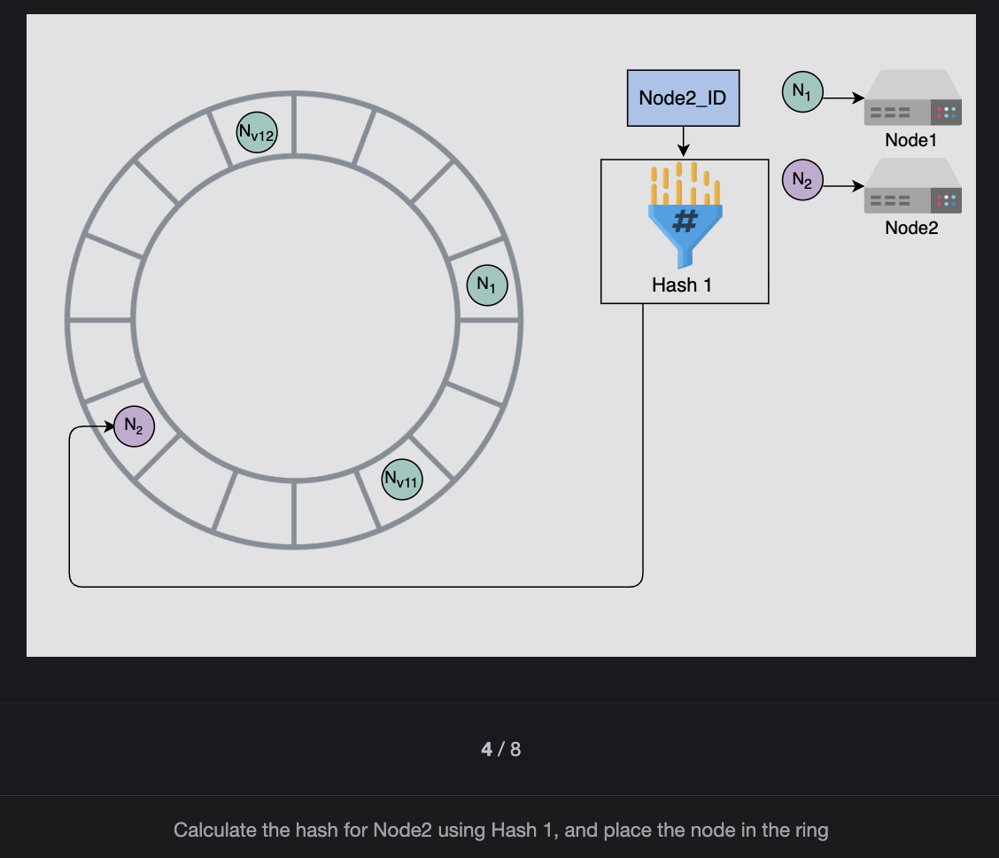 
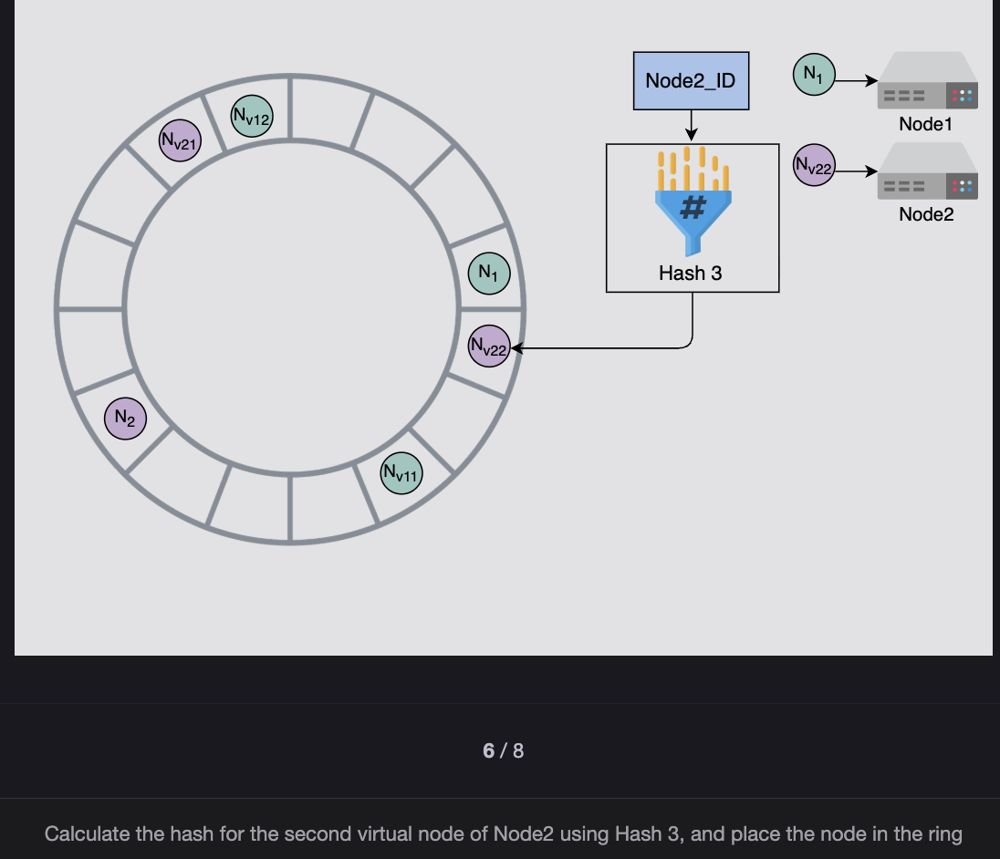 
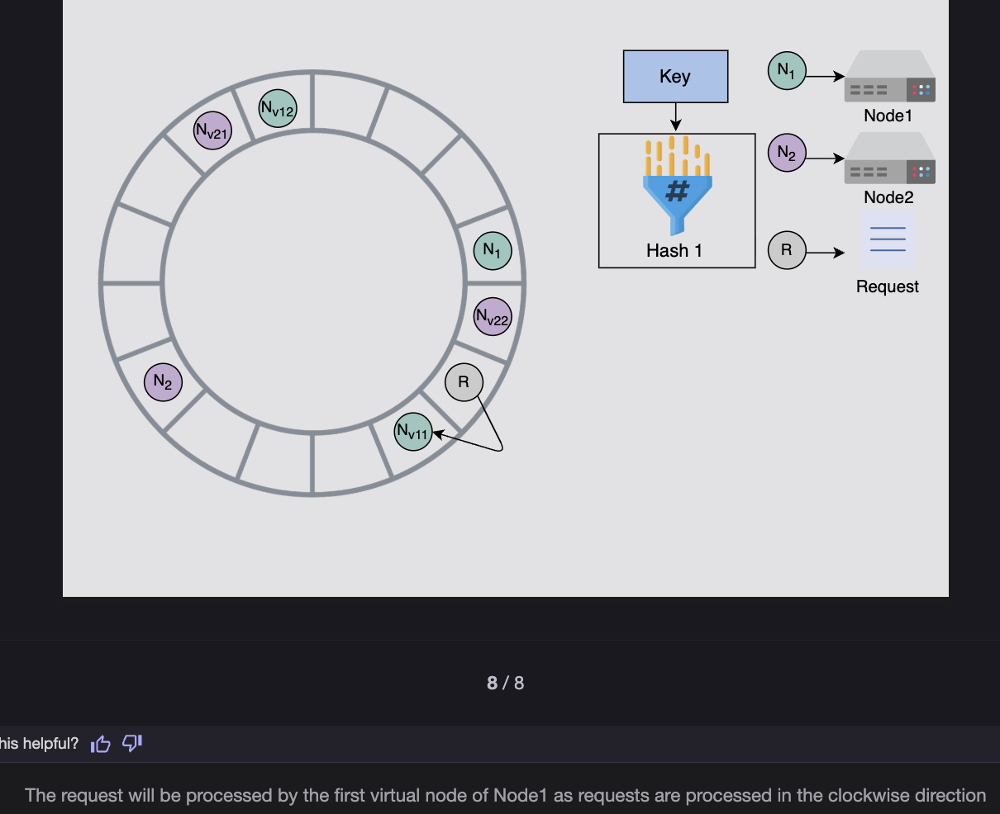 

### Advantages of Virtual Nodes

Following are some advantages of using virtual nodes:

1. **Fault Tolerance**: If a node fails or does routine maintenance, the workload is uniformly distributed over other nodes. For each newly accessible node, the other nodes receive nearly equal load when it comes back online or is added to the system.

2. **Heterogeneity Support**: It's up to each node to decide how many virtual nodes it's responsible for, considering the heterogeneity of the physical infrastructure. For example, if a node has roughly double the computational capacity as compared to the others, it can take more load.

---

## Incremental Scalability Without Disruption

### Question

**Describe how a key-value store can support incremental scalability without disrupting service availability.**

### Answer

A key-value store can support incremental scalability without disrupting service availability by using the following techniques:

1. **Consistent Hashing**: Limits data movement when adding or removing nodes. Only a fraction of keys need to be redistributed.

2. **Virtual Nodes**: Reduces the amount of data that needs to be migrated by spreading the load more evenly across physical nodes.

3. **Background Data Migration**: Performs data migration in the background to avoid impacting active operations. This ensures that read/write operations continue without interruption.

4. **Read/Write Forwarding**: Implements forwarding mechanisms to handle in-transit data smoothly during scaling transitions. Requests for data being migrated are forwarded to the appropriate node (either old or new) seamlessly.

These techniques together enable smooth, incremental scaling while maintaining high availability and consistent performance.

---
# Data Replication Basics

## 1. Data Replication Basics

**Replication means:** keep multiple copies of data across nodes.

### Why?

* **Durability** → if one node crashes, the data still exists somewhere else.
* **High Availability** → clients can still read/write even if some nodes are down.

There are two classic approaches:

---

## 2. Primary–Secondary Replication

### How it works:

* One node = **primary (leader)**
* Others = **secondary (followers)**
* All writes → go to the primary
* Reads → can go to secondary (to offload primary)

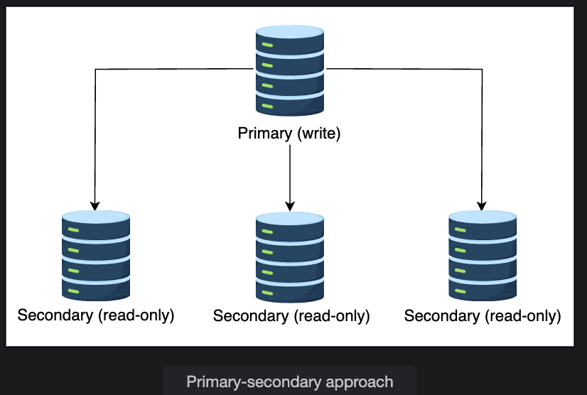 

### Flow:

1. Client writes data → goes to primary.
2. Primary writes data locally → then sends it to secondaries.
3. Clients can read from any secondary (after replication delay).

### Issues:

* **Single Point of Failure**: if primary dies → no writes possible until a new leader is elected.
* **Replication Lag**: secondaries may not be up to date (eventual consistency).
* **Not always write available**: breaks one of our requirements in Dynamo-style systems (we want writes always possible).

### When to use:

✅ **Good for:** read-heavy workloads.  
❌ **Bad for:** always-write systems (like Dynamo, Cassandra).

---

## 3. Peer-to-Peer Replication

### How it works:

* **No "leader"** → every node can accept reads/writes.
* When a node gets a write, it replicates that data to **N-1 other nodes** (where N = replication factor).
* **Example:** replication factor n=3 → each key stored on 3 nodes.

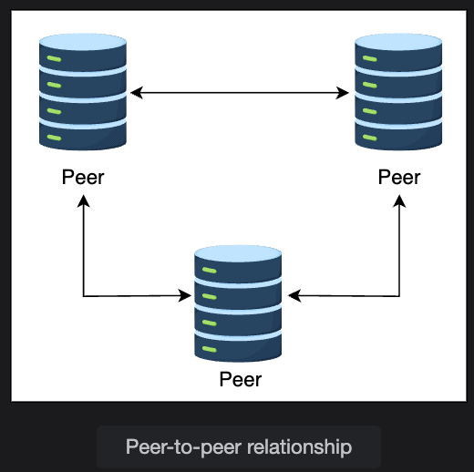 
### Flow:

1. Client sends write for key K.
2. The **coordinator node** (the one responsible for K via consistent hashing) takes it.
3. Coordinator writes locally + replicates to next **(N-1) nodes clockwise** (preference list).
4. Reads can be served by any of the replicas.

### Why better?

* No single point of failure.
* Any node can accept writes → **"always write" is possible**.
* Works well with consistent hashing + replication factor.

### When to use:

✅ **Good for:** high availability, durability, distributed writes.  
❌ **Tradeoff:** conflicts can happen (need versioning to resolve).

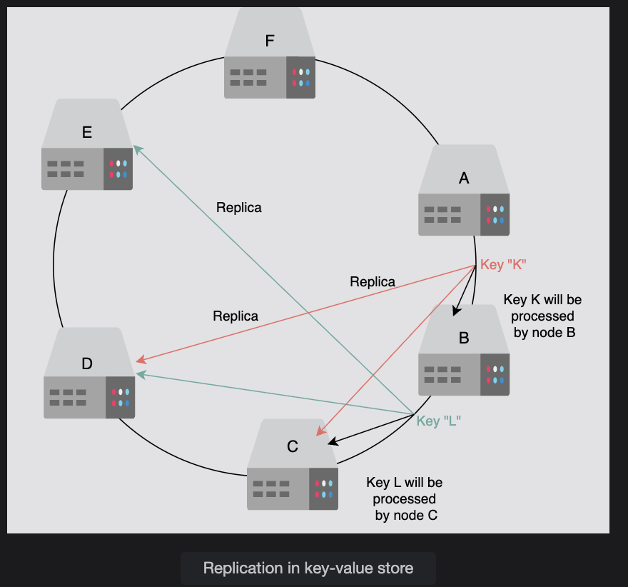 
---

## 4. Synchronous vs Asynchronous Replication

This is about **when to consider a write "done"**:

### Synchronous:

* Coordinator **waits** until all replicas acknowledge before confirming to client.
* **Strong consistency** (all replicas same).
* **Slower** (network delay + if one replica is down, write fails).
* ❌ Hurts availability.

### Asynchronous:

* Coordinator confirms write **after local write** (or minimal acks), without waiting for all replicas.
* **Fast, highly available**.
* But replicas may be temporarily inconsistent (**eventual consistency**).

### 👉 In CAP theorem terms:

* **Synchronous** → favors **Consistency (C)** over Availability (A).
* **Asynchronous** → favors **Availability (A)** over Consistency (C).

### Dynamo-style KV stores (like Amazon DynamoDB, Cassandra):

* Choose **Availability > Consistency**.
* They let nodes keep accepting writes during partitions → and later reconcile differences using versioning + conflict resolution.

---

## 5. Replication Factor & Preference Lists

### Replication factor n:

Number of nodes each key is stored on. (common: 3 or 5).

### Example:

* Replication factor = 3.
* Key K stored on nodes **B, C, D** (coordinator + 2 successors).
* Key L stored on nodes **C, D, E**.

### Preference list:

* Sometimes virtual nodes land on the same physical server.
* But we don't want 3 replicas of the same key on the same machine.
* So **preference list** ensures replicas go to **different physical machines**.

---

## 6. Impact on Availability

### With replication:

* Even if one or two nodes fail → data is still accessible.
* Replication + peer-to-peer design ensures the system is **fault-tolerant**.

### With async replication:

* Write availability is **never blocked**.
* Reads may see stale data, but reconciliation happens later.

---

## 🔑 Final Summary (In Simple Words)

### Primary–Secondary:

* Good for reads, bad for always-writes (single point of failure).

### Peer-to-Peer:

* Every node = read + write capable, with replication factor n.
* Uses coordinator node + preference lists for distributing replicas.
* Provides high availability + durability.

### Replication styles:

* **Synchronous** → strong consistency, low availability.
* **Asynchronous** → high availability, eventual consistency (used in Dynamo/Cassandra).

### CAP Theorem:

* In presence of network failures, you must choose between **Consistency vs Availability**.
* Key-value stores → prefer **Availability**.
