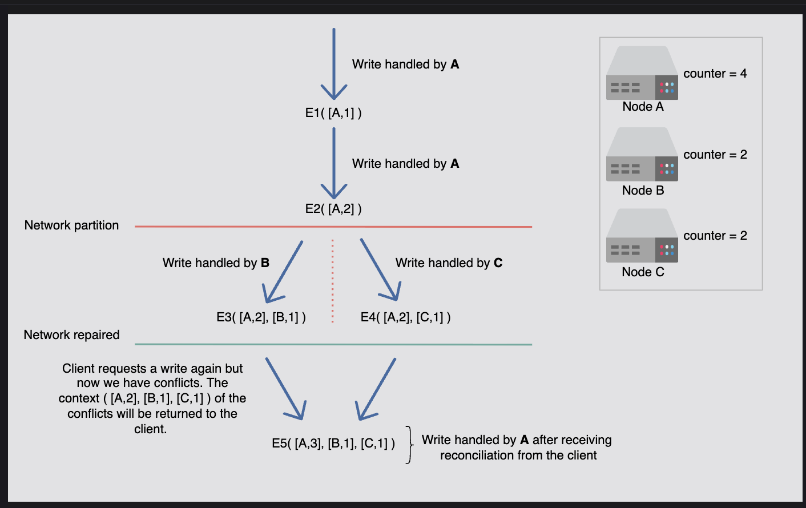
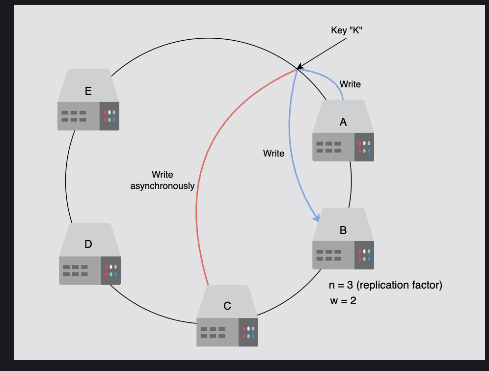

# Versioning Data and Achieving Configurability in Key-Value Stores

## 1. Why Versioning is Needed

In distributed systems:

* Multiple nodes can accept writes (peer-to-peer replication).
* During **network partitions** or **node failures**, different nodes may store **different versions** of the same key.
* When the system heals, we now have **divergent copies** of the same data.

👉 If we simply overwrite, we risk **losing updates**.  
👉 Instead, we keep **multiple versions** until conflicts are reconciled.

This is why **versioning** is critical.

---

## 2. Approaches to Versioning

### (a) Timestamp-based Versioning

* Every write gets a timestamp.
* Newer timestamp overwrites older ones.

⚠️ **Problem:** **Time is unreliable** in distributed systems (clock skew, drift).

* Node A's "newer" write may actually have happened before Node B's update.

### (b) Vector Clocks (Standard Approach)

This is the **standard approach** in Dynamo-style key-value stores.

---

## 3. What is a Vector Clock?

A **vector clock** is a data structure that helps us track the **causal relationship** between events in a distributed system.

* It's basically a **map/dictionary** of `(Node → Counter)` pairs.
* Each node keeps track of how many updates it has made.
* When nodes exchange updates, they merge vector clocks to know if one version happened **before**, **after**, or **concurrently** with another.

### Why do we need it?

Because in distributed systems, updates can happen **at the same time** on different nodes. Vector clocks help us figure out:

1. **Which update came first** (causality).
2. **If two updates are independent/conflicting**.

### Structure

```
[(nodeID1, counter1), (nodeID2, counter2), ...]
```

* Each node keeps a counter for each object version.
* On each write, the node increments its counter and attaches the new vector clock.
* By comparing vector clocks, we can determine causality.

---

## 4. How a Vector Clock Works

### Step 1: Initial State

* Say we have 3 nodes: **A, B, C**.
* Initially, vector clock for a key (say `"user:123"`) is empty:

```
{}
```

### Step 2: First Update (Node A)

* Node A updates `"user:123" → "John"`.
* It increments its own counter.

```
{A:1}
```

### Step 3: Second Update (Node B)

* Now Node B updates `"user:123" → "Johnny"`.
* It increments its counter:

```
{B:1}
```

At this point:

* Node A thinks version = `{A:1}`.
* Node B thinks version = `{B:1}`.
* They are **independent updates** → potential conflict.

### Step 4: Merging

When A and B synchronize, they **merge clocks** by taking the maximum counter for each node.

* Merge `{A:1}` and `{B:1}` →

```
{A:1, B:1}
```

Now they know both A and B made updates.

### Step 5: Another Update (Node A again)

* Node A updates `"user:123" → "Jonathan"`.
* It increments its counter in the vector clock:

```
{A:2, B:1}
```

### Step 6: Concurrent Update (Node C)

* At the same time, Node C also updates `"user:123" → "Jon"`.
* Its vector clock is:

```
{A:1, B:1, C:1}
```

Now we have **two versions**:

* Version 1 → `{A:2, B:1}`
* Version 2 → `{A:1, B:1, C:1}`

These two are **in conflict** because neither is a strict superset of the other.

---

## 5. How Do We Compare Vector Clocks?

Vector clocks are like **scoreboards** showing how many updates each node has made. Comparing them means checking:

* Did one version include all the updates of the other (so it's *newer*)?
* Or are they different in a way that neither includes the other (so they're *concurrent/conflicting*)?

### ✅ Rule 1: Happened-Before (Causality)

We say **X happened before Y** if:

1. Every counter in X is **less than or equal** to Y's counter.
2. At least one counter is **strictly smaller** in X.

👉 **In simple words:**

* Y has seen everything X has seen **and more**.
* So Y is a **newer version** of X.

#### Example:

* `X = {A:1}`
* `Y = {A:2, B:1}`

Check counters:

* A: 1 ≤ 2 ✅
* B: (X has nothing, so treat as 0) → 0 ≤ 1 ✅

At least one counter is smaller (A=1 vs A=2). ✔  
So `{A:1}` happened before `{A:2, B:1}`.

### ✅ Rule 2: Concurrent (Conflict)

If **neither X ≤ Y nor Y ≤ X**, then they are **concurrent**.

👉 **In simple words:**

* Each version has **some updates the other hasn't seen**.
* They're different but not directly comparable.
* This means **conflict** → both versions must be kept and reconciled later.

#### Example:

* `X = {A:2, B:1}`
* `Y = {A:1, B:1, C:1}`

Check counters:

* For A → 2 (X) is not ≤ 1 (Y) ❌
* For C → 0 (X) is not ≥ 1 (Y) ❌

So neither X ≤ Y nor Y ≤ X. ✔  
They are **concurrent/conflicting**.

### Visual Way to Think

Think of each vector clock as a **set of knowledge**:

* If one set fully contains the other → that one is newer (happened after).
* If both sets have **unique info** → they're concurrent.

---

## 6. Conflict Resolution

When two versions are concurrent:

* **System can keep both** and return them to the application.
* **Application decides how to merge**.

### Example: Shopping Cart

* Key = `user:42` (shopping cart).
* Node A updates → VC = `[A:1]` → cart = `{item1}`
* Node B updates → VC = `[B:1]` → cart = `{item2}`

Now, two divergent versions exist:

* A: cart = `{item1}`
* B: cart = `{item2}`

👉 Both versions must be kept until reconciled.

Later, client merges them → `{item1, item2}`, new VC = `[A:1, B:1]`.

This ensures **no update is lost**.

### Conflict Resolution Strategies:

* **Automatic**: If system can merge (like shopping carts → union of items).
* **Application-assisted**: Client must merge conflicting versions and write back.

This design ensures **availability > consistency** (CAP theorem tradeoff).

---

## 7. Why Not Just Use Timestamps?

* Timestamps can be wrong if clocks are out of sync.
* Vector clocks are **logical clocks** → they don't depend on physical time.
* They capture **causality** instead of just order.

---

## 8. Metadata for Integrity

Besides versioning, other metadata is essential:

### (a) Checksums / Hashes

* Every value is stored with a checksum (e.g., MD5, CRC32).
* On read/write, checksum is validated.
* Detects **data corruption** during transmission or storage.

### (b) Version Numbers

* Track the lineage of values.
* Helps nodes detect which replica is stale and which is latest.

### (c) Vector Clocks

* Help detect **conflicts** and **causality**.

👉 Together, metadata ensures:

1. **Integrity** (data not corrupted → checksum).
2. **Consistency** (updates tracked → versioning).
3. **Conflict resolution** (vector clocks allow safe merges).

---

## 9. Configurability

Different applications need different tradeoffs. A **configurable key-value store** lets clients choose:

### Consistency vs Availability

* Banking: prefer consistency.
* Shopping carts: prefer availability.

### Replication factor (n)

* More replicas = more durability, but higher cost.

### Read/write quorum (r, w)

* Strict quorum for strong consistency.
* Loose quorum for faster, more available writes.

👉 Configurability ensures one storage system can support **many use cases**.

---

## 10. End-to-End Example

Imagine a **shopping cart** in Dynamo:

1. **Client adds `item1` at Node A.**
   * VC = `[A:1]`.

2. **Network partition. Client adds `item2` at Node B.**
   * VC = `[B:1]`.

3. **System heals** → Nodes A and B now both have **two divergent versions**.

4. **On next read:**
   * Client gets **two versions** (`{item1}`, `{item2}`) with their vector clocks.

5. **Client merges into `{item1, item2}`.**
   * New VC = `[A:1, B:1]`.

6. **Write back** → conflict resolved without losing data.

---

## ✅ Key Takeaways

* **Versioning (vector clocks)** ensures we never lose updates.
* **Vector clocks track causality**, not just time.
* **Checksums** ensure integrity.
* **Configurability** lets apps choose between consistency and availability.
* **Conflict resolution** can be automatic or application-assisted.
* This is why Dynamo-style key-value stores power real-world systems like **Amazon DynamoDB, Cassandra, Riak**.

---

## 📌 Summary

| Concept | Description |
|---------|-------------|
| **Vector Clock** | `(Node → Counter)` pairs tracking causality |
| **Happened-Before** | One version includes all updates of another (newer) |
| **Concurrent** | Both versions have unique updates (conflict) |
| **Conflict Resolution** | Application merges concurrent versions |
| **Metadata** | Checksums + version numbers + vector clocks |
| **Configurability** | Trade-off between consistency and availability |

Vector clocks are essential for **eventual consistency** in distributed key-value stores.

---

# Modified API Design for Conflict Handling in Key-Value Stores

## Why Modify the API?

In a distributed key-value store, multiple nodes can update the same key at the same time.

This causes **conflicts**: two or more versions of the same value exist.

To resolve conflicts, we need **metadata** (like version history, vector clocks) along with the data.

👉 That's why the API now deals with **context** (metadata + version info) in addition to just the key and value.

---

## New API Design

### 1. `get(key)`

**Input:** only the key.

**Output:**

* The value(s) (could be one value or multiple conflicting versions).
* A **context**, which contains the metadata → typically includes the vector clock.

#### Why context?

Because when you read, the system must tell you which version(s) you got and their history, so you can use that later when writing.

### 2. `put(key, context, value)`

**Input:**

* `key`: the identifier.
* `value`: the new object to store.
* `context`: metadata (vector clock info) from your last read.

**Process:**

1. The system checks the context (vector clock).
2. It figures out whether this write replaces the old value, or if it's a new conflicting branch.
3. The value gets stored at the right node.

#### Why require context in put?

Because without version info, the system cannot tell if your write is:

* A new update (successor).
* Or a conflicting branch that must be stored separately.

---

## Where is the Conflict Detected and Resolved?

* **Conflict is detected during `get(key)`**
* **Conflict is resolved during `put(key, context, value)`**

### During `get(key)`:

When you read a key, the system checks if there are multiple versions of the value (different vector clocks).

* If there's **only one version**, no problem → it just returns the value and its context.
* If there are **conflicting versions**, the system doesn't automatically merge (because it might not know how).
* Instead, it **returns all conflicting versions + their contexts**.

👉 So, `get()` is where you **detect** that a conflict exists, but you don't resolve it here.

### During `put(key, context, value)`:

When you write, you must supply the context (vector clock) you got from the previous `get()`.

The system checks the vector clocks:

* If your new value is a **direct successor** → it updates cleanly.
* If your value comes from **conflicting branches** → then the system expects you (the client/app) to have merged those versions into a single value before writing.

👉 So, conflict resolution actually happens **before or during `put()`**, but done by the **client** (application or user).

---

## How Conflict Handling Works

Let's see this with an example:

### Scenario: User updates same key from two nodes

**Client 1 does:**
```
get("user:123") → { "name": "Alice" }, context={A:1}
```

**Client 2 also does (before Client 1 updates):**
```
get("user:123") → { "name": "Alice" }, context={A:1}
```

**Client 1 updates name:**
```
put("user:123", context={A:1}, value="Alice Smith")
→ System saves { "Alice Smith" } with version {A:2}.
```

**Client 2 updates email at the same time:**
```
put("user:123", context={A:1}, value="alice@gmail.com")
→ System saves { "alice@gmail.com" } with version {B:1}.
```

### Conflict detected

Now the system has two versions:

* `{ "Alice Smith" }` (A:2)
* `{ "alice@gmail.com" }` (B:1)

**When the next client does:**
```
get("user:123")
```

**System returns:**

* Both objects: `[ "Alice Smith", "alice@gmail.com" ]`
* Context: `{A:2}`, `{B:1}`

### Client-side reconciliation

Just like Git:

* If system can auto-merge → e.g., merge name + email into one record.
* If cannot auto-merge → client app (developer) must resolve manually.

**After resolving, client submits:**
```
put("user:123", context={A:2, B:1}, value={ "name": "Alice Smith", "email": "alice@gmail.com" })
```

---

## Complete Example Flow

Let's say two clients update the same user record concurrently:

### Step 1: Both clients read

**Client A does:**
```
get("user:123") → {"name":"Alice"}, context={A:1}
```

**Client B does the same:**
```
get("user:123") → {"name":"Alice"}, context={A:1}
```

### Step 2: Both update concurrently

**Client A:**
```
put("user:123", {A:1}, {"name":"Alice Smith"}) → version {A:2}
```

**Client B:**
```
put("user:123", {A:1}, {"email":"alice@gmail.com"}) → version {B:1}
```

### Step 3: System now has two versions

* `{A:2}` → `{"name":"Alice Smith"}`
* `{B:1}` → `{"email":"alice@gmail.com"}`

### Step 4: Next client reads and detects conflict

```
get("user:123")
```

**System returns:**

* `[ {"name":"Alice Smith"}, {"email":"alice@gmail.com"} ]`
* Contexts: `{A:2}`, `{B:1}`

👉 **Conflict is detected here.**

### Step 5: Application resolves the conflict (like Git merge)

Merged value:
```json
{"name":"Alice Smith", "email":"alice@gmail.com"}
```

### Step 6: Application writes back resolved version

```
put("user:123", {A:2, B:1}, {"name":"Alice Smith", "email":"alice@gmail.com"})
```

👉 **Conflict is resolved here** and stored as the new version.

---

## Analogy with Git

* **Git** stores multiple branches when two people commit at the same time.
* Sometimes Git can **auto-merge**; other times it asks you to resolve conflicts manually.
* **Vector clocks** play the role of commit history to know which changes happened before or concurrently.

---

## Final Summary

| Operation | Purpose | Conflict Handling |
|-----------|---------|-------------------|
| `get(key)` | Returns values + context (metadata) | **Detects conflict** → returns multiple versions + vector clocks |
| `put(key, context, value)` | Uses context (vector clocks) to decide if update is new or conflicting | **Resolves conflict** → client supplies merged value and new context |

### Key Points:

* `get(key)` = **detects conflict** → system returns multiple versions + vector clocks.
* `put(key, context, value)` = **resolves conflict** → client supplies merged value and new context.

This design ensures:

* **No data is lost** (all versions are kept until merged).
* **Conflicts are handled explicitly** (either automatically or by the client).
* **No update is lost**, even in case of network partitions or concurrent writes.

--
# Vector Clock Usage Example

## Scenario: Write Operations with Network Partition

Let's consider a step-by-step example of how vector clocks work in a distributed key-value store.

---

## Step 1: First Write Operation

Say we have a write operation request.

* **Node A** handles the first version of the write request, **E1** (where E means event).
* The corresponding vector clock has node information and its counter: **[A:1]**

---

## Step 2: Second Write on Same Node

Node A handles another write for the same object on which the previous write was performed.

* For **E2**, we have **[A:2]**
* **E1 is no longer required** because E2 was updated on the same node.
* E2 reads the changes made by E1, and then new changes are made.

---

## Step 3: Network Partition Occurs

Suppose a network partition happens.

Now, the request is handled by two different nodes, **B** and **C**.

### Concurrent Updates:

* **Node B** handles write **E3**:
  * Context: **[A:2, B:1]**

* **Node C** handles write **E4**:
  * Context: **[A:2, C:1]**

The context with updated versions (E3, E4) and their related clocks are now in the system.

---

## Step 4: Network Partition Repaired - Conflict Detected

Suppose the network partition is repaired, and the client requests a write again.

**But now we have conflicts!**

* The system has two versions:
  * E3 with clock **[A:2, B:1]**
  * E4 with clock **[A:2, C:1]**

* The context **[A:2, B:1, C:1]** of the conflicts is returned to the client.

---

## Step 5: Client Reconciliation

After the client does reconciliation and **Node A** coordinates the write:

* We have **E5** with the clock **[A:3, B:1, C:1]**

This represents the merged version that incorporates both conflicting updates.

---

## Visual Timeline

```
Time    Event    Node    Vector Clock         Description
----    -----    ----    ------------         -----------
t1      E1       A       [A:1]                Initial write
t2      E2       A       [A:2]                Update on same node
                                              (E1 superseded)
t3      E3       B       [A:2, B:1]           Partition: write to B
        E4       C       [A:2, C:1]           Partition: write to C
                                              (CONFLICT)
t4      -        -       [A:2, B:1, C:1]      Partition healed
                                              Conflict returned to client
t5      E5       A       [A:3, B:1, C:1]      Client reconciles
                                              A coordinates merged write
```

---

1. Let’s suppose that we have three nodes. The vector clock counter is set to 1 for all of them
2. Node A handles the first version of the write request, E1, and the vector clock counter is increased by 1
3. Node A handles the second version of the write request, E2, and the vector clock counter is increased by 2
4. Let’s suppose that a network partition happens
5. Now, the request is handled by Nodes B and C, and their respective vector clock counter is increased
6. Let’s suppose that the network has now been repaired
7. The request is sent to Node A to be processed, but now it has conflicts. We ask the client to resolve it
8. The request is updated after reconciliation

 


## Key Observations

1. **Sequential updates on same node**: Counter increments (E1 → E2)
2. **Concurrent updates on different nodes**: Creates conflict (E3, E4)
3. **Conflict detection**: System identifies incompatible vector clocks
4. **Client reconciliation**: Merges conflicting versions
5. **Resolved version**: New vector clock includes all node counters

---

## Summary

This example demonstrates:

* How vector clocks track causality across nodes
* How network partitions lead to divergent versions
* How conflicts are detected through vector clock comparison
* How reconciliation produces a unified version that preserves all updates

---
# Get and Put Operations in Distributed Key-Value Stores

## Compromise with Vector Clocks Limitations

### Problem

The size of vector clocks may grow large if multiple servers write to the same object simultaneously.

### Reality

This is unlikely in practice because writes are usually handled by one of the top *n* nodes in the preference list.

### Example

In case of network partitions or server failures, writes may be processed by nodes outside the top *n*, leading to long vector versions like:

```
[A:10], [B:4], [C:1], [D:2], [E:1], [F:3], [G:5], [H:7], [I:2], [J:2], [K:1], [L:1]
```

### Challenge

Maintaining such long histories is costly.

### Solution

* Use **clock truncation** with timestamps.
* Purge `(node, counter)` pairs if they exceed a threshold (e.g., 10).
* **Trade-off**: Descendant linkages can't always be precisely determined, reducing reconciliation efficiency.

---

## The Get and Put Operations

* Every node can handle **get (read)** and **put (write)** operations.
* A **coordinator** is the first among the top *n* nodes in the preference list that manages client requests.

---

## Client to Node Communication

There are two approaches:

1. **Through a load balancer** → client not tightly linked to code.
2. **Partition-aware client library** → lower latency due to fewer hops.

---

## Configurable Trade-offs

### Goal

Control **availability, consistency, cost-effectiveness, performance**.

### Implementation

Implemented using a **consistency protocol** similar to quorum systems.

### Example Setup

* *n* = 3 (replication factor)
* Nodes A, B, C, D, E in a ring
* Write on node A → replicas on B and C

---

## Usage of *r* and *w*

* **r** = minimum replicas needed for a successful read
* **w** = minimum replicas needed for a successful write
* **Requirement**: **r + w > n** (ensures at least one overlap → latest value guaranteed)

### Example Table

| n | r | w | Description |
|---|---|---|-------------|
| 3 | 2 | 1 | ❌ Not allowed (violates r + w > n) |
| 3 | 2 | 2 | ✅ Allowed, balanced read/write |
| 3 | 3 | 1 | ✅ Fast writes, slower reads |
| 3 | 1 | 3 | ✅ Fast reads, slower writes |

### Example

If *n = 3* and *w = 2*:

* Write successful after 2 synchronous writes
* 3rd replica updated asynchronously

1. We have a replication factor of 3 and w is 2. The key “K” will be replicated to A, B, and C
2. Since w=2, we’ll write in the first two nodes, then send an acknowledgment to the user or client
3. For the third node, we’ll write/replicate the data asynchronously

 
---

## Read & Write Latency Trade-offs

### Reads

* **Latency** = slowest of *r* replicas
* Higher *r* → more consistent, but slower and less available

### Writes

* Coordinator writes locally
* Sends update to *n* nodes
* Waits for *w-1* responses (since coordinator counts as one)

---

## Conflict Handling in Get Operations

### Process

1. Get requests sent to *n* highest-ranked reachable nodes
2. Coordinator waits for *r* responses
3. If conflicting versions exist (divergent histories), all are returned
4. Client merges them
5. Merged version is rewritten to override old ones

---

## Quorum Configuration Examples

### High Availability Configuration (r=1, w=3)

* **Fast reads**: Only need 1 replica response
* **Slower writes**: Must write to 3 replicas
* **Use case**: Read-heavy workloads (e.g., caching, CDN)

### Balanced Configuration (r=2, w=2)

* **Moderate read/write performance**
* **Ensures consistency**: Overlap guaranteed
* **Use case**: General-purpose applications

### Fast Write Configuration (r=3, w=1)

* **Fast writes**: Only need 1 replica
* **Slower reads**: Must check 3 replicas
* **Use case**: Write-heavy workloads (e.g., logging, analytics)

---

## Achievements So Far

The design achieves:

* ✅ **Scalability** - Through consistent hashing and partitioning
* ✅ **Availability** - Through replication and quorum systems
* ✅ **Conflict Resolution** - Through vector clocks and client-side reconciliation
* ✅ **Configurability** - Through tunable r, w, and n parameters

➡️ **Next step**: Designing for **fault tolerance**

---

## Summary

| Concept | Description |
|---------|-------------|
| **Coordinator** | First among top n nodes handling requests |
| **r (read quorum)** | Minimum replicas for successful read |
| **w (write quorum)** | Minimum replicas for successful write |
| **Requirement** | r + w > n for consistency guarantee |
| **Vector Clock Truncation** | Limits clock size at cost of reconciliation efficiency |
| **Conflict Handling** | Return all versions, client merges, rewrite |
