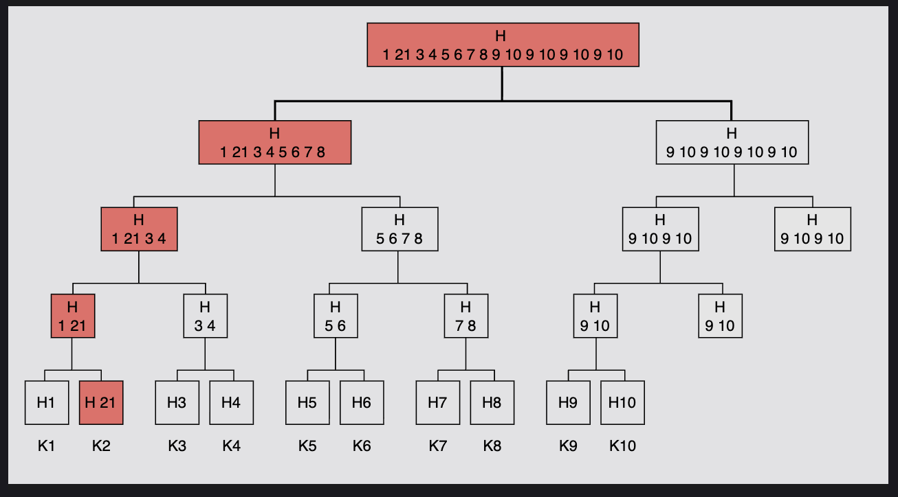
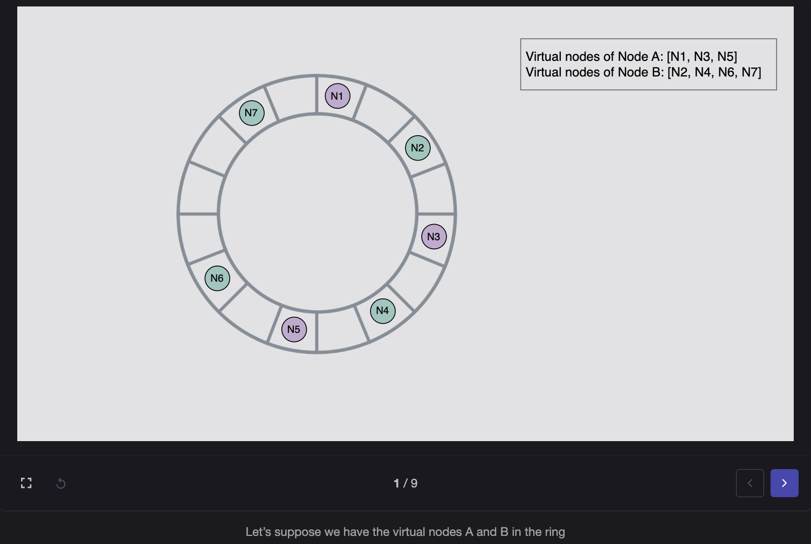
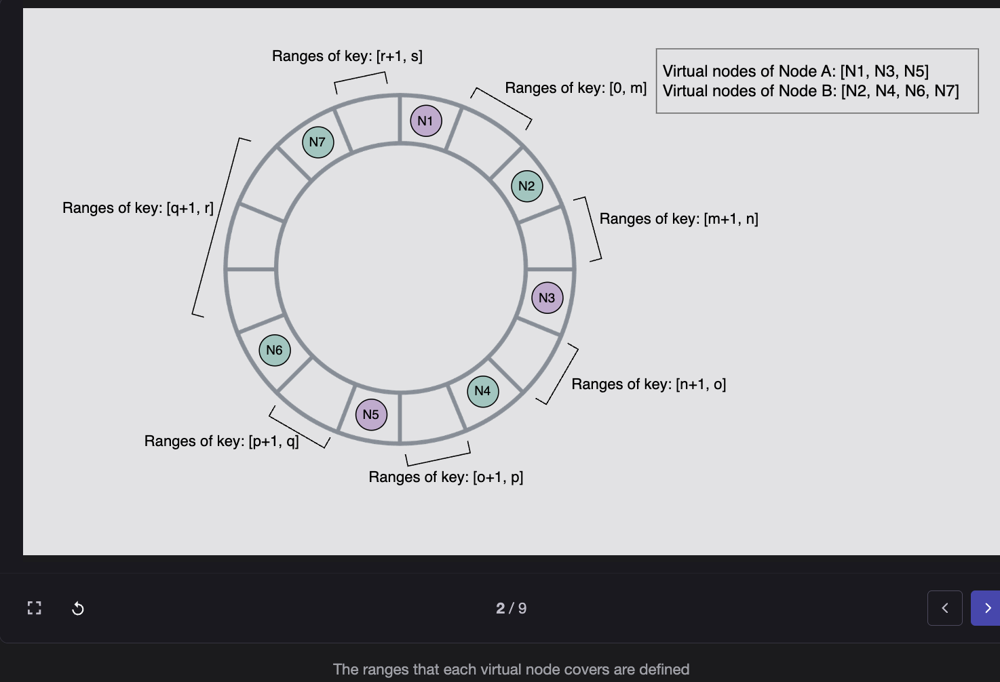
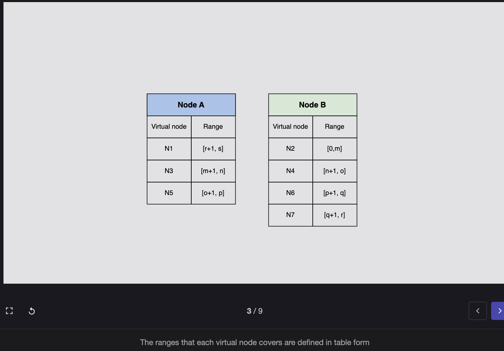
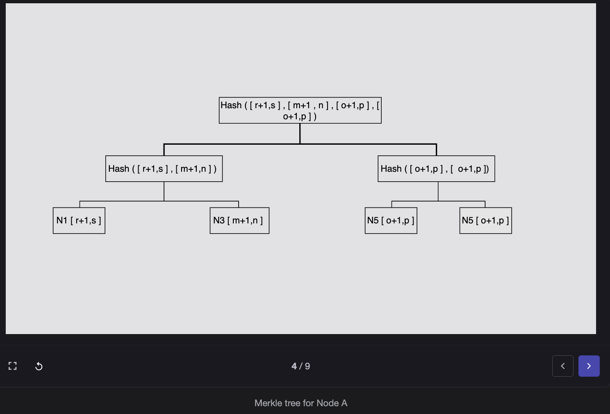
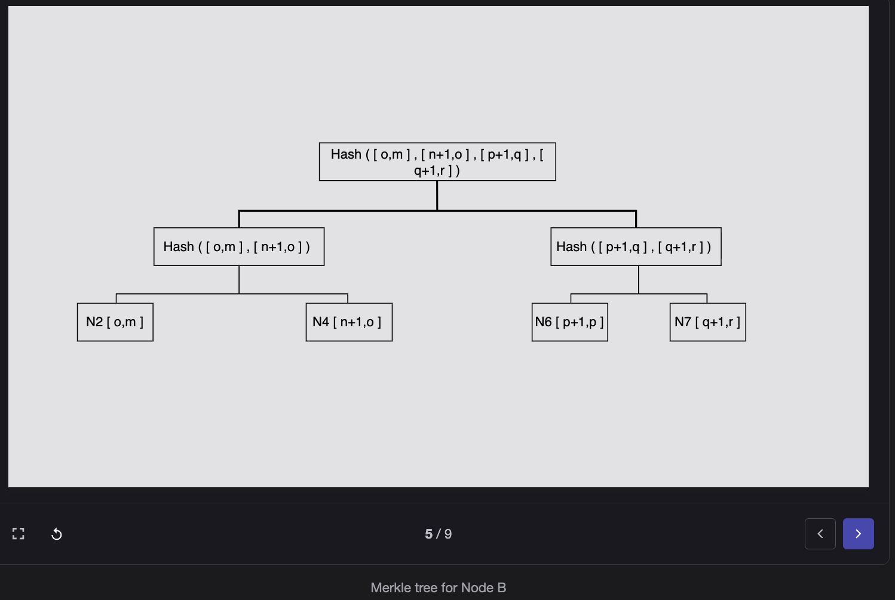
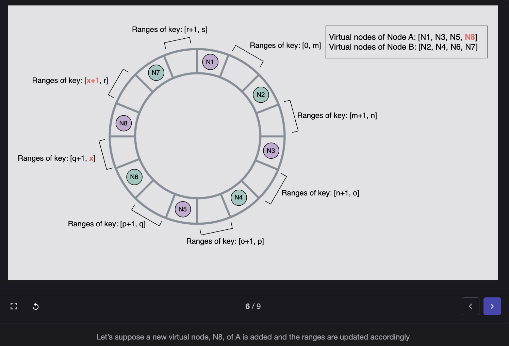
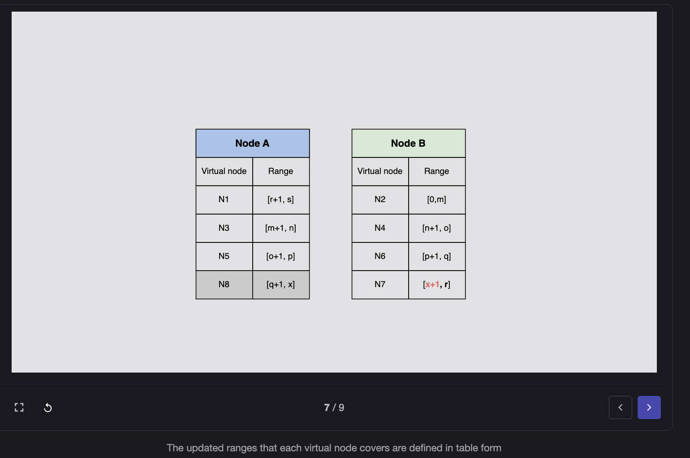
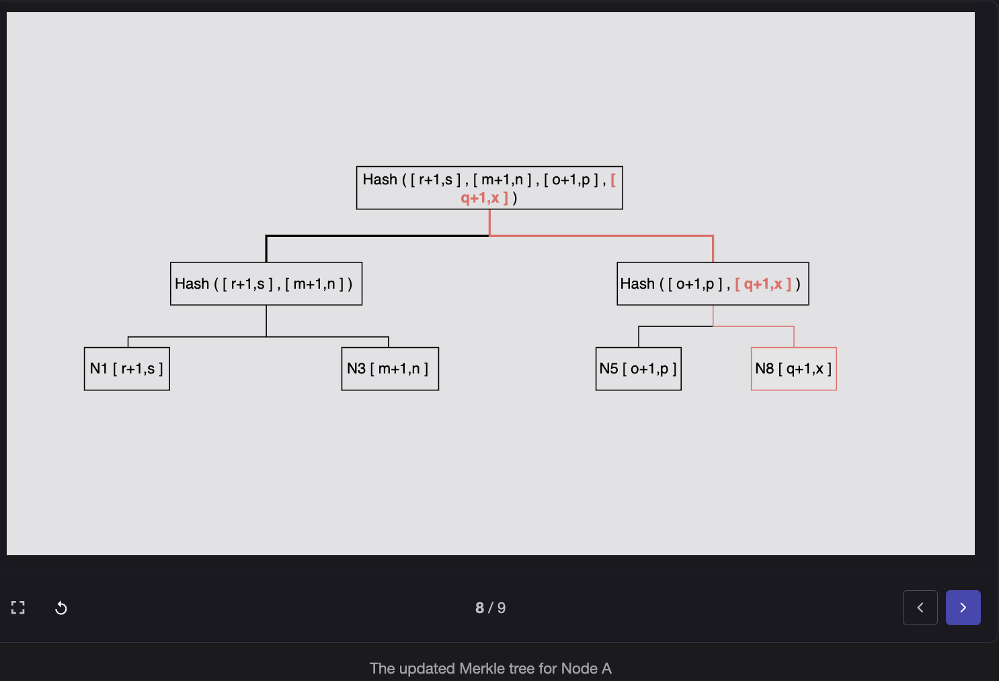
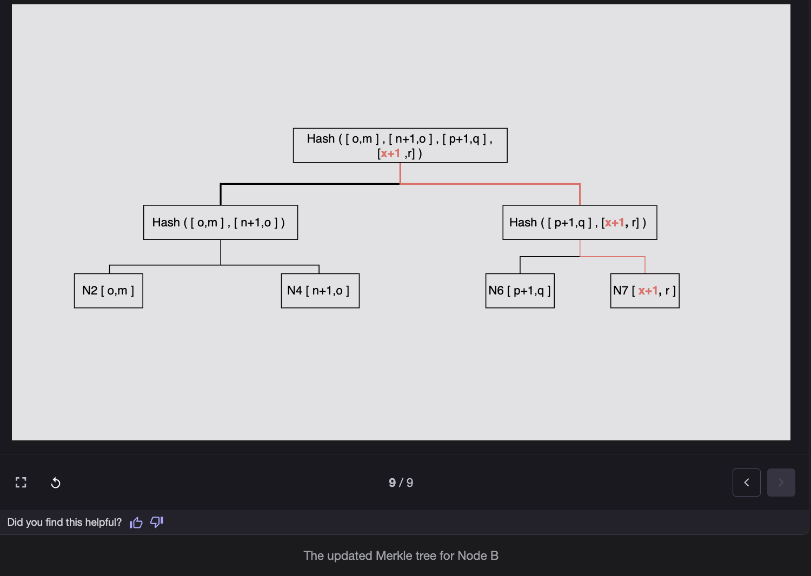

# Fault Tolerance in Distributed Key-Value Stores

## Problem: Fault Tolerance in a Distributed Key-Value Store

In distributed systems (like DynamoDB, Cassandra, etc.), nodes can fail or become temporarily unreachable. If we wait for *all* the replicas to respond (strict quorum), the system may become **unavailable** even for small failures.

### Example:

* Suppose *n=3* replicas.
* If one replica is down, quorum may fail.
* Result: client operation cannot proceed → low availability.

**We want to stay available even if some nodes are temporarily down.**

---

## Solution 1: Strict Quorum (Leader-Based)

* Normally, one leader manages writes.
* Other nodes (participants) acknowledge.
* If leader goes down → **new leader election**.

### Problem:

Frequent elections → wasted time, system performance drops.

---

## Solution 2: Sloppy Quorum (More Practical)

Instead of requiring the *first n nodes* in the preference list, we use the *first n healthy nodes*.

This ensures that as long as some nodes are alive, the operation continues.

### Example

* *n = 3* replicas.
* Preference list: [A, B, C].
* Node A is **temporarily down**.
* Instead of blocking the write, the system uses [B, C, D].
* D stores the data *on behalf of A*.

---

## Mechanism: Hinted Handoff

**How it works:**

1. Node D (substitute node) stores the data temporarily.
2. Along with the data, D stores a **hint**: "This data actually belongs to A."
3. When A comes back online, D forwards the missed data to A.
4. After successful transfer, D deletes its temporary copy.

### Benefits:

* System remains available (writes and reads succeed).
* Once A is back, consistency is restored.

---

## Handling Bigger Failures

If an **entire data center fails** (due to power, cooling, network, or disaster), the system should replicate across **multiple data centers**.

That way, if one is down, data is still accessible from another.

---

## Limitations of Hinted Handoff

1. Works best when failures are **temporary** (short-lived).
2. If the substitute node (D) also fails before A comes back, the hint may be lost.
3. If many nodes keep failing, hinted handoff gets overloaded.
4. Doesn't handle **permanent failures** well (that requires stronger replication and repair strategies like anti-entropy with Merkle trees).

---

## Comparison: Strict vs Sloppy Quorum

| Aspect | Strict Quorum | Sloppy Quorum + Hinted Handoff |
|--------|---------------|--------------------------------|
| **Availability** | Lower (blocks on failures) | Higher (uses substitute nodes) |
| **Consistency** | Stronger | Weaker (temporary inconsistency) |
| **Failure Handling** | Requires leader election | Automatic failover to healthy nodes |
| **Recovery** | Manual/election-based | Automatic via hinted handoff |
| **Best For** | Systems requiring strong consistency | Systems prioritizing availability |

---

## Visual Example

### Normal Operation (All Nodes Healthy)

```
Preference List: [A, B, C]
Write Request → A, B, C (all healthy)
✓ Write succeeds with quorum w=2
```

### With Node Failure (Strict Quorum)

```
Preference List: [A, B, C]
Node A is DOWN
Write Request → B, C only
✗ Cannot achieve quorum w=3 (only 2 nodes available)
Request FAILS
```

### With Node Failure (Sloppy Quorum)

```
Preference List: [A, B, C]
Node A is DOWN
Sloppy Quorum uses: [B, C, D]
Write Request → B, C, D (D stores hint for A)
✓ Write succeeds with quorum w=3
When A recovers → D forwards data to A → D deletes hint
```

---

## Key Takeaways

* **Strict quorum** → safer, but reduces availability.
* **Sloppy quorum + hinted handoff** → improves availability, but comes with risk of lost hints if multiple failures happen.
* **Hinted handoff** is a temporary solution for transient failures.
* **Permanent failures** require additional mechanisms like anti-entropy and Merkle trees.
* **Multi-datacenter replication** protects against catastrophic failures.

---

## Summary

Sloppy quorum with hinted handoff is a pragmatic approach that prioritizes **availability over strict consistency**, making it ideal for systems that need to remain operational even during partial failures. However, it requires careful monitoring and additional mechanisms for handling permanent failures and ensuring eventual consistency.

---
# Merkle Trees for Anti-Entropy in Distributed Systems

## Problem: Permanent Node Failures

* If a node is gone permanently (disk crash, hardware failure, or never comes back), some replicas may **miss updates forever**.
* Over time, different replicas may hold **inconsistent data** (some have new writes, others don't).
* We need a way to **detect differences** between replicas and then **synchronize them**.

### The Challenge

We don't want to compare the **entire dataset** all the time, because that would be **slow and expensive** (imagine billions of keys).

---

## Solution: Merkle Trees (Hash Trees)

Merkle trees solve this problem by allowing **efficient comparison** of large datasets.

### How it works:

### 1. Build a tree of hashes

* Each **leaf node** = hash of a data item (like `hash(value_of_key1)`).
* Each **parent node** = hash of its two children.
* Root node = final single hash representing the whole dataset.

#### Example for keys A, B, C, D:

```
          Root
         /    \
     H(AB)    H(CD)
     /   \    /   \
  H(A)  H(B) H(C) H(D)
```

* `H(A)` = hash of value for key A
* `H(AB)` = hash(H(A) + H(B))
* `Root` = hash(H(AB) + H(CD))

### 2. Compare replicas using tree hashes

* Suppose Node X and Node Y both have replicas of the same data.
* They first compare their **root hash**:
  * If roots are **equal** → datasets are identical → ✅ no sync needed.
  * If roots differ → drill down into child hashes to find *where* they diverge.
* Eventually, they find the **exact leaf nodes (keys)** that are different.

### 3. Sync only the differences

* Once we identify which keys differ, only those values are exchanged between replicas.
* No need to send the full dataset.

---

## Benefits of Merkle Trees

* **Efficient**: Don't need to compare every single record.
* **Localized**: Only inconsistent parts of the dataset are checked.
* **Less data transfer**: Saves bandwidth (important in distributed/cloud systems).
* **Less disk I/O**: Fewer reads/writes during reconciliation.

---

## Example Scenario

* Node A and Node B both replicate keys {k1, k2, k3, k4}.
* Node A crashed for a long time.
* When it comes back, its data is out of date.

### Without Merkle trees:
A and B would compare all keys.

### With Merkle trees:

1. Compare root → mismatch.
2. Compare left branch (k1, k2) → matches.
3. Compare right branch (k3, k4) → mismatch.
4. Drill down → only k4 differs.

✅ Sync just k4 instead of syncing the whole dataset.

---

## Detailed Comparison Process

### Step-by-Step Example

**Initial State:**

Node A has:
```
k1: "value1" → H(k1) = abc123
k2: "value2" → H(k2) = def456
k3: "value3" → H(k3) = ghi789
k4: "value4_old" → H(k4) = jkl012
```

Node B has:
```
k1: "value1" → H(k1) = abc123
k2: "value2" → H(k2) = def456
k3: "value3" → H(k3) = ghi789
k4: "value4_new" → H(k4) = mno345
```

**Merkle Tree Comparison:**

```
Node A Tree:                Node B Tree:
    Root_A                      Root_B
   /      \                    /      \
H(k1,k2)  H(k3,k4_old)    H(k1,k2)  H(k3,k4_new)
  /  \      /  \            /  \      /  \
H(k1) H(k2) H(k3) H(k4)  H(k1) H(k2) H(k3) H(k4)
```

**Comparison Steps:**

1. Compare `Root_A` vs `Root_B` → **Different** ❌
2. Compare left subtree `H(k1,k2)` → **Same** ✅ (skip k1, k2)
3. Compare right subtree `H(k3,k4_old)` vs `H(k3,k4_new)` → **Different** ❌
4. Compare `H(k3)` → **Same** ✅ (skip k3)
5. Compare `H(k4)` → **Different** ❌
6. **Result**: Only k4 needs synchronization

---

## Connection to Anti-Entropy

**Anti-entropy** = process of ensuring all replicas eventually become consistent.

Merkle trees are used to **detect and repair inconsistencies** efficiently.

### Anti-Entropy Process:

1. **Periodic background process** runs on all nodes
2. Nodes exchange Merkle tree root hashes
3. If mismatch detected, drill down to find differences
4. Synchronize only the differing keys
5. Update Merkle trees to reflect new state

---
 


## Performance Comparison

| Approach | Keys to Check | Data Transfer | Time Complexity |
|----------|---------------|---------------|-----------------|
| **Full Scan** | All N keys | Entire dataset | O(N) |
| **Merkle Tree** | Only divergent keys | Only differences | O(log N) |

### Example with 1 Million Keys:

* **Full Scan**: Check 1,000,000 keys
* **Merkle Tree**: Check ~20 hashes (log₂(1,000,000) ≈ 20) to find differences

---

## Implementation Considerations

### Tree Construction

* Each node maintains a Merkle tree for its data partition
* Trees are updated incrementally as data changes
* Tree depth depends on number of keys (typically balanced binary tree)

### Hash Function Choice

* Should be fast (e.g., MD5, SHA-256)
* Cryptographic security not required (just need collision resistance)
* Common choice: MD5 for speed

### Update Strategy

* **Lazy update**: Rebuild tree periodically
* **Incremental update**: Update affected branches on each write
* Trade-off between consistency detection speed and write performance

---

## Summary

**Merkle trees = smart hashing technique to detect and fix inconsistencies between replicas after permanent failures, while saving bandwidth and time.**

### Key Points:

* Uses hierarchical hashing to represent entire dataset
* Enables efficient comparison by checking root first, then drilling down
* Only synchronizes differences, not entire dataset
* Essential for anti-entropy in distributed systems
* Used in systems like Cassandra, DynamoDB, Bitcoin, Git

### Real-World Usage:

* **Cassandra**: Anti-entropy repair using Merkle trees
* **DynamoDB**: Cross-region replication consistency
* **Git**: Efficient repository synchronization
* **Bitcoin**: Block verification and synchronization


---
# Anti-Entropy with Merkle Trees in Distributed Systems

## What Is "Anti-Entropy"?

In distributed systems like Dynamo or Cassandra, data is replicated across multiple nodes for high availability. Over time — due to network failures, node crashes, or partitions — replicas can diverge (hold slightly different data).

The process of **detecting and fixing these differences** to make replicas consistent again is called **anti-entropy**.

So, "anti-entropy with Merkle trees" is how nodes automatically detect and synchronize only the differing data, efficiently.

---

## How Merkle Trees Are Used for Anti-Entropy

Each node maintains a Merkle tree that represents the data it stores.

### 1. Each node keeps multiple Merkle trees

* The consistent hash ring is divided into **key ranges** (or partitions).
* Each node may own several **virtual nodes (vnodes)** — each vnode responsible for one range.
* Each vnode keeps a **Merkle tree for its key range**.

**Example:**
* Node A owns ranges [0–99] and [300–399].
* It has **two Merkle trees** — one per range.

### 2. Nodes compare Merkle trees periodically

To make sure replicas are consistent:

* Two nodes (say A and B) that replicate the same range exchange **root hashes** of their Merkle trees.
* If root hashes are the **same**, everything below them is identical → ✅ no sync needed.
* If root hashes **differ**, it means there's some difference in that range → continue checking.

### 3. Recursive comparison

The comparison process:

1. **Compare the hashes of the root node** of Merkle trees.
2. **Do not proceed if they're the same.**
3. **Traverse left and right children using recursion.**
4. The nodes identify whether or not they have any differences and perform the necessary synchronization.

They recursively compare left and right child hashes:

* If a child's hash differs → go deeper until finding the exact keys that mismatch.
* Only the mismatched key-value pairs are transferred to fix the inconsistency.

This makes synchronization **efficient and localized**.

### 4. No full dataset exchange

**Without Merkle trees:**
* Nodes would need to send their entire key list or dataset to each other for comparison — a huge waste of bandwidth.

**With Merkle trees:**
* Only small hashes are exchanged (lightweight).
* Only changed portions are synchronized.
* Each branch can be compared independently — nodes don't need to download the whole tree.

Results:
* ✅ Faster
* ✅ Less bandwidth
* ✅ Less disk I/O

 
 
 
 
 
 
 
 
 
---

## Detailed Example

Imagine Node A and Node B both replicate keys {k1, k2, k3, k4} for the same range.

### Node A's Merkle tree:

```
        H(ABCD)
       /       \
   H(AB)       H(CD)
   /   \       /   \
 H(A) H(B)   H(C) H(D)
```

### Node B's Merkle tree:

Node B has a different hash for H(D) because key D is out of sync.

```
        H(ABCD')
       /        \
   H(AB)        H(CD')
   /   \        /    \
 H(A) H(B)   H(C)  H(D')
```

### Comparison Process:

1. **Compare root** → `H(ABCD)` vs `H(ABCD')` → **differs** ❌
2. **Compare left subtree** `H(AB)` → **same** ✅ (skip k1, k2)
3. **Compare right subtree** `H(CD)` vs `H(CD')` → **differs** ❌
4. **Compare** `H(C)` → **same** ✅ (skip k3)
5. **Compare** `H(D)` vs `H(D')` → **differs** ❌
6. **Result**: Found mismatch only in D → sync just that key

---

## Advantages of Using Merkle Trees

The advantage of using Merkle trees is that:

* **Each branch can be examined independently** without requiring nodes to download the tree or the complete dataset.
* **Reduces the quantity of data** that must be exchanged for synchronization.
* **Reduces the number of disk accesses** required during the anti-entropy procedure.
* **Efficient parallelization** — multiple ranges can be checked simultaneously.

---

## Disadvantages

When a node joins or departs the system:

* Key ranges get **redistributed** (due to consistent hashing rebalancing).
* The **tree's hashes must be recalculated** because multiple key ranges are affected.
* This recalculation can be **costly in large clusters**, especially with frequent node churn.

**Impact:**
* Temporary performance degradation during rebalancing
* Additional CPU overhead for hash recalculation
* May delay anti-entropy process until trees are rebuilt

---

## Scalability and Fault Tolerance Implications

### Discussion Table

| Concept | Implication |
|---------|-------------|
| **Scalability** | Consistent hashing ensures adding/removing nodes only affects nearby key ranges (not the entire dataset). Each node only recalculates its Merkle trees for affected ranges. |
| **Fault Tolerance** | If a node fails permanently, replicas detect and repair data loss using Merkle trees, ensuring no data corruption or inconsistency remains. |
| **Efficiency** | Merkle trees reduce sync bandwidth and disk I/O, making anti-entropy scalable across thousands of nodes. |
| **Limitation** | When many nodes churn (join/leave), recalculating trees can momentarily affect performance. |

### Scalability Considerations

**Horizontal Scaling:**
* Adding nodes distributes load evenly through consistent hashing
* Only affected virtual nodes need tree recalculation
* Anti-entropy can run in parallel across different ranges

**Performance at Scale:**
* With N nodes and M keys: O(log M) comparison overhead per range
* Much better than O(M) full comparison
* Bandwidth usage scales linearly with actual differences, not dataset size

### Fault Tolerance Considerations

**Permanent Failures:**
* Merkle trees detect all missing updates on failed-then-recovered nodes
* Replicas automatically converge to consistent state
* No manual intervention required

**Transient Failures:**
* Hinted handoff handles short-term unavailability
* Merkle trees catch any missed updates during longer outages
* Combination provides multi-layer fault tolerance

**Data Corruption:**
* Hash mismatches reveal corrupted data
* Can identify and repair specific corrupted keys
* Provides integrity checking beyond just availability

---

## Integration with Consistent Hashing

### How They Work Together

1. **Consistent hashing** partitions the key space into ranges
2. **Virtual nodes** distribute these ranges across physical servers
3. **Replication** ensures each range is stored on multiple nodes
4. **Merkle trees** maintain integrity within each range
5. **Anti-entropy** uses Merkle trees to keep replicas synchronized

### Benefits of Integration

* **Localized impact** — node changes only affect specific ranges
* **Independent verification** — each range verified separately
* **Parallel processing** — multiple ranges synchronized concurrently
* **Incremental updates** — only affected trees need recalculation

---

## Practical Implementation

### When Anti-Entropy Runs

* **Periodic background process** (e.g., every few hours)
* **After node recovery** from failure
* **During cluster rebalancing** (lower priority)
* **On-demand** for suspected inconsistencies

### Optimization Techniques

1. **Lazy tree building** — only build trees when needed
2. **Incremental updates** — update tree as data changes
3. **Bloom filters** — quick pre-check before full comparison
4. **Priority queuing** — sync critical data first

---

## Real-World Usage

### Cassandra

* Uses Merkle trees for `nodetool repair`
* Each node maintains trees per column family
* Configurable tree depth based on data size

### Amazon DynamoDB

* Anti-entropy runs continuously in background
* Merkle trees help detect and repair divergence
* Integrated with cross-region replication

### Apache Riak

* Active anti-entropy (AAE) with Merkle trees
* Separate AAE process doesn't impact read/write performance
* Configurable synchronization intervals

---

## Final Summary

**Anti-entropy** = keeping all replicas in sync.

**Merkle trees** = efficient way to detect data inconsistencies.

**Consistent hashing** = allows data to be partitioned and distributed in a scalable, fault-tolerant way.

**Together** → they make a distributed key-value store highly available, scalable, and eventually consistent.

### Key Takeaways

* Merkle trees enable efficient replica comparison
* Only differing data needs synchronization
* Scales well with dataset size and cluster size
* Trade-off: tree recalculation cost during node changes
* Essential for eventual consistency in distributed systems

---
# Membership Management and Gossip Protocol in Distributed Systems

## The Problem

In a distributed key-value store (Dynamo-style system), we have many nodes arranged in a ring using consistent hashing. Each node stores part of the data and replicates it to its neighbors.

But nodes can:

* **Fail temporarily** (e.g., network glitch, restart)
* **Fail permanently** (e.g., hardware crash, decommission)
* **Be added or removed intentionally** (scaling up/down)

We need a way to:

* Detect failures or recoveries quickly
* Update the membership list (which nodes are active in the ring)
* Keep this view consistent across all nodes — without a central authority

---

## Why We Don't Immediately Rebalance

If a node goes offline for a few seconds/minutes, we shouldn't immediately rebalance (i.e., redistribute its keys).

### Why?

Because:

* It may come back soon — rebalancing would waste resources.
* Rebalancing triggers data movement → increases network load.
* Frequent joins/leaves cause instability ("ring churn").

**Hence, we only rebalance when a node is confirmed permanently gone.**

---

## Solution: Membership Management

### 1. Membership History

Every node maintains a record (history) of which nodes are part of the cluster (ring).

This includes:
* Node IDs
* Tokens (hash ranges they own)
* Join/leave timestamps
* Status (active, suspected, down, etc.)

The history is **persisted on disk** — so even after restarts, the node remembers past membership changes.

### 2. Gossip Protocol for Membership Synchronization

A **gossip protocol** is a lightweight, decentralized way for all nodes to stay in sync about the cluster state.

#### How it works:

1. Each node periodically (say, every second) **randomly picks a few peers** and shares its known membership info with them.
2. Those peers **merge this info** with their own and pass it further to others.
3. Over time, all nodes **converge to the same global view** of membership (eventual consistency).

#### Example:

* Node A knows about B and E (its token set).
* Node D knows about C and E.
* Each node shares its info with its peers periodically.
* Eventually, all nodes learn about each other's presence and state.

**It's like how rumors spread in a crowd — fast, decentralized, and redundant.**

### 3. Token Sets and Virtual Nodes

* Each node is responsible for one or more **token ranges** in the consistent hash ring.
* These are called **virtual nodes (vnodes)**.
* The node keeps a mapping between itself and its tokens.
* This mapping is shared and updated using gossip.

When a node joins, it announces:
> "Hey, I'm Node F, I own tokens X and Y."

All other nodes gradually learn this through gossip.

---

## Failure Detection (Decentralized)

Failure detection is also **gossip-based and decentralized** — there's no single master node.

### Each node monitors a few peers:

1. If a node can't contact one of its peers for a set timeout (e.g., 10 seconds), it **suspects** that node is down.
2. It then **broadcasts this info through gossip**:
   > "Node B seems dead."
3. Other nodes **verify this independently**.
4. If multiple nodes report the same, the system **marks that node as failed**.

### Temporary vs Permanent Failure:

* **Temporary failure** → handled with hinted handoff (store data elsewhere temporarily).
* **Permanent failure** → node is removed from membership, and its partitions are re-replicated to other healthy nodes.

---

## Example Walkthrough

### Step 1: Node Joins

1. **Node A starts up** and connects to B and E (its peers).
2. It shares: "I'm new; here are my tokens."

### Step 2: Information Spreads

1. **B and E** store this info and gossip it to others.
2. Now **C, D, and others** gradually learn that A has joined.

### Step 3: Node Fails

1. Later, if **A crashes** and doesn't respond for a while:
   * B and E detect no response.
   * They gossip: "Node A is unreachable."

### Step 4: Confirmation and Recovery

1. If A **doesn't recover** after a threshold, the system treats it as permanently gone.
2. Its **token ranges are re-assigned** to nearby nodes.
3. **Membership is updated** across the ring.

---

## Advantages of Gossip-Based Membership

| Feature | Description |
|---------|-------------|
| **Decentralized** | No single point of failure. Every node participates equally. |
| **Scalable** | Works well even with thousands of nodes. |
| **Eventually consistent** | All nodes converge to the same view over time. |
| **Low bandwidth** | Only small, periodic updates exchanged. |
| **Fault tolerant** | Can handle temporary and permanent failures gracefully. |

---

## Limitations

| Limitation | Description |
|------------|-------------|
| **Slow convergence** | It takes some time for all nodes to learn about new changes (eventual, not instant). |
| **False positives** | Temporary network lags may cause nodes to be marked as "dead" incorrectly. |
| **Churn impact** | Too many joins/leaves cause frequent updates and temporary instability. |

---

## Gossip Protocol Details

### Message Types

1. **Syn (Synchronize)**: Initial message with node's current membership view
2. **Ack (Acknowledge)**: Response with receiver's membership view
3. **Ack2**: Final acknowledgment to complete three-way handshake

### Information Propagation

* **Round duration**: Typically 1 second
* **Fanout factor**: Each node contacts 1-3 random peers per round
* **Convergence time**: O(log N) rounds to reach all N nodes
* **Message size**: Typically a few KB (compressed membership state)

### State Management

Each membership entry contains:
* Node ID and address
* Token assignments
* Heartbeat counter (increments on each gossip round)
* Generation number (increments on restart)
* Application state (metadata)

---

## Failure Detection Algorithm

### Phi Accrual Failure Detector

Modern systems use an adaptive algorithm:

1. **Track heartbeat intervals** for each node
2. **Calculate distribution** of arrival times
3. **Compute suspicion level (φ)** based on delay
4. **Mark as failed** when φ exceeds threshold (e.g., φ > 8)

**Advantages:**
* Adapts to network conditions
* Reduces false positives
* Configurable sensitivity

---

## Integration with Data Operations

### During Normal Operations

* Requests routed based on current membership view
* Coordinator selected from healthy nodes in preference list
* Quorum operations use reachable replicas

### During Membership Changes

* **Node joining**: Gradually takes ownership of token ranges
* **Node leaving**: Data transferred to successor nodes
* **Node failed**: Hinted handoff + anti-entropy repairs divergence

---

## Real-World Implementations

### Apache Cassandra

* Uses gossip for cluster membership
* Configurable gossip interval (default: 1 second)
* Phi accrual failure detector with configurable threshold
* Seed nodes help new nodes bootstrap

### Amazon DynamoDB

* Proprietary gossip-based membership
* Integrated with consistent hashing
* Auto-scaling adjusts membership dynamically

### Apache Riak

* Gossip protocol for ring state
* Vector clocks track causality
* Configurable failure detection thresholds

---

## Summary

| Concept | Explanation |
|---------|-------------|
| **Membership history** | Tracks which nodes are in the ring; stored persistently. |
| **Gossip protocol** | Spreads membership updates randomly among nodes. |
| **Failure detection** | Decentralized — each node checks its peers and gossips about failures. |
| **Token sets** | Each node owns virtual nodes (key ranges). |
| **Temporary failures** | Handled via hinted handoff. |
| **Permanent failures** | Trigger re-replication and membership update. |

---

## Key Takeaways

* Gossip protocol enables decentralized membership management
* No single point of failure or coordination bottleneck
* Eventually consistent view across all nodes
* Adaptive failure detection reduces false positives
* Balances between quick detection and stability
* Critical foundation for distributed key-value stores

---
# Seed Nodes and Preventing Logical Partitioning in Gossip Protocols

## 1. Background: Gossip-based Membership

In distributed systems like Dynamo (and Cassandra), **each node maintains a view of cluster membership** — which nodes exist and are alive.

Since there is no central coordinator, this view must stay **eventually consistent**. That's why systems use a **gossip protocol** — a decentralized way of sharing information.

### Example:

* Node **A** randomly picks node **B** and gossips its current membership list.
* **B** merges this information with its own and maybe adds updates.
* Next round, **B** gossips to **C**, and so on.

Over time, **every node learns about every other node**, even though messages are only exchanged pairwise.

---

## 2. When Can Gossip Fail? (Logical Partitioning)

Even though gossip is powerful, it can fail under some special conditions.

### Example Scenario:

Let's say physical node **A** has two *virtual nodes*:

* Virtual node **N1**
* Virtual node **N2**

Now, suppose due to a configuration or network issue:

* **N1** tries to join the ring independently and gossips as if it's a different node.
* **N2** also joins separately.

👉 Both **N1** and **N2** believe they are separate members of the ring — but in reality, they are **on the same physical machine (A)**.

This situation is called **logical partitioning** because the system's *logical view* of the cluster is partitioned — even though physically, nothing is wrong.

Now, if **N1** and **N2** start making updates, they'll **update themselves** repeatedly or get inconsistent views of the ring.

### Visual Representation:

```
Physical Reality:
┌─────────────┐
│  Machine A  │
│  ┌────┐     │
│  │ N1 │     │
│  └────┘     │
│  ┌────┐     │
│  │ N2 │     │
│  └────┘     │
└─────────────┘

Logical View (Incorrect):
    Ring
   ┌─────┐
   │     │
  N1    N2
   │     │
   └─────┘
(N1 and N2 think they are separate nodes)
```

---

## 3. Why Gossip Alone Isn't Enough

Gossip ensures that information *eventually spreads*, but it assumes that:

* Every node can eventually reach every other node (connected topology).
* The virtual-to-physical node mapping is correct.

If a few nodes get "cut off" logically or their mappings are inconsistent, gossip can't fix that automatically — they'll form *independent subgroups* that never hear from each other.

### This can happen due to:

* Misconfigured token ranges.
* Network partitions.
* Too many nodes frequently joining/leaving (high churn).
* Virtual node configuration errors.
* Split-brain scenarios.

### Example of Logical Partition:

```
Cluster State (Actual):
Nodes: [A, B, C, D, E]

After Misconfiguration:
Group 1: [A, B, C]  (gossip among themselves)
Group 2: [D, E]     (gossip among themselves)

Neither group knows about the other!
```

---

## 4. How to Prevent Logical Partitioning: Seed Nodes

To prevent the above problem, systems introduce **seed nodes**.

### What are Seed Nodes?

Seed nodes are *special nodes* configured manually (or via a config service) that are **known to all other nodes** in the cluster.

**Key characteristics:**
* Pre-configured list of trusted nodes
* Used as initial contact points for new nodes
* Act as "anchors" for the gossip network
* Typically 2-3 nodes per datacenter

### How They Help:

* When any new node joins the cluster, it first **contacts one of the seed nodes** to get the latest membership information.
* Because **every node knows at least one common seed**, they can reconcile their state even if some subgroups get temporarily isolated.
* It ensures **all nodes are connected through at least one shared reference point** (the seed).

Think of seed nodes like **"well-known gateways"** or **"directory servers"** that everyone trusts to start gossip with.

### Example:

Let's say nodes A, B, and C exist.

* **Seed list** = {A, B}
* **New node D joins** → contacts A → gets membership info → starts gossiping.

Even if node C was isolated for a while, once it reconnects and talks to A or B, its membership view becomes consistent again.

---

## 5. How Seed Nodes Work in Practice

### Bootstrap Process:

```
Step 1: Node D starts up
  ↓
Step 2: D reads seed list from config: [A, B]
  ↓
Step 3: D contacts seed node A
  ↓
Step 4: A sends current membership: [A, B, C, E, F]
  ↓
Step 5: D joins ring and starts gossiping with all nodes
  ↓
Step 6: D's presence propagates via gossip
```

### Reconnection After Partition:

```
Scenario: Node C was isolated

Before:
Group 1: [A, B, D, E, F]  (main cluster)
Group 2: [C]              (isolated)

After C contacts seed node A:
C receives: [A, B, D, E, F]
C updates its membership
C rejoins gossip network
Final: [A, B, C, D, E, F]  (unified)
```

---

## 6. Seed Node Configuration

### Example Configuration (Cassandra-style):

```yaml
# cassandra.yaml
seed_provider:
  - class_name: org.apache.cassandra.locator.SimpleSeedProvider
    parameters:
      - seeds: "192.168.1.10,192.168.1.11,192.168.1.12"
```

### Best Practices:

1. **Choose stable nodes**: Select nodes unlikely to go down simultaneously
2. **Multiple seeds**: Use 2-3 seeds per datacenter for redundancy
3. **Don't make all nodes seeds**: Only a few designated nodes
4. **Consistent configuration**: All nodes should have the same seed list
5. **Geographic distribution**: Seeds should span different availability zones

---

## 7. Seed Nodes vs Regular Nodes

| Aspect | Seed Nodes | Regular Nodes |
|--------|-----------|---------------|
| **Configuration** | Manually configured in all nodes | Discover via gossip |
| **Role** | Bootstrap point for new nodes | Normal cluster members |
| **Responsibility** | Help maintain cluster connectivity | Store data and serve requests |
| **Failure impact** | No operations impact (just bootstrap) | May affect quorum |
| **Number needed** | 2-3 per datacenter | Can be hundreds/thousands |

**Important:** Seed nodes are **not special in operation** — they participate in gossip, store data, and serve requests like any other node. Their only special property is being in the **seed list**.

---

## 8. Limitations and Considerations

### Limitations:

1. **Manual configuration required**: Seed list must be updated when seed nodes change
2. **Bootstrap dependency**: New nodes can't join if all seeds are down
3. **Not a panacea**: Can't prevent all types of partitions (e.g., network splits)
4. **Configuration drift**: If seed lists differ across nodes, can cause issues

### What Seed Nodes Don't Solve:

* **Network partitions**: Physical network splits still cause issues
* **Data consistency**: Seed nodes don't guarantee strong consistency
* **Quorum availability**: Still need enough replicas for operations
* **Split-brain**: Can still occur in severe network failures

---

## 9. Real-World Examples

### Apache Cassandra

```
- Uses seed nodes for bootstrap
- Recommends 2-3 seeds per datacenter
- Seeds participate normally
