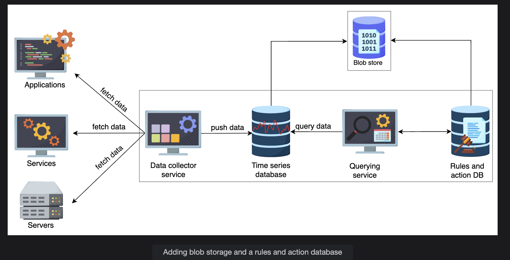
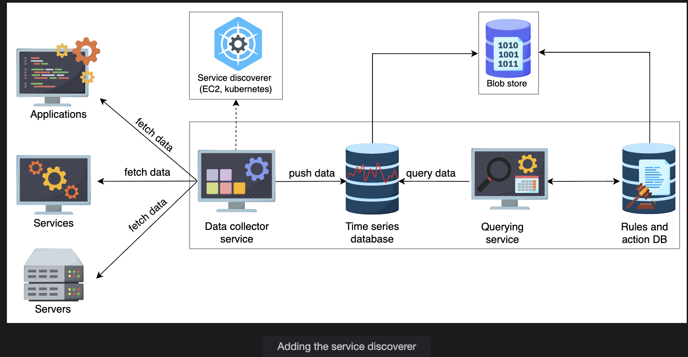
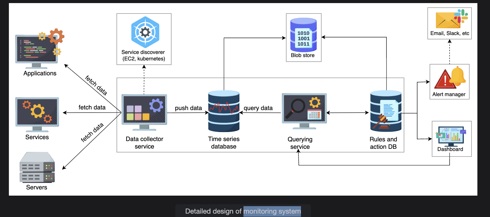
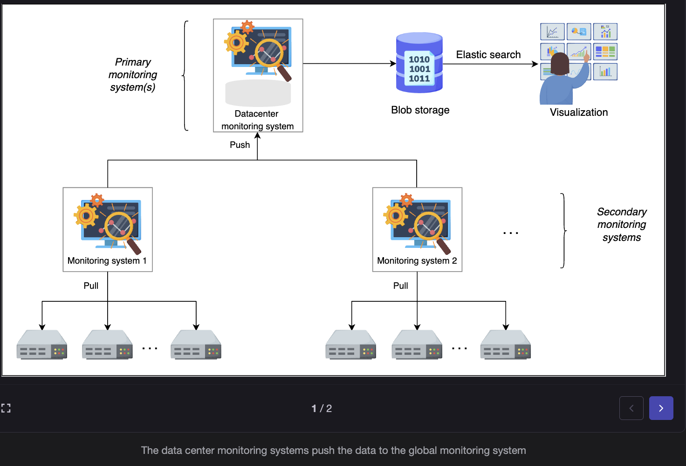

# Detailed Design of the Monitoring System

## 🧩 Overview

A monitoring system continuously collects, stores, and analyzes metrics and logs from various servers and applications. It also triggers alerts when those metrics cross predefined thresholds.

Now, we'll look at the detailed design, which has several main components:

| Component | Purpose |
|-----------|---------|
| **Data Collector** | Collects metrics (usually via pull strategy) |
| **Time-Series Database (TSDB)** | Stores metric values with timestamps |
| **Rules & Action Database** | Stores alert rules (thresholds) and what actions to take |
| **Blob Storage** | Stores large, unstructured monitoring data like logs, traces, or snapshots |
| **Alerting Engine** | Evaluates metrics against rules and triggers alerts |

Let's explore each.

## 🧱 1. Storage Layer



### a. Time-Series Database (TSDB)

This is the heart of the monitoring system. It stores metrics in the form of:

```
(timestamp, metric_name, value, tags)
```

**Example:**

```
(2025-11-01T10:30:00Z, cpu_usage, 91%, server_id=app-001)
```

- Each new metric sample gets stored with its timestamp
- This allows plotting graphs over time (e.g., CPU over 24 hours)

**Examples:** Prometheus, InfluxDB, Graphite

#### 📘 Why local first?

Metrics are first stored locally where the monitoring service runs — this makes it faster.

Then they are synced or replicated to a separate storage node (central blob store) for durability and global analysis.

### b. Blob Storage

Blob storage (like Amazon S3, Google Cloud Storage, or Azure Blob) is used for:

**Storing large or unstructured monitoring data:**

- Logs
- Application traces
- Snapshots
- Archived metrics (for long-term retention)

**Why separate from TSDB?**

TSDBs are optimized for high-speed writes and querying recent data — but they're not good for very large or unstructured data. Hence, blob storage complements TSDB by holding historical or large data.

### c. Rules and Action Database

This is where we store alert rules and what to do when they are violated.

**Example entry:**

| Rule ID | Metric | Condition | Action |
|---------|--------|-----------|--------|
| 101 | CPU usage | > 90% for 5 mins | Send alert + auto-scale EC2 |

This helps automate responses.

So, if your CPU crosses 90% for 5 minutes:

- An alert is sent (email/Slack/PagerDuty)
- And the system may trigger auto-scaling

📘 This part connects **monitoring → alerting → remediation**.

## ⚙️ 2. Data Collector Layer

The data collector is responsible for fetching or receiving metrics from services.

### a. Pull-based Strategy (Chosen in This Design)

In this approach:

1. Each application exposes its metrics on an HTTP endpoint (like `/metrics`)
2. The data collector (monitoring service) periodically polls these endpoints
3. It fetches current metrics and stores them in the TSDB

**Advantages:**

- The monitoring system controls how often to pull (avoiding overload)
- If a service is down, no unnecessary network flood
- Easier to manage rate limits and consistency

**Real-world Example:**

🟢 Prometheus and DigitalOcean both use this pull-based model — Prometheus scrapes metrics from servers across the globe.

### b. Push-based Strategy (and its Drawbacks)

In a push-based system:

- Each microservice pushes its metrics to the monitoring system

**Example:**

Your service every 5 seconds sends:

```json
POST /metrics
{
   "service": "payment",
   "cpu_usage": 92,
   "memory": 75
}
```

#### 🔴 Drawbacks:

**Network Flooding:**
- Every service keeps sending data → network gets overloaded

**Central Bottleneck:**
- The monitoring service becomes a hotspot, receiving millions of metrics simultaneously

**Infrastructure Overhead:**
- Each microservice must run a daemon/agent that collects and pushes metrics → adds complexity and CPU overhead

**Less Control:**
- If a service misbehaves or floods data, monitoring may crash

Hence, large-scale systems prefer pull-based approaches for better control and load management.

## 🧭 3. Data Flow Summary

Let's visualize the flow:

```
┌─────────────────────┐
│  Application/Service│
│  (e.g., Web API)    │
│  Exposes /metrics   │
└─────────┬───────────┘
          │
          ▼
┌─────────────────────┐
│   Data Collector    │
│ (Pulls metrics)     │
└─────────┬───────────┘
          │
          ▼
┌─────────────────────┐
│ Time-Series DB      │
│ (Stores metrics)    │
└─────────┬───────────┘
          │
          ├──► Blob Storage (for large logs/traces)
          │
          ▼
┌─────────────────────┐
│ Rules DB + Action DB│
│ (Define alerts)     │
└─────────┬───────────┘
          │
          ▼
┌─────────────────────┐
│ Alert Engine        │
│ (Checks thresholds) │
│ e.g. CPU > 90%      │
└─────────┬───────────┘
          │
          ▼
┌─────────────────────┐
│ Notification System │
│ (Slack, Email, SMS) │
└─────────────────────┘
```

## 💡 4. Example Scenario

Let's say:

- You have 1,000 servers across 3 data centers
- Each exposes metrics like CPU, memory, and response time

### Step-by-step:

1. **Data Collector** periodically polls all 1,000 servers
2. Stores data in the **Time-Series Database**
3. **Alert Engine** checks for any threshold violations
4. If CPU > 90%, it checks **Rules DB** for matching rule
5. It sends an alert to the operations team and/or triggers auto-scaling
6. All raw logs and traces go into **Blob Storage** for further analysis later

## ⚖️ 5. Pros and Cons of the Design

| Pros | Cons / Limitations |
|------|-------------------|
| Efficient Pull model prevents overload | Pulling metrics from thousands of nodes can be slow if not scaled |
| Centralized rule management simplifies alerting logic | Storing and analyzing large metrics data can become expensive |
| Blob storage allows durable long-term storage | Real-time analysis on blob data isn't feasible (too slow) |
| Modular design – easy to extend or replace components | Complex setup and maintenance required |
| Scales horizontally – add more collectors or databases | Requires high coordination between collectors and storage nodes |

## 🧠 6. In Simple Terms

Imagine you are the head of a 1000-room hotel:

- Each **room (service)** has sensors (metrics) that measure temperature, occupancy, water usage
- You have **staff (data collectors)** who check each room regularly (pull model)
- They write down readings in a **logbook (TSDB)**
- If any reading crosses safety limits (**rule DB**), an **alarm (alert system)** goes off
- You store historical data in a **warehouse (blob storage)** for audits and trend analysis

That's how a monitoring system works internally.

---
# Monitoring System Components and Architecture

## Overview — What Are We Trying to Do?

We are designing a **distributed monitoring system** — a system that:

- Collects performance metrics (CPU usage, memory, requests/sec, etc.)
- Stores and processes those metrics efficiently
- Sends alerts if thresholds are violated
- Displays the system's health visually (via dashboards)

Think of this as designing your own **Prometheus + Grafana + Alertmanager** setup.

## ⚙️ Key Components of the Monitoring System

Let's go through each major component mentioned in the passage.

### 1. Data Collector

The **Data Collector** is responsible for fetching metrics (CPU load, latency, memory usage, etc.) from various services or servers.

- It **pulls** data from each server rather than waiting for them to push it
- This approach avoids network flooding (since pulling is controlled by the collector)
- The collected data is stored in a **time-series database (TSDB)** like Prometheus TSDB, InfluxDB, or TimescaleDB

So if you have 10,000 microservices, your collector might query them every 10 seconds to get metrics.

### 2. Service Discoverer


Now, here's the challenge — If your system has thousands of microservices across dynamic environments (like Kubernetes), how does the Data Collector know which services to monitor?

That's where the **Service Discoverer** comes in.

- It keeps track of which services exist, where they run, and how to reach them
- It integrates with platforms like:
  - **Kubernetes** (via API to discover pods/services)
  - **AWS EC2** (to find active instances)
  - **Consul** (service registry)

When a new service is added or removed, the discoverer updates automatically.

🧩 **In short:** The Data Collector doesn't have to manually know every service — it just asks the Discoverer.

### 3. Storage Layer

There are multiple storage needs here:

| Type | Purpose |
|------|---------|
| **Time-Series Database (TSDB)** | Stores metrics over time (CPU %, memory, etc.) |
| **Blob Storage** | Stores large historical metric data (for long-term retention) |
| **Rules & Actions Database** | Defines thresholds (e.g. CPU > 90%) and what action to take (e.g. send alert) |

Whenever a metric violates a rule, the monitoring system triggers an action — like sending an alert.

### 4. Querying Service

This service allows users or systems to query the metrics — for example:

- "Show me CPU usage for service A in the last 10 minutes"
- "Fetch memory usage for node-23"

This querying layer interacts with the TSDB and rule database.

It's also what the dashboard or alert manager uses to fetch data.

### 5. Alert Manager

The **Alert Manager** takes care of notifying teams when something goes wrong.

- It receives violations from the rule database (e.g. CPU > 90%)
- Sends alerts via channels such as:
  - Email
  - SMS
  - Slack
  - PagerDuty, etc.

✅ Alerts are usually **rate-limited** and **grouped** to avoid spam.

### 6. Dashboard

The **Dashboard** is a visualization layer (think Grafana or Kibana).

- Displays metrics and trends
- Helps engineers identify spikes or downtime
- Provides quick insight into the system health


## 🧩 Combined Design — How All These Fit Together

Let's visualize the overall design (conceptually):

```
+---------------------+         +----------------------+
|   Service Discoverer| <-----> |  EC2 / K8s / Consul  |
+---------------------+         +----------------------+
              |
              v
+--------------------------------------------+
|                Data Collector               |
| (Pull metrics from all discovered services) |
+--------------------------------------------+
              |
              v
     +----------------------+
     | Time-Series Database |
     +----------------------+
              |
   +------------------+     +------------------+
   | Rules & Actions  |     | Blob Storage     |
   +------------------+     +------------------+
              |
              v
     +----------------------+
     |    Alert Manager     |
     +----------------------+
              |
              v
     +----------------------+
     |     Dashboard        |
     +----------------------+
```

This is your monitoring pipeline.

## ⚖️ Pros of This Design

### ✅ Efficient Network Usage

Because we use a pull-based model, only the collector fetches metrics periodically. This avoids network congestion that happens if every service starts pushing data simultaneously.

### ✅ High Availability

The monitoring service keeps the system reliable and catches issues early.

### ✅ Modular and Extensible

Each component (collector, discoverer, alert manager) can evolve independently.

## ⚠️ Cons / Limitations

### ❌ Single Point of Failure (SPOF)

If the monitoring server goes down, we lose visibility into all systems.

**➡️ Solution:** Use failover monitoring servers.

### ❌ Scalability Challenges

As the number of monitored servers grows, one collector cannot handle all requests.

**➡️ Solution:** Use hierarchical monitoring.

### ❌ Data Explosion

Collecting 24/7 data generates terabytes of logs.

**➡️ Solution:** Use retention policies — delete old data periodically or move it to blob storage.

## 🚀 Improved Design — The Hybrid (Push + Pull) Model

To solve scalability issues, we introduce hierarchy and combine both pull and push strategies.

### How it works:

**Within each data center:**
- A secondary monitoring server (collector) **pulls** data from ~5,000 local servers

**Between data centers:**
- Each secondary monitoring server **pushes** data to a primary monitoring server

**Globally:**
- Each primary server **pushes** summarized metrics to a global monitoring system

This creates a **hierarchical push-pull model**, as shown:

```
                 Global Monitoring Server
                          ▲
                          │ (push)
          +---------------+---------------+
          |                               |
 Primary Monitoring (DC1)        Primary Monitoring (DC2)
          ▲                               ▲
          │ (push)                        │ (push)
   +------+------+                 +------+------+
   |             |                 |             |
Secondary1   Secondary2       Secondary3   Secondary4
   ▲             ▲                 ▲             ▲
   │ (pull)      │ (pull)          │ (pull)      │ (pull)
 Local Servers  Local Servers   Local Servers  Local Servers
```

## 💡 Key Takeaways

- **Pull-based monitoring** works best within a controlled environment (like a single data center)
- **Push-based monitoring** scales better across multiple data centers
- A **hybrid model** provides both efficiency and scalability
- **Service Discovery** automates which nodes to monitor
- **Rules and alerts** make the system proactive, not reactive
- **Hierarchical monitoring** avoids bottlenecks and supports global scaling




---
# Monitoring System Questions

## Question 1
**What happens if a local or global monitoring system is down?**

**Answer:**  
We can store the data locally and wait for the system to be up and running again. But there’s a limit for the local data storage. So, either we delete previous data or we don’t store new data. To make a decision, relevant policies need to be created.

---

## Question 2
**How can a monitoring system reliably work if it uses the same infrastructure in a data center that it was supposed to monitor?**  
Consider this given that a failure of a network in a data center can knock out the monitoring components.

**Answer:**  
The actual deployment of a monitoring system needs special care. We might have an internal, monitoring-specific network to isolate it from the common network. We should use a separate instance of blob stores and other
