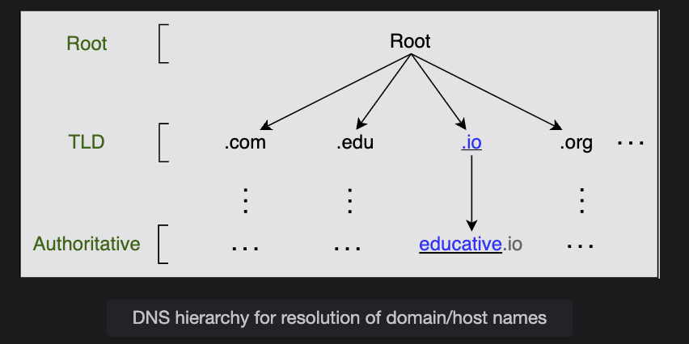
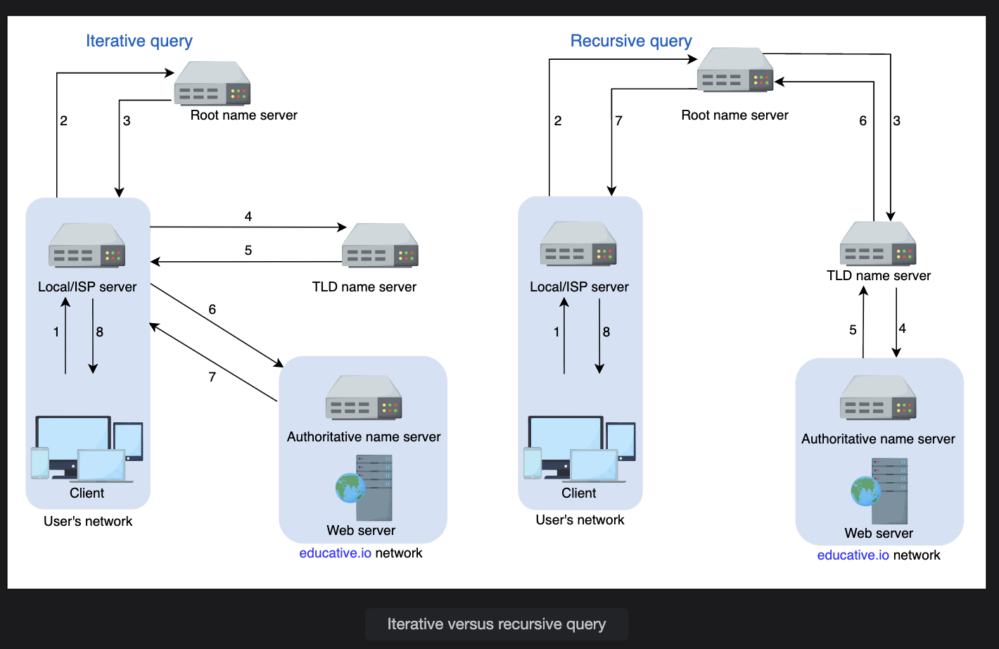
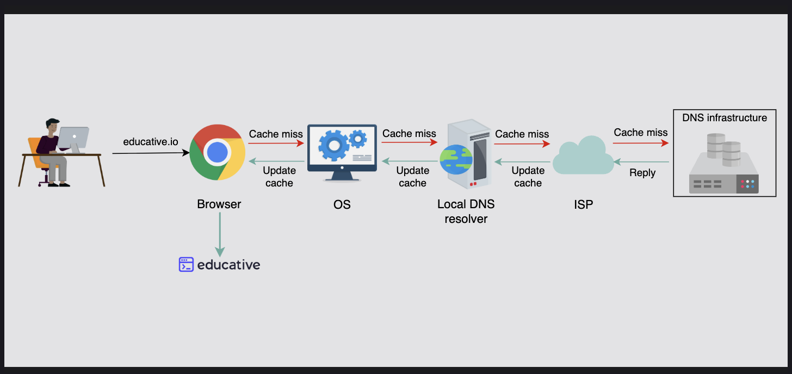
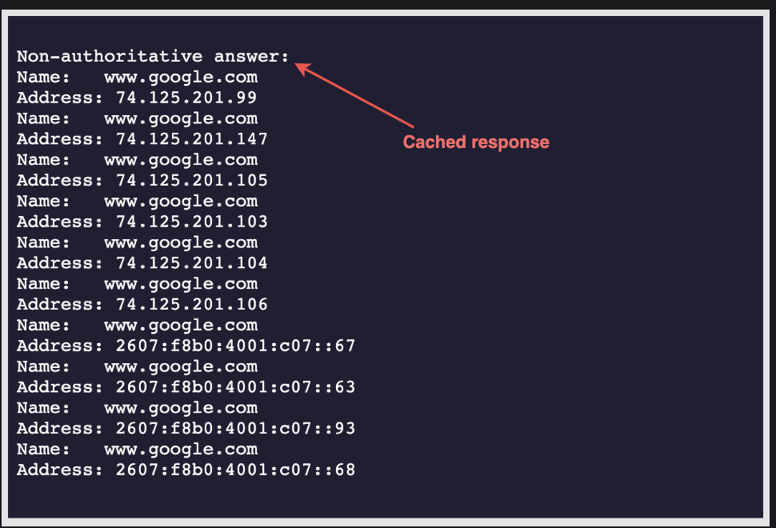

# How the Domain Name System Works

Understand the detailed working of the Domain Name System (DNS).

Through this lesson, we’ll answer the following questions:

- How is the DNS hierarchy formed using various types of DNS name servers?
- How is caching performed at different levels of the Internet to reduce the querying burden over the DNS infrastructure?
- How does the distributed nature of the DNS infrastructure help its robustness?

---

## DNS Hierarchy

As stated before, the DNS isn’t a single server that accepts requests and responds to user queries.  
It’s a complete infrastructure with name servers at different hierarchies.

There are mainly four types of servers in the DNS hierarchy:

### 1. DNS Resolver
- Resolvers initiate the querying sequence and forward requests to the other DNS name servers.  
- Typically, DNS resolvers lie within the premise of the user’s network.  
- However, DNS resolvers can also cater to users’ DNS queries through **caching techniques**, as we will see shortly.  
- These servers can also be called **local** or **default servers**.  

### 2. Root-Level Name Servers
- These servers receive requests from local servers.  
- Root name servers maintain name servers based on top-level domain names, such as `.com`, `.edu`, `.us`, and so on.  
- Example: When a user requests the IP address of `educative.io`, root-level name servers will return a list of **TLD servers** that hold the IP addresses of the `.io` domain.  

### 3. Top-Level Domain (TLD) Name Servers
- These servers hold the IP addresses of authoritative name servers.  
- The querying party will get a list of IP addresses that belong to the authoritative servers of the organization.  

### 4. Authoritative Name Servers
- These are the organization’s own DNS name servers.  
- They provide the actual IP addresses of the **web servers** or **application servers**.  

**Question:** 
How are DNS names processed? For example, will educative.io be processed from left to right or right to left?

**Ans**
Unlike UNIX files, which are processed from left to right, DNS names are processed from right to left. In the case of educative.io, the resolvers will first resolve the .io part, then educative, and so on.

Visually, however, the DNS hierarchy can be viewed as a tree.   

# Iterative versus Recursive Query Resolution

There are two ways to perform a DNS query:

---

## 1. Iterative Query
- The **local server** (e.g., ISP’s DNS resolver) requests the **root**, **TLD**, and the **authoritative servers** for the IP address.  
- At each step, the server queried responds with the best information it has (either the final IP address or a referral to another server).  
- The local server keeps iterating through this chain until it finds the answer.  

---

## 2. Recursive Query
- The **end user** requests the **local server** (resolver).  
- The local server then takes full responsibility to get the answer.  
- It contacts the **root DNS name servers**, which forward the request to **TLD servers**, and eventually to **authoritative servers**.  
- Finally, the local server responds back to the user with the resolved IP address.  

---

### Illustration
- **Iterative (from the perspective of the local/ISP server):** The resolver queries each server step by step until it reaches the authoritative server.  
- **Recursive (from the perspective of the end user):** The resolver does all the heavy lifting and only returns the final IP address to the client.  

  

> **💡 Note:**  
> - Typically, an **iterative query** is preferred to reduce query load on the DNS infrastructure.  
>
> **Tips:**  
> - Many third-party public DNS resolvers are available today (e.g., **Google DNS**, **Cloudflare DNS**, **OpenDNS**, etc.).  
> - These public DNS servers may often provide **quicker responses** compared to the local ISP DNS facilities.  

# Caching

Caching refers to the temporary storage of frequently requested **resource records (RRs)**.  
A record is a data unit within the DNS database that shows a **name-to-value binding**.  

### Benefits of Caching:
- Reduces response time for the user  
- Decreases network traffic  
- Lowers the querying burden on the DNS infrastructure  

### Where Caching Can Happen:
- In the **browser**  
- In the **operating system**  
- At the **local name server** within the user’s network  
- At the **ISP’s DNS resolvers**  

---

  

# Note on Caching

> **Note:** Even if there is no cache available to resolve a user’s query and it’s imperative to visit the DNS infrastructure, caching can still be beneficial.  
> The local server or ISP DNS resolver can cache the IP addresses of **TLD servers** or **authoritative servers** and avoid requesting the root-level server.

---

## Question

**Why does DNS sacrifice strong consistency to achieve high performance and scalability?**

*(Think about the trade-off: DNS prioritizes speed and fault tolerance over always having the freshest data.)*

# DNS as a Distributed System

Although the DNS hierarchy facilitates the distributed Internet that we know today, it’s a distributed system itself.  
The distributed nature of DNS has the following advantages:

- It avoids becoming a **single point of failure (SPOF)**.  
- It achieves **low query latency** so users can get responses from nearby servers.  
- It provides **flexibility during maintenance and updates or upgrades**. For example, if one DNS server is down or overburdened, another DNS server can respond to user queries.  

There are **13 logical root name servers** (named letter A through M) with many instances spread throughout the globe.  
These servers are managed by **12 different organizations**.

---

## Scalability, Reliability, and Consistency in DNS

### Highly Scalable
- Due to its hierarchical nature, DNS is a **highly scalable system**.  
- Roughly **1,000 replicated instances** of the 13 root-level servers are spread strategically around the world to handle user queries.  
- The work is divided among **TLD servers, root servers, and authoritative servers**, allowing scalability and manageability.  
- Different services handle different portions of the DNS tree, ensuring efficient query resolution.

---

### Reliable

Three main factors make DNS a **reliable system**:

1. **Caching**  
   - Caching happens in the **browser**, the **operating system**, the **local name server**, and the **ISP DNS resolvers**.  
   - Even if some DNS servers are temporarily down, cached records can serve user queries.  

2. **Server Replication**  
   - DNS maintains replicated copies of each logical server across the globe.  
   - Redundant servers ensure **low latency** and improved reliability.  

3. **Protocol (UDP vs TCP)**  
   - DNS primarily uses **UDP**, which, although unreliable, is much **faster** than TCP.  
   - The internet has become more reliable, making UDP sufficient for DNS queries.  
   - If a UDP request fails, queries are retransmitted, ensuring eventual resolution.  
   - Using UDP avoids the **three-way handshake overhead** of TCP, resulting in shorter delays.

**Question**
What happens if a network is congested? Should DNS continue using UDP?

**Ans**
Typically, DNS uses UDP. However, DNS can use TCP when its message size exceeds the original packet size of 512 Bytes. This is because large-size packets are more prone to be damaged in congested networks. DNS uses TCP for zone transfers.

Some clients prefer TCP over UDP for better security, typically using protocols like DNS over HTTPS (DoH) or DNS over TLS (DoT) to ensure privacy.   

# Consistency in DNS

DNS uses various protocols to **update and transfer information** among replicated servers in its hierarchy.  

- DNS **sacrifices strong consistency** to achieve **high performance** because:  
  - Data is **read frequently** from DNS databases.  
  - Data is **rarely written/updated** compared to reads.  

Instead of strong consistency, DNS provides **eventual consistency**:  
- Updates to records on replicated servers are done **lazily**.  
- Propagation time can range from **a few seconds to up to three days**, depending on:  
  - The DNS infrastructure.  
  - The size of the update.  
  - Which part of the DNS tree is being updated.  

---

## Caching and Consistency

Caching can also lead to **consistency issues**:  
- Authoritative servers (inside organizations) may update resource records due to failures or changes.  
- Cached records at **default/local servers** or **ISP servers** might still hold **outdated data**.  

### Time-to-Live (TTL)  
- To mitigate inconsistency, every cached record has an **expiration time** called **TTL** (Time-to-Live).  
- Once TTL expires, the resolver must fetch a **fresh copy** of the record from authoritative servers.  

**Question**
 Should the TTL be large or small to maintain the high availability of a web service that relies on DNS?

**Ans**
To maintain high availability, the TTL value should be small. This is because if any server or cluster fails, the organization can update the resource records right away. Users will experience non-availability only for the time the TTL isn’t expired. However, if the TTL is large, the organization will update its resource records, whereas users will keep pinging the outdated server that would have crashed long ago. Companies that long for high availability maintain a TTL value as low as 120 seconds. Therefore, even in case of a failure, the maximum downtime is a few minutes.  

## Test it out
Let’s run a couple of commands. Click on the terminal to execute the following commands. Copy the following commands in the terminal to run them. Study the output of the commands:

   1. nslookup www.google.com

   2. dig www.google.com  

    

# Understanding DNS Query Responses

## The `nslookup` Output
- **Non-authoritative answer**:  
  - This response is from a server **that is not the authoritative server** of Google.  
  - It isn’t listed among Google’s official authoritative name servers.  
  - Instead, the response comes from other servers such as:  
    - University/office DNS resolvers.  
    - ISP name servers.  
    - ISP’s upstream (ISP’s ISP) servers.  
  - In short, this is a **cached version** of the authoritative nameserver’s response.  

- If we run the same command multiple times:  
  - We get the **same IP addresses list** but in a **different order each time**.  
  - This happens because DNS performs **indirect load balancing**.  
  - We’ll explore DNS load balancing in more detail in later lessons.  

---

## The `dig` Output
- **Query time: 4 msec** → Time taken to get a response from the DNS server.  
  - This value may differ due to network conditions, congestion, or cache hits.  

- **300 value in the ANSWER SECTION**:  
  - Represents the **TTL (Time-to-Live)** for the cached record.  
  - Example: `300 seconds = 5 minutes`.  
  - This means Google’s authoritative DNS server (ADNS) allows caching of the record for **5 minutes** before refresh.  

**Note:** Try testing different services using `dig` or `nslookup` to observe their **TTL** values and **query times**.

---

## The Chicken-and-Egg Problem of DNS
**Question:** If we need DNS to tell us which IP to reach a website, how do we know the DNS resolver’s IP address in the first place?  

**Answer:**  
- End users’ operating systems already have DNS resolver IPs configured:  
  - Example: `/etc/resolv.conf` in Linux.  
  - Usually provided automatically by **DHCP** along with other network settings.  
- DNS resolvers run **special software** to resolve queries (commonly **BIND – Berkeley Internet Name Domain**).  
- Root server IP addresses are **pre-seeded** into the software (these IPs rarely change).  
- The **InterNIC** maintains the updated list of **13 logical root servers**.  

✅ This setup **breaks the chicken-and-egg problem** by ensuring that resolvers always have a starting point (the root servers) to begin resolution.

# DNS Caching and the Risk of Stale Data

## Problem
DNS caching significantly improves performance by reducing query latency and lowering the load on DNS servers.  

However, caching also introduces the risk of **stale data**:  
- Example: An organization updates its website’s IP address.  
- Many users may still be directed to the **old IP** because their local DNS resolvers, browsers, or operating systems have cached the outdated record.  

This can lead to **downtime or misdirected traffic** until caches are refreshed.

---

## Strategy to Minimize Disruption

1. **Use Low Time-To-Live (TTL) Values Before Planned Changes**  
   - Lower the TTL value of DNS records (e.g., from 24 hours → 5 minutes) a few days before updating the IP.  
   - This ensures caches expire quickly, and users receive updated records sooner.  

2. **Graceful Transition (Dual Hosting)**  
   - Keep the **old server running temporarily** alongside the new one.  
   - This ensures users hitting the old cached IP are still served correctly until caches expire.  

3. **DNS Propagation Monitoring**  
   - Use tools to check if DNS changes have propagated across global resolvers.  
   - Helps detect regions still serving the old IP.  

4. **Communicate With Stakeholders**  
   - Inform users or customers ahead of time if critical services may experience temporary disruption.  

---

## Example Timeline
- **T - 72 hours**: Lower TTL values.  
- **T = 0**: Update the DNS record to point to the new IP.  
- **T + few hours**: Monitor traffic to both old and new IPs.  
- **T + TTL expiry**: Retire the old server once most caches have updated.  

---

## Key Takeaway
DNS caching is essential for **performance and scalability**, but careful **TTL management** and **transition planning** are crucial to avoid downtime when IP addresses change.

