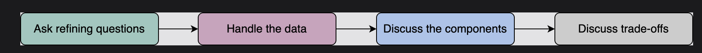

## Strategize, then divide and conquer
 We recommend including the following activities somewhere in the interview:

We should ensure that we’re solving the right problem. Often, it helps to divide the requirements into two groups:   
  - Requirements that the clients need directly—for example, the ability to send messages in near real-time to friends.
  - Requirements that are needed indirectly—for example, messaging service performance shouldn’t degrade with increasing user load.  
Note: Professionals call these functional and nonfunctional requirements.

### Handle data
We need to identify and understand data and its characteristics in order to look for appropriate data storage systems and data processing components for the system design.

Some important questions to ask ourselves when searching for the right systems and components include the following:

- What’s the size of the data right now?  
- At what rate is the data expected to grow over time?  
- How will the data be consumed by other subsystems or end users?  
- Is the data read-heavy or write-heavy?  
- Do we need strict consistency of data, or will eventual consistency work?  
- What’s the durability target of the data?  
- What privacy and regulatory requirements do we require for storing or transmitting user data?  

### Discuss trade-offs
Remember that there’s no one correct answer to a design problem. If we give the same problem to two different groups, they might come up with different designs.

These are some of the reasons why such diversity exists in design solutions:

- Different components have different pros and cons. We’ll need to carefully weigh what works for us.
- Different choices have different costs in terms of money and technical complexity. We need to efficiently utilize our resources.
- Every design has its weaknesses. As designers, we should be aware of all of them, and we should have a follow-up plan to tackle them.

### What not to do in an interview#
Here are a few things that we should avoid doing in a system design interview:

- Don’t write code in a system design interview.
- Don’t start building without a plan.
- Don’t work in silence.
- Don’t describe numbers without reason. We have to frame it.
- If we don’t know something, we don’t paper over it, and we don’t pretend to know it.