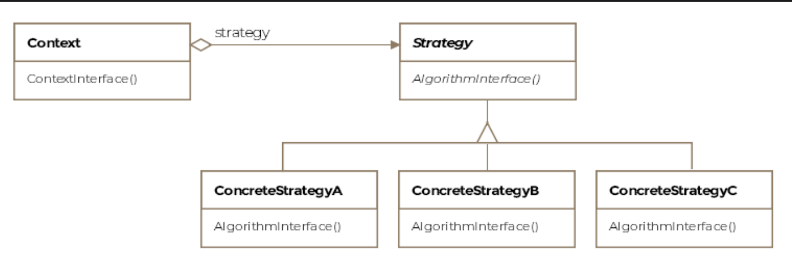

# Strategy Pattern

> *Encapsulate a family of algorithms under a common interface, making them interchangeable — so the client can switch algorithms without modification.*

The Strategy is a **Behavioral** design pattern and one of the most widely used in practice. It solves a common problem elegantly: when you have multiple ways to do something and need to choose between them — at configuration time, at runtime, or both — without cluttering the client with conditional logic.

---

## What Is It?

Imagine a navigation app that can route you via the fastest path, the shortest path, or avoiding tolls. All three are "routing algorithms" — they take the same input (start, destination) and produce the same kind of output (a route). The Strategy pattern groups these related algorithms under a common interface, lets the client pick one, and makes swapping between them seamless.

> **Formal definition:** Encapsulate algorithms belonging to the same family and make them interchangeable. Consumers of the common interface can switch one algorithm for another seamlessly.

Without the Strategy pattern:
```java
// BAD — client littered with conditionals
if (sortType.equals("bubble")) { /* bubble sort logic */ }
else if (sortType.equals("merge")) { /* merge sort logic */ }
else if (sortType.equals("quick")) { /* quick sort logic */ }
// Adding a new algorithm means modifying this client
```

With Strategy:
```java
// GOOD — new algorithm = new class, client unchanged
context.setStrategy(new QuickSort());
context.sort(numbers);
```

---

## Class Diagram

```
  ┌──────────────────────────────────────┐
  │             Context                  │
  │──────────────────────────────────────│
  │ - strategy: ISort                    │ ◄── holds a strategy reference
  │──────────────────────────────────────│
  │ + Context(ISort strategy)            │
  │ + setStrategy(ISort strategy)        │ ← swap at runtime
  │ + sort(int[] numbers): void          │ ← delegates to strategy
  └──────────────────────────────────────┘
                    │ delegates to
                    ▼
  ┌──────────────────────────────────────┐
  │          «interface»                 │
  │             ISort                    │  ← Strategy
  │──────────────────────────────────────│
  │ + sort(int[] input): void            │
  └──────────────────────────────────────┘
                    ▲
       ┌────────────┼───────────────┐
       │            │               │
 ┌──────────┐  ┌──────────┐  ┌──────────┐
 │ BubbleSort│  │MergeSort │  │QuickSort │  ← Concrete Strategies
 │──────────│  │──────────│  │──────────│
 │ sort()   │  │ sort()   │  │ sort()   │
 │ O(n²)    │  │ O(n logn)│  │ O(n logn)│
 └──────────┘  └──────────┘  └──────────┘
```

The pattern consists of three key entities:

| Entity | Role |
|---|---|
| **Strategy** | Common interface for all algorithm variants |
| **Concrete Strategy** | A specific algorithm implementation |
| **Context** | Holds a reference to a strategy; delegates the work to it; can swap strategies at runtime |

---

## Example 1: Sorting Algorithms

### The Strategy Interface

```java
public interface ISort {
    void sort(int[] input);
}
```

### Concrete Strategies

```java
public class BubbleSort implements ISort {
    @Override
    public void sort(int[] input) {
        System.out.println("BubbleSort: O(n²) — good for small arrays.");
        // nested loop comparison and swap
    }
}

public class MergeSort implements ISort {
    @Override
    public void sort(int[] input) {
        System.out.println("MergeSort: O(n log n) — efficient for large arrays.");
        // divide, sort halves, merge
    }
}

public class QuickSort implements ISort {
    @Override
    public void sort(int[] input) {
        System.out.println("QuickSort: O(n log n) avg — fastest in practice.");
        // partition around pivot, recurse
    }
}
```

### The Context

```java
public class SortContext {

    private ISort strategy;  // the current algorithm

    // Constructor injection — provide a strategy upfront
    public SortContext(ISort strategy) {
        this.strategy = strategy;
    }

    // Runtime swap — change strategy without recreating the context
    public void setStrategy(ISort strategy) {
        this.strategy = strategy;
    }

    // Delegate — context passes data to strategy
    public void sort(int[] numbers) {
        strategy.sort(numbers);
    }
}
```

### Client Usage

```java
public class Client {

    void crunchingNumbers() {
        int[] numbers = new int[1000];

        // Start with BubbleSort for a small dataset
        SortContext context = new SortContext(new BubbleSort());
        context.sort(numbers);
        // BubbleSort: O(n²) — good for small arrays.

        // Dataset grew — swap to MergeSort at runtime
        context.setStrategy(new MergeSort());
        context.sort(numbers);
        // MergeSort: O(n log n) — efficient for large arrays.

        // Need in-place sort — swap to QuickSort
        context.setStrategy(new QuickSort());
        context.sort(numbers);
        // QuickSort: O(n log n) avg — fastest in practice.
    }
}
```

> **Key insight:** The client never changes its core logic. Adding `TimSort` or `HeapSort` requires only a new class implementing `ISort` — the `Client` and `SortContext` are untouched.

---

## Example 2: F-16 Arming Strategies ✈️💥

Before each mission, an F-16 can be armed differently depending on the mission type:

- **Reconnaissance** — no weapons (stealth priority)
- **Air-to-air combat** — Sidewinder missiles (intercept enemy jets)
- **Strategic strike** — nuclear payload (high-value target)

```java
public interface IArmingStrategy {
    void arm();
    String getMissionType();
}

public class NoWeapons implements IArmingStrategy {
    @Override public void arm() {
        System.out.println("[F16] Recon loadout: no weapons, extra fuel tanks.");
    }
    @Override public String getMissionType() { return "Reconnaissance"; }
}

public class AirToAirWeapons implements IArmingStrategy {
    @Override public void arm() {
        System.out.println("[F16] Air-to-air loadout: 4× Sidewinder AIM-9X missiles.");
    }
    @Override public String getMissionType() { return "Intercept"; }
}

public class NuclearWeapons implements IArmingStrategy {
    @Override public void arm() {
        System.out.println("[F16] Strategic loadout: B61 nuclear gravity bomb.");
    }
    @Override public String getMissionType() { return "Strategic Strike"; }
}
```

```java
public class F16 {

    private IArmingStrategy armingStrategy;

    public F16(IArmingStrategy armingStrategy) {
        this.armingStrategy = armingStrategy;
    }

    // Change mission loadout before takeoff
    public void setArmingStrategy(IArmingStrategy armingStrategy) {
        this.armingStrategy = armingStrategy;
    }

    public void prepareForMission() {
        System.out.println("Mission type: " + armingStrategy.getMissionType());
        armingStrategy.arm();
    }
}
```

```java
public class MissionControl {

    public void main() {
        F16 f16 = new F16(new NoWeapons());
        f16.prepareForMission();
        // Mission type: Reconnaissance
        // [F16] Recon loadout: no weapons, extra fuel tanks.

        // New orders — intercept mission
        f16.setArmingStrategy(new AirToAirWeapons());
        f16.prepareForMission();
        // Mission type: Intercept
        // [F16] Air-to-air loadout: 4× Sidewinder AIM-9X missiles.
    }
}
```

---

## Comparison of All Three Sorting Strategies

| Strategy | Time Complexity | Space | Best For |
|---|---|---|---|
| **BubbleSort** | O(n²) | O(1) | Tiny datasets, nearly-sorted data |
| **MergeSort** | O(n log n) | O(n) | Large datasets, stable sort needed |
| **QuickSort** | O(n log n) avg | O(log n) | General purpose, in-place preferred |

The client doesn't need to know these trade-offs in code — it just sets the right strategy for the context.

---

## Passing Data: Two Models

The context can give the strategy what it needs in two ways:

### Model 1 — Pass Data Directly (our sorting example)

```java
// Strategy receives just the data it needs
public void sort(int[] input) { ... }
```

✅ Simple and decoupled — strategy doesn't know about the context  
❌ Strategy can only work with the data explicitly passed to it

### Model 2 — Pass the Context Itself

```java
// Strategy receives the context and pulls what it needs
public void arm(F16 f16) {
    int payload = f16.getAvailablePayload();  // strategy queries context
    // ... customize based on available payload
}
```

✅ Strategy can access any context data it needs  
❌ Couples the strategy to the context's interface

---

## Real-World Examples

### `java.util.Comparator`

```java
// Comparator IS the strategy interface
Comparator<String> byLength  = (a, b) -> a.length() - b.length();
Comparator<String> byAlpha   = String::compareTo;
Comparator<String> byReverse = Comparator.reverseOrder();

List<String> names = Arrays.asList("Charlie", "Alice", "Bob");

Collections.sort(names, byLength);   // [Bob, Alice, Charlie]
Collections.sort(names, byAlpha);    // [Alice, Bob, Charlie]
Collections.sort(names, byReverse);  // [Charlie, Bob, Alice]
```

`Collections.sort()` is the context. `Comparator` is the strategy interface. Each lambda is a concrete strategy — swapped without touching the sort call.

### Text Editor — Paragraph Alignment

```java
public interface IAlignmentStrategy {
    void align(Paragraph paragraph);
}

public class JustifyAlignment  implements IAlignmentStrategy { ... }
public class LeftAlignment     implements IAlignmentStrategy { ... }
public class RightAlignment    implements IAlignmentStrategy { ... }
public class CenterAlignment   implements IAlignmentStrategy { ... }
```

Microsoft Word switches between these when the user clicks the alignment button — same paragraph, different strategy.

### Payment Processing

```java
public interface IPaymentStrategy {
    void pay(double amount);
}

public class CreditCardPayment implements IPaymentStrategy { ... }
public class PayPalPayment       implements IPaymentStrategy { ... }
public class CryptoPayment       implements IPaymentStrategy { ... }
public class BankTransfer        implements IPaymentStrategy { ... }
```

An e-commerce checkout is the context. The payment method chosen by the user is the strategy — swapped at runtime.

---

## Strategy Strategies as Flyweights

If strategy objects hold no instance-specific state (only behavior), they can be shared as Flyweights:

```java
// Stateless strategies — safe to share as singletons
public class BubbleSort implements ISort {
    public static final BubbleSort INSTANCE = new BubbleSort();
    private BubbleSort() { }

    @Override
    public void sort(int[] input) { /* ... */ }
}

// Client uses shared instance — no new allocation per call
context.setStrategy(BubbleSort.INSTANCE);
```

This is especially beneficial when strategies are frequently swapped and the application creates many context objects.

---

## Strategy vs. Template Method — Final Clarification

| | Strategy | Template Method |
|---|---|---|
| **Mechanism** | Composition — context holds a strategy object | Inheritance — subclass extends abstract class |
| **Scope of variation** | Entire algorithm is swappable | Parts of the algorithm (individual steps) |
| **Client control** | Client selects and injects the strategy | Client uses the subclass; template controls flow |
| **Coupling** | Loose — context only knows the interface | Tighter — subclass coupled to abstract class |
| **Runtime swap** | ✅ Yes — `context.setStrategy(new X())` | ❌ No — determined at compile time by subclass choice |
| **Best for** | Runtime algorithm selection | Fixed workflow with customizable steps |

```java
// Strategy — composition, client swaps entire algorithm
context.setStrategy(new QuickSort());   // runtime decision
context.sort(data);

// Template Method — inheritance, structure is fixed
class F16CheckList extends AbstractCheckList {
    void checkAirPressure() { /* step customized */ }
}
```

---

## Strategy vs. State

Both patterns use composition and an interface — but their intent differs:

| | Strategy | State |
|---|---|---|
| **Who changes the algorithm** | Client — explicitly sets a new strategy | State objects or context — changes automatically |
| **Awareness** | Client knows which strategy is active | Client is unaware of current state |
| **Purpose** | Choose among algorithms | Object behavior changes as state changes |

---

## Caveats & Gotchas

| Caveat | Details |
|---|---|
| **Class proliferation** | Each algorithm needs a class. For a handful of simple algorithms, lambdas or method references may be cleaner than full strategy classes. |
| **Default strategy** | Provide a sensible default strategy in the context constructor — so clients aren't burdened with always providing one. |
| **Strategy-context coupling** | If the strategy needs a lot of data from the context, consider passing the context itself to strategy methods — but be aware this couples strategy to context's API. |
| **Stateless strategies** | Prefer stateless strategies — they're thread-safe by default and can be shared as flyweights. Strategies with state are harder to reason about and can't be shared. |

---

## When to Use the Strategy Pattern

✅ Several related classes differ only in their behavior — strategies let you configure a class with one of many behaviors  
✅ You need different variants of an algorithm that the client should be able to select at runtime  
✅ An algorithm uses data that the client shouldn't need to know about  
✅ A class defines many behaviors that appear as conditional statements — move each branch into its own strategy  
✅ You want to eliminate algorithm-selection conditionals from the client  

❌ Avoid when there are only two or three algorithms that will never grow — a simple conditional may be clearer  
❌ Avoid when the overhead of creating strategy objects is too high and lambdas/method references serve the same purpose  
❌ Avoid when clients don't need to switch between algorithms — a single hardcoded implementation is simpler