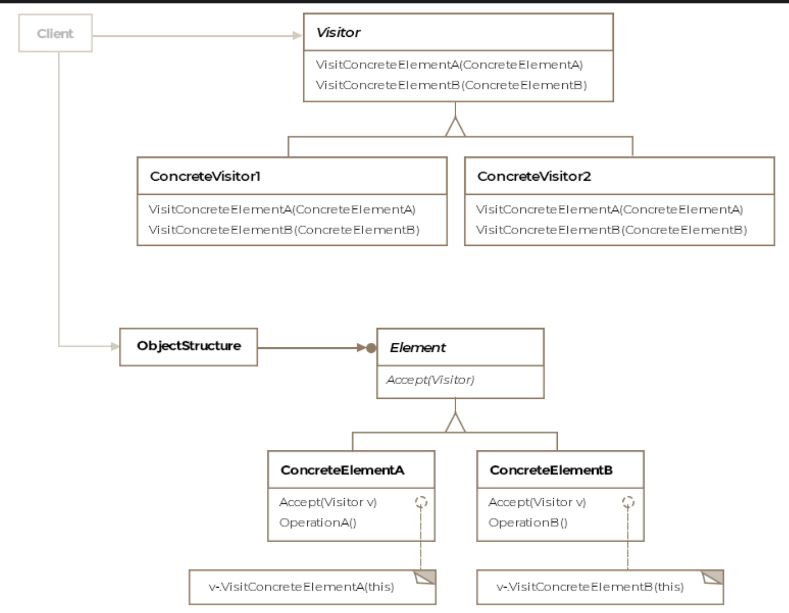

# Visitor Pattern

> *Define new operations on elements of an object structure without changing the classes of those elements.*

The Visitor is the final **Behavioral** design pattern — and the most powerful for adding behavior to complex object structures. It cleanly separates algorithms from the objects they work on, letting you add new operations to a stable class hierarchy without touching those classes.

---

## What Is It?

Imagine you have an `Airforce` object composed of `F16`s, `Boeing747`s, and `CobraGunship`s. You need to:

1. Collect metrics (fuel, altitude, temperature) for each aircraft
2. Calculate the total price tag for the fleet
3. Six months later — generate maintenance schedules

The naive approach: add methods to the aircraft classes for each new operation. This has serious problems:

- Aircraft classes accumulate unrelated methods (metrics, pricing, maintenance...)
- Every new operation requires modifying *every* aircraft class
- Aircraft classes should model aircraft — not business logic about them

The Visitor pattern solves this by creating **separate visitor classes** for each new operation. The aircraft classes gain just one method — `accept(visitor)` — and the visitor does all the work.

> **Formal definition:** Define operations to be performed on elements of an object structure without changing the classes of the elements it works on.

---

## When to Use It

The Visitor pattern is most valuable when:

```
Object structure:    STABLE (classes rarely change)
Operations:          FREQUENTLY ADDED (new requirements keep coming)
```

If the object structure changes often (new element classes added frequently), adding operations directly to the classes may be simpler.

---

## Class Diagram

```
  ┌─────────────────────────────────────────┐
  │            Airforce                     │  ← Object Structure
  │─────────────────────────────────────────│
  │ - planes: Collection<IAircraft>         │
  │─────────────────────────────────────────│
  │ + getIterator(): Iterator<IAircraft>    │
  │ + accept(IAircraftVisitor): void        │
  └─────────────────────────────────────────┘
                    │ contains
                    ▼
  ┌─────────────────────────────────────────┐
  │         «interface» IAircraft           │  ← Element
  │─────────────────────────────────────────│
  │ + accept(IAircraftVisitor): void        │
  └─────────────────────────────────────────┘
                    ▲
        ┌───────────┴────────────┐
        │                        │
  ┌──────────┐             ┌───────────┐
  │   F16    │             │ Boeing747 │  ← Concrete Elements
  │──────────│             │───────────│
  │ accept() │             │ accept()  │
  │→visitor. │             │→visitor.  │
  │visitF16()│             │visitB747()│
  └──────────┘             └───────────┘
        │                        │
        └──────────┬─────────────┘
                   │ calls visit methods on
                   ▼
  ┌─────────────────────────────────────────┐
  │      «interface» IAircraftVisitor       │  ← Visitor
  │─────────────────────────────────────────│
  │ + visitF16(F16): void                   │
  │ + visitBoeing747(Boeing747): void       │
  └─────────────────────────────────────────┘
                    ▲
        ┌───────────┴───────────┐
        │                       │
 ┌──────────────┐      ┌──────────────┐
 │MetricsVisitor│      │ PriceVisitor │  ← Concrete Visitors
 │──────────────│      │──────────────│
 │ visitF16()   │      │ visitF16()   │
 │ visitB747()  │      │ visitB747()  │
 │ printResults()      │ printResults()
 └──────────────┘      └──────────────┘
```


The pattern consists of five key entities:

| Entity | Role |
|---|---|
| **Visitor** | Interface declaring a `visit` method for each concrete element type |
| **Concrete Visitor** | Implements the operation for each element type (e.g. MetricsVisitor, PriceVisitor) |
| **Element** | Interface declaring `accept(visitor)` — the gateway for visitors |
| **Concrete Element** | Implements `accept()` by calling the right `visit` method on the visitor |
| **Object Structure** | The collection (e.g. Airforce) that holds elements and can be iterated |

---

## Example: NATO Airforce Fleet ✈️

### Step 1 — The Object Structure

```java
public class Airforce {

    private Collection<IAircraft> planes = new ArrayList<>();

    public Airforce() {
        planes.add(new F16());
        planes.add(new F16());
        planes.add(new Boeing747());
    }

    public Iterator<IAircraft> getIterator() {
        return planes.iterator();
    }

    // Convenience method — apply a visitor to all planes in one call
    public void accept(IAircraftVisitor visitor) {
        Iterator<IAircraft> it = getIterator();
        while (it.hasNext()) {
            it.next().accept(visitor);
        }
    }
}
```

### Step 2 — The Element Interface

```java
public interface IAircraft {
    // The single gateway for all visitors
    void accept(IAircraftVisitor visitor);
}
```

### Step 3 — Concrete Elements

```java
public class F16 implements IAircraft {

    // F-16 specific data — visitors can access this through public methods
    private double fuelLevel      = 85.0;   // percentage
    private int    altitude       = 35000;  // feet
    private float  engineTemp     = 180.0f; // celsius
    private long   acquisitionCost = 18_000_000L; // USD

    @Override
    public void accept(IAircraftVisitor visitor) {
        visitor.visitF16(this);  // dispatch to the right visitor method
    }

    // Expose state for visitors to work with
    public double getFuelLevel()       { return fuelLevel; }
    public int    getAltitude()        { return altitude; }
    public float  getEngineTemp()      { return engineTemp; }
    public long   getAcquisitionCost() { return acquisitionCost; }
}

public class Boeing747 implements IAircraft {

    private double fuelLevel      = 62.0;
    private int    altitude       = 38000;
    private float  engineTemp     = 210.0f;
    private long   acquisitionCost = 400_000_000L; // USD

    @Override
    public void accept(IAircraftVisitor visitor) {
        visitor.visitBoeing747(this);  // dispatch to the right visitor method
    }

    public double getFuelLevel()       { return fuelLevel; }
    public int    getAltitude()        { return altitude; }
    public float  getEngineTemp()      { return engineTemp; }
    public long   getAcquisitionCost() { return acquisitionCost; }
}
```

### Step 4 — The Visitor Interface

```java
public interface IAircraftVisitor {
    void visitF16(F16 f16);
    void visitBoeing747(Boeing747 boeing747);
    // Add visitC130(C130 c130) here if a new aircraft type is introduced
}
```

### Step 5 — Concrete Visitors

**Metrics Visitor:**

```java
public class MetricsVisitor implements IAircraftVisitor {

    private int    aircraftCount = 0;
    private double totalFuel     = 0;
    private float  maxEngineTemp = 0;

    @Override
    public void visitF16(F16 f16) {
        aircraftCount++;
        totalFuel    += f16.getFuelLevel();
        maxEngineTemp = Math.max(maxEngineTemp, f16.getEngineTemp());

        System.out.printf("[MetricsVisitor] F-16 — Fuel: %.1f%%, Alt: %dft, Temp: %.1f°C%n",
                f16.getFuelLevel(), f16.getAltitude(), f16.getEngineTemp());
    }

    @Override
    public void visitBoeing747(Boeing747 boeing) {
        aircraftCount++;
        totalFuel    += boeing.getFuelLevel();
        maxEngineTemp = Math.max(maxEngineTemp, boeing.getEngineTemp());

        System.out.printf("[MetricsVisitor] B747 — Fuel: %.1f%%, Alt: %dft, Temp: %.1f°C%n",
                boeing.getFuelLevel(), boeing.getAltitude(), boeing.getEngineTemp());
    }

    public void printAccumulatedResults() {
        System.out.println("\n=== Fleet Metrics Summary ===");
        System.out.printf("Total aircraft:    %d%n", aircraftCount);
        System.out.printf("Average fuel:      %.1f%%%n", totalFuel / aircraftCount);
        System.out.printf("Max engine temp:   %.1f°C%n", maxEngineTemp);
    }
}
```

**Price Visitor:**

```java
public class PriceVisitor implements IAircraftVisitor {

    private long totalCost = 0;
    private int  count     = 0;

    @Override
    public void visitF16(F16 f16) {
        long cost = f16.getAcquisitionCost();
        totalCost += cost;
        count++;
        System.out.printf("[PriceVisitor] F-16 unit cost:    $%,d%n", cost);
    }

    @Override
    public void visitBoeing747(Boeing747 boeing) {
        long cost = boeing.getAcquisitionCost();
        totalCost += cost;
        count++;
        System.out.printf("[PriceVisitor] Boeing 747 cost:   $%,d%n", cost);
    }

    public void printAccumulatedResults() {
        System.out.println("\n=== Fleet Pricing Summary ===");
        System.out.printf("Total aircraft:    %d%n", count);
        System.out.printf("Total fleet cost:  $%,d%n", totalCost);
        System.out.printf("Average per unit:  $%,d%n", totalCost / count);
    }
}
```

### Step 6 — Client Usage

```java
public class Client {

    public void main() {

        Airforce airforce = new Airforce();

        // Operation 1: Collect metrics
        MetricsVisitor metrics = new MetricsVisitor();
        airforce.accept(metrics);
        metrics.printAccumulatedResults();

        System.out.println();

        // Operation 2: Calculate pricing
        PriceVisitor pricing = new PriceVisitor();
        airforce.accept(pricing);
        pricing.printAccumulatedResults();

        // Operation 3 (future): Add MaintenanceVisitor — zero changes to aircraft classes
    }
}
```

**Output:**
```
[MetricsVisitor] F-16  — Fuel: 85.0%, Alt: 35000ft, Temp: 180.0°C
[MetricsVisitor] F-16  — Fuel: 85.0%, Alt: 35000ft, Temp: 180.0°C
[MetricsVisitor] B747  — Fuel: 62.0%, Alt: 38000ft, Temp: 210.0°C

=== Fleet Metrics Summary ===
Total aircraft:    3
Average fuel:      77.3%
Max engine temp:   210.0°C

[PriceVisitor] F-16 unit cost:    $18,000,000
[PriceVisitor] F-16 unit cost:    $18,000,000
[PriceVisitor] Boeing 747 cost:   $400,000,000

=== Fleet Pricing Summary ===
Total aircraft:    3
Total fleet cost:  $436,000,000
Average per unit:  $145,333,333
```

---

## Double Dispatch — The Key Mechanism

The Visitor pattern simulates **double dispatch** in Java. Understanding why this is necessary requires understanding how Java dispatches method calls.

### Single Dispatch — How Java Normally Works

Java selects which method to call based on the **runtime type of the object the method is called on**:

```java
F16 f16 = new BetterF16();
f16.whoAmI();  // calls BetterF16.whoAmI() — runtime type determines dispatch ✅
```

This is **single** dispatch — one type (the receiver) determines the method.

### The Problem: Overloading Fails at Runtime

Java resolves **overloaded methods** based on the **compile-time type of arguments** — not runtime type:

```java
Missile betterMissile = new BetterMissile();  // reference type: Missile

f16.fireMissile(betterMissile);
// Calls fireMissile(Missile) — NOT fireMissile(BetterMissile)!
// Java uses the declared type of the argument (Missile), not the actual type (BetterMissile)
```

This is the **failed double dispatch** problem. Java only dispatches on one type — the receiver.

### How Visitor Simulates Double Dispatch

The `accept()` pattern adds a **second dynamic dispatch** via the `this` keyword:

```
Dispatch 1: aircraft.accept(visitor)
  → Java dispatches on aircraft's runtime type
  → If aircraft is F16 → F16.accept() is called ✅
  → If aircraft is Boeing747 → Boeing747.accept() is called ✅

Inside F16.accept(visitor):
  visitor.visitF16(this);   ← 'this' is the concrete F16 object

Dispatch 2: visitor.visitF16(this)
  → Java dispatches on visitor's runtime type
  → If visitor is MetricsVisitor → MetricsVisitor.visitF16() ✅
  → If visitor is PriceVisitor   → PriceVisitor.visitF16()   ✅
```

Result: the exact right combination of `[aircraft type] × [visitor type]` is always called — achieved through **two** dynamic dispatches chained together.

```
                    Aircraft type
                 F16          Boeing747
              ┌──────────────┬──────────────┐
Visitor  Metrics│ visitF16() │visitBoeing() │
  Type         ├──────────────┼──────────────┤
         Price │ visitF16() │visitBoeing() │
              └──────────────┴──────────────┘
Every cell is uniquely dispatched — correct method always called
```

---

## Adding a New Operation — Zero Aircraft Changes

```java
// New requirement: generate maintenance schedules
// Just add a new visitor — F16 and Boeing747 are UNTOUCHED

public class MaintenanceVisitor implements IAircraftVisitor {

    @Override
    public void visitF16(F16 f16) {
        System.out.println("[Maintenance] F-16 service due in 47 flight hours.");
        if (f16.getEngineTemp() > 200.0f) {
            System.out.println("[Maintenance] ⚠ Engine temperature high — priority inspection.");
        }
    }

    @Override
    public void visitBoeing747(Boeing747 boeing) {
        System.out.println("[Maintenance] B747 cabin pressure check scheduled.");
    }
}

// Client
MaintenanceVisitor maintenance = new MaintenanceVisitor();
airforce.accept(maintenance);
```

New operation → new class. Aircraft classes unchanged. Client unchanged.

---

## Adding a New Aircraft Type — The Trade-Off

The downside of Visitor is symmetric: adding a **new element class** (e.g. `CobraGunship`) requires updating **every visitor**:

```java
// IAircraftVisitor must add a new method
void visitCobraGunship(CobraGunship gunship);

// Every concrete visitor must implement it:
// MetricsVisitor   → add visitCobraGunship()
// PriceVisitor     → add visitCobraGunship()
// MaintenanceVisitor → add visitCobraGunship()
```

This is the fundamental trade-off of the Visitor pattern:

| Change Type | Without Visitor | With Visitor |
|---|---|---|
| **New operation** | Touch every element class | Add one new visitor class ✅ |
| **New element type** | Add method to one class | Touch every visitor class ❌ |

**Choose Visitor when:** Element classes are stable, operations grow frequently.  
**Avoid Visitor when:** Element classes change frequently.

---

## Real-World Examples

### `java.nio.file.FileVisitor`

```java
// Walk an entire file tree — the Visitor visits each file and directory
Files.walkFileTree(startPath, new SimpleFileVisitor<Path>() {

    @Override
    public FileVisitResult visitFile(Path file, BasicFileAttributes attrs) {
        System.out.println("Visiting: " + file);
        return FileVisitResult.CONTINUE;
    }

    @Override
    public FileVisitResult visitFileFailed(Path file, IOException exc) {
        System.err.println("Failed: " + file);
        return FileVisitResult.CONTINUE;
    }
});
```

The file tree is the object structure. `FileVisitor` is the visitor interface. `SimpleFileVisitor` is the concrete visitor base. `Files.walkFileTree` drives the traversal.

### `javax.lang.model.element.ElementVisitor`

Java's annotation processing API uses Visitor to process different program elements (packages, classes, methods, fields) — the element hierarchy is stable; the operations vary by annotation processor.

### Compiler AST Operations

In compilers, the Abstract Syntax Tree (AST) nodes are the elements. Operations (type checking, optimization, code generation) are visitors:

```
AST (stable)           Operations (grow over time)
────────────           ──────────────────────────
BinaryExprNode ──────► TypeCheckVisitor
IfStatementNode         OptimizeVisitor
MethodCallNode          CodeGenVisitor
VariableDeclNode        PrettyPrintVisitor
```

---

## Visitor vs. Related Patterns

| Pattern | Relationship |
|---|---|
| **Composite** | Visitor is commonly used with Composite — the Composite is the object structure, Visitor defines operations over it |
| **Iterator** | Iterator traverses the structure; Visitor performs the operation at each node. Used together: Iterator drives traversal, Visitor performs work |
| **Strategy** | Both separate algorithm from context; Strategy lets the client swap a single algorithm; Visitor defines N algorithms (one per element type) |
| **Interpreter** | The `interpret()` method in Interpreter can be moved into a Visitor, separating grammar classes from interpretation logic |

---

## Caveats & Gotchas

| Caveat | Details |
|---|---|
| **New element = update all visitors** | The biggest downside — adding a new concrete element requires touching every visitor class. If element classes are unstable, the pattern causes more pain than benefit. |
| **Breaks encapsulation** | Visitors need access to the element's internal state. Elements must expose enough public interface for visitors to work, which may expose more than desired. |
| **Double dispatch complexity** | The `accept()`/`visit()` mechanism is non-obvious to developers unfamiliar with the pattern — document it clearly. |
| **Languages with multiple dispatch** | In languages like Julia, Dylan, or CLOS that natively support multiple dispatch, the Visitor pattern is unnecessary — the language handles it directly. |
| **Traversal options** | Iteration can be done by the client (as in our example), inside the object structure (`Airforce.accept()`), or by the visitor itself. Choose based on how much the traversal strategy needs to vary. |

---

## When to Use the Visitor Pattern

✅ The object structure is stable but you need to add new operations frequently  
✅ You want to keep related operations together in a single class rather than scattered across element classes  
✅ The object structure contains many unrelated element types that need different operations  
✅ You need to accumulate state across element visits (as our MetricsVisitor and PriceVisitor do)  
✅ You're processing a Composite or AST with many node types and many possible operations  

❌ Avoid when element classes change frequently — every addition requires updating all visitors  
❌ Avoid when elements have small, closed hierarchies — direct polymorphism is simpler  
❌ Avoid when operations need access to private state that elements can't reasonably expose