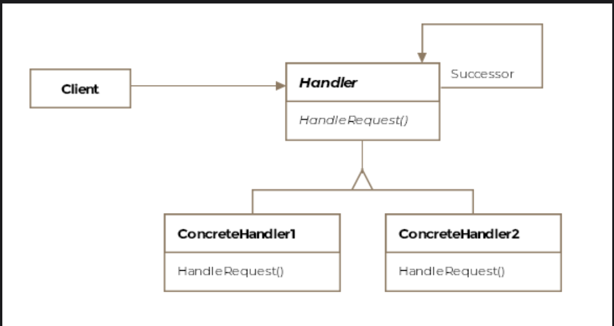

# Chain of Responsibility Pattern

> *Decouple the sender of a request from its receiver by chaining handler objects together and passing the request along the chain until one handles it.*

The Chain of Responsibility is a **Behavioral** design pattern — the first of the behavioral family. Where Structural patterns deal with how objects are composed, Behavioral patterns deal with how objects communicate and delegate responsibility among themselves.

---

## What Is It?

In many systems, a request needs to be handled — but the sender doesn't know which object is best suited to handle it, and multiple objects may be capable of handling it. Rather than hardwiring the sender to a specific receiver, the Chain of Responsibility pattern lets the request travel through a sequence of handler objects until one of them takes ownership.

Think of it like escalating a customer support ticket: it starts with a front-line agent, passes to a specialist if needed, then to a manager, and so on — each handler either resolves it or passes it up the chain.

Key properties:
- The **sender** has no reference to any specific handler — it just sends the request into the chain
- The **receiver** that ultimately handles the request has no knowledge of the sender
- Handler objects can be **added, removed, or reordered at runtime**
- A request may be handled by **one handler, multiple handlers, or none**

> **Formal definition:** Decouple the sender of a request from its receiver by chaining the receiving objects together and passing the request along the chain until an object handles it.

---

## Class Diagram

```
  ┌──────────┐     sends request     ┌──────────────────────────┐
  │  Client  │──────────────────────►│    «abstract»            │
  └──────────┘                       │    AbstractHandler       │  ← Handler
                                     │──────────────────────────│
                                     │ - next: AbstractHandler  │ ← successor reference
                                     │──────────────────────────│
                                     │ + handleRequest(req)     │
                                     │ + setNext(handler)       │
                                     └──────────────────────────┘
                                                  ▲
                               ┌──────────────────┴──────────────────┐
                               │                                     │
                    ┌──────────────────┐                 ┌──────────────────┐
                    │   FireHandler    │                 │ LowFuelHandler   │
                    │──────────────────│                 │──────────────────│
                    │ handles code: 1  │                 │ handles code: 2  │
                    │ else → forward   │                 │ else → forward   │
                    └──────────────────┘                 └──────────────────┘

  Chain:  FireHandler ──► LowFuelHandler ──► null
                 ↑
          request enters here
```


The pattern consists of three key entities:

| Entity | Role |
|---|---|
| **Handler** | Abstract class/interface defining `handleRequest()` and a reference to the next handler |
| **Concrete Handler** | Handles requests it's responsible for; forwards others to successor |
| **Client** | Initiates the request; only knows the first handler in the chain |

---

## Example: Aircraft Cockpit Emergency System ✈️🚨

An aircraft's cockpit computer receives error codes from hardware sensors. Depending on the error code, different corrective systems need to respond. The order in which systems attempt to handle the error matters — and the list of handlers may change as the aircraft's software is updated.

### The Chain in Action

```
Hardware sends: LowFuelRequest (code=2)
       │
       ▼
FireHandler (handles code 1)
  → "This isn't code 1, not my job" → forwards to next
       │
       ▼
LowFuelHandler (handles code 2)
  → "Code 2! I've got this." → handles request ✅
```

---

### Step 1 — Abstract Request

```java
public abstract class AbstractRequest {

    // Each request type is identified by a unique integer code
    // FireRequest    → code 1
    // LowFuelRequest → code 2
    private int requestCode;

    public AbstractRequest(int requestCode) {
        this.requestCode = requestCode;
    }

    public int getRequestCode() {
        return requestCode;
    }
}
```

### Step 2 — Abstract Handler

```java
public abstract class AbstractHandler {

    private AbstractHandler next;  // reference to next handler in chain

    public AbstractHandler(AbstractHandler next) {
        this.next = next;
    }

    public void setNext(AbstractHandler next) {
        this.next = next;
    }

    public void handleRequest(AbstractRequest request) {
        // Default behavior: forward to next handler if one exists
        if (next != null) {
            next.handleRequest(request);
        }
        // If next is null, request falls off the chain unhandled
    }
}
```

### Step 3 — Concrete Requests

```java
public class FireDetectedRequest extends AbstractRequest {
    public FireDetectedRequest() {
        super(1);  // fire = code 1
    }
}

public class LowFuelRequest extends AbstractRequest {
    public LowFuelRequest() {
        super(2);  // low fuel = code 2
    }
}
```

### Step 4 — Concrete Handlers

```java
public class FireHandler extends AbstractHandler {

    private static final int FIRE_CODE = 1;

    public FireHandler(AbstractHandler successor) {
        super(successor);
    }

    @Override
    public void handleRequest(AbstractRequest request) {
        if (request.getRequestCode() == FIRE_CODE) {
            System.out.println("[FireHandler] Fire detected! Activating suppression system.");
            // Handle fire: deploy extinguishers, alert crew, etc.
        } else {
            System.out.println("[FireHandler] Not a fire request. Forwarding...");
            super.handleRequest(request);  // pass to next handler
        }
    }
}

public class LowFuelHandler extends AbstractHandler {

    private static final int LOW_FUEL_CODE = 2;

    public LowFuelHandler(AbstractHandler successor) {
        super(successor);
    }

    @Override
    public void handleRequest(AbstractRequest request) {
        if (request.getRequestCode() == LOW_FUEL_CODE) {
            System.out.println("[LowFuelHandler] Low fuel! Alerting pilot and rerouting.");
            // Handle low fuel: alert crew, find nearest airport, etc.
        } else {
            System.out.println("[LowFuelHandler] Not a fuel request. Forwarding...");
            super.handleRequest(request);
        }
    }
}
```

### Step 5 — Client: Building and Using the Chain

```java
public class Client {

    public void main() {

        // Build the chain: FireHandler → LowFuelHandler → null (end of chain)
        AbstractHandler lowFuelHandler = new LowFuelHandler(null);
        AbstractHandler fireHandler    = new FireHandler(lowFuelHandler);

        // Send a low fuel emergency into the chain
        AbstractRequest lowFuelRequest = new LowFuelRequest();
        fireHandler.handleRequest(lowFuelRequest);
        // Output:
        // [FireHandler] Not a fire request. Forwarding...
        // [LowFuelHandler] Low fuel! Alerting pilot and rerouting.

        System.out.println("---");

        // Send a fire emergency into the same chain
        AbstractRequest fireRequest = new FireDetectedRequest();
        fireHandler.handleRequest(fireRequest);
        // Output:
        // [FireHandler] Fire detected! Activating suppression system.
    }
}
```

> **Key insight:** The client always sends requests to `fireHandler` — the head of the chain. It has zero knowledge of `LowFuelHandler` or how many handlers exist. Swap, add, or remove handlers without touching client code.

---

## How Requests Traverse the Chain

```
Request: LowFuelRequest (code=2)

  fireHandler.handleRequest(req)
       │
       ├── code == 1? No
       └── super.handleRequest(req) ──► lowFuelHandler.handleRequest(req)
                                               │
                                               ├── code == 2? Yes ✅
                                               └── HANDLE — chain stops here

──────────────────────────────────────────────────────────────────────

Request: FireDetectedRequest (code=1)

  fireHandler.handleRequest(req)
       │
       ├── code == 1? Yes ✅
       └── HANDLE — chain stops immediately, never reaches lowFuelHandler
```

---

## Modifying the Chain at Runtime

One of the key benefits of Chain of Responsibility is that the chain can be reconfigured without changing handler classes:

```java
// Original chain: Fire → LowFuel
AbstractHandler chain = new FireHandler(new LowFuelHandler(null));

// Add a new EngineFailureHandler at the front
AbstractHandler extended = new EngineFailureHandler(chain);

// Or inject a handler in the middle
AbstractHandler lowFuel = new LowFuelHandler(null);
AbstractHandler fire    = new FireHandler(lowFuel);
AbstractHandler oxygen  = new OxygenLevelHandler(fire);  // inserted before fire
```

No existing handler class changes — you compose a new chain from the same pieces.

---

## Real-World Examples

### JavaScript Event Bubbling

Browser events travel through a chain from the innermost element outward:

```
<div>  ← outermost handler (last chance)
  <section>
    <button>  ← event originates here
```

```javascript
button.addEventListener('click', (e) => {
    console.log('Button clicked');
    e.stopPropagation(); // stops the chain — div and section never see this event
});
```

Each DOM element is a handler in the chain. `stopPropagation()` is equivalent to a handler consuming the request rather than forwarding it.

### Java Servlet Filters — `javax.servlet.Filter`

```java
public class AuthFilter implements Filter {
    @Override
    public void doFilter(ServletRequest req, ServletResponse res, FilterChain chain)
            throws IOException, ServletException {

        // Pre-processing (before forwarding)
        if (!isAuthenticated(req)) {
            res.sendError(401);  // handle here — don't forward
            return;
        }

        // Forward to next filter or servlet
        chain.doFilter(req, res);

        // Post-processing (after the chain returns)
        logResponse(res);
    }
}
```

The `FilterChain` is the successor. Each filter either handles the request (by not calling `chain.doFilter`) or passes it along.

```
Request ──► AuthFilter ──► LoggingFilter ──► RateLimitFilter ──► Servlet
```

### ATM Cash Withdrawal

```
Request: Withdraw $280

$100 Handler → dispenses 2×$100 = $200, remainder $80 → passes $80 down
$50  Handler → dispenses 1×$50  = $50,  remainder $30 → passes $30 down
$20  Handler → dispenses 1×$20  = $20,  remainder $10 → passes $10 down
$10  Handler → dispenses 1×$10  = $10,  remainder $0  → done ✅
```

Each bill denomination is a handler in the chain.

---

## Chain of Responsibility vs. Related Patterns

| Pattern | Key Difference |
|---|---|
| **Chain of Responsibility** | One request, multiple potential handlers in sequence; only one (or none) handles it |
| **Command** | Encapsulates a request as an object; usually one specific receiver |
| **Mediator** | Centralizes communication between objects; objects don't talk directly to each other |
| **Observer** | One event, multiple receivers all notified simultaneously |

> Key distinction from Observer: **Chain of Responsibility** passes the request until *one* handler takes it. **Observer** notifies *all* registered handlers regardless.

---

## Caveats & Gotchas

| Caveat | Details |
|---|---|
| **Unhandled requests** | If no handler in the chain can handle the request, it silently falls off. Always consider adding a default catch-all handler at the end of the chain. |
| **No guarantee of handling** | Unlike a direct call, there's no compile-time guarantee a request will be handled. Log or throw when a request reaches the end unhandled. |
| **Ordering matters** | The chain's order determines which handler gets first crack. A handler that handles too broadly placed early in the chain can starve later, more specific handlers. |
| **Performance** | For very long chains, every request traverses all handlers before the right one is found. Consider whether direct dispatch is more appropriate for performance-critical paths. |
| **Existing structures as chains** | In Composite trees or linked lists, the chain links may already exist — explicit successor references can be avoided by leveraging the existing structure. |

---

## When to Use the Chain of Responsibility Pattern

✅ More than one object may handle a request, and the handler isn't known at compile time  
✅ You want to issue a request to one of several handlers without specifying the receiver explicitly  
✅ The set of handlers or their order should be configurable at runtime  
✅ You want to decouple senders and receivers of requests  
✅ Requests should be handled at the most appropriate level in a hierarchy  

❌ Avoid when you need a guarantee that the request is always handled — use a direct call instead  
❌ Avoid for performance-critical paths where traversing a long chain on every request is too costly