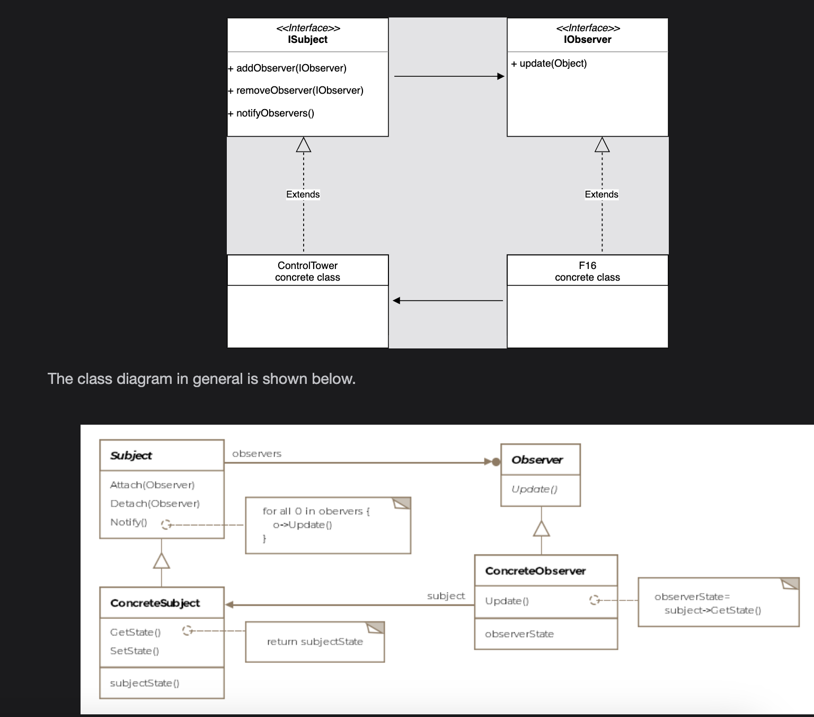

# Observer Pattern

> *Define a one-to-many dependency between objects so that when one object changes state, all its dependents are notified and updated automatically.*

The Observer is a **Behavioral** design pattern that models the relationship between a **subject** (publisher) that produces updates and **observers** (subscribers) that consume them — without either side being tightly coupled to the other.

---

## What Is It?

Think of Twitter. When you follow someone, you're telling Twitter: *"Send me that person's updates."* The person you follow is the **subject** — they produce content. You are the **observer** — you consume it. When they tweet, all their followers are notified automatically. When you unfollow, you stop receiving updates. Neither you nor the person you follow needs to know anything about each other directly.

This is the Observer pattern: a **one-to-many** relationship where:
- One **subject** (publisher) maintains a list of interested **observers** (subscribers)
- When the subject's state changes, it notifies all registered observers automatically
- Observers can subscribe and unsubscribe at any time
- The subject and observers are **loosely coupled** — they interact through interfaces, not concrete classes

> **Formal definition:** Define a one-to-many dependency between objects so that when one object changes state, all the dependents are notified and updated automatically.

---

## Class Diagram

```
  ┌─────────────────────────────────────────┐
  │           «interface»                   │
  │             ISubject                    │  ← Subject
  │─────────────────────────────────────────│
  │ + addObserver(IObserver): void          │
  │ + removeObserver(IObserver): void       │
  │ + notifyObservers(): void               │
  └─────────────────────────────────────────┘
                    ▲
                    │ implements
          ┌─────────────────────────┐
          │      ControlTower       │  ← Concrete Subject
          │─────────────────────────│
          │ - observers: Collection │
          │─────────────────────────│
          │ + addObserver()         │
          │ + removeObserver()      │
          │ + notifyObservers()     │
          │ + run()                 │
          └─────────────────────────┘
                    │
                    │ notifies all →
                    ▼
  ┌─────────────────────────────────────────┐
  │           «interface»                   │
  │             IObserver                   │  ← Observer
  │─────────────────────────────────────────│
  │ + update(newState: Object): void        │
  └─────────────────────────────────────────┘
                    ▲
          ┌─────────┴─────────┐
          │                   │
  ┌──────────────┐   ┌──────────────────┐
  │     F16      │   │   Boeing747      │  ← Concrete Observers
  │──────────────│   │──────────────────│
  │ + update()   │   │ + update()       │
  │ + fly()      │   │ + fly()          │
  │ + land()     │   │ + land()         │
  └──────────────┘   └──────────────────┘
```


The pattern consists of four key entities:

| Entity | Role |
|---|---|
| **Subject (ISubject)** | Interface for subscribing, unsubscribing, and notifying observers |
| **Concrete Subject** | Maintains observer list; sends notifications when state changes |
| **Observer (IObserver)** | Interface with `update()` method — all observers implement this |
| **Concrete Observer** | Receives and reacts to notifications from the subject |

---

## The Shared Interfaces

```java
public interface ISubject {
    void addObserver(IObserver observer);
    void removeObserver(IObserver observer);
    void notifyObservers();
}

public interface IObserver {
    void update(Object newState);
}
```

Defining both sides as interfaces ensures neither the subject nor the observer is coupled to any concrete class — just to the agreed contracts.

---

## Example: Air Traffic Control ✈️📡

Any aircraft entering airspace wants to receive updates from the control tower — runway conditions, weather, landing instructions. When it lands, it should stop receiving updates. The control tower broadcasts to all registered aircraft simultaneously.

### The Concrete Subject — Control Tower

```java
public class ControlTower implements ISubject {

    private Collection<IObserver> observers = new ArrayList<>();

    @Override
    public void addObserver(IObserver observer) {
        observers.add(observer);
        System.out.println("[ControlTower] Observer registered: " + observer.getClass().getSimpleName());
    }

    @Override
    public void removeObserver(IObserver observer) {
        observers.remove(observer);
        System.out.println("[ControlTower] Observer removed: " + observer.getClass().getSimpleName());
    }

    @Override
    public void notifyObservers() {
        for (IObserver observer : observers) {
            // Push model: pass the new state directly
            // Pull model: pass 'this' and let observers query what they need
            observer.update(null);
        }
    }

    // Continuously gathers runway/weather conditions and notifies observers
    public void run() {
        while (true) {
            // Gather runway and weather data...
            // Thread.sleep(1000 * 60 * 5); // notify every 5 minutes
            notifyObservers();
        }
    }
}
```

### The Concrete Observer — F-16

```java
public class F16 implements IObserver, IAircraft {

    private ISubject controlTower;

    public F16(ISubject controlTower) {
        this.controlTower = controlTower;
        controlTower.addObserver(this);  // subscribe on creation
    }

    @Override
    public void fly() {
        System.out.println("F-16 is flying...");
    }

    @Override
    public void land() {
        System.out.println("F-16 is landing...");
        controlTower.removeObserver(this);  // unsubscribe on landing
    }

    @Override
    public void update(Object newState) {
        System.out.println("[F16] Received update from control tower.");
        // Parse newState and take appropriate action:
        // adjust altitude, change heading, prepare for landing, etc.
    }
}
```

### Client Usage

```java
public class Client {

    public void main() {
        ControlTower tower = new ControlTower();

        // Both aircraft subscribe automatically in their constructors
        F16     f16     = new F16(tower);
        Boeing747 boeing = new Boeing747(tower);

        // Tower broadcasts to all registered aircraft
        tower.notifyObservers();
        // [F16] Received update from control tower.
        // [Boeing747] Received update from control tower.

        // F-16 lands and unsubscribes
        f16.land();

        // Now only Boeing receives updates
        tower.notifyObservers();
        // [Boeing747] Received update from control tower.
    }
}
```

> **Key insight:** The `ControlTower` has no knowledge of `F16` or `Boeing747` specifically — it only knows about `IObserver`. Add any new aircraft type without touching the tower.

---

## How Notification Flows

```
ControlTower.notifyObservers()
       │
       ├──► F16.update(newState)       → adjusts heading
       ├──► Boeing747.update(newState) → adjusts altitude
       └──► Helicopter.update(state)   → adjusts rotor speed

All observers notified simultaneously — unlike Chain of Responsibility,
the notification doesn't stop after the first receiver.
```

---

## Push Model vs. Pull Model

This is one of the most important design decisions when implementing the Observer pattern.

### Push Model — Subject sends the state

```java
// Subject sends the new state directly to observers
observer.update(newRunwayConditions);  // observer receives everything

// Observer receives all data — even if it doesn't need all of it
public void update(Object newState) {
    RunwayConditions conditions = (RunwayConditions) newState;
    // Helicopter doesn't care about runway length — but receives it anyway
}
```

| | Push Model |
|---|---|
| **Subject** | Pushes specific state data to all observers |
| **Observer** | Receives data; may get more than it needs |
| **Coupling** | Observer must know the type of data being pushed |
| **Best for** | All observers need the same information |

---

### Pull Model — Subject sends itself; observers query

```java
// Subject sends a reference to itself
observer.update(this);  // observer can ask for what it needs

// Observer pulls only the data it cares about
public void update(Object subject) {
    ControlTower tower = (ControlTower) subject;
    // Helicopter only pulls helipad status — ignores runway data
    HelipadStatus status = tower.getHelipadStatus();
}
```

| | Pull Model |
|---|---|
| **Subject** | Passes itself; exposes getter methods |
| **Observer** | Queries only what it needs |
| **Coupling** | Observer must know the subject's interface |
| **Best for** | Different observers need different subsets of information |

### Side-by-Side Comparison

```
                Push Model              Pull Model
Subject    push(newState) ──────────►  push(this) ──────────►
Observer   receives everything         queries what it needs
Runway       ✅ (always sent)           ✅ (queried if needed)
Helipad      ✅ (always sent, wasted)   ✅ (queried if needed)
```

---

## Real-World Examples

### JavaScript & Frontend Frameworks

```javascript
// DOM event listener — the classic push model observer
button.addEventListener('click', (event) => {
    console.log('Button clicked!', event);  // event is the pushed state
});
```

**AngularJS / KnockoutJS two-way data binding:**
```
User types in input field (Subject changes state)
       │
       ▼
Framework notifies all bound elements (Observers)
       │
       ▼
All UI components displaying that value update automatically
```

### Java `EventListener`

```java
// All implementations of java.util.EventListener follow the Observer pattern
button.addActionListener(e -> System.out.println("Action triggered!"));
```

### Stock Ticker

```
StockExchange (Subject)
    │  price of AAPL changes from $175 → $180
    │
    ├──► TradingApp.update()   → executes buy order
    ├──► PortfolioApp.update() → updates portfolio value
    └──► AlertApp.update()     → sends notification to user
```

### Distributed Event Systems

Modern event-driven architectures like Kafka, RabbitMQ, and AWS SNS are the Observer pattern at scale:

```
Publisher (Subject)   →   Message Broker   →   Subscribers (Observers)
  OrderService              Kafka Topic          PaymentService
                                                 InventoryService
                                                 NotificationService
```

---

## Observer vs. Chain of Responsibility

This is a commonly confused pairing:

| | Observer | Chain of Responsibility |
|---|---|---|
| **Receivers** | All observers notified | One handler takes it; rest skipped |
| **Coupling** | Subject ↔ Observer interface | Handler → Successor reference |
| **Purpose** | Broadcast state changes | Route a request to the right handler |
| **Handling** | Every observer reacts | Only one (or none) handles it |

---

## Caveats & Gotchas

| Caveat | Details |
|---|---|
| **Storage cost with many subjects** | If each subject stores its own observer list, and multiple subjects share the same observers, that observer is stored multiple times. A centralized **Change Manager** can solve this. |
| **Cascade of updates** | A small change in the subject can trigger a large cascade — if observers modify the subject in response to an update, it can cause infinite loops. Always guard against re-entrant notifications. |
| **Notification batching** | Notifying observers after each individual change can overwhelm them. Consider batching changes and notifying once, or using a dirty flag to coalesce updates. |
| **Memory leaks** | Observers that forget to unsubscribe keep the subject holding references to them — preventing garbage collection. Always call `removeObserver()` when an observer is done. |
| **Ordering of notifications** | The order observers are notified may matter. The default list iteration order may not be sufficient — consider sorted or prioritized observer lists when ordering is important. |
| **Change Manager** | For complex dependency webs between subjects and observers, introduce a `ChangeManager` entity that sits between them to coordinate update logic and avoid redundant notifications. |

---

## When to Use the Observer Pattern

✅ A change in one object requires updating others, and you don't know how many objects need to change  
✅ An object should be able to notify other objects without assuming who those objects are  
✅ You want to support dynamic subscription — objects can join or leave at runtime  
✅ You want loose coupling between the producer of events and their consumers  
✅ You need a one-to-many broadcast relationship  

❌ Avoid when the set of observers is fixed and known at compile time — direct calls are simpler  
❌ Avoid when the order of notification matters and is hard to control through the observer list  
❌ Avoid if observers need to modify the subject in response — risk of update cascades and infinite loops