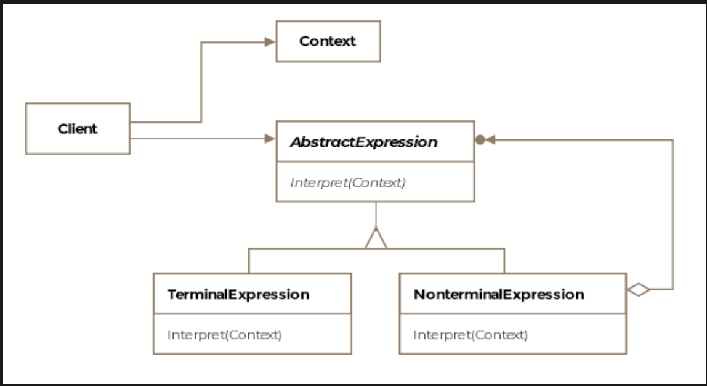
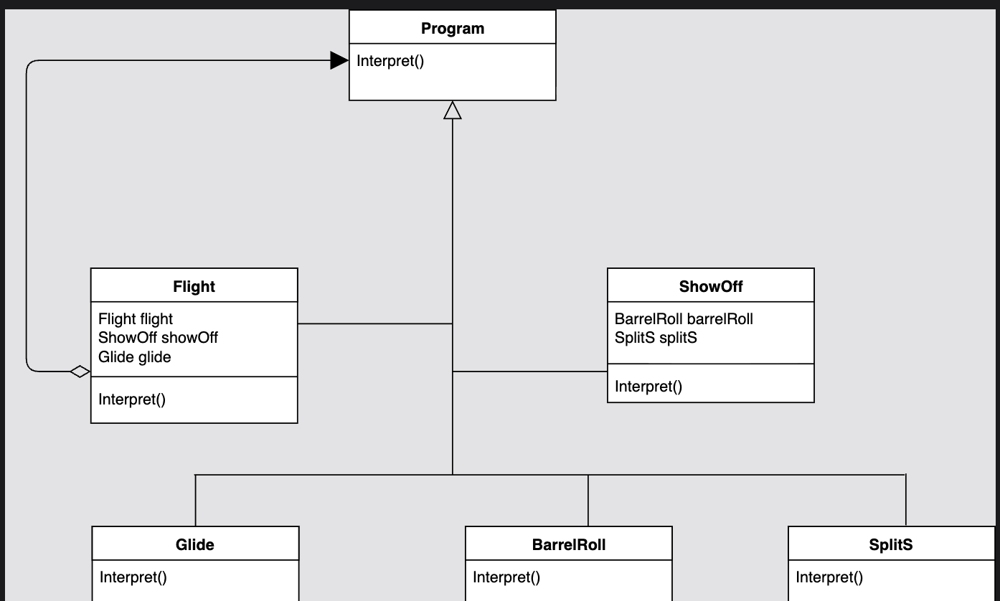
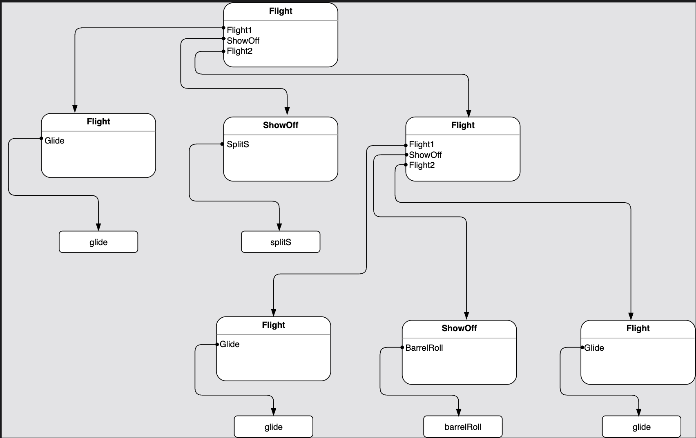

# Interpreter Pattern

> *Describe a way to represent the grammar of a language along with an interpreter that uses the representation to interpret sentences in the language.*

The Interpreter is a **Behavioral** design pattern that lets you define a grammar for a language and build an interpreter to process sentences written in that language. It's the most theory-heavy of the GoF patterns — understanding it requires a brief foray into formal language theory.

---

## Background: Context-Free Grammar

Every programming language is defined by a **grammar** — a set of rules that determine what is and isn't a legal sentence in that language. The Interpreter pattern specifically uses **Context-Free Grammar (CFG)**.

A CFG has four components:

| Component | What It Is | Example |
|---|---|---|
| **Start Symbol** | The root non-terminal — every sentence starts here | `<expression>` |
| **Terminal Symbols** | Atomic tokens — can't be expanded further | `+`, `-`, `*`, `/`, `number` |
| **Non-Terminal Symbols** | Placeholders that expand into other symbols | `<expression>`, `<Flight>` |
| **Production Rules** | Rules defining how non-terminals expand | `<expression> → <expression> + <expression>` |

### A Simple Arithmetic Grammar

```
<expression> → number
<expression> → <expression> + <expression>
<expression> → <expression> - <expression>
<expression> → <expression> * <expression>
<expression> → <expression> / <expression>
```

Using these rules, we can derive the string `7 + 4 * 3`:

```
<expression>
  → <expression> + <expression>          (rule 2)
  → 7 + <expression>                     (rule 1: number = 7)
  → 7 + <expression> * <expression>      (rule 4)
  → 7 + 4 * 3                            (rule 1: number = 4 and 3)
```

The string `7 + 4 * 3` is said to be **in the language** defined by this grammar.

---

## Connecting Grammar to the Pattern

The Interpreter pattern maps directly onto grammar structure:

| Grammar Concept | Interpreter Pattern Equivalent |
|---|---|
| Production rule | One class |
| Non-terminal symbol | Abstract expression class; has child instance variables |
| Terminal symbol | Leaf expression class; contains actual interpretation logic |
| Sentence | An Abstract Syntax Tree (AST) built from expression objects |
| Interpretation | Calling `interpret(context)` on the root of the AST |

> **Formal definition:** Describe a way to represent the grammar of a language along with an interpreter that uses the representation to interpret sentences in the language.

---

## Class Diagram

```
              ┌─────────────────────────────┐
              │       «abstract»            │
              │         Program             │  ← Abstract Expression
              │─────────────────────────────│
              │ + interpret(Context): void  │
              └─────────────────────────────┘
                            ▲
          ┌─────────────────┼─────────────────────┐
          │                 │                     │
 ┌────────────────┐  ┌────────────────┐  ┌──────────────────┐
 │     Glide      │  │    ShowOff     │  │     Flight       │
 │────────────────│  │────────────────│  │──────────────────│
 │ interpret()    │  │ - barrelRoll   │  │ - flight: Flight  │
 │ (terminal)     │  │ - splitS       │  │ - showOff: ShowOff│
 └────────────────┘  │────────────────│  │ - glide: Glide   │
                     │ interpret()    │  │──────────────────│
 ┌────────────────┐  │ (non-terminal) │  │ interpret()      │
 │   BarrelRoll   │  └────────────────┘  │ (non-terminal)   │
 │────────────────│                      └──────────────────┘
 │ interpret()    │
 │ (terminal)     │
 └────────────────┘

 ┌────────────────┐
 │    SplitS      │
 │────────────────│
 │ interpret()    │
 │ (terminal)     │
 └────────────────┘
```


The pattern consists of five key entities:

| Entity | Role |
|---|---|
| **Abstract Expression** | Base class with `interpret(Context)` method |
| **Terminal Expression** | Leaf class; handles the base case of interpretation |
| **Non-Terminal Expression** | Composite class; delegates to child expressions recursively |
| **Context** | Holds the input string and tracks parsing progress |
| **Client** | Builds the AST and drives interpretation |

---

## Example: Kids' Aviation Programming Language ✈️

You're building an educational programming language for aspiring young pilots. The language has just three commands:

- `glide` — fly straight
- `splitS` — perform a Split-S stunt
- `barrelRoll` — perform a Barrel Roll stunt

**The rule:** A program must start and end with `glide`, and no two stunts can appear consecutively — stunts must be separated by a `glide`.

---

### Step 1 — Define the Grammar

```
Start symbol:    <Flight>
Terminals:       glide, splitS, barrelRoll
Non-terminals:   <Flight>, <ShowOff>

Production rules:
  <Flight>  → glide
  <Flight>  → <Flight> <ShowOff> <Flight>
  <ShowOff> → splitS
  <ShowOff> → barrelRoll
```

**In BNF notation:**
```
<Flight>  ::= glide | <Flight> <ShowOff> <Flight>
<ShowOff> ::= splitS | barrelRoll
```

**Generating a valid sentence:**
```
<Flight>
→ <Flight> <ShowOff> <Flight>            (expand using rule 2)
→ glide <ShowOff> <Flight>               (rule 1: terminal)
→ glide splitS <Flight>                  (rule 3: terminal)
→ glide splitS <Flight> <ShowOff> <Flight>  (rule 2)
→ glide splitS glide barrelRoll glide    (rules 1, 4, 1)
```

✅ `glide splitS glide barrelRoll glide` is a valid program in this language.


---

### Step 2 — The Abstract Syntax Tree (AST)

An AST represents the structure of a parsed sentence as a tree. Internal nodes are non-terminals; leaves are terminals.

```
For: "glide splitS glide barrelRoll glide"

            Flight
           /  |   \
         glide ShowOff   Flight
                 |       /  |  \
               splitS  glide ShowOff  Flight
                               |        |
                           barrelRoll  glide
```

Each node in this tree is an object of one of our expression classes. Calling `interpret()` on the root recursively traverses the entire tree.


---

### Step 3 — The Expression Classes

**Abstract Base:**
```java
public abstract class Program {
    public abstract void interpret(Context context);
}
```

**Terminal Expressions (leaves — base cases for recursion):**
```java
public class Glide extends Program {
    @Override
    public void interpret(Context context) {
        // Match "glide" in the context input stream
        System.out.println("Executing: Glide");
        context.advance("glide");
    }
}

public class SplitS extends Program {
    @Override
    public void interpret(Context context) {
        System.out.println("Executing: Split-S");
        context.advance("splitS");
    }
}

public class BarrelRoll extends Program {
    @Override
    public void interpret(Context context) {
        System.out.println("Executing: Barrel Roll");
        context.advance("barrelRoll");
    }
}
```

**Non-Terminal Expressions (composite — delegate to children):**
```java
// <ShowOff> → splitS | barrelRoll
public class ShowOff extends Program {

    Program stunt;  // either SplitS or BarrelRoll

    public ShowOff(Program stunt) {
        this.stunt = stunt;
    }

    @Override
    public void interpret(Context context) {
        // Delegate to whichever stunt this ShowOff contains
        stunt.interpret(context);
    }
}

// <Flight> → glide | <Flight> <ShowOff> <Flight>
public class Flight extends Program {

    Program left;   // <Flight> or Glide
    ShowOff showOff;
    Program right;  // <Flight> or Glide

    public Flight(Program left, ShowOff showOff, Program right) {
        this.left    = left;
        this.showOff = showOff;
        this.right   = right;
    }

    // Constructor for terminal case: <Flight> → glide
    public Flight(Glide glide) {
        this.left = glide;
    }

    @Override
    public void interpret(Context context) {
        left.interpret(context);
        if (showOff != null) {
            showOff.interpret(context);
            right.interpret(context);
        }
    }
}
```

**The Context:**
```java
public class Context {

    private String input;
    private int    position = 0;

    public Context(String input) {
        this.input = input;
    }

    public void advance(String token) {
        // Move position past the matched token
        position += token.length() + 1;  // +1 for space
    }

    public String getRemainingInput() {
        return input.substring(position);
    }
}
```

---

### Step 4 — Building and Executing the AST

```java
public class Client {

    public void main() {

        Context context = new Context("glide splitS glide barrelRoll glide");

        // Build AST for: glide splitS glide barrelRoll glide
        //
        //        Flight (root)
        //       /   |       \
        //    Glide ShowOff  Flight
        //            |       /  |  \
        //          SplitS  Glide ShowOff  Flight
        //                          |        |
        //                      BarrelRoll  Glide

        Flight innerRight = new Flight(new Glide());
        ShowOff barrelShowOff = new ShowOff(new BarrelRoll());
        Flight innerLeft = new Flight(new Glide(), barrelShowOff, innerRight);

        ShowOff splitShowOff = new ShowOff(new SplitS());
        Flight root = new Flight(new Glide(), splitShowOff, innerLeft);

        // Interpret the entire AST
        root.interpret(context);
        // Output:
        // Executing: Glide
        // Executing: Split-S
        // Executing: Glide
        // Executing: Barrel Roll
        // Executing: Glide
    }
}
```

---

## How Recursion Unwinds Through the AST

```
root (Flight).interpret()
  │
  ├── left (Glide).interpret()         → "Executing: Glide"
  │
  ├── showOff (ShowOff).interpret()
  │      └── stunt (SplitS).interpret() → "Executing: Split-S"
  │
  └── right (Flight).interpret()
         ├── left (Glide).interpret()   → "Executing: Glide"
         ├── showOff (ShowOff).interpret()
         │      └── (BarrelRoll)        → "Executing: Barrel Roll"
         └── right (Flight).interpret()
                └── (Glide)             → "Executing: Glide"
```

Each `interpret()` call either executes (terminal) or delegates to children (non-terminal). The recursion ends at the leaves.

---

## Real-World Examples

### Java — `java.util.Pattern`

```java
// Pattern is a compiled representation of a regular expression grammar
Pattern p = Pattern.compile("\\d{3}-\\d{4}");
Matcher m = p.matcher("867-5309");
System.out.println(m.matches());  // true
```

The regular expression `\\d{3}-\\d{4}` is a sentence in the regex grammar. `Pattern.compile()` builds the AST; `Matcher.matches()` interprets it against the input.

### Java — `java.text.Normalizer`

Normalizer interprets Unicode transformation rules applied to text — each rule maps to an interpretation step.

### SQL Parsing

```sql
SELECT name FROM users WHERE age > 30
```

A SQL parser builds an AST from this query:

```
SELECT
├── columns: [name]
├── FROM: users
└── WHERE
    └── age > 30
        ├── left:  age (column reference — terminal)
        ├── op:    >   (operator — terminal)
        └── right: 30  (literal — terminal)
```

Each node in the AST is interpreted to produce a query execution plan.

### Configuration / Expression Languages

Business rule engines, mathematical expression evaluators, template languages, and query builders all use the Interpreter pattern — any system where you want to define a mini-language and execute it.

---

## Interpreter vs. Related Patterns

| Pattern | Relationship |
|---|---|
| **Composite** | The AST is a Composite tree — non-terminals are composites, terminals are leaves |
| **Visitor** | `interpret()` can be moved out of expression classes into a Visitor, allowing multiple interpretations of the same grammar without modifying expressions |
| **Flyweight** | Terminal symbols (which are often repeated) can be implemented as Flyweights to save memory |
| **Iterator** | Used to traverse the AST nodes in the client |

---

## Caveats & Gotchas

| Caveat | Details |
|---|---|
| **One class per rule** | The pattern scales poorly with grammar size. Small grammars (under ~10 rules) work well; complex languages (like Java itself) require parser generators (ANTLR, JavaCC) instead. |
| **Grammar changes cascade** | Modifying a production rule means changing the corresponding class and potentially its consumers. Adding new terminal symbols is easy; restructuring non-terminals is harder. |
| **Parsing not included** | The pattern handles *interpretation*, not *parsing*. Building the AST from raw input text is a separate concern — typically handled by a lexer/parser. |
| **Performance** | Walking the AST recursively is fine for small inputs; for large inputs or frequently executed expressions, consider compiling the expression to bytecode or caching interpreted results. |

---

## When to Use the Interpreter Pattern

✅ You need to interpret sentences in a simple language with a well-defined grammar  
✅ Grammar rules are stable and not too numerous (under ~10 rules)  
✅ Efficiency is not a primary concern — you prioritize simplicity and extensibility  
✅ You want each grammar rule to be independently testable and maintainable  
✅ You're building a scripting language, expression evaluator, or rule engine  

❌ Avoid for complex languages with many rules — use a parser generator (ANTLR, JavaCC, PEG.js) instead  
❌ Avoid when performance is critical — AST traversal is slower than compiled or bytecode execution  
❌ Avoid when the grammar changes frequently — class-per-rule coupling makes refactoring expensive