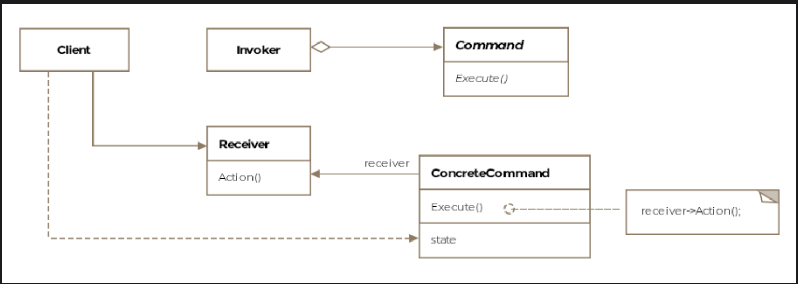

# Command Pattern

> *Represent an action or request as an object, allowing it to be passed, queued, logged, and undone.*

The Command is a **Behavioral** design pattern that decouples the object that *triggers* an action from the object that *knows how to perform* it. By wrapping requests as objects, you gain the ability to parameterize, queue, log, and reverse operations — capabilities impossible with simple direct method calls.

---

## What Is It?

Imagine building a UI framework. You add a menu bar, menu items, buttons. When a user clicks a button, *something* happens — but as the framework author, you have no idea what. It could open a file, restart the app, or launch a nuclear missile. You can't hardcode the action inside the button.

The Command pattern solves this by having the button hold a **command object**. The button doesn't know what the command does — it just calls `execute()`. The command object encapsulates everything needed to carry out the action, including the target object and any parameters.

> **Formal definition:** Represent an action or a request as an object that can then be passed to other objects as parameters, allowing parameterization of clients with requests or actions. Requests can be queued for later execution or logged — enabling undo operations.

---

## Class Diagram

```
  ┌──────────┐    creates    ┌───────────────────────────┐
  │  Client  │──────────────►│    «interface»            │
  └──────────┘               │       Command             │  ← Command
                             │───────────────────────────│
                             │ + execute(): void         │
                             │ + unexecute(): void       │ ← (for undo)
                             └───────────────────────────┘
                                          ▲
                                          │ implements
                        ┌─────────────────┴─────────────────┐
                        │                                   │
           ┌────────────────────────┐     ┌─────────────────────────┐
           │  LandingGearDownCommand│     │  LandingGearUpCommand   │
           │────────────────────────│     │─────────────────────────│
           │ - landingGear: LandingGear   │ - landingGear: LandingGear
           │────────────────────────│     │─────────────────────────│
           │ + execute()            │     │ + execute()             │
           └────────────────────────┘     └─────────────────────────┘
                   │ delegates to                 │ delegates to
                   ▼                             ▼
           ┌────────────────────────────────────────────┐
           │              LandingGear                   │  ← Receiver
           │────────────────────────────────────────────│
           │ + up(): void                               │
           │ + down(): void                             │
           └────────────────────────────────────────────┘

  ┌──────────────────────────────┐
  │       InstrumentPanel        │  ← Invoker
  │──────────────────────────────│
  │ - commands: Command[]        │
  │──────────────────────────────│
  │ + setCommand(i, Command)     │
  │ + lowerLandingGear()         │
  │ + retractLandingGear()       │
  └──────────────────────────────┘
```



The pattern consists of five key entities:

| Entity | Role |
|---|---|
| **Command** | Interface declaring `execute()` (and optionally `unexecute()`) |
| **Concrete Command** | Implements `execute()`; holds reference to the Receiver; bridges Invoker and Receiver |
| **Receiver** | The object that actually knows how to carry out the action |
| **Invoker** | Holds and triggers command objects; knows nothing about what they do |
| **Client** | Creates Receivers and Commands; wires them together; configures the Invoker |

---

## Example: Boeing-747 Cockpit ✈️

The cockpit instrument panel has dozens of buttons and switches. Each button triggers a specific action on some part of the aircraft. The panel (invoker) shouldn't need to know how any of those systems work — it just needs to know it can call `execute()` on whatever command is assigned to each button.

### Step 1 — The Command Interface

```java
public interface Command {
    void execute();
    void unexecute();  // for undo support
}
```

### Step 2 — The Receiver

```java
public class LandingGear {

    public void down() {
        System.out.println("[LandingGear] Landing gear lowered. Ready to land.");
    }

    public void up() {
        System.out.println("[LandingGear] Landing gear retracted. Ready for flight.");
    }
}
```

### Step 3 — Concrete Commands

```java
// Command to lower the landing gear
public class LandingGearDownCommand implements Command {

    private LandingGear landingGear;  // the Receiver

    public LandingGearDownCommand(LandingGear landingGear) {
        this.landingGear = landingGear;
    }

    @Override
    public void execute() {
        landingGear.down();  // delegate to receiver
    }

    @Override
    public void unexecute() {
        landingGear.up();    // reverse the action
    }
}

// Command to retract the landing gear
public class LandingGearUpCommand implements Command {

    private LandingGear landingGear;

    public LandingGearUpCommand(LandingGear landingGear) {
        this.landingGear = landingGear;
    }

    @Override
    public void execute() {
        landingGear.up();
    }

    @Override
    public void unexecute() {
        landingGear.down();  // reverse the action
    }
}
```

### Step 4 — The Invoker

```java
public class InstrumentPanel {

    private Command[] commands = new Command[10];  // slots for panel buttons
    private Deque<Command> history = new ArrayDeque<>();  // for undo support

    public void setCommand(int slot, Command command) {
        commands[slot] = command;
    }

    public void pressButton(int slot) {
        if (commands[slot] != null) {
            commands[slot].execute();
            history.push(commands[slot]);  // record for undo
        }
    }

    public void undoLastCommand() {
        if (!history.isEmpty()) {
            Command last = history.pop();
            last.unexecute();
        }
    }

    // Convenience methods
    public void lowerLandingGear()   { pressButton(0); }
    public void retractLandingGear() { pressButton(1); }
}
```

### Step 5 — The Client

```java
public class Client {

    public void main() {

        // Create the Receiver
        LandingGear landingGear = new LandingGear();

        // Create Concrete Commands, composed with the Receiver
        Command lowerGear   = new LandingGearDownCommand(landingGear);
        Command retractGear = new LandingGearUpCommand(landingGear);

        // Create and configure the Invoker
        InstrumentPanel panel = new InstrumentPanel();
        panel.setCommand(0, lowerGear);    // slot 0 → lower gear
        panel.setCommand(1, retractGear);  // slot 1 → retract gear

        // Pilot presses buttons — panel knows nothing about LandingGear
        panel.lowerLandingGear();
        // [LandingGear] Landing gear lowered. Ready to land.

        panel.retractLandingGear();
        // [LandingGear] Landing gear retracted. Ready for flight.

        // Oops — undo the retract
        panel.undoLastCommand();
        // [LandingGear] Landing gear lowered. Ready to land.
    }
}
```

> **Key insight:** `InstrumentPanel` never imports `LandingGear`. It holds `Command` references. Swap any command for a different implementation — `panel` works identically. The coupling between button and action is completely eliminated.

---

## How the Pieces Collaborate

```
Client
  │
  ├── creates LandingGear (Receiver)
  ├── creates LandingGearDownCommand(landingGear) (Command + Receiver wired)
  └── gives command to InstrumentPanel (Invoker)
                    │
                    │ pilot presses button 0
                    ▼
         InstrumentPanel.pressButton(0)
                    │
                    │ calls execute() on the command
                    ▼
         LandingGearDownCommand.execute()
                    │
                    │ delegates to receiver
                    ▼
         LandingGear.down()    → "Landing gear lowered" ✅
```

---

## Macro Commands (Composite Commands)

A **Macro Command** strings together multiple commands and executes them in sequence. It's an application of the **Composite pattern** — the macro command implements `Command` and holds a list of child commands.

```java
public class TakeoffSequenceCommand implements Command {

    private List<Command> commands;

    public TakeoffSequenceCommand(List<Command> commands) {
        this.commands = commands;
    }

    @Override
    public void execute() {
        // Execute all commands in sequence
        for (Command command : commands) {
            command.execute();
        }
    }

    @Override
    public void unexecute() {
        // Undo in reverse order
        ListIterator<Command> it = commands.listIterator(commands.size());
        while (it.hasPrevious()) {
            it.previous().unexecute();
        }
    }
}

// Usage
Command takeoff = new TakeoffSequenceCommand(Arrays.asList(
    new LandingGearUpCommand(landingGear),
    new FlapsRetractCommand(flaps),
    new ThrottleFullCommand(engine)
));

takeoff.execute();  // entire takeoff sequence in one call
```

---

## Advanced Capabilities

### Undo / Redo

```java
Deque<Command> undoStack = new ArrayDeque<>();
Deque<Command> redoStack = new ArrayDeque<>();

// Execute and record
void executeCommand(Command cmd) {
    cmd.execute();
    undoStack.push(cmd);
    redoStack.clear();  // new command invalidates redo history
}

// Undo
void undo() {
    if (!undoStack.isEmpty()) {
        Command cmd = undoStack.pop();
        cmd.unexecute();
        redoStack.push(cmd);
    }
}

// Redo
void redo() {
    if (!redoStack.isEmpty()) {
        Command cmd = redoStack.pop();
        cmd.execute();
        undoStack.push(cmd);
    }
}
```

### Command Queue (Deferred Execution)

```java
BlockingQueue<Command> commandQueue = new LinkedBlockingQueue<>();

// Producer — adds commands to queue
commandQueue.put(new LandingGearDownCommand(landingGear));
commandQueue.put(new FlapsExtendCommand(flaps));

// Consumer — executes from queue (on a different thread or at a later time)
while (true) {
    Command cmd = commandQueue.take();
    cmd.execute();
}
```

### Command Logging (Crash Recovery)

```java
public interface Command {
    void execute();
    void unexecute();
    void saveToDisk();    // serialize command to log
    void loadFromDisk();  // deserialize for replay
}

// On crash recovery:
// 1. Read command log from disk
// 2. Replay each command in sequence
// 3. System returns to pre-crash state
```

---

## Real-World Examples

### `java.lang.Runnable`

```java
// Runnable is the Command interface in Java's threading model
Runnable command = () -> System.out.println("Task executing...");

// Thread is the Invoker
Thread thread = new Thread(command);
thread.start();  // calls command.execute() (i.e. run())
```

| Command Pattern | Runnable Equivalent |
|---|---|
| Command interface | `Runnable` |
| `execute()` | `run()` |
| Invoker | `Thread` / `ExecutorService` |
| Concrete Command | Lambda or anonymous class |

### `javax.swing.Action`

```java
Action saveAction = new AbstractAction("Save") {
    @Override
    public void actionPerformed(ActionEvent e) {
        // actual save logic — this is the receiver call
        document.save();
    }
};

// Same Action object can be assigned to a menu item AND a toolbar button
menuItem.setAction(saveAction);
toolbarButton.setAction(saveAction);
```

One command object shared across multiple invokers — a key benefit of the pattern.

### Transaction Systems

```
Command pattern models database transactions:

BEGIN TRANSACTION
  → InsertCustomerCommand.execute()
  → UpdateInventoryCommand.execute()
  → ChargePaymentCommand.execute()
COMMIT  (all succeed)
─── or ───
ROLLBACK (any fails → unexecute() all in reverse)
```

---

## Command vs. Related Patterns

| Pattern | Relationship |
|---|---|
| **Composite** | Macro Commands use Composite to chain multiple commands |
| **Memento** | Used alongside Command to store state needed for `unexecute()` — the Memento captures the receiver's state before `execute()` |
| **Strategy** | Both encapsulate behavior in an object, but Command encapsulates a *request* (with sender/receiver context); Strategy encapsulates an *algorithm* (interchangeable computation) |
| **Chain of Responsibility** | CoR passes a request along a chain until one handler takes it; Command sends a request to one specific receiver |

---

## Caveats & Gotchas

| Caveat | Details |
|---|---|
| **Class proliferation** | Each action requires a concrete command class. Systems with many actions can accumulate dozens of command classes. Lambdas/method references in Java 8+ reduce this boilerplate significantly. |
| **Undo complexity** | Implementing `unexecute()` correctly can be hard, especially for commands with side effects (network calls, file writes). Consider using **Memento** to capture pre-execution state. |
| **Command state** | Commands that capture state at creation time may become stale if the receiver's state changes between creation and execution — especially relevant for queued or deferred commands. |

---

## When to Use the Command Pattern

✅ You want to parameterize objects with actions (UI buttons, menu items, toolbar buttons)  
✅ You need to queue, schedule, or execute requests at a different time than they are created  
✅ You need undo/redo functionality  
✅ You want to log or audit all operations for crash recovery  
✅ You want to support transactional behavior (all-or-nothing with rollback)  
✅ You need macro commands — composite sequences of simpler operations  

❌ Avoid when the action is simple and will never need queuing, logging, or undo  
❌ Avoid when the explosion of command classes outweighs the flexibility gained — use lambdas instead for simple cases