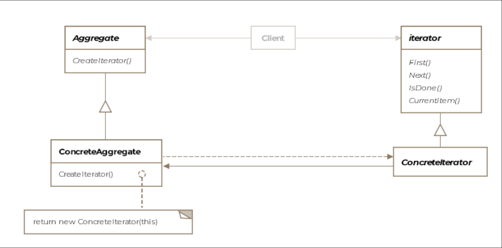

# Iterator Pattern

> *Provide a way to sequentially access elements of a collection without exposing its underlying implementation.*

The Iterator is a **Behavioral** design pattern so ubiquitous in modern programming that most languages have built it directly into their syntax (`for-each`, `for...of`, `foreach`). Understanding the pattern beneath the syntax makes you a better designer of collections and traversal logic.

---

## What Is It?

A collection holds objects — but how those objects are stored internally varies wildly: arrays, linked lists, hash maps, trees, graphs. A client that needs to iterate over a collection shouldn't have to know or care which data structure is underneath. The Iterator pattern extracts the traversal responsibility out of the collection and puts it in a dedicated object — the **iterator**.

```java
// You already use this pattern every day in Java:
ArrayList<String> companies = new ArrayList<>();
companies.add("SnapChat");
companies.add("Twitter");
companies.add("Tesla");

Iterator<String> it = companies.iterator();
while (it.hasNext()) {
    System.out.println(it.next());  // no knowledge of ArrayList internals
}
```

> **Formal definition:** Allow traversal of the elements of an aggregate or collection sequentially without exposing the underlying implementation.

The pattern also **simplifies the aggregate's interface** — by moving traversal logic out of the collection class, the collection only needs to manage its data, not how to iterate over it.

---

## Class Diagram

```
  ┌─────────────────────────────────────┐
  │          «interface»                │
  │            Iterator                 │  ← Iterator
  │─────────────────────────────────────│
  │ + next(): IAircraft                 │
  │ + hasNext(): boolean                │
  └─────────────────────────────────────┘
                  ▲
      ┌───────────┴────────────┐
      │                        │
 ┌─────────────────────┐  ┌──────────────────────┐
 │  AirForceIterator   │  │    JetsIterator      │  ← Concrete Iterators
 │─────────────────────│  │──────────────────────│
 │ - jets: List        │  │ - jets: List          │
 │ - helis: Array      │  │ - position: int       │
 │ - cargo: LinkedList │  │──────────────────────│
 │ - positions: int[]  │  │ + next()             │
 │─────────────────────│  │ + hasNext()          │
 │ + next()            │  └──────────────────────┘
 │ + hasNext()         │
 └─────────────────────┘

  ┌─────────────────────────────────────────┐
  │              AirForce                   │  ← Aggregate
  │─────────────────────────────────────────│
  │ - jets: List<IAircraft>                 │
  │ - helis: IAircraft[]                    │
  │ - cargo: LinkedList<Boeing747>          │
  │─────────────────────────────────────────│
  │ + createIterator(): Iterator            │ ← returns AirForceIterator
  │ + createJetsIterator(): Iterator        │ ← returns JetsIterator
  └─────────────────────────────────────────┘
                    │
                    │ client uses
                    ▼
            ┌──────────────┐
            │    Client    │
            └──────────────┘
```


The pattern consists of four key entities:

| Entity | Role |
|---|---|
| **Iterator** | Interface declaring `next()` and `hasNext()` |
| **Concrete Iterator** | Tracks traversal position; implements iteration logic for a specific collection |
| **Aggregate** | The collection; exposes a factory method to create its iterator |
| **Client** | Uses only the Iterator interface; knows nothing about the collection's internals |

---

## The Problem: Heterogeneous Collections

Our `AirForce` class stores different aircraft in different collection types:

```java
public class AirForce {

    List<IAircraft>       jets  = new ArrayList<>();   // fighter jets
    IAircraft[]           helis = new IAircraft[1];    // helicopters (array)
    LinkedList<Boeing747> cargo = new LinkedList<>();   // cargo planes

    public AirForce() {
        jets.add(new F16());
        helis[0] = new CobraGunship();
        cargo.add(new Boeing747());
    }
}
```

If a client wants to list everything, without an iterator it looks like:

```java
// Without iterator — client must know about all three internal structures
for (IAircraft jet : airForce.getJets()) { process(jet); }

for (IAircraft heli : airForce.getHelis()) { process(heli); }

for (Boeing747 plane : airForce.getCargo()) { process(plane); }
```

This is brittle. Add a fourth collection type, or change `ArrayList` to `TreeSet`, and every client breaks.

---

## Step 1 — The Iterator Interface

```java
public interface Iterator {
    IAircraft next();     // returns the next element
    boolean hasNext();    // returns true if more elements remain
}
```

---

## Step 2 — The Aggregate (AirForce)

```java
public class AirForce {

    List<IAircraft>       jets  = new ArrayList<>();
    IAircraft[]           helis = new IAircraft[1];
    LinkedList<Boeing747> cargo = new LinkedList<>();

    public List<IAircraft>       getJets()  { return jets; }
    public IAircraft[]           getHelis() { return helis; }
    public LinkedList<Boeing747> getCargo() { return cargo; }

    public AirForce() {
        jets.add(new F16());
        helis[0] = new CobraGunship();
        cargo.add(new Boeing747());
    }

    // Factory method — returns iterator over ALL aircraft (helis → jets → cargo)
    public Iterator createIterator() {
        return new AirForceIterator(this);
    }

    // Factory method — returns iterator over JETS only
    public Iterator createJetsIterator() {
        return new JetsIterator(jets);
    }
}
```

---

## Step 3 — Concrete Iterators

### AirForceIterator — traverses all three collections in sequence

```java
public class AirForceIterator implements Iterator {

    private List<IAircraft>       jets;
    private IAircraft[]           helis;
    private LinkedList<Boeing747> cargo;

    private int jetsPosition  = 0;
    private int helisPosition = 0;
    private int cargoPosition = 0;

    public AirForceIterator(AirForce airForce) {
        this.jets  = airForce.getJets();
        this.helis = airForce.getHelis();
        this.cargo = airForce.getCargo();
    }

    @Override
    public IAircraft next() {
        // Iteration order: helis first, then jets, then cargo
        if (helisPosition < helis.length) {
            return helis[helisPosition++];
        }
        if (jetsPosition < jets.size()) {
            return jets.get(jetsPosition++);
        }
        if (cargoPosition < cargo.size()) {
            return cargo.get(cargoPosition++);
        }
        throw new RuntimeException("No more elements — check hasNext() before calling next()");
    }

    @Override
    public boolean hasNext() {
        return helisPosition < helis.length ||
               jetsPosition  < jets.size()  ||
               cargoPosition < cargo.size();
    }
}
```

### JetsIterator — traverses only jets

```java
public class JetsIterator implements Iterator {

    private List<IAircraft> jets;
    private int position = 0;

    public JetsIterator(List<IAircraft> jets) {
        this.jets = jets;
    }

    @Override
    public IAircraft next() {
        if (!hasNext()) {
            throw new RuntimeException("No more jets");
        }
        return jets.get(position++);
    }

    @Override
    public boolean hasNext() {
        return position < jets.size();
    }
}
```

---

## Step 4 — Client Usage

```java
public class Client {

    public void main() {

        AirForce airForce = new AirForce();

        // Iterate over jets only
        System.out.println("=== Jets ===");
        Iterator jets = airForce.createJetsIterator();
        while (jets.hasNext()) {
            IAircraft jet = jets.next();
            System.out.println(jet.getClass().getSimpleName());
        }

        // Iterate over all aircraft
        System.out.println("=== All Aircraft ===");
        Iterator allPlanes = airForce.createIterator();
        while (allPlanes.hasNext()) {
            IAircraft aircraft = allPlanes.next();
            System.out.println(aircraft.getClass().getSimpleName());
        }
        // Output: CobraGunship, F16, Boeing747
        // (helis first, then jets, then cargo — as defined by AirForceIterator)
    }
}
```

> **Key insight:** The client uses two completely different iterators (one traverses a `List`, the other traverses three heterogeneous collections) through the **same `Iterator` interface**. The internal structure of `AirForce` is completely hidden.

---

## How Traversal State is Maintained

Each iterator is an independent object with its own position state:

```
Iterator 1 (AirForceIterator)        Iterator 2 (JetsIterator)
──────────────────────────────        ────────────────────────────
helisPosition = 2 (done)             position = 0 (at start)
jetsPosition  = 1 (mid-way)
cargoPosition = 0 (not started)
```

Multiple iterators over the same collection can be active simultaneously — each maintains its own independent position. This is the key advantage of the **external iterator** approach.

---

## External vs. Internal Iterators

| | External Iterator | Internal Iterator |
|---|---|---|
| **Control** | Client controls the traversal — calls `next()` and `hasNext()` explicitly | Iterator controls the traversal — client provides an operation to apply |
| **Flexibility** | Client can pause, restart, or conditionally skip elements | Simpler for the client — just hand over the action |
| **Example** | `java.util.Iterator` | Java's `forEach()`, `stream().map()` |
| **Use when** | Client needs fine control over traversal | Client just wants to apply an operation to all elements |

```java
// External iterator — client drives
Iterator<String> it = list.iterator();
while (it.hasNext()) {
    String s = it.next();
    if (s.startsWith("A")) break;  // client can stop mid-way
}

// Internal iterator — iterator drives
list.forEach(s -> System.out.println(s));  // client just provides action
```

---

## Traversal Variations

The `createIterator()` factory method can be parameterized to yield different traversal orders:

```java
// Tree traversal — same tree, three different iterators
tree.createIterator(TraversalOrder.PREORDER);
tree.createIterator(TraversalOrder.INORDER);
tree.createIterator(TraversalOrder.POSTORDER);

// AirForce — multiple views of the same data
airForce.createIterator();         // all aircraft
airForce.createJetsIterator();     // jets only
airForce.createCargoIterator();    // cargo only
airForce.createCombatIterator();   // jets + helicopters
```

Each is a separate concrete iterator — the aggregate and client code stay unchanged.

---

## Real-World Examples

### Java Collections Framework

Every Java collection returns an iterator via `.iterator()`:

```java
// All of these expose Iterator — despite wildly different internal structures
new ArrayList<>().iterator()     // backed by array
new LinkedList<>().iterator()    // backed by doubly-linked list
new HashSet<>().iterator()       // backed by hash table
new TreeSet<>().iterator()       // backed by red-black tree
```

The `for-each` loop in Java is syntactic sugar over `Iterator`:

```java
for (String s : list) { }
// is exactly:
Iterator<String> it = list.iterator();
while (it.hasNext()) { String s = it.next(); }
```

### `java.util.Scanner`

```java
Scanner scanner = new Scanner(System.in);
while (scanner.hasNextLine()) {
    String line = scanner.nextLine();  // next() equivalent
}
```

`Scanner` is an iterator over a stream of tokens or lines — classic Iterator pattern.

### `java.util.Enumeration` (legacy)

The predecessor to `Iterator` — `hasMoreElements()` and `nextElement()` map directly to `hasNext()` and `next()`.

---

## Iterator vs. Related Patterns

| Pattern | Relationship |
|---|---|
| **Composite** | For Composite trees, internal iterators are often preferred — the composite can use recursive calls to implicitly track position via the call stack |
| **Memento** | An iterator can use Memento to save and restore its traversal position — enabling rewind or bookmark functionality |
| **Factory Method** | The `createIterator()` method on the aggregate is a Factory Method — it returns an abstract iterator type, hiding the concrete implementation |
| **Visitor** | Visitor uses an iterator internally to traverse elements and apply an operation to each |

---

## Caveats & Gotchas

| Caveat | Details |
|---|---|
| **Concurrent modification** | If elements are added or removed from the collection during an active traversal, the iterator may skip elements or visit them twice. Java throws `ConcurrentModificationException` as a safeguard — use `Iterator.remove()` instead of direct collection removal. |
| **Multiple active iterators** | Multiple iterators can traverse the same aggregate simultaneously, each with independent state. This is safe as long as the aggregate is not modified. |
| **Traversal order** | Collections like `HashSet` don't guarantee traversal order. If order matters, use a sorted collection or sort before iterating. |
| **Composites** | For deeply nested composite structures, external iterators become complex to implement (they must maintain a stack of positions). Internal iterators using recursion are simpler and preferred for composites. |

---

## When to Use the Iterator Pattern

✅ You want a uniform way to traverse different types of collections  
✅ The internal structure of a collection should be hidden from clients  
✅ You need multiple simultaneous traversals of the same collection  
✅ You want to vary the traversal algorithm independently of the collection  
✅ You are designing a collection class and want to decouple it from traversal logic  

❌ Avoid implementing a custom iterator when the built-in Java iterator already covers your use case  
❌ Avoid external iterators for recursive/tree structures — internal iterators with recursion are simpler and less error-prone