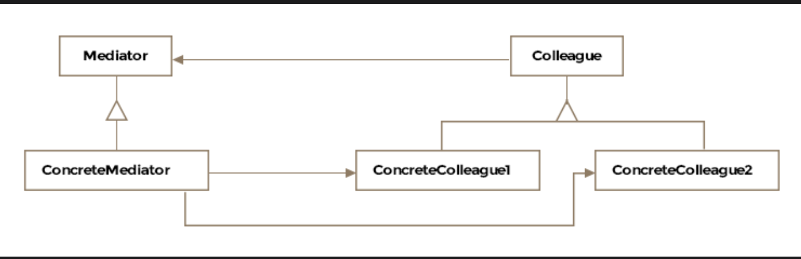

# Mediator Pattern

> *Encourage loose coupling among interacting objects by encapsulating their interactions in a mediator object — so objects don't refer to each other directly.*

The Mediator is a **Behavioral** design pattern that centralizes communication between a set of objects. Instead of objects talking directly to each other (creating a web of dependencies), they all talk through a single mediator — reducing coupling from many-to-many to one-to-many.

---

## What Is It?

In real life, a mediator is someone who helps conflicting parties reach agreement without them having to directly confront each other. In software, the pattern does the same: it stands between objects that need to interact, taking the burden of coordination off each individual object.

Without a mediator, objects in a system must hold references to all the other objects they interact with. As the number of objects grows, this creates an exponential number of connections:

```
Without Mediator (N objects, each knows all others):
────────────────────────────────────────────────────
Plane A ←──► Plane B
Plane A ←──► Plane C
Plane A ←──► Plane D
Plane B ←──► Plane C
Plane B ←──► Plane D
Plane C ←──► Plane D
→ N×(N-1)/2 connections = hard to manage, impossible to reuse

With Mediator (N objects + 1 mediator):
────────────────────────────────────────────────────
Plane A ──► ControlTower ◄── Plane B
Plane C ──►      │       ◄── Plane D
                 │
            coordinates all
→ N connections = clean, centralised, reusable
```

> **Formal definition:** Encourage loose coupling among interacting objects by encapsulating their interactions in a mediator object, thus avoiding the need for individual objects to refer to each other directly and allowing object interactions to vary independently.

---

## Class Diagram

```
  ┌──────────────────────────────────────────┐
  │           «interface»                    │
  │            IMediator                     │  ← Mediator
  │──────────────────────────────────────────│
  │ + requestToLand(IAircraft): void         │
  │ + notifyAircraft(IAircraft): void        │
  └──────────────────────────────────────────┘
                      ▲
                      │ implements
            ┌─────────────────────────┐
            │      ControlTower       │  ← Concrete Mediator
            │─────────────────────────│
            │ - queuedForLanding: List│
            │─────────────────────────│
            │ + requestToLand()       │
            │ + run()                 │
            └─────────────────────────┘
                      │
           coordinates │ all communication
                      │
     ┌────────────────┼────────────────┐
     │                │                │
 ┌────────┐      ┌────────┐      ┌────────┐
 │  F16   │      │ B747   │      │Gunship │  ← Colleague Classes
 │────────│      │────────│      │────────│
 │ - tower│      │ - tower│      │ - tower│
 │────────│      │────────│      │────────│
 │ land() │      │ land() │      │ land() │
 │request │      │request │      │request │
 └────────┘      └────────┘      └────────┘
   (each knows only the mediator — not each other)
```


The pattern consists of three key entities:

| Entity | Role |
|---|---|
| **Mediator** | Interface defining how colleagues communicate with the mediator |
| **Concrete Mediator** | Implements coordination logic; knows all colleagues and manages their interactions |
| **Colleague Classes** | Know only the mediator; communicate with each other exclusively through it |

---

## Example: Air Traffic Control ✈️

Imagine an airport without a control tower. Every aircraft must track every other aircraft to safely coordinate runways and airspace. With 10 planes, that's 45 direct peer-to-peer connections. With 100 planes — 4,950. The control tower eliminates this by being the single point of coordination.

### The Naive Scenario (No Mediator)

```java
// Without mediator — each plane holds references to ALL others
public class F16 {
    List<IAircraft> otherPlanes;  // must know about every other plane!

    public void requestToLand() {
        for (IAircraft plane : otherPlanes) {
            // negotiate with each individually
            plane.isRunwayClear();
        }
    }
}
```

This doesn't scale. Add a new aircraft type and every other class needs updating.

---

### Step 1 — The Mediator Interface

```java
public interface IMediator {
    void requestToLand(IAircraft aircraft);
}
```

---

### Step 2 — The Colleague Interface

```java
public interface IAircraft {
    void land();
    void hold();   // circle and wait
}
```

---

### Step 3 — The Concrete Mediator (Control Tower)

```java
public class ControlTower implements IMediator {

    // Queue of aircraft waiting for clearance
    private List<IAircraft> queuedForLanding = new ArrayList<>();
    private boolean runwayClear = true;

    // Aircraft call this to request landing — no coordination needed on their end
    @Override
    synchronized public void requestToLand(IAircraft aircraft) {
        if (runwayClear) {
            runwayClear = false;
            System.out.println("[ControlTower] Runway clear — cleared for landing.");
            aircraft.land();
            runwayClear = true;
            processQueue();
        } else {
            System.out.println("[ControlTower] Runway busy — adding to queue.");
            queuedForLanding.add(aircraft);
            aircraft.hold();
        }
    }

    // Runs perpetually to service the landing queue
    private synchronized void processQueue() {
        while (!queuedForLanding.isEmpty() && runwayClear) {
            IAircraft next = queuedForLanding.remove(0);
            System.out.println("[ControlTower] Runway free — next aircraft cleared.");
            runwayClear = false;
            next.land();
            runwayClear = true;
        }
    }

    // Notify all waiting aircraft of an emergency closure
    public synchronized void closeRunway(String reason) {
        System.out.println("[ControlTower] Runway closed: " + reason);
        for (IAircraft aircraft : queuedForLanding) {
            aircraft.hold();  // tell everyone to keep waiting
        }
    }
}
```

---

### Step 4 — The Colleague Classes

```java
public class F16 implements IAircraft {

    private IMediator controlTower;  // knows ONLY the mediator — not other planes

    public F16(IMediator controlTower) {
        this.controlTower = controlTower;
    }

    public void requestLanding() {
        controlTower.requestToLand(this);  // delegate coordination to mediator
    }

    @Override
    public void land() {
        System.out.println("[F16] Landing...");
    }

    @Override
    public void hold() {
        System.out.println("[F16] Holding pattern — waiting for clearance.");
    }
}

public class Boeing747 implements IAircraft {

    private IMediator controlTower;

    public Boeing747(IMediator controlTower) {
        this.controlTower = controlTower;
    }

    public void requestLanding() {
        controlTower.requestToLand(this);
    }

    @Override
    public void land() {
        System.out.println("[Boeing747] Landing...");
    }

    @Override
    public void hold() {
        System.out.println("[Boeing747] Holding pattern — waiting for clearance.");
    }
}
```

---

### Step 5 — Client Usage

```java
public class Client {

    public void main() {

        ControlTower tower = new ControlTower();

        F16      f16     = new F16(tower);
        Boeing747 boeing = new Boeing747(tower);

        // Both planes want to land simultaneously
        // Without the mediator, they'd need to negotiate directly
        // With the mediator, each just asks the tower
        f16.requestLanding();
        boeing.requestLanding();

        // Output:
        // [ControlTower] Runway clear — cleared for landing.
        // [F16] Landing...
        // [ControlTower] Runway busy — adding to queue.
        // [Boeing747] Holding pattern — waiting for clearance.
        // [ControlTower] Runway free — next aircraft cleared.
        // [Boeing747] Landing...
    }
}
```

> **Key insight:** `F16` and `Boeing747` have zero knowledge of each other. If a third aircraft type `CobraGunship` is added, `F16` and `Boeing747` need no changes — only the mediator may need updating if the coordination logic changes.

---

## How the Many-to-Many Problem Shrinks

```
4 aircraft without mediator:
  F16 ←──► Boeing ←──► Gunship ←──► C130
   └────────────────────────────────────┘
  6 bidirectional connections — each aircraft holds 3 references

4 aircraft with mediator:
  F16 ──► ControlTower ◄── Boeing
  Gunship ──►    │      ◄── C130
  4 connections — each aircraft holds 1 reference (the mediator)

Add a 5th aircraft:
  Without mediator: 4 new connections needed (one to each existing plane)
  With mediator: 1 new connection needed (just to the tower) ✅
```

---

## Mediator + Observer

The interaction between mediator and colleagues often follows the **Observer pattern**:

- The mediator acts as the **Observer** — it receives notifications from colleagues
- Colleagues act as **Subjects** — they notify the mediator when their state changes
- The mediator then coordinates and notifies the relevant colleagues in response

```java
// Colleague notifies mediator (like a subject notifying an observer)
controlTower.requestToLand(this);

// Mediator coordinates and notifies other colleagues (like observer forwarding updates)
aircraft.hold();  // tell other waiting aircraft to stay in pattern
```

This is a natural composition — the Mediator pattern defines *who* centralizes communication, and the Observer pattern defines *how* that communication flows.

---

## Real-World Examples

### `java.util.concurrent.ExecutorService`

```java
ExecutorService executor = Executors.newFixedThreadPool(4);

// Tasks don't coordinate with each other directly
// ExecutorService (mediator) decides when and on which thread each runs
executor.submit(() -> System.out.println("Task 1"));
executor.submit(() -> System.out.println("Task 2"));
executor.submit(() -> System.out.println("Task 3"));

executor.shutdown();
```

`ExecutorService` is the mediator between submitted tasks and the thread pool — tasks have no knowledge of each other or of the threads.

### `java.util.Timer`

```java
Timer timer = new Timer();  // mediator between tasks and execution schedule

// Tasks don't know about each other — Timer coordinates execution
timer.schedule(new TimerTask() {
    public void run() { System.out.println("Task A"); }
}, 0, 1000);  // every second

timer.schedule(new TimerTask() {
    public void run() { System.out.println("Task B"); }
}, 500, 1000);  // offset by 500ms
```

### Chat Room

```
ChatRoom (Mediator)
├── User Alice sends message → ChatRoom receives it
│       │
│       └── ChatRoom forwards to Bob, Carol, Dave
│                (Alice never holds references to Bob, Carol, Dave)
```

```java
public class ChatRoom {

    private List<User> participants = new ArrayList<>();

    public void join(User user) {
        participants.add(user);
        broadcast(user.getName() + " joined the chat.", user);
    }

    public void sendMessage(String message, User sender) {
        broadcast(sender.getName() + ": " + message, sender);
    }

    private void broadcast(String message, User except) {
        for (User user : participants) {
            if (user != except) {
                user.receive(message);
            }
        }
    }
}
```

### Air Traffic Control (Real Scale)

Modern ATC systems are mediators at scale — thousands of aircraft communicate through ground stations, not directly with each other. Position, speed, altitude, and flight plan changes all pass through the ATC infrastructure.

---

## Mediator vs. Related Patterns

| Pattern | Key Difference |
|---|---|
| **Observer** | One subject notifies many observers; observers don't coordinate through a central object. Mediator uses Observer internally for the notification mechanism. |
| **Facade** | Facade simplifies a subsystem's interface for an external client; it's a one-way simplification. Mediator coordinates two-way communication *between* colleagues. |
| **Chain of Responsibility** | Request travels along a chain until one handler takes it. Mediator receives all requests and decides how to route them. |
| **Command** | Encapsulates a request as an object. Mediator can use Command objects to record and replay colleague interactions. |

---

## Caveats & Gotchas

| Caveat | Details |
|---|---|
| **Mediator complexity** | The pattern trades a web of inter-object connections for complexity in the mediator itself. As the number of colleagues and interaction rules grows, the mediator can become a "god object" that's hard to maintain. Split it into sub-mediators if it grows too large. |
| **Single point of failure** | All communication passes through the mediator — if it fails or becomes a bottleneck, the entire system suffers. |
| **Reusability of colleagues** | Colleagues become easier to reuse since they only depend on the mediator interface. The mediator itself is harder to reuse since it's tightly coupled to its specific colleagues. |
| **Observer pattern coupling** | When the mediator-colleague interaction is modeled as Observer, the mediator must be careful about infinite notification loops (a colleague change → mediator notifies colleague → colleague changes → ...). |

---

## When to Use the Mediator Pattern

✅ A set of objects communicate in well-defined but complex ways, creating many interdependencies  
✅ Reusing an object is difficult because it refers to and communicates with many others  
✅ Behavior distributed across many classes should be customizable without lots of subclassing  
✅ You want to centralize coordination logic so it can be changed in one place  
✅ Objects should be loosely coupled and unaware of each other  

❌ Avoid when only a few objects interact — direct references are simpler and less indirect  
❌ Avoid when the coordination rules are simple — the overhead of a mediator class is unjustified  
❌ Avoid if the mediator is at risk of growing into an all-knowing god object — refactor into sub-mediators instead