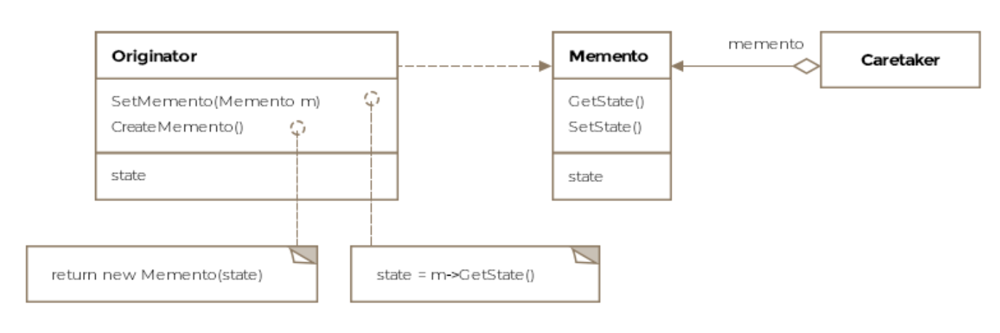

# Memento Pattern

> *Capture an object's internal state without exposing its structure — so the object can be restored to that state later.*

The Memento is a **Behavioral** design pattern that enables **undo**, **rollback**, and **snapshot** functionality. It solves a subtle but important problem: how do you save an object's state without breaking encapsulation?

---

## What Is It?

A *memento* is a keepsake — an object held as a reminder of something. The software pattern works exactly that way: it captures a snapshot of an object's state at a moment in time and holds it so the object can be restored to that exact state later.

### The Encapsulation Problem

The naive approach to saving state is to expose all the object's fields so external code can read and store them:

```java
// BAD — breaks encapsulation
SavedState state = new SavedState(
    blackBox.getAltitude(),
    blackBox.getSpeed(),
    blackBox.getEngineTemp()
);
```

This is brittle. If you add, rename, or remove a field in the originator, every piece of code that saves state must change too. It also exposes internal implementation details that clients have no business knowing.

The Memento pattern fixes this by having **the object itself create its own snapshot** — no external class needs to know what's inside.

> **Formal definition:** Without violating encapsulation, capture and externalize an object's internal state so that the object can be restored to this state later.

---

## The Three Roles

| Role | Responsibility |
|---|---|
| **Originator** | The object whose state we want to save. Creates mementos and restores from them. |
| **Memento** | The snapshot object. Stores the originator's state. Opaque to the outside world. |
| **Caretaker** | Holds the memento. Knows *when* to save and restore, but never reads the memento's contents. |

### How They Interact

```
Caretaker                     Originator
────────────                  ─────────────────────
1. "Save your state" ──────►  createMemento()
                              │
                              │ packs internal state → Memento
                              ▼
                         ┌─────────────┐
                         │   Memento   │ ◄── Caretaker holds this
                         │  (opaque)   │
                         └─────────────┘
                              │
2. "Restore this" ───────────►│
                              │ unpacks state from Memento
                              ▼
                          State restored ✅
```

---

## Class Diagram

```
  ┌─────────────────────────────────────┐
  │           Originator                │
  │  (BlackBox)                         │
  │─────────────────────────────────────│
  │ - altitude: long                    │
  │ - speed: double                     │
  │ - engineTemperature: float          │
  │─────────────────────────────────────│
  │ + getState(): byte[]   ─────────────┼────► creates Memento
  │ + setState(byte[]): BlackBox ───────┼◄──── restores from Memento
  └─────────────────────────────────────┘
                   │
                   │ creates / restores
                   ▼
  ┌─────────────────────────────────────┐
  │             Memento                 │
  │          (byte[] snapshot)          │
  │─────────────────────────────────────│
  │  Opaque to Caretaker —              │
  │  only Originator can interpret it   │
  └─────────────────────────────────────┘
                   ▲
                   │ holds (but never reads)
  ┌─────────────────────────────────────┐
  │            Caretaker                │
  │            (Client)                 │
  │─────────────────────────────────────│
  │ - memento: byte[]                   │
  │─────────────────────────────────────│
  │ + saveState()                       │
  │ + restoreState()                    │
  └─────────────────────────────────────┘
```


---

## Example: Aircraft Black Box ✈️📦

Modern aircraft have a flight data recorder — the **black box** — that stores critical flight parameters. We want to be able to snapshot this data and restore from it, without exposing the sensitive internals to external classes.

### The Originator — BlackBox

```java
public class BlackBox implements Serializable {

    private long  altitude;
    private double speed;
    private float  engineTemperature;
    private static final long serialVersionUID = 1L;

    public BlackBox(long altitude, double speed, float engineTemperature) {
        this.altitude          = altitude;
        this.speed             = speed;
        this.engineTemperature = engineTemperature;
    }

    // Simulate some flight changes
    public void fly(long newAltitude, double newSpeed) {
        this.altitude = newAltitude;
        this.speed    = newSpeed;
        System.out.printf("[BlackBox] Flying: altitude=%d, speed=%.1f%n", altitude, speed);
    }

    // Create a memento — serialize the entire object state to a byte array
    public byte[] getState() throws IOException {
        ByteArrayOutputStream bos = new ByteArrayOutputStream();
        try (ObjectOutputStream out = new ObjectOutputStream(bos)) {
            out.writeObject(this);
            out.flush();
        }
        System.out.println("[BlackBox] State saved to memento.");
        return bos.toByteArray();
    }

    // Restore from memento — deserialize and return restored object
    public BlackBox setState(byte[] memento) throws Exception {
        try (ObjectInputStream in = new ObjectInputStream(
                new ByteArrayInputStream(memento))) {
            BlackBox restored = (BlackBox) in.readObject();
            System.out.printf("[BlackBox] State restored: altitude=%d, speed=%.1f%n",
                    restored.altitude, restored.speed);
            return restored;
        }
    }

    @Override
    public String toString() {
        return String.format("BlackBox[altitude=%d, speed=%.1f, engineTemp=%.1f]",
                altitude, speed, engineTemperature);
    }
}
```

### The Caretaker — Client

```java
public class Client {

    public void main() throws Exception {

        BlackBox blackBox = new BlackBox(35000, 550.0f, 180.0f);
        System.out.println("Initial: " + blackBox);

        // === SAVE STATE (create memento) ===
        byte[] memento = blackBox.getState();
        // [BlackBox] State saved to memento.

        // === SOME WORK — state changes ===
        blackBox.fly(28000, 400.0f);
        System.out.println("After descent: " + blackBox);

        blackBox.fly(15000, 250.0f);
        System.out.println("On approach: " + blackBox);

        // === RESTORE STATE (revert to checkpoint) ===
        blackBox = blackBox.setState(memento);
        // [BlackBox] State restored: altitude=35000, speed=550.0
        System.out.println("After restore: " + blackBox);
    }
}
```

**Output:**
```
Initial: BlackBox[altitude=35000, speed=550.0, engineTemp=180.0]
[BlackBox] State saved to memento.
[BlackBox] Flying: altitude=28000, speed=400.0
After descent: BlackBox[altitude=28000, speed=400.0, engineTemp=180.0]
[BlackBox] Flying: altitude=15000, speed=250.0
On approach: BlackBox[altitude=15000, speed=250.0, engineTemp=180.0]
[BlackBox] State restored: altitude=35000, speed=550.0
After restore: BlackBox[altitude=35000, speed=550.0, engineTemp=180.0]
```

> **Key insight:** The caretaker (`Client`) holds the `byte[]` memento but has no idea what's inside it. It can't read `altitude`, `speed`, or `engineTemperature` — those are inaccessible. Only `BlackBox` knows how to interpret its own snapshot.

---

## Memento with a Dedicated Memento Class

The byte-array approach works but is somewhat opaque. A cleaner implementation uses a dedicated inner class as the memento — Java's inner class mechanism naturally enforces access control:

```java
public class FlightRecorder {

    private long   altitude;
    private double speed;
    private float  engineTemp;

    public FlightRecorder(long altitude, double speed, float engineTemp) {
        this.altitude   = altitude;
        this.speed      = speed;
        this.engineTemp = engineTemp;
    }

    // Memento is a nested class — Caretaker can hold it but can't read it
    public static class Snapshot {
        // All fields are package-private — inaccessible to Caretaker
        private final long   altitude;
        private final double speed;
        private final float  engineTemp;

        private Snapshot(long altitude, double speed, float engineTemp) {
            this.altitude   = altitude;
            this.speed      = speed;
            this.engineTemp = engineTemp;
        }
    }

    // Originator creates its own memento
    public Snapshot save() {
        System.out.println("[FlightRecorder] Saving checkpoint...");
        return new Snapshot(altitude, speed, engineTemp);
    }

    // Originator restores from memento — has full access to Snapshot's private fields
    public void restore(Snapshot snapshot) {
        this.altitude   = snapshot.altitude;
        this.speed      = snapshot.speed;
        this.engineTemp = snapshot.engineTemp;
        System.out.println("[FlightRecorder] Checkpoint restored.");
    }

    public void update(long altitude, double speed) {
        this.altitude = altitude;
        this.speed    = speed;
    }
}
```

**Usage:**
```java
FlightRecorder recorder = new FlightRecorder(35000, 550.0, 180.0);

// Caretaker holds the snapshot — but can't read its contents
FlightRecorder.Snapshot checkpoint = recorder.save();

recorder.update(15000, 250.0);  // simulate a change

recorder.restore(checkpoint);   // revert to saved state
```

---

## Multiple Checkpoints — Undo History

The real power of the Memento pattern emerges when multiple snapshots are maintained:

```java
public class FlightController {

    private FlightRecorder recorder;
    private Deque<FlightRecorder.Snapshot> history = new ArrayDeque<>();

    public void executeManeuver(long altitude, double speed) {
        history.push(recorder.save());    // save before each change
        recorder.update(altitude, speed);
        System.out.printf("Maneuver: alt=%d speed=%.1f%n", altitude, speed);
    }

    public void undoLastManeuver() {
        if (!history.isEmpty()) {
            recorder.restore(history.pop());  // revert to previous state
            System.out.println("Last maneuver undone.");
        } else {
            System.out.println("Nothing to undo.");
        }
    }
}
```

```
history:  [snap3, snap2, snap1]
               ↑
          most recent undo target

undo() → pops snap3 → restores to state before last maneuver
undo() → pops snap2 → restores to state before that
undo() → pops snap1 → back to original state
undo() → nothing to undo
```

---

## Incremental (Differential) Mementos

For objects with large state, storing full snapshots on every change is expensive. Instead, store only what changed:

```java
public class DifferentialSnapshot {
    private Map<String, Object> changes;  // only the delta, not the full state

    public DifferentialSnapshot(Map<String, Object> changes) {
        this.changes = changes;
    }

    public Map<String, Object> getChanges() { return changes; }
}

// Store only the fields that changed since the last snapshot
// → dramatically reduces memory usage for large objects
```

---

## Real-World Examples

### `java.io.Serializable`

All classes implementing `Serializable` support the Memento pattern — their state can be serialized (snapshotted) and deserialized (restored):

```java
// Serialize to disk (create memento)
ObjectOutputStream out = new ObjectOutputStream(new FileOutputStream("state.dat"));
out.writeObject(myObject);

// Deserialize from disk (restore from memento)
ObjectInputStream in = new ObjectInputStream(new FileInputStream("state.dat"));
MyObject restored = (MyObject) in.readObject();
```

### `javax.faces.component.StateHolder`

JSF components implement `StateHolder` to save and restore their state between HTTP requests — the web framework is the caretaker, components are originators.

### Text Editor Undo

```
User types "Hello"     → Snapshot: ""
User types " World"    → Snapshot: "Hello"
User types "!"         → Snapshot: "Hello World"
User presses Ctrl+Z    → restore "Hello World"
User presses Ctrl+Z    → restore "Hello"
User presses Ctrl+Z    → restore ""
```

### Video Game Save Points

```
Player reaches checkpoint → game creates Memento (save file)
Player dies later        → game restores from Memento
                           (player respawns at checkpoint, not game start)
```

The game server is the caretaker. The save file is the memento. The game state object is the originator. The player triggers save/restore but doesn't manage the internal state directly.

---

## Memento vs. Related Patterns

| Pattern | Relationship |
|---|---|
| **Command** | Command's `unexecute()` often uses Memento to capture the state needed to reverse an action |
| **Iterator** | Iterator can use Memento to save and restore its traversal position (bookmarking) |
| **Prototype** | Both involve copying state — Prototype clones the object itself; Memento saves just the state for later restoration |
| **Serialization** | Java serialization is essentially the Memento pattern — state serialized to bytes, later deserialized to restore |

---

## Caveats & Gotchas

| Caveat | Details |
|---|---|
| **Memory cost** | Storing full snapshots of large objects frequently can consume significant memory. Use incremental (differential) mementos or limit history depth. |
| **Java inner class access** | The inner `Snapshot` class pattern works well in Java to restrict caretaker access — but requires careful design. In languages without inner classes, another mechanism (interfaces with limited visibility) may be needed. |
| **`this` can't be reassigned** | In Java, `setState()` must return the restored object for the caller to reassign it — you can't do `this = restored`. In C++, this is possible via pointer reassignment. |
| **Caretaker responsibility** | The caretaker is responsible for managing memento lifecycle — storing, discarding, and deciding when to restore. Without careful management, old mementos accumulate. |
| **Shallow vs. deep copy** | If the originator contains references to mutable objects, the memento must deep-copy them — otherwise, restoring the memento may restore a stale reference to a changed object. |

---

## When to Use the Memento Pattern

✅ You need to snapshot an object's state and restore it later (undo, rollback, checkpoints)  
✅ A direct interface to the object's state would expose implementation details or break encapsulation  
✅ You want the object itself to control what state gets saved — not external code  
✅ You're implementing undo/redo, transaction rollback, or save-game functionality  
✅ You want to shift state-management responsibility from the object to the caretaker  

❌ Avoid when the object's state is very large and snapshots would consume too much memory  
❌ Avoid when the caretaker needs to inspect or manipulate the saved state — use a more explicit data-transfer approach instead