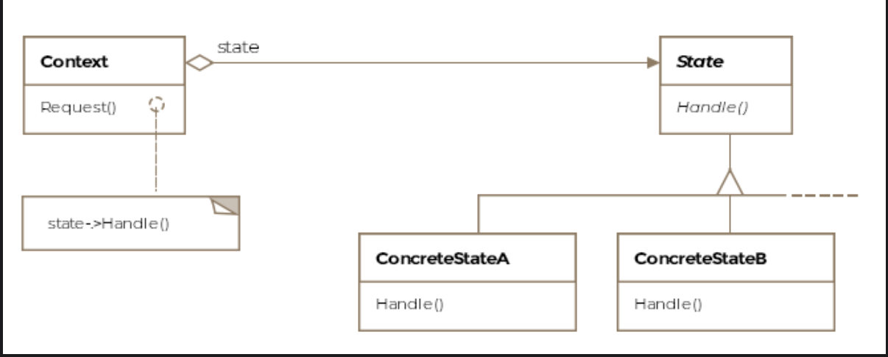
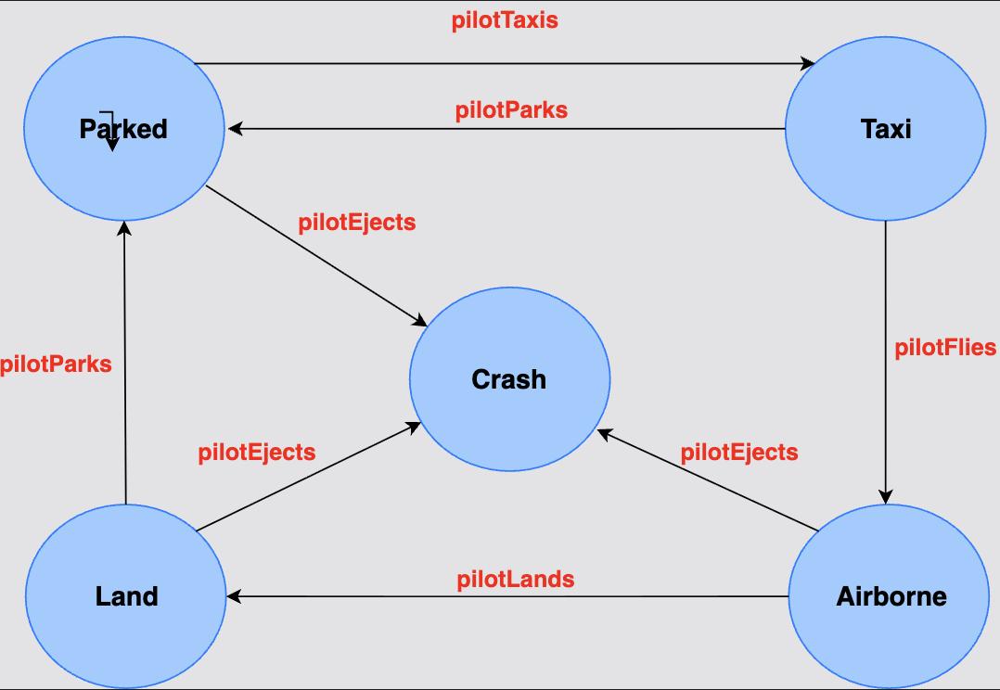

# State Pattern

> *Allow an object to alter its behavior when its internal state changes — so that it appears to change its class.*

The State is a **Behavioral** design pattern that replaces tangled `if-else` or `switch` state logic with dedicated state classes. Each state encapsulates its own behavior, and the object (context) delegates all actions to the current state object — switching cleanly between states as actions are taken.

---

## What Is It?

Many objects have a lifecycle — they exist in different states and behave differently depending on which state they're in. A traffic light is red, yellow, or green. A vending machine is idle, has-selection, or dispensing. An aircraft is parked, taxiing, airborne, landing, or crashed.

The naive approach embeds all state-dependent behavior in a single class using conditionals:

```java
// BAD — grows without bounds as states and actions increase
public void pilotTaxies(String currentState) {
    if (currentState.equals("Parked")) {
        currentState = "Taxi";
    } else if (currentState.equals("Airborne")) {
        System.out.println("Invalid operation");
    } else if (currentState.equals("Crashed")) {
        System.out.println("Invalid operation");
    }
    // ... more and more cases
}
```

Add a new state → touch every method. Add a new action → add a new conditional ladder. This is a maintenance nightmare.

The State pattern **replaces each state with a class** and moves all state-specific behavior into that class. The context simply delegates to its current state object.

> **Formal definition:** Allow an object to alter its behavior when its internal state changes so that it appears to change its class.

---

## State Diagram — F-16 Lifecycle

```
                  ┌─────────────────────┐
                  │      Parked         │ ← initial state
                  └─────────────────────┘
                     │           │
               taxi  │           │ eject
                     ▼           ▼
                  ┌──────┐   ┌─────────┐
                  │ Taxi │   │ Crashed │ ← terminal state (no exit)
                  └──────┘   └─────────┘
                     │   │
              fly    │   │ park
                     │   ▼
                     │ ┌────────┐
                     │ │ Parked │
                     ▼
                ┌──────────┐
                │ Airborne │
                └──────────┘
                     │   │
              land   │   │ eject
                     ▼   ▼
                ┌──────┐ ┌─────────┐
                │ Land │ │ Crashed │
                └──────┘ └─────────┘
                    │
              taxi  │
                    ▼
                ┌──────┐
                │ Taxi │
                └──────┘
```

| Current State | Valid Transitions |
|---|---|
| **Parked** | → Taxi (taxi action), → Crashed (eject) |
| **Taxi** | → Airborne (fly action), → Parked (park action) |
| **Airborne** | → Land (land action), → Crashed (eject) |
| **Land** | → Taxi (taxi action) |
| **Crashed** | No transitions — terminal state |

---

## Class Diagram

```
  ┌─────────────────────────────────────────────┐
  │                F16 (Context)                │
  │─────────────────────────────────────────────│
  │ - state: IPilotActions  ← current state     │
  │ - parkedState: ParkedState                  │
  │ - taxiState: TaxiState                      │
  │ - airborneState: AirborneState              │
  │ - landState: LandState                      │
  │ - crashState: CrashState                    │
  │─────────────────────────────────────────────│
  │ + startsEngine()  → delegates to state      │
  │ + fliesPlane()    → delegates to state      │
  │ + landsPlane()    → delegates to state      │
  │ + ejectsPlane()   → delegates to state      │
  │ + parksPlane()    → delegates to state      │
  │ + setState(IPilotActions)                   │
  └─────────────────────────────────────────────┘
                       │ delegates to
                       ▼
  ┌─────────────────────────────────────────────┐
  │         «interface» IPilotActions           │  ← State
  │─────────────────────────────────────────────│
  │ + pilotTaxies(F16): void                    │
  │ + pilotFlies(F16): void                     │
  │ + pilotEjects(F16): void                    │
  │ + pilotLands(F16): void                     │
  │ + pilotParks(F16): void                     │
  └─────────────────────────────────────────────┘
                       ▲
      ┌────────────────┼────────────────────┐
      │                │                   │
 ┌──────────┐   ┌────────────┐   ┌──────────────┐  ...
 │ Parked   │   │  TaxiState │   │ AirborneState│
 │  State   │   │────────────│   │──────────────│
 │──────────│   │ pilotTaxies│   │ pilotTaxies  │
 │pilotTaxies│  │   → fly    │   │  → invalid   │
 │  → Taxi  │   │ pilotFlies │   │ pilotFlies   │
 │pilotFlies│   │ → Airborne │   │  → invalid   │
 │ → invalid│   └────────────┘   │ pilotLands   │
 └──────────┘                    │  → Land      │
                                 └──────────────┘
```


---

## Step 1 — The State Interface

```java
/**
 * Defines all actions a pilot can take.
 * Each action moves the aircraft into a different state.
 */
public interface IPilotActions {
    void pilotTaxies(F16 f16);
    void pilotFlies(F16 f16);
    void pilotEjects(F16 f16);
    void pilotLands(F16 f16);
    void pilotParks(F16 f16);
}
```

---

## Step 2 — Concrete State Classes

### ParkedState

```java
public class ParkedState implements IPilotActions {

    F16 f16;

    public ParkedState(F16 f16) {
        this.f16 = f16;
    }

    @Override
    public void pilotTaxies(F16 f16) {
        System.out.println("[Parked] Starting engine — moving to runway.");
        f16.setState(f16.getTaxiState());
    }

    @Override
    public void pilotFlies(F16 f16) {
        System.out.println("[Parked] Cannot fly from parked — must taxi first.");
    }

    @Override
    public void pilotEjects(F16 f16) {
        System.out.println("[Parked] Emergency ejection from parked position!");
        f16.setState(f16.getCrashState());
    }

    @Override
    public void pilotLands(F16 f16) {
        System.out.println("[Parked] Already on the ground.");
    }

    @Override
    public void pilotParks(F16 f16) {
        System.out.println("[Parked] Already parked.");
    }
}
```

### TaxiState

```java
public class TaxiState implements IPilotActions {

    F16 f16;

    public TaxiState(F16 f16) {
        this.f16 = f16;
    }

    @Override
    public void pilotTaxies(F16 f16) {
        System.out.println("[Taxi] Already taxiing on the runway.");
    }

    @Override
    public void pilotFlies(F16 f16) {
        System.out.println("[Taxi] Full throttle — taking off!");
        f16.setState(f16.getAirborneState());
    }

    @Override
    public void pilotEjects(F16 f16) {
        System.out.println("[Taxi] Emergency ejection on runway!");
        f16.setState(f16.getCrashState());
    }

    @Override
    public void pilotLands(F16 f16) {
        System.out.println("[Taxi] Not airborne — cannot land.");
    }

    @Override
    public void pilotParks(F16 f16) {
        System.out.println("[Taxi] Returning to hangar.");
        f16.setState(f16.getParkedState());
    }
}
```

### AirborneState

```java
public class AirborneState implements IPilotActions {

    F16 f16;

    public AirborneState(F16 f16) {
        this.f16 = f16;
    }

    @Override
    public void pilotTaxies(F16 f16) {
        System.out.println("[Airborne] Cannot taxi mid-air.");
    }

    @Override
    public void pilotFlies(F16 f16) {
        System.out.println("[Airborne] Already flying at altitude.");
    }

    @Override
    public void pilotEjects(F16 f16) {
        System.out.println("[Airborne] Ejecting at altitude — aircraft lost!");
        f16.setState(f16.getCrashState());
    }

    @Override
    public void pilotLands(F16 f16) {
        System.out.println("[Airborne] Descending for landing approach.");
        f16.setState(f16.getLandState());
    }

    @Override
    public void pilotParks(F16 f16) {
        System.out.println("[Airborne] Cannot park mid-air.");
    }
}
```

### LandState

```java
public class LandState implements IPilotActions {

    F16 f16;

    public LandState(F16 f16) {
        this.f16 = f16;
    }

    @Override
    public void pilotTaxies(F16 f16) {
        System.out.println("[Land] Cleared runway — taxiing to hangar.");
        f16.setState(f16.getTaxiState());
    }

    @Override
    public void pilotFlies(F16 f16) {
        System.out.println("[Land] Must taxi before taking off again.");
    }

    @Override
    public void pilotEjects(F16 f16) {
        System.out.println("[Land] Emergency on landing — ejecting!");
        f16.setState(f16.getCrashState());
    }

    @Override
    public void pilotLands(F16 f16) {
        System.out.println("[Land] Already on the ground.");
    }

    @Override
    public void pilotParks(F16 f16) {
        System.out.println("[Land] Must taxi to parking area first.");
    }
}
```

### CrashState (Terminal — no valid transitions out)

```java
public class CrashState implements IPilotActions {

    F16 f16;

    public CrashState(F16 f16) {
        this.f16 = f16;
    }

    @Override public void pilotTaxies(F16 f16) { invalid(); }
    @Override public void pilotFlies(F16 f16)  { invalid(); }
    @Override public void pilotEjects(F16 f16) { invalid(); }
    @Override public void pilotLands(F16 f16)  { invalid(); }
    @Override public void pilotParks(F16 f16)  { invalid(); }

    private void invalid() {
        System.out.println("[Crashed] Aircraft destroyed — no operations possible.");
    }
}
```

---

## Step 3 — The Context (F16)

```java
public class F16 implements IAircraft {

    // All possible states created at construction — stored as flyweights
    private ParkedState   parkedState   = new ParkedState(this);
    private TaxiState     taxiState     = new TaxiState(this);
    private AirborneState airborneState = new AirborneState(this);
    private LandState     landState     = new LandState(this);
    private CrashState    crashState    = new CrashState(this);

    // Current state — starts parked
    private IPilotActions state = parkedState;

    // Actions — all delegate to the current state
    public void startsEngine()  { state.pilotTaxies(this); }
    public void fliesPlane()    { state.pilotFlies(this);  }
    public void landsPlane()    { state.pilotLands(this);  }
    public void ejectsPlane()   { state.pilotEjects(this); }
    public void parksPlane()    { state.pilotParks(this);  }

    // State accessors — used by state classes to perform transitions
    public void setState(IPilotActions state) { this.state = state; }
    public IPilotActions getCurrentState()    { return state; }

    public ParkedState   getParkedState()   { return parkedState;   }
    public TaxiState     getTaxiState()     { return taxiState;     }
    public AirborneState getAirborneState() { return airborneState; }
    public LandState     getLandState()     { return landState;     }
    public CrashState    getCrashState()    { return crashState;    }
}
```

---

## Step 4 — Client Usage

```java
public class Client {

    public void main() {

        F16 f16 = new F16();

        // Normal flight sequence
        f16.startsEngine();   // Parked → Taxi
        f16.fliesPlane();     // Taxi → Airborne
        f16.landsPlane();     // Airborne → Land
        f16.startsEngine();   // Land → Taxi
        f16.parksPlane();     // Taxi → Parked

        System.out.println("--- Emergency scenario ---");

        f16.startsEngine();   // Parked → Taxi
        f16.fliesPlane();     // Taxi → Airborne
        f16.ejectsPlane();    // Airborne → Crashed

        // Trying to operate a crashed plane
        f16.startsEngine();   // [Crashed] Aircraft destroyed — no operations possible.
    }
}
```

**Output:**
```
[Parked] Starting engine — moving to runway.
[Taxi] Full throttle — taking off!
[Airborne] Descending for landing approach.
[Land] Cleared runway — taxiing to hangar.
[Taxi] Returning to hangar.
--- Emergency scenario ---
[Parked] Starting engine — moving to runway.
[Taxi] Full throttle — taking off!
[Airborne] Ejecting at altitude — aircraft lost!
[Crashed] Aircraft destroyed — no operations possible.
```

> **Key insight:** The client never checks the current state. It just calls `f16.fliesPlane()` and the correct behavior happens automatically — determined by which state object `f16` is currently holding. Adding a new state requires only a new class and updates to the relevant transitions, not a new conditional in every method.

---

## How a State Transition Flows

```
Client calls: f16.fliesPlane()
       │
       │ F16 delegates to current state object
       ▼
TaxiState.pilotFlies(f16)
       │
       ├── prints "[Taxi] Full throttle — taking off!"
       │
       └── f16.setState(f16.getAirborneState())
                   │
                   └── f16.state = airborneState ✅

Next call: f16.landsPlane()
       │
       │ F16 delegates to new current state
       ▼
AirborneState.pilotLands(f16)
       │
       └── f16.setState(f16.getLandState()) ✅
```

---

## State vs. Strategy — A Critical Distinction

The two patterns are structurally similar (both delegate behavior to a composed object) but differ in **intent and who controls transitions**:

| | State Pattern | Strategy Pattern |
|---|---|---|
| **Intent** | Object changes behavior as its internal state changes | Client selects and swaps an algorithm explicitly |
| **Who controls transitions** | The state objects themselves (or the context) | The client — it composes the context with the right strategy |
| **Client awareness** | Client is unaware of which state the context is in | Client knowingly selects a strategy |
| **Object appears to** | Change its class | Execute a different algorithm |
| **Transitions** | Automatic, based on actions | Manual, decided by client |

```java
// Strategy — CLIENT decides the algorithm
sorter.setStrategy(new QuickSortStrategy());
sorter.sort(data);

// State — STATE OBJECT decides the next state
f16.fliesPlane();  // client doesn't know or care which state runs this
```

---

## States as Flyweights

If state objects contain **no instance-specific data** (only behavior), they can be shared across multiple context objects — implementing the Flyweight pattern:

```java
// All F16 instances share the same state objects
static ParkedState   PARKED   = new ParkedState();
static TaxiState     TAXI     = new TaxiState();
static AirborneState AIRBORNE = new AirborneState();

// State methods take the context as a parameter instead of storing it
public void pilotFlies(F16 f16) {
    f16.setState(AIRBORNE);
}
```

This reduces memory consumption significantly when many context objects exist simultaneously (e.g., thousands of aircraft in a simulation).

---

## Real-World Examples

### `javax.faces.lifecycle.LifeCycle`

JSF's lifecycle processes HTTP requests through a series of phases (Restore View, Apply Request Values, Process Validations, Update Model, Invoke Application, Render Response). Each phase is a state — the lifecycle context delegates to the current phase and advances automatically.

### TCP Connection State Machine

```
CLOSED → SYN_SENT → ESTABLISHED → FIN_WAIT_1 → FIN_WAIT_2 → TIME_WAIT → CLOSED
```

Each TCP connection is a state machine with well-defined transitions. The State pattern is the natural model — each state handles the connection's response to incoming packets differently.

### Vending Machine

```
Idle → HasSelection → HasMoney → Dispensing → Idle
          ↑________________________↓ (insufficient funds → back to HasSelection)
```

### Order Management System

```
Pending → Confirmed → Shipped → Delivered
              ↓
           Cancelled (terminal)
```

Each order state determines what operations are valid (you can't ship a cancelled order; you can't cancel a delivered order).

---

## Caveats & Gotchas

| Caveat | Details |
|---|---|
| **Class proliferation** | Each state requires a class. For objects with many states, this grows. Consider whether a simpler state machine (enum + switch) suffices for small state spaces. |
| **State initialization** | The context pre-creates all state objects in our example. An alternative is lazy initialization — only create a state object when first entered — useful when state objects are heavyweight. |
| **Flyweight applicability** | If state classes contain no instance-specific fields (only methods), make them singletons or flyweights to save memory — especially relevant when many context objects share the same states. |
| **Initial state configuration** | The context defaults to a starting state, but clients can configure a different initial state at instantiation time if the object can legitimately start in multiple states. |
| **Transition responsibility** | Transitions can be managed by state objects (as in our example) or by the context. Centralizing in the context makes all transitions visible in one place; distributing to states makes each state's behavior self-contained. |

---

## When to Use the State Pattern

✅ An object's behavior depends on its current state and must change at runtime  
✅ Operations have large multi-part conditional logic depending on the object's state  
✅ States and transitions are numerous and likely to change or grow over time  
✅ You want each state's behavior to be self-contained and independently testable  
✅ You want to eliminate state-checking conditionals scattered across methods  

❌ Avoid when there are only 2-3 states with simple, stable logic — an enum or boolean flag is simpler  
❌ Avoid when state transitions are rarely needed or the object rarely changes state