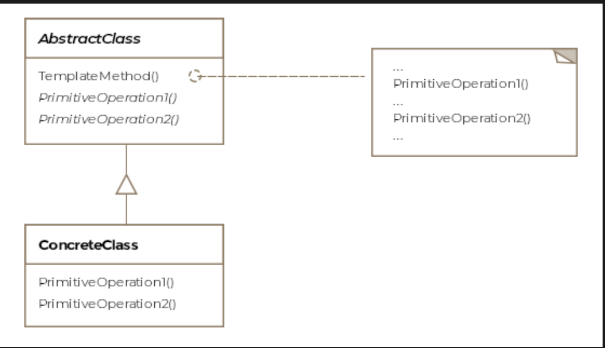

# Template Method Pattern

> *Define the skeleton of an algorithm in an abstract class, deferring some steps to subclasses — without modifying the overall structure of the algorithm.*

The Template Method is a **Behavioral** design pattern that captures the invariant parts of an algorithm in a base class and lets subclasses fill in the variable parts. It's the backbone of most frameworks — defining *what* happens and *when*, while letting developers customize *how* individual steps work.

---

## What Is It?

Think of a résumé template. The structure is fixed — personal info, work experience, education, skills — but the specific content in each section is yours to fill in. The Template Method pattern works exactly the same way for algorithms.

The abstract class defines:
- **The skeleton** — the overall sequence of steps, fixed and non-negotiable
- **Mandatory steps** — marked `final`; subclasses cannot override these
- **Abstract steps** — subclasses *must* provide an implementation
- **Hooks** — optional steps with a default implementation; subclasses *may* override

```
Abstract Class (template)            Subclass (customization)
──────────────────────────           ──────────────────────────
runChecklist() ← final               cannot override
  step1()      ← final               cannot override
  step2()      ← hook (default)      may override
  step3()      ← abstract            MUST override
```

> **Formal definition:** Allow subclasses to define parts of an algorithm without modifying the overall structure of the algorithm.

---

## Template Methods vs. Hooks vs. Final Methods

| Method Type | Defined In | Subclass Can Override? | Purpose |
|---|---|---|---|
| **Template method** | Abstract class (`final`) | ❌ No | Defines the skeleton / algorithm sequence |
| **Abstract step** | Abstract class (`abstract`) | ✅ Yes (required) | Forces subclass to provide specific behavior |
| **Hook** | Abstract class (default implementation) | ✅ Yes (optional) | Optional customization point |
| **Final step** | Abstract class (`final`) | ❌ No | Mandatory invariant step — same for all subclasses |

---

## Class Diagram

```
  ┌──────────────────────────────────────────────────┐
  │            «abstract»                            │
  │       AbstractPreFlightCheckList                 │  ← Abstract Class
  │──────────────────────────────────────────────────│
  │ + runChecklist(): void  [final]                  │ ← template method
  │   → calls: isFuelEnough()                        │
  │             doorsLocked()                        │
  │             checkAirPressure()                   │
  │──────────────────────────────────────────────────│
  │ # isFuelEnough(): void  [final]                  │ ← invariant step
  │ # doorsLocked(): boolean  [hook, default=true]   │ ← optional override
  │ # checkAirPressure(): void  [abstract]           │ ← MUST override
  └──────────────────────────────────────────────────┘
                         ▲
             ┌───────────┴────────────┐
             │                        │
  ┌──────────────────────┐  ┌──────────────────────────┐
  │  F16PreFlightCheckList│  │Boeing747PreFlightCheckList│
  │──────────────────────│  │──────────────────────────│
  │ checkAirPressure()   │  │ checkAirPressure()       │
  │  → cockpit pressure  │  │  → cabin + cockpit       │
  │ doorsLocked()        │  │ doorsLocked()            │
  │  → no doors, true    │  │  → verify all 8 doors    │
  └──────────────────────┘  └──────────────────────────┘
```

---

## Example: Pre-Flight Checklist ✈️

Before every flight, pilots run through a mandatory checklist. Most of it is the same regardless of aircraft type, but some checks are aircraft-specific. The Template Method pattern captures the common structure once, letting each aircraft type plug in its own specifics.

### Step 1 — The Abstract Class (the template)

```java
public abstract class AbstractPreFlightCheckList {

    /**
     * THE TEMPLATE METHOD — defines the sequence.
     * Marked final: no subclass can reorder or skip steps.
     */
    final public void runChecklist() {
        System.out.println("=== Pre-Flight Checklist Starting ===");
        isFuelEnough();       // invariant — same for every aircraft
        doorsLocked();        // hook — optional override
        checkAirPressure();   // abstract — must be customized
        System.out.println("=== Pre-Flight Checklist Complete ===\n");
    }

    /**
     * INVARIANT STEP — marked final.
     * Fuel check logic is identical for all aircraft.
     */
    final protected void isFuelEnough() {
        System.out.println("[✓] Fuel gauge checked — sufficient for flight.");
    }

    /**
     * HOOK — optional override.
     * Default implementation returns true.
     * Aircraft without doors can ignore this.
     */
    protected boolean doorsLocked() {
        System.out.println("[✓] Doors locked (default check).");
        return true;
    }

    /**
     * ABSTRACT STEP — mandatory override.
     * Each aircraft type has different pressure systems.
     */
    abstract protected void checkAirPressure();
}
```

### Step 2 — Concrete Subclasses

**F-16 Pre-Flight Checklist:**

```java
public class F16PreFlightCheckList extends AbstractPreFlightCheckList {

    @Override
    protected void checkAirPressure() {
        // F-16 has a single cockpit — check cockpit pressure only
        System.out.println("[✓] F-16 cockpit air pressure: 14.7 psi — nominal.");
    }

    @Override
    protected boolean doorsLocked() {
        // F-16 has no passenger doors — override hook to skip check
        System.out.println("[–] F-16 has no doors to lock — skipping.");
        return true;
    }
}
```

**Boeing 747 Pre-Flight Checklist:**

```java
public class Boeing747PreFlightCheckList extends AbstractPreFlightCheckList {

    @Override
    protected void checkAirPressure() {
        // Boeing 747 has cabin AND cockpit — check both
        System.out.println("[✓] Boeing 747 cabin pressure: 11.5 psi — nominal.");
        System.out.println("[✓] Boeing 747 cockpit pressure: 14.7 psi — nominal.");
    }

    @Override
    protected boolean doorsLocked() {
        // Boeing 747 has 8 doors — verify all are sealed
        System.out.println("[✓] All 8 Boeing 747 doors verified and locked.");
        return true;
    }
}
```

**Military Transport (uses default door hook):**

```java
public class C130PreFlightCheckList extends AbstractPreFlightCheckList {

    @Override
    protected void checkAirPressure() {
        System.out.println("[✓] C-130 cargo bay and cockpit pressures nominal.");
    }

    // No override of doorsLocked() — default implementation is sufficient
}
```

---

### Step 3 — Client Usage

```java
public class Client {

    public void main() {

        AbstractPreFlightCheckList f16Checklist = new F16PreFlightCheckList();
        f16Checklist.runChecklist();

        AbstractPreFlightCheckList boeingChecklist = new Boeing747PreFlightCheckList();
        boeingChecklist.runChecklist();

        AbstractPreFlightCheckList c130Checklist = new C130PreFlightCheckList();
        c130Checklist.runChecklist();
    }
}
```

**Output:**
```
=== Pre-Flight Checklist Starting ===
[✓] Fuel gauge checked — sufficient for flight.
[–] F-16 has no doors to lock — skipping.
[✓] F-16 cockpit air pressure: 14.7 psi — nominal.
=== Pre-Flight Checklist Complete ===

=== Pre-Flight Checklist Starting ===
[✓] Fuel gauge checked — sufficient for flight.
[✓] All 8 Boeing 747 doors verified and locked.
[✓] Boeing 747 cabin pressure: 11.5 psi — nominal.
[✓] Boeing 747 cockpit pressure: 14.7 psi — nominal.
=== Pre-Flight Checklist Complete ===

=== Pre-Flight Checklist Starting ===
[✓] Fuel gauge checked — sufficient for flight.
[✓] Doors locked (default check).
[✓] C-130 cargo bay and cockpit pressures nominal.
=== Pre-Flight Checklist Complete ===
```

> **Key insight:** All three aircraft run through the **same sequence** of steps — defined once in `runChecklist()`. The sequence cannot be changed. But each aircraft customizes the steps that are specific to it. The `isFuelEnough()` step runs identically for all of them — zero duplication.

---

## How the Algorithm Flows

```
Client calls: boeingChecklist.runChecklist()
       │
       ▼
AbstractPreFlightCheckList.runChecklist()  [final — cannot be overridden]
  │
  ├── 1. isFuelEnough()          [final]     → same for all aircraft
  │
  ├── 2. doorsLocked()           [hook]      → Boeing747PreFlightCheckList.doorsLocked()
  │                                          → "All 8 doors verified and locked"
  │
  └── 3. checkAirPressure()      [abstract]  → Boeing747PreFlightCheckList.checkAirPressure()
                                             → checks cabin AND cockpit
```

---

## Avoiding Dependency Rot

Without the Template Method pattern, higher-level code depends on lower-level concrete classes — creating a fragile web of dependencies:

```
Without Template Method:
──────────────────────────
Client → F16CheckList
Client → BoeingCheckList
Client → C130CheckList
(Client depends on all concrete implementations)

With Template Method:
──────────────────────────
Client → AbstractPreFlightCheckList (high-level)
              ↑
         F16CheckList
         BoeingCheckList   (low-level depend on high-level)
         C130CheckList
```

Subclasses (low-level) depend on the abstract class (high-level) — not the other way around. This is the **Hollywood Principle**: *"Don't call us, we'll call you."* The abstract class calls the subclass methods when needed, not vice versa.

---

## Real-World Examples

### Java `InputStream`

```java
// Abstract method — subclasses MUST implement
public abstract int read() throws IOException;

// Template method — calls abstract read() internally
public int read(byte[] b, int off, int len) throws IOException {
    // ... validation ...
    for (int i = off; i < off + len; i++) {
        int c = read();  // calls the subclass implementation
        if (c == -1) break;
        b[i] = (byte) c;
    }
    return len;
}
```

`FileInputStream`, `ByteArrayInputStream`, and `BufferedInputStream` all override `read()` — the template method calls them at the right time.

### `javax.servlet.http.HttpServlet`

```java
// Template method in HttpServlet — defines the request handling skeleton
protected void service(HttpServletRequest req, HttpServletResponse res) {
    String method = req.getMethod();
    if (method.equals("GET"))  doGet(req, res);   // hook
    if (method.equals("POST")) doPost(req, res);  // hook
    if (method.equals("PUT"))  doPut(req, res);   // hook
}

// Developers override the hooks they care about:
public class MyServlet extends HttpServlet {
    @Override
    protected void doGet(HttpServletRequest req, HttpServletResponse res) {
        // custom GET handling
    }
}
```

### Kafka's `UncaughtExceptionHandler`

```java
// Kafka calls this hook when an uncaught exception occurs
streams.setUncaughtExceptionHandler((thread, throwable) -> {
    // developer customizes the response — restart, log, alert, etc.
    return StreamsUncaughtExceptionHandler.StreamThreadExceptionResponse.REPLACE_THREAD;
});
```

The framework controls the flow; developers customize specific steps.

### JUnit Test Lifecycle

```
@BeforeAll  → setup (hook)
@BeforeEach → setUp (hook)
  @Test     → test method (abstract — must be provided)
@AfterEach  → tearDown (hook)
@AfterAll   → cleanup (hook)
```

JUnit defines the test execution skeleton; the developer fills in the steps.

---

## Template Method vs. Strategy — A Key Distinction

| | Template Method | Strategy |
|---|---|---|
| **Mechanism** | Inheritance — subclass fills in steps | Composition — client injects an algorithm object |
| **Algorithm scope** | Subclass varies *parts* of the algorithm | Client selects the *entire* algorithm |
| **Coupling** | Subclass coupled to abstract class | Context coupled only to strategy interface |
| **Flexibility** | Fixed structure, variable steps | Entirely swappable algorithm |
| **Best for** | Frameworks with defined workflows | Runtime algorithm selection |

```java
// Template Method — inheritance, fixed structure
class F16CheckList extends AbstractPreFlightCheckList {
    void checkAirPressure() { /* custom */ }
}

// Strategy — composition, swappable whole algorithm
sorter.setStrategy(new QuickSort());  // entire algorithm swapped
```

---

## Relationship to Other Patterns

| Pattern | Relationship |
|---|---|
| **Factory Method** | Is a specialization of Template Method — the factory method is the "abstract step" that subclasses override to create different products |
| **Strategy** | Alternative to Template Method using composition instead of inheritance for varying behavior |
| **Hook (in frameworks)** | Hooks in frameworks (like Kafka, Spring) are Template Method pattern — the framework calls the hook at a defined point in its algorithm |

---

## Caveats & Gotchas

| Caveat | Details |
|---|---|
| **Minimize abstract steps** | The more steps a subclass must implement, the harder it is to use correctly. Keep mandatory overrides to the minimum necessary. |
| **Liskov Substitution** | Subclasses must correctly implement abstract steps — a misbehaving subclass (returning wrong values, throwing unexpected exceptions) breaks the algorithm silently. |
| **Don't confuse with Strategy** | Template Method uses inheritance and varies parts; Strategy uses composition and varies the whole. Use Strategy when you need runtime algorithm swapping. |
| **`final` on template method** | Always mark the template method `final` — if subclasses can override the skeleton itself, the pattern breaks entirely. |
| **Hook documentation** | Clearly document which methods are hooks (optional) vs. abstract (required). Without this, subclass authors won't know what they should or must override. |

---

## When to Use the Template Method Pattern

✅ Several classes share the same overall algorithm structure but differ in specific steps  
✅ You want to avoid code duplication by factoring out the invariant parts of an algorithm  
✅ You're building a framework and want to give developers controlled customization points  
✅ You want to enforce a fixed sequence of steps while allowing step-level customization  
✅ You want subclasses (lower-level) to depend on the abstract class (higher-level), not vice versa  

❌ Avoid when the algorithm structure itself varies — use Strategy instead  
❌ Avoid when inheritance creates too tight a coupling and composition would be more flexible  
❌ Avoid when there are too many abstract steps — it becomes burdensome to subclass