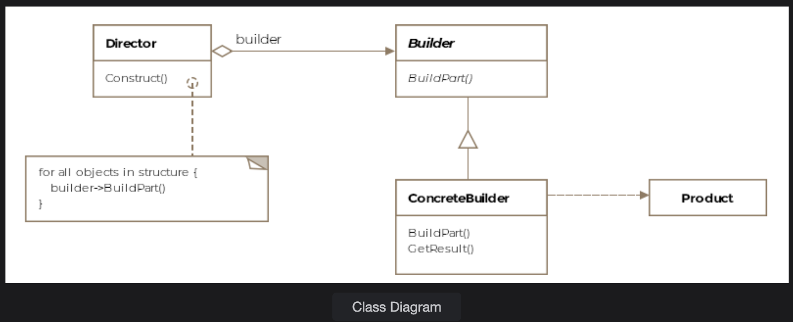

# Builder Pattern

> *Simplify complex object creation by separating construction from representation.*

The Builder pattern is one of the four **Creational** design patterns from the Gang of Four. It shines whenever object construction is complex, multi-step, or needs to produce different variations from the same process.

---

## What Is It?

Sometimes the objects we create are complex — made up of several sub-objects or requiring an elaborate, ordered construction process. The Builder pattern simplifies this by:

- **Encapsulating** the construction process behind a clean interface
- **Separating** how an object is built from what it ultimately looks like
- **Enabling** different representations (variants) to be produced using the same construction steps

> A Builder generally produces a **composite** or **aggregate** object — one made up of many parts assembled in sequence.

---

## Class Diagram

The Builder pattern consists of four key entities:

| Entity | Role |
|---|---|
| **Builder** | Abstract interface declaring all construction steps |
| **Concrete Builder** | Implements steps for a specific product variant |
| **Director** | Orchestrates the construction sequence |
| **Product** | The complex object being assembled |

```
         ┌─────────────┐
         │   Director  │
         │-------------|
         │ construct() │──────────────────────┐
         └─────────────┘                      │
                                              ▼
                                    ┌──────────────────┐
                                    │  «abstract»      │
                                    │  AircraftBuilder │
                                    │------------------|
                                    │ buildCockpit()   │
                                    │ buildEngine()    │
                                    │ buildWings()     │
                                    │ buildBathrooms() │
                                    │ getResult()      │
                                    └──────────────────┘
                                        ▲         ▲
                              ┌─────────┘         └─────────┐
                    ┌─────────────────┐       ┌──────────────────┐
                    │  F16Builder     │       │  Boeing747Builder│
                    └─────────────────┘       └──────────────────┘
                         │                            │
                         ▼                            ▼
                      ┌─────┐                   ┌──────────┐
                      │ F16 │                   │ Boeing747│
                      └─────┘                   └──────────┘
```

---


## Example: Building Aircraft ✈️

Every aircraft in our system must be built in a specific order:

1. Build the **cockpit**
2. Build the **engine**
3. Build the **wings**
4. *(Optional)* Build **bathrooms** — for passenger aircraft only

The same process produces both an **F-16 fighter jet** and a **Boeing 747** — just with different concrete builders.

---

### Step 1 — Abstract Builder

The abstract builder declares a method for each possible component. Concrete builders selectively override only the methods relevant to their variant.

```java
public abstract class AircraftBuilder {

    public void buildEngine() { }

    public void buildWings() { }

    public void buildCockpit() { }

    public void buildBathrooms() { }

    abstract public IAircraft getResult();
}
```

---

### Step 2 — Concrete Builders

**F-16 Builder** — a fighter jet; no bathrooms needed.

```java
public class F16Builder extends AircraftBuilder {

    F16 f16;

    @Override
    public void buildCockpit() {
        f16 = new F16();
        // f16.cockpit = new F16Cockpit();
    }

    @Override
    public void buildEngine() {
        // f16.engine = new F16Engine();
    }

    @Override
    public void buildWings() {
        // f16.wings = new F16Wings();
    }

    // buildBathrooms() intentionally not overridden — F-16 has none

    @Override
    public IAircraft getResult() {
        return f16;
    }
}
```

**Boeing 747 Builder** — a passenger aircraft; bathrooms included.

```java
public class Boeing747Builder extends AircraftBuilder {

    Boeing747 boeing747;

    @Override
    public void buildCockpit() { }

    @Override
    public void buildEngine() { }

    @Override
    public void buildWings() { }

    @Override
    public void buildBathrooms() {
        // boeing747.bathrooms = new PassengerBathrooms();
    }

    @Override
    public IAircraft getResult() {
        return boeing747;
    }
}
```

---

### Step 3 — The Director

The Director captures the **construction algorithm** — the specific sequence in which parts are assembled. It delegates the actual building to whichever builder is injected.

```java
public class Director {

    AircraftBuilder aircraftBuilder;

    public Director(AircraftBuilder aircraftBuilder) {
        this.aircraftBuilder = aircraftBuilder;
    }

    public void construct(boolean isPassenger) {
        aircraftBuilder.buildCockpit();
        aircraftBuilder.buildEngine();
        aircraftBuilder.buildWings();

        if (isPassenger)
            aircraftBuilder.buildBathrooms();
    }
}
```

---

### Step 4 — Client Usage

```java
public class Client {

    public void main() {
        // Build an F-16
        F16Builder f16Builder = new F16Builder();
        Director director = new Director(f16Builder);
        director.construct(false);  // not a passenger plane
        IAircraft f16 = f16Builder.getResult();

        // Swap the builder to get a Boeing 747 instead
        Boeing747Builder boeingBuilder = new Boeing747Builder();
        director = new Director(boeingBuilder);
        director.construct(true);   // is a passenger plane
        IAircraft boeing = boeingBuilder.getResult();
    }
}
```

> **Key insight:** The client never sees `F16Engine`, `F16Cockpit`, or any internal assembly class. The `AircraftBuilder` interface hides all of that complexity.

---

## Skipping the Director

You may encounter the Builder pattern used **without a Director**. The client directly invokes builder methods in sequence — a common and clean solution to the **telescoping constructor anti-pattern**.

Instead of this mess:

```java
new Aircraft("Boeing", "white", "turbofan", 4, true, true, false);
```

You get this readable alternative:

```java
IAircraft plane = new Boeing747Builder()
    .buildCockpit()
    .buildEngine()
    .buildWings()
    .buildBathrooms()
    .getResult();
```

Only the properties you actually need get set — no dummy arguments, no confusion.

---

## Real-World Examples

### Java's `StringBuilder`

```java
String result = new StringBuilder()
    .append("Hello")
    .append(", ")
    .append("World!")
    .toString();
```

While not a strict GoF implementation, `StringBuilder` embodies the builder spirit — assembling a complex result step by step.

### Document Builder

```java
public IDocument construct(DocumentBuilder documentBuilder) {
    documentBuilder.addTitle("Why Use Design Patterns");
    documentBuilder.addBody("blah blah blah...");
    documentBuilder.addAuthor("C. H. Afzal");
    documentBuilder.addConclusion("Happy Coding!");
    return documentBuilder.buildDocument();
}
```

Pass in an `HtmlDocumentBuilder` → get an HTML file.  
Pass in a `PdfDocumentBuilder` → get a PDF.  
Same process, different representations.

---

## Caveats & Gotchas

| ⚠️ Watch Out For | Details |
|---|---|
| **Builder vs Abstract Factory** | Both create objects, but Builder assembles **step by step** while Abstract Factory returns the product **in one go** |
| **Unnecessary complexity** | If your object is simple with few properties, a plain constructor or factory method is cleaner |
| **Mutable intermediate state** | The product is partially built during construction — ensure builders aren't shared across threads |

---

## When to Use the Builder Pattern

✅ The object has many optional parameters or configurations  
✅ Construction requires a specific sequence of steps  
✅ You need to produce different representations using the same process  
✅ You want to hide the complexity of assembly from the client  

❌ Avoid it when the object is simple and a constructor or factory suffices