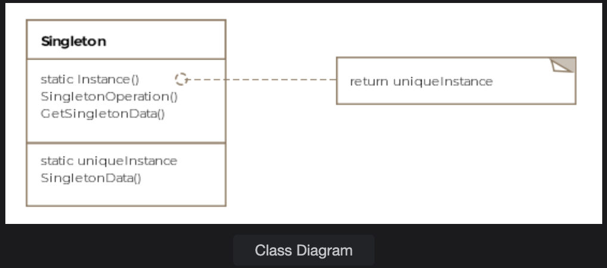

# Singleton Pattern

> *Ensure a class has one and only one instance — and provide a global point of access to it.*

The Singleton is one of the simplest yet most debated **Creational** design patterns. It's essential when exactly one object is needed to coordinate actions across an entire system.

---

## What Is It?

Some resources in a system should logically exist only once:

- **Caches** — one shared cache, not one per class
- **Thread pools** — one pool managing all threads
- **Registries** — one registry for lookups
- **Config managers** — one source of truth for settings

The Singleton pattern enforces this constraint at the language level. The trick is simple: **make the constructor private**. If no outside code can call `new`, no outside code can create a second instance. The class itself controls its one and only instantiation.

> **Formal definition:** Ensure that only a single instance of a class exists and that a global point of access to it is provided.

---

## Class Diagram

```
┌──────────────────────────────────┐
│           «Singleton»            │
│          AirforceOne             │
│─────────────────────────────────-│
│ - onlyInstance: AirforceOne      │
│─────────────────────────────────-│
│ - AirforceOne()                  │  ← private constructor
│ + getInstance(): AirforceOne     │  ← only way to get the instance
│ + fly(): void                    │
└──────────────────────────────────┘
```

---

## Example: Air Force One ✈️🇺🇸

There is only one Air Force One. Ever. It's the perfect real-world metaphor for a Singleton — no matter who asks for it or when, they should always get back the same, single aircraft.

### Basic Implementation

```java
public class AirforceOne {

    // The sole instance of the class
    private static AirforceOne onlyInstance;

    // Private constructor — no one outside can call new AirforceOne()
    private AirforceOne() { }

    public void fly() {
        System.out.println("Airforce One is flying...");
    }

    // The one and only way to access the instance
    public static AirforceOne getInstance() {
        if (onlyInstance == null) {
            onlyInstance = new AirforceOne();  // created only on first call
        }
        return onlyInstance;
    }
}
```

### Client Usage

```java
public class Client {

    public void main() {
        AirforceOne airforceOne = AirforceOne.getInstance();
        airforceOne.fly();
    }
}
```

This works perfectly — for a **single-threaded** application.

---

## ⚠️ The Multithreading Problem

As soon as multiple threads enter the picture, the basic implementation breaks. Here's why:

```
Thread A → calls getInstance() → sees onlyInstance is null
                                  → gets context-switched OUT before new-ing up
Thread B → calls getInstance() → sees onlyInstance is null → creates Instance #1
Thread A → resumes → already past the null check → creates Instance #2 ❌
```

Now two different `AirforceOne` objects exist in memory — violating the entire point of the pattern.

---

## Solutions: Thread Safety

### Option 1 — Synchronized Method

```java
synchronized public static AirforceOne getInstance() {
    if (onlyInstance == null) {
        onlyInstance = new AirforceOne();
    }
    return onlyInstance;
}
```

✅ Correct — only one thread enters at a time  
❌ Expensive — **every** call to `getInstance()` acquires a lock, even after the instance exists

---

### Option 2 — Static Initialization (Eager Loading)

```java
public class AirforceOne {

    // Instance created at class-load time — guaranteed thread-safe by JVM
    private static AirforceOne onlyInstance = new AirforceOne();

    private AirforceOne() { }

    public static AirforceOne getInstance() {
        return onlyInstance;
    }
}
```

✅ Simple and thread-safe — JVM handles synchronization during class loading  
❌ Object is created **even if never used** — wasteful if construction is expensive

---

### Option 3 — Double-Checked Locking

The most optimized approach: synchronize only during the **first** creation, not on every subsequent call.

```java
public class AirforceOneWithDoubleCheckedLocking {

    // volatile ensures visibility of changes across threads
    private volatile static AirforceOneWithDoubleCheckedLocking onlyInstance;

    private AirforceOneWithDoubleCheckedLocking() { }

    public void fly() {
        System.out.println("Airforce One is flying...");
    }

    public static AirforceOneWithDoubleCheckedLocking getInstance() {

        if (onlyInstance == null) {                          // Check 1: no lock
            synchronized (AirforceOneWithDoubleCheckedLocking.class) {
                if (onlyInstance == null) {                  // Check 2: with lock
                    onlyInstance = new AirforceOneWithDoubleCheckedLocking();
                }
            }
        }

        return onlyInstance;
    }
}
```

**Why two null checks?**

| Check | Purpose |
|---|---|
| **First check** (no lock) | Avoids expensive synchronization once the instance exists |
| **Second check** (with lock) | Catches the race condition where two threads both passed the first check simultaneously |

> ⚠️ **Note:** The `volatile` keyword is critical here. Without it, the JVM may reorder instructions and a thread could receive a partially constructed object. Also, double-checked locking is broken in **Java 1.4 and below** due to JVM memory model issues — only use it on Java 5+.

> **Modern verdict:** Double-checked locking is now largely considered an **anti-pattern**. JVM startup times have improved dramatically, making eager static initialization the preferred choice in most real-world scenarios.

---

## Comparison of Approaches

| Approach | Thread-Safe | Lazy Loading | Performance |
|---|---|---|---|
| Basic (no sync) | ❌ | ✅ | ✅ Fast |
| Synchronized method | ✅ | ✅ | ❌ Slow (locks every call) |
| Static initialization | ✅ | ❌ | ✅ Fast |
| Double-checked locking | ✅ (Java 5+) | ✅ | ✅ Fast |

---

## Real-World Examples in Java

The Java standard library uses Singletons in several places:

```java
// Runtime — one per JVM process
Runtime runtime = Runtime.getRuntime();

// Desktop — one per desktop environment
Desktop desktop = Desktop.getDesktop();
```

---

## Caveats & Gotchas

| ⚠️ Caveat | Details |
|---|---|
| **Subclassing** | You can allow subclassing by making the constructor `protected` instead of `private`. Use a **registry** to map string names to singleton subclass instances, and let `getInstance()` accept a parameter to look up the right one. |
| **Testing difficulty** | Singletons introduce global state, making unit tests harder. Consider dependency injection as an alternative in test-heavy codebases. |
| **Serialization** | If a Singleton implements `Serializable`, deserialization can create a new instance. Override `readResolve()` to prevent this. |
| **Reflection attacks** | Reflection can bypass private constructors. Use an `enum`-based Singleton to prevent this entirely. |

---

## Bonus: The Enum Singleton (Most Robust)

Joshua Bloch (author of *Effective Java*) recommends using an `enum` for Singletons — it's inherently thread-safe, serialization-safe, and reflection-proof:

```java
public enum AirforceOne {
    INSTANCE;

    public void fly() {
        System.out.println("Airforce One is flying...");
    }
}

// Usage
AirforceOne.INSTANCE.fly();
```

---

## When to Use the Singleton Pattern

✅ Exactly one shared resource is needed (config, cache, connection pool, logger)  
✅ Global access to that resource is required across the system  
✅ The object is expensive to create and should only be created once  

❌ Avoid when it introduces unnecessary global state  
❌ Avoid when it makes testing harder without a clear benefit