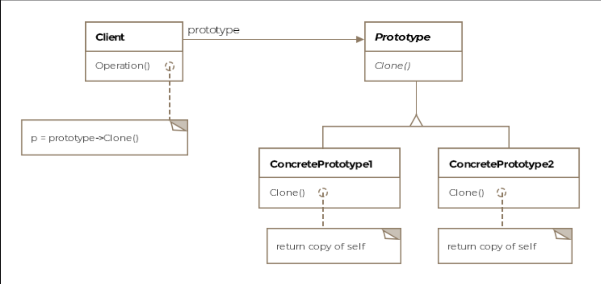

# Prototype Pattern

> *Create new objects by cloning existing ones — use a prototype as the seed, not the blueprint.*

The Prototype pattern is a **Creational** design pattern that shifts the focus of object creation from constructing from scratch to **copying from an existing instance**. It's particularly powerful when object creation is expensive, dynamic, or when you want to avoid an explosion of subclasses.

---

## What Is It?

In the Prototype pattern, a pre-configured object — the **prototype** — acts as a template. New objects are produced by cloning it rather than constructing them fresh each time.

### Why clone instead of construct?

| Motivation | Explanation |
|---|---|
| **Expensive construction** | Creating a new object may involve costly DB calls, network requests, or heavy computation. Cloning a ready-made prototype is far cheaper. |
| **Dynamic class loading** | When a class is only available at runtime, its constructor isn't accessible statically. A prototype instance registered at load time can be cloned on demand. |
| **Reducing subclass explosion** | Instead of creating a new subclass for every variation, clone a prototype and tweak its properties. Fewer classes, same flexibility. |

> **Formal definition:** Specify the kind of objects to create using a prototypical instance as a model, and make copies of the prototype to create new objects.

---

## Class Diagram

```
         ┌───────────────────────┐
         │  «interface»          │
         │  IAircraftPrototype   │
         │───────────────────────│
         │ + fly(): void         │
         │ + clone(): Prototype  │
         │ + setEngine(): void   │
         └───────────────────────┘
                    ▲
          ┌─────────┴──────────┐
          │                    │
 ┌────────────────┐   ┌──────────────────┐
 │      F16       │   │    Boeing747     │
 │────────────────│   │──────────────────│
 │ - f16Engine    │   │ - engine         │
 │────────────────│   │──────────────────│
 │ + fly()        │   │ + fly()          │
 │ + clone()      │   │ + clone()        │
 │ + setEngine()  │   │ + setEngine()    │
 └────────────────┘   └──────────────────┘
          │
          │ clones
          ▼
 ┌────────────────┐   ┌────────────────┐
 │    F16-A       │   │    F16-B       │
 │ (F16AEngine)   │   │ (F16BEngine)   │
 └────────────────┘   └────────────────┘

        Client ──── uses ────► IAircraftPrototype
```

The class diagram consists of three key entities:

| Entity | Role |
|---|---|
| **Prototype** | Interface or abstract class declaring the `clone()` method |
| **Concrete Prototype** | Implements `clone()` to produce a copy of itself |
| **Client** | Requests clones from the prototype; never touches concrete constructors |

---

## Example: F-16 Variants

The F-16 fighter jet has several real-world variants (F-16A, F-16B, F-16C...). They're nearly identical — differing primarily in their **engine type**. We have two options:

- **Option A:** Subclass `F16` for every variant → subclass explosion
- **Option B:** Keep one `F16` class, clone it, and swap the engine → clean and minimal

The Prototype pattern enables Option B.

---

### Step 1 — The Prototype Interface

```java
public interface IAircraftPrototype {

    void fly();

    IAircraftPrototype clone();  // the key method

    void setEngine(F16Engine f16Engine);
}
```

---

### Step 2 — Concrete Prototype

```java
public class F16 implements IAircraftPrototype {

    // Default engine
    F16Engine f16Engine = new F16Engine();

    @Override
    public void fly() {
        System.out.println("F-16 flying...");
    }

    @Override
    public IAircraftPrototype clone() {
        // Deep clone — returns a fresh F16 with its own state
        return new F16();
    }

    @Override
    public void setEngine(F16Engine f16Engine) {
        this.f16Engine = f16Engine;
    }
}
```

---

### Step 3 — Client Usage

```java
public class Client {

    public void main() {

        IAircraftPrototype prototype = new F16();  // the one prototype

        // Clone and customize for F-16A
        IAircraftPrototype f16A = prototype.clone();
        f16A.setEngine(new F16AEngine());

        // Clone and customize for F-16B
        IAircraftPrototype f16B = prototype.clone();
        f16B.setEngine(new F16BEngine());
    }
}
```

> **Key insight:** The client only interacts with `IAircraftPrototype`. It never knows — or cares — whether the clone is an `F16` or a `Boeing747`. Swap the prototype and you get an entirely different aircraft family, with zero client code changes.

---

## Shallow Copy vs. Deep Copy

This is one of the most important implementation decisions when using the Prototype pattern.

```
Prototype F16
│
└── f16Engine ──► [ F16Engine Object @ 0x001 ]

Shallow Clone                       Deep Clone
│                                   │
└── f16Engine ──► [ SAME 0x001 ]    └── f16Engine ──► [ NEW copy @ 0x002 ]
         ↑                                                  ↑
    Shared! Dangerous                              Independent. Safe.
```

| | Shallow Copy | Deep Copy |
|---|---|---|
| **What's copied** | Primitives + references to nested objects | Primitives + full recursive copies of all nested objects |
| **Nested objects** | Shared between prototype and clone | Each gets their own independent copy |
| **Risk** | Modifying a nested object in the clone affects the prototype | No cross-contamination |
| **Cost** | Cheaper | More expensive |
| **Use when** | Nested objects are immutable or intentionally shared | Nested objects are mutable and need independent state |

### Deep copy example:

```java
@Override
public IAircraftPrototype clone() {
    F16 copy = new F16();
    copy.f16Engine = new F16Engine(this.f16Engine); // manually copy the nested object
    return copy;
}
```

---

## Dynamic Class Loading

The Prototype pattern has a special use case in frameworks that support **dynamic class loading** — loading classes at runtime rather than at compile time:

```
1. Framework loads a class dynamically at runtime
2. Creates one instance automatically → registers it as a prototype
3. Application requests an object of that type
4. Prototype manager returns a clone

        ┌────────────────────┐
        │  Prototype Manager │
        │────────────────────│
        │ "F16"  → instance  │ ──clone──► returned to app
        │ "B747" → instance  │ ──clone──► returned to app
        └────────────────────┘
```

Since the constructor isn't accessible statically, cloning is the only viable way to produce new instances. The prototype manager acts as a registry and factory rolled into one.

---

## Real-World Examples

### Java's `Cloneable` Interface

```java
// The root Object class exposes clone()
// Classes opt in by implementing java.lang.Cloneable

public class F16 implements Cloneable {

    @Override
    protected Object clone() throws CloneNotSupportedException {
        return super.clone(); // shallow copy via Object.clone()
    }
}
```

> Java's built-in `Object.clone()` performs a **shallow copy** by default. For deep copies, you must manually clone each mutable nested field.

---

## Caveats & Gotchas

| Caveat | Details |
|---|---|
| **Circular references** | If Object A holds a reference to B, and B holds one back to A, deep cloning can cause infinite recursion. Requires visited-object tracking to solve. |
| **`Cloneable` is a poor API** | Java's `Cloneable` marker interface is widely considered broken — `clone()` isn't even declared on it. Many experts recommend copy constructors or static factory methods instead. |
| **Hidden state** | If the prototype has mutable internal state not exposed via getters, clones may silently inherit unexpected values. |
| **Shallow copy bugs** | The most common mistake — forgetting to deep-copy mutable nested objects causes the prototype and its clones to share state unintentionally. |

---

## Prototype vs. Other Creational Patterns

| Pattern | Creates objects by... | Best when... |
|---|---|---|
| **Factory Method** | Calling a factory method | Subclasses decide what to instantiate |
| **Abstract Factory** | Calling a family of factories | You need families of related objects |
| **Builder** | Step-by-step assembly | Construction is complex and ordered |
| **Prototype** | Cloning an existing object | Construction is expensive or class is only known at runtime |

---

## When to Use the Prototype Pattern

✅ Object creation is expensive and a pre-built instance can serve as a base  
✅ The system needs to be independent of how its objects are created  
✅ Classes to instantiate are only known at runtime (dynamic loading)  
✅ You want to avoid a factory hierarchy that mirrors a product hierarchy  
✅ Variations of an object differ only in a few properties — clone and adjust  

❌ Avoid when objects have circular references that are hard to clone correctly  
❌ Avoid when shallow copies would silently introduce shared mutable state bugs