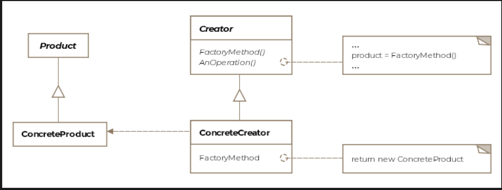

# Factory Method Pattern

> *Define an interface for creating an object, but let subclasses decide which class to instantiate.*

The Factory Method is a **Creational** design pattern that solves one of the most common problems in object-oriented design: how to create objects without tightly coupling your code to their concrete classes.

---

## What Is It?

In Java, creating objects typically looks like this:

```java
SomeClass obj = new SomeClass();
```

Simple — but it comes with a hidden cost. The moment you write `new SomeClass()`, your code is **hardwired** to that concrete implementation. Change the class, add a variant, or swap it out entirely — and you have to hunt down every `new` call and update it. This violates the golden rule:

> *Code to an interface, not to an implementation.*

The Factory Method pattern solves this by **delegating object creation to subclasses**. The parent class defines *when* and *how* to use an object; the subclass decides *which* object to create.

> **Formal definition:** Provide an interface for object creation but delegate the actual instantiation of objects to subclasses.

---

## Class Diagram

```
┌───────────────────────────────────┐
│         «abstract»                │
│           Creator (F16)           │
│───────────────────────────────────│
│ + makeF16(): F16   ← factory method (overridden by subclasses)
│ + taxi(): void                    │
│ + fly(): void      ← calls makeF16() internally
└───────────────────────────────────┘
              ▲              ▲
              │              │
 ┌────────────────┐   ┌────────────────┐
 │ ConcreteCreator│   │ ConcreteCreator│
 │    F16A        │   │    F16B        │
 │────────────────│   │────────────────│
 │ + makeF16()    │   │ + makeF16()    │
 │  → F16AEngine  │   │  → F16BEngine  │
 └────────────────┘   └────────────────┘
       │                      │
       ▼                      ▼
 ┌──────────────┐      ┌──────────────┐
 │  «Product»   │      │  «Product»   │
 │  F16AEngine  │      │  F16BEngine  │
 └──────────────┘      └──────────────┘
```

The pattern consists of four key entities:

| Entity | Role |
|---|---|
| **Product** | The interface or abstract class for objects the factory creates |
| **Concrete Product** | A specific implementation of the product (e.g. `F16AEngine`) |
| **Creator** | Declares the factory method; may provide a default implementation |
| **Concrete Creator** | Overrides the factory method to return a specific product variant |

---

## Example: F-16 Variants ✈️

### The Problem — Naive Implementation

```java
public class F16 {

    F16Engine engine;
    F16Cockpit cockpit;

    protected void makeF16() {
        engine = new F16Engine();   // hardcoded concrete types
        cockpit = new F16Cockpit();
    }

    public void fly() {
        makeF16();
        System.out.println("F16 flying...");
    }
}

public class Client {
    public void main() {
        F16 f16 = new F16();  // tightly coupled to F16
        f16.fly();
    }
}
```

When the company releases F-16A and F-16B variants, every `new F16()` call in client code needs to change. That's brittle, repetitive, and error-prone.

---

### The Detour — Simple Factory (Not the Pattern)

A common first instinct is to centralize creation in a factory class:

```java
public class F16SimpleFactory {

    public F16 makeF16(String variant) {
        switch (variant) {
            case "A": return new F16A();
            case "B": return new F16B();
            default:  return new F16();
        }
    }
}
```

This is better — but it's just a programming idiom, **not the Factory Method pattern**. The key limitation: it can't be extended through inheritance. Adding a new variant means modifying the factory class itself (violating the Open/Closed Principle).

> **Static factories** are even more limited — static methods can't be overridden in subclasses at all.

---

### The Solution — Factory Method Pattern

We keep object creation *inside* the `F16` class hierarchy but delegate which variant gets created to the subclasses by overriding the `makeF16()` factory method:

**The Creator (superclass):**

```java
public class F16 {

    IEngine engine;
    ICockpit cockpit;

    // Factory method — default implementation, meant to be overridden
    protected F16 makeF16() {
        engine = new F16Engine();
        cockpit = new F16Cockpit();
        return this;
    }

    public void taxi() {
        System.out.println("F16 is taxiing on the runway!");
    }

    public void fly() {
        // The superclass calls makeF16() but doesn't know which variant it gets
        F16 f16 = makeF16();
        f16.taxi();
        System.out.println("F16 is in the air!");
    }
}
```

**Concrete Creators (subclasses):**

```java
public class F16A extends F16 {

    @Override
    public F16 makeF16() {
        super.makeF16();          // reuse cockpit from parent
        engine = new F16AEngine(); // override only what differs
        return this;
    }
}

public class F16B extends F16 {

    @Override
    public F16 makeF16() {
        super.makeF16();
        engine = new F16BEngine();
        return this;
    }
}
```

**Client Usage:**

```java
public class Client {

    public void main() {
        Collection<F16> myAirForce = new ArrayList<>();

        myAirForce.add(new F16A());
        myAirForce.add(new F16B());

        for (F16 f16 : myAirForce) {
            f16.fly();  // each calls its own makeF16() internally
        }
    }
}
```

> **Key insight:** The `F16` superclass calls `makeF16()` without knowing which variant it will get back. The subclass decides. The client works entirely through the `F16` type — no concrete variant knowledge needed.

---

## How It Works — Step by Step

```
Client creates new F16A()
       │
       ▼
  f16A.fly() is called
       │
       ▼
  fly() internally calls makeF16()   ← defined in superclass F16
       │
       ▼
  F16A.makeF16() executes            ← overridden in subclass
  → sets engine = new F16AEngine()
       │
       ▼
  taxi() and fly logic proceed
  with the correctly configured F16A object ✅
```

---

## Simple Factory vs. Factory Method — Key Differences

| | Simple / Static Factory | Factory Method Pattern |
|---|---|---|
| **Mechanism** | One class with a switch/if block | Inheritance + method overriding |
| **Extensibility** | Must modify factory to add variants | Add a new subclass — no existing code changes |
| **Overridable** | Static methods can't be overridden | Factory method is designed to be overridden |
| **Coupling** | Client coupled to factory class | Client coupled only to abstract type |
| **Pattern?** | Programming idiom | True GoF design pattern |

---

## Real-World Examples

The Factory Method pattern is everywhere in frameworks and the Java API:

```java
// Calendar — returns the right Calendar subclass for the locale
Calendar cal = Calendar.getInstance();

// ResourceBundle — loads the right bundle variant
ResourceBundle bundle = ResourceBundle.getBundle("messages");

// NumberFormat — returns locale-appropriate formatter
NumberFormat formatter = NumberFormat.getInstance();
```

In each case, you call a method on an abstract type and get back the right concrete implementation — without ever writing `new ConcreteCalendar()` yourself.

### Framework Design

The pattern is especially common in **frameworks**. A framework can't know in advance what objects its consumers will need. Instead it exposes abstract creator classes that consumers subclass and override:

```
Framework defines:          Consumer implements:
─────────────────           ────────────────────
abstract makeWidget()  →    MyWidget makeWidget() { return new MyWidget(); }
```

The framework calls `makeWidget()` at the right time; the consumer supplies the concrete object.

---

## Caveats & Gotchas

| Caveat | Details |
|---|---|
| **Subclass explosion** | Each new variant requires a new subclass. With many small differences, this can balloon quickly. Consider the **Abstract Factory** or **Prototype** pattern if variants share more structure. |
| **Downcast risk** | If a subclass extends the product with extra functionality, the superclass can't use it without downcasting to the concrete type — which can fail at runtime with a `ClassCastException`. |
| **Not truly decoupled** | The client still needs to know which concrete *creator* (e.g. `F16A` vs `F16B`) to instantiate — the decoupling happens one level up, not all the way to the client. |

---

## When to Use the Factory Method Pattern

✅ A class can't anticipate which objects it will need to create  
✅ You want subclasses to control what gets created  
✅ You want to localize the knowledge of which class to instantiate  
✅ You're building a framework meant to be extended by consumers  
✅ You need to add new product variants without modifying existing code  

❌ Avoid when the hierarchy of creators mirrors the hierarchy of products too closely — leads to unnecessary complexity  
❌ Avoid when a simple factory or constructor is sufficient for your use case