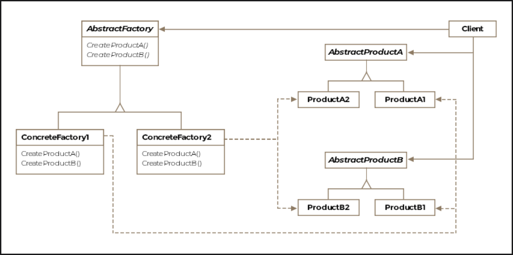

# Abstract Factory Pattern

> *Create families of related objects without depending on their concrete classes.*

The Abstract Factory is a **Creational** design pattern — often called a "factory of factories." Where the Factory Method pattern handles creating *one* product, the Abstract Factory handles creating *entire families* of related products, keeping them consistent and decoupled from client code.

---

## What Is It?

Some systems need to produce not just one object but a **coordinated set of related objects**. Consider an aircraft: it needs an engine, a cockpit, and wings — all of which must be compatible with each other and specific to that aircraft type.

The Abstract Factory pattern provides a single interface through which a client can request an entire product family, without ever knowing the concrete classes involved.

> **Formal definition:** Define an interface to create families of related or dependent objects without specifying their concrete classes.

---

## Class Diagram

```
         ┌──────────────────────────────┐
         │      «interface»             │
         │      IAircraftFactory        │
         │──────────────────────────────│
         │ + createEngine(): IEngine    │
         │ + createWings(): IWings      │
         │ + createCockpit(): ICockpit  │
         └──────────────────────────────┘
                    ▲              ▲
                    │              │
      ┌─────────────────┐   ┌──────────────────────┐
      │   F16Factory    │   │   Boeing747Factory   │
      │─────────────────│   │──────────────────────│
      │ createEngine()  │   │ createEngine()        │
      │ createWings()   │   │ createWings()         │
      │ createCockpit() │   │ createCockpit()       │
      └─────────────────┘   └──────────────────────┘
            │                         │
    ┌───────┼──────────┐      ┌───────┼──────────┐
    ▼       ▼          ▼      ▼       ▼          ▼
F16Engine F16Wings F16Cockpit B747Engine B747Wings B747Cockpit

    (all implement IEngine / IWings / ICockpit)

         ┌────────────────────────────────┐
         │           Client               │
         │   Aircraft(IAircraftFactory)   │
         └────────────────────────────────┘
```

The pattern consists of five key entities:

| Entity | Role |
|---|---|
| **Abstract Factory** | Interface declaring creation methods for each product in the family |
| **Concrete Factory** | Implements the abstract factory to produce a specific product family |
| **Abstract Product** | Interface for each type of product (e.g. `IEngine`, `IWings`) |
| **Concrete Product** | Specific implementation of a product (e.g. `F16Engine`, `Boeing747Wings`) |
| **Client** | Uses only abstract factories and abstract products — never concrete classes |

---

## The Problem: Why We Need It

Consider a naive implementation of an aviation simulation:

```java
public void main() {
    F16Cockpit f16Cockpit = new F16Cockpit();
    F16Engine  f16Engine  = new F16Engine();
    F16Wings   f16Wings   = new F16Wings();

    List<F16Engine> engines = new ArrayList<>();
    engines.add(f16Engine);
    for (F16Engine engine : engines) {
        engine.start();
    }
}
```

This looks harmless — but it's hiding three serious problems:

| Problem | Impact |
|---|---|
| **Concrete classes exposed** | Any change to `F16Engine` forces a change in the client |
| **Variant-specific subclassing** | Adding F-16A or F-16B engines requires changing the client too |
| **Typed collections** | `List<F16Engine>` can't hold a `Boeing747Engine` — no extensibility |

---

## The Solution: Step by Step

### Step 1 — Code to Interfaces, Not Implementations

Replace all concrete references with product interfaces:

```java
public interface IEngine {
    void start();
}

public interface IWings  { /* wing-specific methods */ }
public interface ICockpit { /* cockpit-specific methods */ }

public class F16Engine implements IEngine {
    @Override
    public void start() {
        System.out.println("F16 engine on");
    }
}
```

Now the client can use `IEngine` instead of `F16Engine` — and the list becomes `List<IEngine>`, which can hold any engine:

```java
IEngine f16Engine = new F16Engine();  // still exposes new F16Engine()
List<IEngine> engines = new ArrayList<>();
engines.add(f16Engine);
```

Better — but `new F16Engine()` is still hardcoded. We need to hide that too.

---

### Step 2 — Create a Factory Per Aircraft Family

Instead of `new`-ing up parts in client code, delegate to a dedicated factory:

```java
public class F16Factory {
    public IEngine  createEngine()  { return new F16Engine(); }
    public IWings   createWings()   { return new F16Wings(); }
    public ICockpit createCockpit() { return new F16Cockpit(); }
}
```

The client now receives a factory and asks it for parts — no concrete classes in sight:

```java
public void main(F16Factory f16Factory) {
    IEngine engine = f16Factory.createEngine();
    // works with IEngine — factory hides the F16Engine detail
}
```

---

### Step 3 — Abstract the Factory Itself

To support multiple aircraft families (F-16, Boeing-747, MiG-29...) through the *same* client code, all factories must implement a shared interface — the **Abstract Factory**:

```java
public interface IAircraftFactory {
    IEngine  createEngine();
    IWings   createWings();
    ICockpit createCockpit();
}
```

**Concrete Factories:**

```java
public class F16Factory implements IAircraftFactory {
    @Override public IEngine  createEngine()  { return new F16Engine(); }
    @Override public IWings   createWings()   { return new F16Wings(); }
    @Override public ICockpit createCockpit() { return new F16Cockpit(); }
}

public class Boeing747Factory implements IAircraftFactory {
    @Override public IEngine  createEngine()  { return new Boeing747Engine(); }
    @Override public IWings   createWings()   { return new Boeing747Wings(); }
    @Override public ICockpit createCockpit() { return new Boeing747Cockpit(); }
}
```

---

### Step 4 — The Client: One Class, Any Aircraft

With the factory injected via the constructor, one `Aircraft` class can represent any aircraft:

```java
public class Aircraft {

    IEngine  engine;
    ICockpit cockpit;
    IWings   wings;
    IAircraftFactory factory;

    public Aircraft(IAircraftFactory factory) {
        this.factory = factory;
    }

    protected Aircraft makeAircraft() {
        engine  = factory.createEngine();
        cockpit = factory.createCockpit();
        wings   = factory.createWings();
        return this;
    }

    private void taxi() {
        System.out.println("Taxiing on runway");
    }

    public void fly() {
        Aircraft aircraft = makeAircraft();
        aircraft.taxi();
        System.out.println("Flying!");
    }
}
```

**Client code:**

```java
public class Client {

    public void main() {
        Collection<Aircraft> myPlanes = new ArrayList<>();

        // Just swap the factory — same Aircraft class, different plane
        myPlanes.add(new Aircraft(new F16Factory()));
        myPlanes.add(new Aircraft(new Boeing747Factory()));

        for (Aircraft aircraft : myPlanes) {
            aircraft.fly();
        }
    }
}
```

> **Key insight:** The `Aircraft` class never mentions `F16Engine`, `Boeing747Wings`, or any concrete part. Swap the factory → get a completely different aircraft. Add a new aircraft type → just write a new factory, zero changes to `Aircraft` or `Client`.

---

## How the Pieces Fit Together

```
Client
  │
  ├── new Aircraft(F16Factory)
  │       │
  │       └── makeAircraft()
  │               ├── factory.createEngine()  → F16Engine
  │               ├── factory.createCockpit() → F16Cockpit
  │               └── factory.createWings()   → F16Wings
  │
  └── new Aircraft(Boeing747Factory)
          │
          └── makeAircraft()
                  ├── factory.createEngine()  → Boeing747Engine
                  ├── factory.createCockpit() → Boeing747Cockpit
                  └── factory.createWings()   → Boeing747Wings
```

---

## Real-World Examples

### Java XML API

```java
// Returns a factory — caller never touches a concrete parser class
DocumentBuilderFactory  dbf = DocumentBuilderFactory.newInstance();
TransformerFactory       tf = TransformerFactory.newInstance();
```

### UI Toolkits & Themes

An IDE supporting **Light** and **Dark** themes can use an Abstract Factory:

```
IThemeFactory
├── LightThemeFactory → LightButton, LightPanel, LightMenu
└── DarkThemeFactory  → DarkButton,  DarkPanel,  DarkMenu
```

Switch the factory at startup → entire UI switches theme consistently.

### Cross-Platform Widgets

```
IWidgetFactory
├── MacOSWidgetFactory  → MacButton, MacScrollbar, MacWindow
└── WindowsWidgetFactory → WinButton, WinScrollbar, WinWindow
```

The same application code runs on both platforms — only the factory changes.

---

## Factory Method vs. Abstract Factory

This is the most common point of confusion between the two patterns:

| | Factory Method | Abstract Factory |
|---|---|---|
| **Creates** | One product | A family of related products |
| **Mechanism** | Inheritance — subclasses override a method | Composition — a factory object is injected |
| **Extensibility** | Add a new subclass | Add a new concrete factory class |
| **Use when** | One object's creation needs to vary | Multiple related objects must be consistent |
| **Relationship** | Used *inside* Abstract Factory implementations | Orchestrates multiple Factory Methods |

> The Abstract Factory pattern typically *uses* the Factory Method pattern internally — each `create*()` method in the concrete factory is a factory method.

---

## Caveats & Gotchas

| Caveat | Details |
|---|---|
| **Adding new product types is hard** | If a `Helicopter` needs a `IRotor` that jets don't have, the `IAircraftFactory` interface must be extended — cascading changes to *all* existing factories, which must return `null` for the new method |
| **Proliferation of classes** | Each new product family needs a concrete factory plus concrete implementations of every product interface — can add up quickly |
| **Concrete factories as Singletons** | Since concrete factories hold no state, they are often best implemented as Singletons to avoid redundant instantiation |
| **Complexity vs. benefit** | For small systems with one or two product types, the pattern adds overhead. Reserve it for systems that genuinely need multiple consistent product families |

---

## When to Use the Abstract Factory Pattern

✅ The system needs to be independent of how its products are created and composed  
✅ You need to enforce that a family of products is always used together (consistency)  
✅ You want to swap entire product families at runtime (e.g. themes, platforms, vendors)  
✅ You're building a framework that consumers extend with their own product families  
✅ You have multiple product types that vary together across families  

❌ Avoid when you only need to vary one product type — Factory Method is simpler  
❌ Avoid when the product family interface changes frequently — each change cascades to all factories