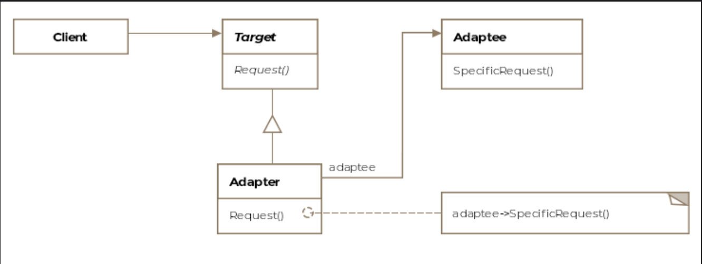

# Adapter Pattern

> *Allow incompatible classes to work together by converting the interface of one class into another expected by the client.*

The Adapter is a **Structural** design pattern — the first of the structural family. Where Creational patterns deal with *how objects are made*, Structural patterns deal with *how classes and objects are composed* to form larger, more capable structures.

---

## What Is It?

Two classes can be perfectly well-designed on their own and still be unable to work together — simply because they speak different "languages" (interfaces). The Adapter pattern acts as a translator between them.

### Real-World Analogies

**Language Interpreter**
When two heads of state don't share a common language, an interpreter sits between them and translates in real time — neither diplomat changes how they speak, yet communication flows freely.

**Power Adapter**
Electronics bought in the USA run on 110V. Plug them into an Indian 220V socket and they'll fry. A physical voltage adapter steps the power up or down so the device works without modification.

The software Adapter pattern works exactly the same way: it sits between two incompatible interfaces and converts calls from one form to another — without modifying either side.

> **Formal definition:** Allow incompatible classes to work together by converting the interface of one class into another expected by the client.

---

## Class Diagram

```
  ┌──────────┐          ┌──────────────────────────────────┐
  │  Client  │─────────►│       «interface»                │
  └──────────┘          │         IAircraft (Target)       │
                        │──────────────────────────────────│
                        │  + fly(): void                   │
                        └──────────────────────────────────┘
                                        ▲
                                        │ implements
                              ┌─────────────────────┐
                              │       Adapter        │
                              │─────────────────────-│
                              │ - hotAirBalloon       │ ◄── composed with Adaptee
                              │─────────────────────-│
                              │ + fly(): void         │ ← translates to Adaptee calls
                              └──────────────────────┘
                                        │
                                        │ delegates to
                                        ▼
                              ┌──────────────────────┐
                              │    HotAirBalloon      │  (Adaptee)
                              │──────────────────────-│
                              │ - gasUsed: String     │
                              │──────────────────────-│
                              │ + fly(gasUsed)        │ ← incompatible signature
                              │ + inflateWithGas()    │
                              └──────────────────────┘
```

The pattern consists of four key entities:

| Entity | Role |
|---|---|
| **Target** | The interface the client knows and expects (e.g. `IAircraft`) |
| **Client** | Works only with the Target interface |
| **Adaptee** | The existing class with an incompatible interface (e.g. `HotAirBalloon`) |
| **Adapter** | Implements the Target interface; wraps and delegates to the Adaptee |

---

## Example: Hot Air Balloon ✈️🎈

Your aviation software is built around the `IAircraft` interface. Everything works great — until a hot air balloon company asks to integrate their existing system. Their `HotAirBalloon` class can't be changed, and it doesn't fit your `IAircraft` interface. Rewriting from scratch isn't an option.

### The Incompatible Adaptee

```java
public class HotAirBalloon {

    String gasUsed = "Helium";

    // fly() requires a fuel parameter — incompatible with IAircraft.fly()
    void fly(String gasUsed) {
        // Take-off sequence based on fuel type
    }

    String inflateWithGas() {
        return gasUsed;
    }
}
```

### The Target Interface (what the client expects)

```java
public interface IAircraft {
    void fly();  // no parameters — incompatible with HotAirBalloon.fly(String)
}
```

### The Adapter (the translator)

```java
public class HotAirBalloonAdapter implements IAircraft {

    HotAirBalloon hotAirBalloon;  // composed with the Adaptee

    public HotAirBalloonAdapter(HotAirBalloon hotAirBalloon) {
        this.hotAirBalloon = hotAirBalloon;
    }

    @Override
    public void fly() {
        // Translate: call inflateWithGas() first, then pass result to fly()
        String fuelUsed = hotAirBalloon.inflateWithGas();
        hotAirBalloon.fly(fuelUsed);
    }
}
```

Two things to note about the adapter:

1. It is **composed** with the Adaptee (`HotAirBalloon`) — it wraps it, not extends it
2. It **implements the Target** (`IAircraft`) — so the client sees it as just another aircraft

### Client Usage

```java
public void main() {
    HotAirBalloon balloon = new HotAirBalloon();
    IAircraft balloonAdapter = new HotAirBalloonAdapter(balloon);

    // Client works with IAircraft — knows nothing about HotAirBalloon
    balloonAdapter.fly();
}
```

The client never sees `HotAirBalloon`, never calls `inflateWithGas()`, and never knows a translation is happening. From its perspective, it's just flying another aircraft.

---

## How the Translation Flows

```
Client
  │
  │ calls fly() on IAircraft
  ▼
HotAirBalloonAdapter.fly()
  │
  ├── calls hotAirBalloon.inflateWithGas() → "Helium"
  │
  └── calls hotAirBalloon.fly("Helium")
                │
                ▼
        HotAirBalloon takes off ✅
```

---

## Object Adapter vs. Class Adapter

There are two ways to implement the Adapter pattern. Java supports only one of them natively.

### Object Adapter (Composition) — ✅ Supported in Java

```java
public class HotAirBalloonAdapter implements IAircraft {
    private HotAirBalloon hotAirBalloon;  // HAS-A relationship

    public HotAirBalloonAdapter(HotAirBalloon hotAirBalloon) {
        this.hotAirBalloon = hotAirBalloon;
    }

    @Override
    public void fly() {
        String fuel = hotAirBalloon.inflateWithGas();
        hotAirBalloon.fly(fuel);
    }
}
```

| Characteristic | Detail |
|---|---|
| **Mechanism** | Composition — adapter *holds* the adaptee as a field |
| **Flexibility** | Can adapt the adaptee *and all its subclasses* |
| **Behavior override** | Cannot override adaptee's methods (no inheritance) |
| **Java support** | ✅ Fully supported |

---

### Class Adapter (Inheritance) — ❌ Not Supported in Java

```java
// Pseudocode — Java doesn't support multiple inheritance
public class HotAirBalloonAdapter extends HotAirBalloon implements IAircraft {

    @Override
    public void fly() {
        String fuel = inflateWithGas();  // inherited from HotAirBalloon
        super.fly(fuel);
    }
}
```

| Characteristic | Detail |
|---|---|
| **Mechanism** | Multiple inheritance — adapter IS-A of both target and adaptee |
| **Flexibility** | Only adapts the specific adaptee class, not subclasses |
| **Behavior override** | ✅ Can override or extend adaptee behavior |
| **Java support** | ❌ Not possible — Java has single inheritance only |

> Java can partially simulate class adapters by implementing an interface (Target) while extending a class (Adaptee) — but only when the Target is an interface, not an abstract class.

---

## Real-World Examples

### XML to JSON Bridge

```
App A → outputs XML ──► [XML-to-JSON Adapter] ──► App B accepts JSON
```

Neither application changes — the adapter handles the translation silently.

### Java: Enumeration → Iterator Adapter

Early Java used `Enumeration` (read-only: `hasMoreElements()`, `nextElement()`). Modern Java uses `Iterator` (adds `remove()`). To make legacy `Enumeration` code work with modern APIs, an adapter bridges the two:

```java
public class EnumerationIterator<T> implements Iterator<T> {

    private Enumeration<T> enumeration;

    public EnumerationIterator(Enumeration<T> enumeration) {
        this.enumeration = enumeration;
    }

    @Override public boolean hasNext() { return enumeration.hasMoreElements(); }
    @Override public T next()          { return enumeration.nextElement(); }

    @Override public void remove() {
        // Enumeration is read-only — removal not supported
        throw new UnsupportedOperationException("remove() not supported");
    }
}
```

### Java I/O Adapters

The Java API uses the Adapter pattern extensively in its I/O library:

```java
// InputStreamReader adapts InputStream (byte stream) → Reader (char stream)
Reader reader = new InputStreamReader(System.in);

// OutputStreamWriter adapts OutputStream (byte stream) → Writer (char stream)
Writer writer = new OutputStreamWriter(System.out);
```

---

## Adapter vs. Other Structural Patterns

| Pattern | Intent |
|---|---|
| **Adapter** | Makes two *existing* incompatible interfaces work together |
| **Decorator** | Adds new responsibilities to an object without changing its interface |
| **Facade** | Simplifies a complex subsystem behind a single unified interface |
| **Proxy** | Controls access to an object through a surrogate with the same interface |

> The key distinction: Adapter *changes* the interface. Decorator, Facade, and Proxy *preserve* it.

---

## Caveats & Gotchas

| Caveat | Details |
|---|---|
| **Adapter proliferation** | If many classes need adapting, you end up with many adapter classes — can clutter the codebase |
| **One-way translation** | An adapter translates calls one way. If bidirectional adaptation is needed, you'll need two adapters or a more complex solution |
| **Runtime exceptions from class adapter** | When simulating a class adapter and the target includes a method the adaptee can't support (like `remove()` on a read-only `Enumeration`), you must throw a runtime exception — document this clearly |
| **Hidden complexity** | Adapters can obscure the fact that incompatible systems are being bridged — future maintainers may not realize translation is happening |

---

## When to Use the Adapter Pattern

✅ You want to use an existing class but its interface doesn't match what you need  
✅ You want to create a reusable class that works with classes that don't necessarily have compatible interfaces  
✅ You need to integrate third-party or legacy code without modifying it  
✅ You need to make several existing subclasses usable via a common interface without subclassing each one  

❌ Avoid when you *can* modify the original class — direct refactoring is cleaner than adding an adapter layer  
❌ Avoid when the interface mismatch is so large that the adapter itself becomes complex — consider a full rewrite instead