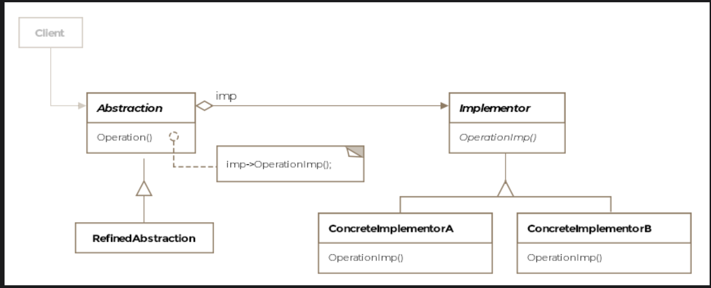
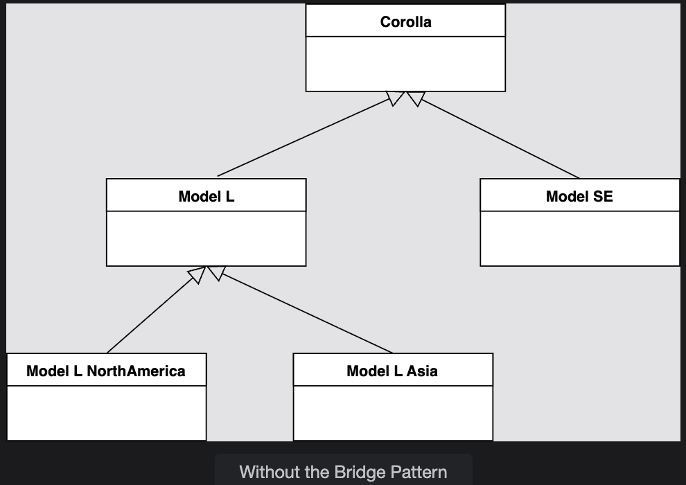
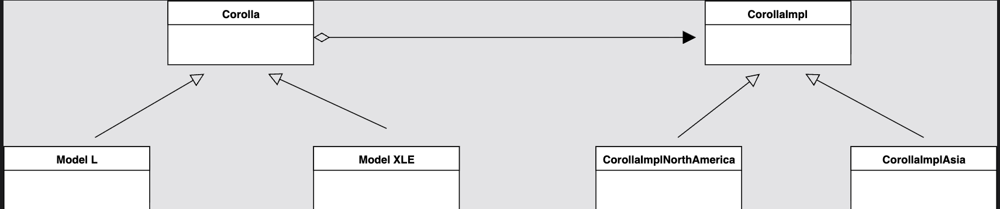

# Bridge Pattern

> *Decouple an abstraction from its implementation so that the two can vary independently.*

The Bridge is a **Structural** design pattern that solves a specific but very common problem: when both a class and its behavior need to vary, inheritance alone leads to a combinatorial explosion of subclasses. The Bridge pattern splits the two dimensions into separate hierarchies — and connects them with a bridge.

---

## What Is It?

Imagine a class that has two reasons to change: what it *is* (its model or type) and what it *does* (its behavior or implementation). If you use inheritance to handle both, you end up with a class for every possible combination. Add one new type or one new behavior — and the explosion compounds.

The Bridge pattern avoids this by **pulling the two layers apart** into parallel class hierarchies:

- **Abstraction hierarchy** — represents *what the class is* (models, types, roles)
- **Implementation hierarchy** — represents *how it behaves* (platform-specific, locale-specific, vendor-specific logic)

A bridge — a reference from the abstraction to the implementation — connects the two. You can now extend either hierarchy independently.

> **Formal definition:** Let the abstraction vary independently of the implementation, thus decoupling the two in the process.

> ⚠️ **Important:** "Abstraction" and "implementation" here do *not* mean Java's `abstract class` and concrete class. They refer to two conceptual *layers* of your design — each of which may itself be an abstract class or interface.

---

## The Problem: Subclass Explosion

Consider representing Toyota Corolla models across multiple countries. Each model (L, LE, XLE) can be built to different regional standards (North America, Asia-Pacific). Using pure inheritance:

```
Without Bridge Pattern:
─────────────────────────────────────────────────────
AbstractCorolla
├── Corolla_L
│   ├── Corolla_L_NorthAmerica
│   └── Corolla_L_AsiaPacific
├── Corolla_LE
│   ├── Corolla_LE_NorthAmerica
│   └── Corolla_LE_AsiaPacific
└── Corolla_XLE
    ├── Corolla_XLE_NorthAmerica
    └── Corolla_XLE_AsiaPacific

3 models × 2 regions = 6 classes
Add 1 model or 1 region → more combinations explode outward
```

With Bridge Pattern:

```
Abstraction Hierarchy          Implementation Hierarchy
─────────────────────          ────────────────────────
AbstractCorolla                AbstractCorollaImpl
├── Corolla_L         ◄──────► ├── Corolla_L_Impl_NorthAmerica
├── Corolla_LE        bridge   └── Corolla_L_Impl_AsiaPacific
└── Corolla_XLE

3 models + 2 implementations = 5 classes (and growing linearly, not combinatorially)
```

---

## Class Diagram

```
  ┌─────────────────────────────────────┐
  │       «abstract»                    │
  │       AbstractCorolla               │  ← Abstraction
  │─────────────────────────────────────│
  │ # corollaImpl: AbstractCorollaImpl  │ ◄── the bridge (holds reference to Impl)
  │─────────────────────────────────────│
  │ + listSafetyEquipment(): void       │
  │ + isCarRightHanded(): boolean       │
  └─────────────────────────────────────┘
                  ▲
                  │ extends
        ┌─────────────────────┐
        │     Corolla_L       │  ← Refined Abstraction
        │─────────────────────│
        │ + listSafety...()   │  delegates to → corollaImpl
        │ + isCarRight...()   │
        └─────────────────────┘

                                ┌─────────────────────────────────┐
                                │        «abstract»               │
                                │      AbstractCorollaImpl        │  ← Implementor
                                │─────────────────────────────────│
                                │ + listSafetyEquipment(): void   │
                                │ + isCarRightHanded(): boolean   │
                                └─────────────────────────────────┘
                                                ▲
                              ┌─────────────────┴──────────────────┐
                   ┌──────────────────────┐        ┌──────────────────────────┐
                   │ Corolla_L_Impl_Asia  │        │ Corolla_L_Impl_NA        │
                   │──────────────────────│        │──────────────────────────│
                   │ listSafety...()      │        │ listSafety...()           │
                   │ isCarRightHanded()   │        │ isCarRightHanded()        │
                   │ → returns false      │        │ → returns true            │
                   └──────────────────────┘        └──────────────────────────┘
```

The pattern consists of four key entities:

| Entity | Role |
|---|---|
| **Abstraction** | The high-level layer; holds a reference to the Implementor |
| **Refined Abstraction** | Extends the Abstraction with specific model or type details |
| **Implementor** | Interface for the implementation layer; defines what the impl must provide |
| **Concrete Implementor** | Provides a specific implementation (e.g. region-specific behavior) |

---

## Example: Toyota Corolla 

### Step 1 — The Abstraction Hierarchy

```java
public abstract class AbstractCorolla {

    // The bridge — a reference to the implementation layer
    protected AbstractCorollaImpl corollaImpl;

    public AbstractCorolla(AbstractCorollaImpl corollaImpl) {
        this.corollaImpl = corollaImpl;
    }

    // Allow swapping implementation at runtime
    public void setCorollaImpl(AbstractCorollaImpl corollaImpl) {
        this.corollaImpl = corollaImpl;
    }

    abstract void listSafetyEquipment();
    abstract boolean isCarRightHanded();
}
```

**Refined Abstraction — the Model L:**

```java
public class Corolla_L extends AbstractCorolla {

    public Corolla_L(AbstractCorollaImpl corollaImpl) {
        super(corollaImpl);
    }

    @Override
    void listSafetyEquipment() {
        corollaImpl.listSafetyEquipment();  // delegates to implementation
    }

    @Override
    boolean isCarRightHanded() {
        return corollaImpl.isCarRightHanded();  // delegates to implementation
    }
}
```

---


### Step 2 — The Implementor Hierarchy

```java
public abstract class AbstractCorollaImpl {
    abstract void listSafetyEquipment();
    abstract boolean isCarRightHanded();
}
```

**Concrete Implementors — one per region:**

```java
public class Corolla_L_Impl_AsiaPacific extends AbstractCorollaImpl {

    @Override
    void listSafetyEquipment() {
        System.out.println("Standard safety package.");
    }

    @Override
    boolean isCarRightHanded() {
        return false;  // left-hand drive in most of Asia-Pacific
    }
}

public class Corolla_L_Impl_NorthAmerica extends AbstractCorollaImpl {

    @Override
    void listSafetyEquipment() {
        System.out.println("High safety standards — airbags, ABS, lane assist.");
    }

    @Override
    boolean isCarRightHanded() {
        return true;  // right-hand drive in North America
    }
}
```

---

### Step 3 — Client Usage

```java
public class Client {

    public void main() {

        // Same model, different region — just swap the implementation
        AbstractCorolla myCorolla = new Corolla_L(new Corolla_L_Impl_AsiaPacific());
        System.out.println(myCorolla.isCarRightHanded());  // false

        // Switch implementation at runtime — no new object of Corolla_L needed
        myCorolla.setCorollaImpl(new Corolla_L_Impl_NorthAmerica());
        System.out.println(myCorolla.isCarRightHanded());  // true
    }
}
```

> **Key insight:** The implementation can be swapped **at runtime** — without creating a new model object or touching the `Corolla_L` class. New regional regulations only affect the implementor classes. New car models only affect the abstraction classes. The two layers evolve completely independently.

---

## How Delegation Flows

```
Client
  │
  │ creates Corolla_L(AsiaPacific impl)
  ▼
Corolla_L.isCarRightHanded()
  │
  │ delegates to →
  ▼
Corolla_L_Impl_AsiaPacific.isCarRightHanded()
  │
  └── returns false ✅

Later: setCorollaImpl(NorthAmerica)
  │
Corolla_L.isCarRightHanded()
  │ delegates to →
Corolla_L_Impl_NorthAmerica.isCarRightHanded()
  └── returns true ✅
```

---

## Real-World Example: GUI Toolkit / Cross-Platform Widgets

The Bridge pattern is a perfect fit for cross-platform UI toolkits. Without it:

```
Without Bridge:
Menu → MenuWindows
     → MenuLinux

Button → ButtonWindows
       → ButtonLinux

Checkbox → CheckboxWindows
         → CheckboxLinux

(N widgets × M platforms = N×M classes)
```

With Bridge:

```
Abstraction Hierarchy       Implementation Hierarchy
─────────────────────       ────────────────────────
Menu                        AbstractMenuImpl
Button          ◄──────────► MenuImplWindows
Checkbox         bridge      MenuImplLinux

(N widgets + M platforms = N+M classes, growing linearly)
```

Any `Menu`, `Button`, or `Checkbox` object can be composed with either `MenuImplWindows` or `MenuImplLinux` at runtime — targeting any OS without changing the widget classes.

---

## Bridge vs. Adapter — Key Distinction

These two patterns look structurally similar (both use composition to connect two classes) but serve fundamentally different purposes:

| | Bridge | Adapter |
|---|---|---|
| **Intent** | Decouple two layers *by design* so they can vary independently | Make two *existing* incompatible classes work together |
| **When applied** | Proactively, *during* the design phase | Reactively, *after* a system is already designed |
| **Interfaces** | Both hierarchies are designed together | Adapts a pre-existing interface to another |
| **Focus** | Extensibility and independent evolution | Compatibility and integration |

> Rule of thumb: If you're designing a new system and anticipate two dimensions of variation — **use Bridge**. If you're integrating a legacy or third-party class that doesn't fit — **use Adapter**.

---

## Caveats & Gotchas

| Caveat | Details |
|---|---|
| **Upfront complexity** | The pattern requires identifying two independent dimensions of variation early. Applied incorrectly, it adds unnecessary layers to simple problems. |
| **Indirection overhead** | Every call on the abstraction delegates to the implementation — adds a layer of method calls. Negligible in most cases but worth noting in performance-critical paths. |
| **Not always obvious** | Recognizing when a class hierarchy has two independent dimensions of change requires design experience. |

---

## When to Use the Bridge Pattern

✅ You want to avoid a permanent binding between an abstraction and its implementation  
✅ Both the abstraction and implementation should be extensible through subclassing  
✅ Changes to the implementation should not impact the client (abstraction) side  
✅ You have a class hierarchy that is growing combinatorially due to two independent dimensions  
✅ You want to switch implementations at runtime  

❌ Avoid when only one dimension of variation exists — plain inheritance or a single factory is simpler  
❌ Avoid when the two hierarchies are not truly independent — forced separation adds complexity without benefit