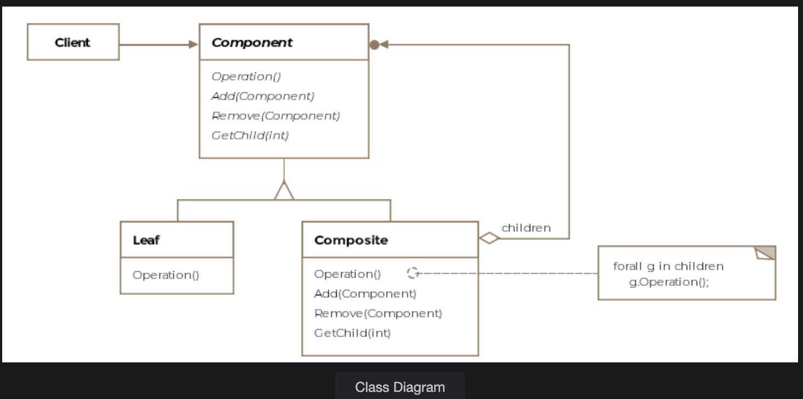
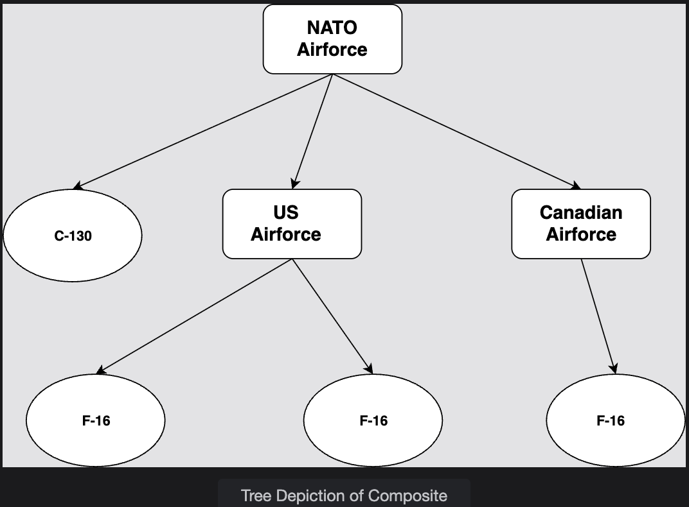

# Composite Pattern

> *Compose objects into tree structures to represent part-whole hierarchies, letting clients treat individual objects and compositions uniformly.*

The Composite is a **Structural** design pattern that models hierarchical, recursive structures — like file systems, UI menus, or military alliances — in a way that lets clients interact with any node in the tree, whether it's a single leaf or an entire subtree, through exactly the same interface.

---

## What Is It?

"Composite" literally means *made up of various parts*. The pattern allows you to **treat the whole and its individual parts as one unified type**. The natural data structure for this is a tree:

```
Root (Composite)
├── Child A (Composite)
│   ├── Leaf A1
│   └── Leaf A2
├── Child B (Leaf)
└── Child C (Composite)
    └── Leaf C1
```

- **Composites** hold children — they can be other composites or leaves
- **Leaves** are the end nodes — they hold no children and do the actual work
- Both implement the **same interface**, so the client never needs to check which is which

> **Formal definition:** Compose objects into tree structures to represent part-whole hierarchies, thus letting clients uniformly treat individual objects and compositions of objects.

---

## Class Diagram

```
              ┌──────────────────────────────┐
              │         «interface»          │
              │         IAlliancePart        │  ← Component
              │──────────────────────────────│
              │  + getPersonnel(): int       │
              └──────────────────────────────┘
                      ▲              ▲
            ┌─────────┘              └──────────────────┐
            │                                           │
 ┌──────────────────────────┐            ┌──────────────────────────────┐
 │     Leaf Classes         │            │     Airforce (Composite)     │
 │──────────────────────────│            │──────────────────────────────│
 │  F16                     │            │ - planes: List<IAlliancePart>│
 │  C130Hercules            │            │──────────────────────────────│
 │──────────────────────────│            │ + add(IAlliancePart)         │
 │  + getPersonnel(): int   │            │ + getPersonnel(): int        │
 └──────────────────────────┘            │   (sums all children)        │
                                         └──────────────────────────────┘
                                                      │
                                         can contain  │
                                         ┌────────────┴────────────┐
                                         ▼                         ▼
                                    Airforce                  F16 / C130
                                  (sub-composite)              (leaves)
```

The pattern consists of four key entities:

| Entity | Role |
|---|---|
| **Component** | Common interface for both leaves and composites (`IAlliancePart`) |
| **Leaf** | End node with no children; implements actual behavior (`F16`, `C130Hercules`) |
| **Composite** | Contains children (leaves or other composites); delegates behavior to them (`Airforce`) |
| **Client** | Works only with the Component interface — never checks for leaf vs. composite |

---

## Example: NATO Alliance Air Force ✈️

We need to model the combined NATO air force. An air force can contain individual aircraft *and* sub–air forces (e.g. US 1st Air Force, Canada's RCAF). The total personnel count of the whole alliance should recursively sum up every plane across every nested air force.

### The Tree Structure

```
NATO Alliance (Airforce — root composite)
├── Canada Air Force (Airforce — composite)
│   ├── F16          (leaf — 2 pilots)
│   └── C130         (leaf — 5 crew)
├── USA Air Force (Airforce — composite)
│   ├── F16          (leaf — 2 pilots)
│   ├── F16          (leaf — 2 pilots)
│   └── C130         (leaf — 5 crew)
├── French F16       (leaf — 2 pilots)
└── German C130      (leaf — 5 crew)
                                     ─────────
                          Total =    23 personnel
```


---

### Step 1 — The Component Interface

```java
public interface IAlliancePart {

    // Leaves return their own count.
    // Composites return the sum of all children.
    int getPersonnel();
}
```

---

### Step 2 — The Leaf Classes

```java
public class F16 implements IAircraft, IAlliancePart {

    @Override
    public int getPersonnel() {
        return 2;  // 2 pilots required
    }
}

public class C130Hercules implements IAircraft, IAlliancePart {

    @Override
    public int getPersonnel() {
        return 5;  // pilot + co-pilot + 3 crew
    }
}
```

Leaves are simple — they know their own personnel count and return it directly.

---

### Step 3 — The Composite Class

```java
public class Airforce implements IAlliancePart {

    // Can hold leaves (planes) OR other composites (sub-air forces)
    ArrayList<IAlliancePart> planes = new ArrayList<>();

    public void add(IAlliancePart alliancePart) {
        planes.add(alliancePart);
    }

    public void remove(IAlliancePart alliancePart) {
        planes.remove(alliancePart);
    }

    @Override
    public int getPersonnel() {

        // Internal iterator — Airforce iterates over itself recursively
        Iterator<IAlliancePart> itr = planes.iterator();
        int staff = 0;

        while (itr.hasNext()) {
            // Each child may be a leaf (returns fixed number)
            // or another Airforce (recursively sums its own children)
            staff += itr.next().getPersonnel();
        }

        return staff;
    }
}
```

> **Internal iterator:** The `Airforce` class assumes responsibility for iterating over its children. This can also be extracted into a separate external iterator class if the traversal logic needs to vary independently.

---

### Step 4 — Client Usage

```java
public class Client {

    public void main() {

        // Build sub-composites
        Airforce canadaAirForce = createCanadaAirForce();
        Airforce usaAirForce    = createUSAAirForce();

        // Build the root composite
        Airforce natoAlliance = new Airforce();
        natoAlliance.add(canadaAirForce);  // composite child
        natoAlliance.add(usaAirForce);     // composite child

        // Add individual planes directly to root
        natoAlliance.add(new F16());           // leaf child
        natoAlliance.add(new C130Hercules());  // leaf child

        // One call — recursively sums all personnel across all levels
        System.out.println(natoAlliance.getPersonnel());
    }
}
```

> **Key insight:** The client calls `getPersonnel()` on the root composite exactly the same way it would on a single `F16`. It never checks `if (part instanceof Airforce)` or `if (part instanceof F16)`. The tree depth and structure are completely transparent.

---

## How Recursion Flows

```
natoAlliance.getPersonnel()
│
├── canadaAirForce.getPersonnel()
│   ├── F16.getPersonnel()         → 2
│   └── C130.getPersonnel()        → 5
│   subtotal                       = 7
│
├── usaAirForce.getPersonnel()
│   ├── F16.getPersonnel()         → 2
│   ├── F16.getPersonnel()         → 2
│   └── C130.getPersonnel()        → 5
│   subtotal                       = 9
│
├── F16.getPersonnel()             → 2  (French)
└── C130.getPersonnel()            → 5  (German)
                                   ────
Total                              = 23
```

The recursion bottoms out at leaves, which return numbers. Composites accumulate upward — no special-casing needed at any level.

---

## Handling Mismatched Operations

Sometimes the common interface has methods that make sense for leaves but not for composites, or vice versa. For example, a `fire()` method makes sense for an individual plane but not for an entire air force.

Two safe approaches:

```java
// Option 1: Default no-op in the interface (Java 8+)
public interface IAlliancePart {
    int getPersonnel();

    default void fire() {
        // Do nothing by default — composites ignore this
    }
}

// Option 2: Throw UnsupportedOperationException in the composite
public class Airforce implements IAlliancePart {
    @Override
    public void fire() {
        throw new UnsupportedOperationException("Cannot fire an entire air force");
    }
}
```

---

## Real-World Examples

### Java Faces — `UIComponent`

`javax.faces.component.UIComponent` is the composite pattern in Java EE. A `UIPanel` (composite) can hold `UIInput`, `UIOutput` (leaves) and other `UIPanel` components — all treated as `UIComponent`.

### UI Menu System

```
MenuBar (Composite)
├── File Menu (Composite)
│   ├── New      (Leaf — triggers action)
│   ├── Open     (Leaf — triggers action)
│   └── Recent Files (Composite)
│       ├── file1.txt (Leaf)
│       └── file2.txt (Leaf)
└── Edit Menu (Composite)
    ├── Cut      (Leaf)
    └── Paste    (Leaf)
```

Clicking any node — whether a `MenuBar` or a single `MenuItem` — calls the same `onClick()` method. The tree structure is irrelevant to the event system.

### File System

```
Directory (Composite)
├── File.txt   (Leaf)
├── File2.txt  (Leaf)
└── SubDirectory (Composite)
    └── File3.txt (Leaf)
```

`getSize()` on any node recursively sums children — identical call on leaf or directory.

---

## Composite vs. Related Patterns

| Pattern | Relationship |
|---|---|
| **Iterator** | Often used *with* Composite to traverse the tree. Can be internal (as in our example) or external. |
| **Visitor** | Lets you add operations to a Composite tree without changing the component classes |
| **Decorator** | Also uses recursive composition, but adds behavior to a single object rather than building a tree of objects |
| **Flyweight** | Can be used with Composite to share leaf nodes across multiple trees and save memory |

---

## Caveats & Gotchas

| Caveat | Details |
|---|---|
| **Parent references** | Some tree operations require traversing upward. If needed, store a parent reference in the Component interface — but be careful to keep it consistent when adding/removing children |
| **Child ordering** | If the tree must be traversed in a specific order (e.g. alphabetical, priority-based), the composite's child list must maintain that order — consider a sorted collection |
| **Caching for performance** | For large, deep composites, recomputing `getPersonnel()` on every call can be expensive. Cache intermediate results and invalidate on add/remove |
| **Type safety trade-off** | Making `add()` and `remove()` part of the Component interface (transparent design) allows uniform treatment but exposes these methods on leaves, which shouldn't have children. A safer but less transparent design puts child management only on the Composite class. |

---

## When to Use the Composite Pattern

✅ You need to represent part-whole hierarchies (trees, menus, file systems, org charts)  
✅ You want clients to treat individual objects and groups of objects uniformly  
✅ The structure is recursive — composites can contain other composites  
✅ You want to eliminate `instanceof` checks or type-conditional code in the client  

❌ Avoid when the hierarchy is flat or non-recursive — a simple list or array is cleaner  
❌ Avoid when leaves and composites have wildly different interfaces — forcing a common interface becomes artificial