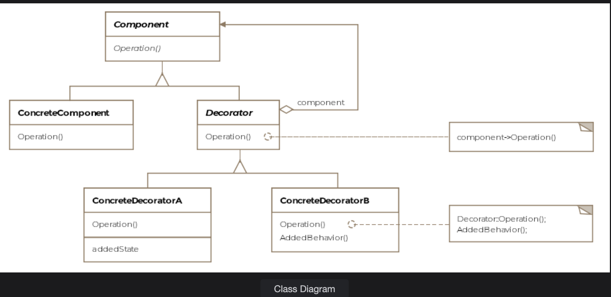

# Decorator Pattern

> *Dynamically add new functionality to objects without modifying their defining classes — wrap, don't subclass.*

The Decorator is a **Structural** design pattern that provides a flexible, composable alternative to subclassing. Instead of building a new class for every feature combination, you wrap an existing object inside a decorator that adds behavior on top — and decorators can be stacked, mixed, and applied at runtime.

---

## What Is It?

When you want to extend an object's behavior, the instinctive approach is inheritance: create a subclass. But inheritance is static — it's baked in at compile time. What if you need to add features *selectively*, *at runtime*, or in *different combinations* for different objects?

The Decorator pattern solves this by **wrapping** an object inside another object (the decorator) that implements the same interface. The decorator intercepts method calls, delegates to the wrapped object, and adds its own behavior before or after.

```
Client → [Decorator B → [Decorator A → [Original Object]]]
```

Each layer adds a behavior. The client sees only the outermost interface — it never knows how many layers of decoration are beneath.

> **Formal definition:** Attach additional responsibilities to an object dynamically. Decorators provide a flexible alternative to subclassing for extending functionality.

---

## Class Diagram

```
         ┌──────────────────────────────┐
         │        «interface»           │
         │          IAircraft           │  ← Component
         │──────────────────────────────│
         │  + fly(): void               │
         │  + land(): void              │
         │  + getWeight(): float        │
         └──────────────────────────────┘
                 ▲               ▲
                 │               │
  ┌──────────────────┐    ┌───────────────────────────┐
  │    Boeing747     │    │   «abstract»              │
  │──────────────────│    │   BoeingDecorator         │  ← Decorator
  │ + fly()          │    │───────────────────────────│
  │ + land()         │    │ # boeing: IAircraft       │ ◄── wraps the component
  │ + getWeight()    │    │───────────────────────────│
  │   → 100f         │    │ + fly()                   │
  └──────────────────┘    │ + land()                  │
   (Concrete Component)   │ + getWeight()             │
                          └───────────────────────────┘
                                      ▲
                        ┌─────────────┴──────────────┐
                        │                            │
            ┌───────────────────────┐   ┌────────────────────────┐
            │    LuxuryFittings     │   │      BulletProof        │
            │───────────────────────│   │────────────────────────-│
            │ + getWeight()         │   │ + getWeight()           │
            │   → +30.5f            │   │   → +50.0f              │
            └───────────────────────┘   └────────────────────────┘
              (Concrete Decorator)         (Concrete Decorator)
```



The pattern consists of four key entities:

| Entity | Role |
|---|---|
| **Component** | The interface both the real object and decorators implement (`IAircraft`) |
| **Concrete Component** | The base object being decorated (`Boeing747`) |
| **Decorator** | Abstract class implementing Component; holds a reference to a Component (`BoeingDecorator`) |
| **Concrete Decorator** | Adds specific behavior before/after delegating to the wrapped object (`LuxuryFittings`, `BulletProof`) |

---

## Example: Boeing-747 Options ✈️

Think of the base `Boeing747` like a car's base model. Optional packages — luxury fittings, bullet-proofing — can be added on top. Each package adds weight. We want a way to calculate total weight regardless of which combination of packages is installed, without creating a separate subclass for every possible combination.

### Without the Decorator Pattern (subclassing approach)

```
Boeing747
├── Boeing747WithLuxury
├── Boeing747WithBulletProof
└── Boeing747WithLuxuryAndBulletProof  ← combinatorial explosion!
```

3 packages = up to 7 subclasses. Add a 4th package = 15 subclasses. This doesn't scale.

---

### Step 1 — The Component Interface

```java
public interface IAircraft {

    float baseWeight = 100;

    void fly();
    void land();
    float getWeight();
}
```

---

### Step 2 — The Concrete Component (base model)

```java
public class Boeing747 implements IAircraft {

    @Override
    public void fly() {
        System.out.println("Boeing-747 flying ...");
    }

    @Override
    public void land() {
        System.out.println("Boeing-747 landing ...");
    }

    @Override
    public float getWeight() {
        return baseWeight;  // 100 units
    }
}
```

---

### Step 3 — The Abstract Decorator

```java
public abstract class BoeingDecorator implements IAircraft {
    // Implements IAircraft so it can stand in place of Boeing747
    // Concrete decorators will hold a reference to the wrapped IAircraft
}
```

---

### Step 4 — Concrete Decorators

```java
public class LuxuryFittings extends BoeingDecorator {

    IAircraft boeing;  // reference to the wrapped object

    public LuxuryFittings(IAircraft boeing) {
        this.boeing = boeing;
    }

    @Override
    public void fly() {
        boeing.fly();  // delegate
    }

    @Override
    public void land() {
        boeing.land();  // delegate
    }

    @Override
    public float getWeight() {
        return 30.5f + boeing.getWeight();  // add own weight, delegate the rest
    }
}

public class BulletProof extends BoeingDecorator {

    IAircraft boeing;

    public BulletProof(IAircraft boeing) {
        this.boeing = boeing;
    }

    @Override
    public void fly() {
        boeing.fly();
    }

    @Override
    public void land() {
        boeing.land();
    }

    @Override
    public float getWeight() {
        return 50f + boeing.getWeight();  // add own weight, delegate the rest
    }
}
```

---

### Step 5 — Client Usage

```java
public class Client {

    public void main() {
        IAircraft simpleBoeing      = new Boeing747();
        IAircraft luxuriousBoeing   = new LuxuryFittings(simpleBoeing);
        IAircraft bulletProofBoeing = new BulletProof(luxuriousBoeing);

        float netWeight = bulletProofBoeing.getWeight();
        System.out.println("Final weight: " + netWeight);  // 180.5
    }
}
```

---

## How the Weight Resolves (Layer by Layer)

```
bulletProofBoeing.getWeight()
│
│  BulletProof adds 50f, then calls →
▼
luxuriousBoeing.getWeight()
│
│  LuxuryFittings adds 30.5f, then calls →
▼
simpleBoeing.getWeight()
│
└── returns 100f (base weight)

Unwinding back up:
  100f (base)
+ 30.5f (luxury)   = 130.5f
+ 50f (bulletproof) = 180.5f ✅
```

No subclass needed for the luxury+bulletproof combination. The stacking happens at runtime through simple object composition.

---

## Decorator Stacking is Flexible

The order of decoration matters and can be varied at runtime:

```java
// Luxury first, then bulletproof
IAircraft v1 = new BulletProof(new LuxuryFittings(new Boeing747()));

// Bulletproof first, then luxury (same total weight — order doesn't matter for weight)
IAircraft v2 = new LuxuryFittings(new BulletProof(new Boeing747()));

// Luxury only
IAircraft v3 = new LuxuryFittings(new Boeing747());

// No extras
IAircraft v4 = new Boeing747();
```

Any combination works — zero changes to `Boeing747` or the decorator classes themselves.

---

## Real-World Example: Java I/O

The `java.io` package is the most famous real-world use of the Decorator pattern. Every stream wrapper is a decorator:

```java
// Base component — reads raw bytes from a file
FileInputStream fileInputStream = new FileInputStream("myFile.txt");

// Decorator 1 — adds buffering capability
BufferedInputStream bufferedInputStream = new BufferedInputStream(fileInputStream);

// Decorator 2 — adds data-type reading (int, long, float, etc.)
DataInputStream dataInputStream = new DataInputStream(bufferedInputStream);

// The read is now buffered AND type-aware
dataInputStream.readInt();
```

```
DataInputStream
    └── wraps BufferedInputStream
            └── wraps FileInputStream
                    └── reads from file
```

Each decorator adds one capability. Mix and match for exactly the features you need — no subclass for every combination.

| Class | Role |
|---|---|
| `FileInputStream` | Concrete Component — actual file reading |
| `FilterInputStream` | Abstract Decorator — base for all stream decorators |
| `BufferedInputStream` | Concrete Decorator — adds buffering |
| `DataInputStream` | Concrete Decorator — adds typed reads |
| `GZIPInputStream` | Concrete Decorator — adds decompression |

---

## Decorator vs. Other Structural Patterns

| Pattern | Key Difference |
|---|---|
| **Decorator** | Adds behavior dynamically; wraps object with *same* interface; stackable |
| **Adapter** | Changes an interface to make it compatible; not stackable |
| **Composite** | Builds a tree of objects; focus is on part-whole hierarchy, not behavior extension |
| **Proxy** | Controls *access* to an object; typically one proxy per object, not stackable |

> The key marker for Decorator: the wrapper and the wrapped both implement the **same interface**, and wrappers can be **nested arbitrarily**.

---

## Caveats & Gotchas

| Caveat | Details |
|---|---|
| **Class proliferation** | Each new feature needs a new decorator class. With many features, the number of decorators grows. Java's `java.io` is a well-known example of this getting unwieldy. |
| **Loss of concrete type** | Once an object is wrapped, the reference is through the abstract interface. Code that needs to act on the concrete type (e.g. `instanceof Boeing747`) can no longer do so easily. |
| **Decorator order sensitivity** | Some decorators may produce different results depending on the order of stacking — document intended stacking order clearly. |
| **Debugging difficulty** | A deeply nested chain of decorators can be confusing to trace in a debugger — the call stack may show many layers of delegation before reaching the base object. |

---

## When to Use the Decorator Pattern

✅ You want to add behavior to individual objects without affecting others of the same class  
✅ You need to add features in arbitrary combinations — the number of combinations makes subclassing impractical  
✅ You want to add or remove responsibilities at runtime rather than compile time  
✅ Extending via subclassing is impractical (e.g. the class is `final`, or you don't own it)  

❌ Avoid when you need to act on the specific concrete type of the object — decorators hide the original type  
❌ Avoid when the component interface is large — every decorator must implement all methods, mostly as pass-throughs, which becomes boilerplate-heavy