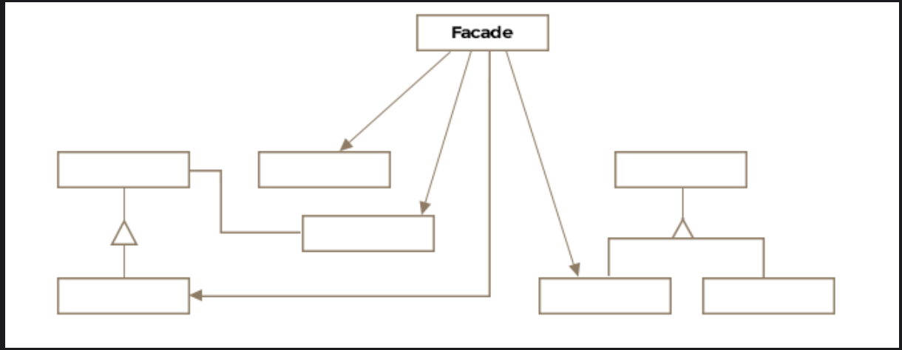

# Facade Pattern

> *Provide a single, simplified interface to a complex subsystem — hide the wiring, expose the switch.*

The Facade is a **Structural** design pattern that wraps a complicated set of subsystems behind a clean, easy-to-use interface. It doesn't add new functionality — it makes existing functionality dramatically easier to use correctly.

---

## What Is It?

A *façade* in architecture is the front face of a building — the polished exterior that hides all the structural complexity behind it. The software Facade pattern does exactly the same thing: it presents a simple face to the world while concealing the intricate machinery behind it.

### Real-World Analogies

**Light Switch**
Pressing a button to turn on your room lights hides an enormous chain of complexity — power generation, transformers, distribution grids, circuit breakers, wiring. The switch is a facade: one simple interface to a deeply complex subsystem.

**Car Ignition**
Turning a key (or pressing a start button) fires up the fuel injection system, the battery, the alternator, the cooling system, and dozens of sensors — all hidden behind one action.

The software Facade pattern applies this same principle: instead of forcing the client to orchestrate multiple subsystems in the right order, a single Facade object does the orchestration.

> **Formal definition:** A single uber-interface to one or more subsystems or interfaces, intending to make use of the subsystems easier.

---

## Class Diagram

```
           ┌─────────────────────────────────────────┐
           │            Client (Boeing747)            │
           └─────────────────────────────────────────┘
                               │
                               │ talks only to
                               ▼
           ┌──────────────────────────────────────────┐
           │           AutopilotFacade                │  ← Facade
           │──────────────────────────────────────────│
           │ - altitudeMonitor: BoeingAltitudeMonitor │
           │ - engineController: BoeingEngineController│
           │ - fuelMonitor: BoeingFuelMonitor         │
           │ - navigationSystem: BoeingNavigationSystem│
           │──────────────────────────────────────────│
           │ + autopilotOn(): void                    │
           │ + autopilotOff(): void                   │
           └──────────────────────────────────────────┘
                 │          │           │          │
        ┌────────┘    ┌─────┘     ┌────┘    ┌─────┘
        ▼             ▼           ▼          ▼
 ┌────────────┐ ┌──────────┐ ┌─────────┐ ┌──────────────┐
 │ Altitude   │ │ Engine   │ │  Fuel   │ │ Navigation   │
 │ Monitor    │ │Controller│ │ Monitor │ │   System     │
 └────────────┘ └──────────┘ └─────────┘ └──────────────┘
         Subsystem Classes (hidden from client)
```


The pattern consists of just two key entities:

| Entity | Role |
|---|---|
| **Facade** | The simplified interface; orchestrates subsystems on behalf of the client |
| **Subsystem Classes** | The complex underlying components; do the actual work; know nothing about the facade |

---

## Example: Boeing Autopilot ✈️

Modern autopilot systems coordinate altitude monitoring, engine speed, fuel consumption, and navigation — all simultaneously, in the right sequence. A pilot shouldn't need to manually coordinate all of these. The Facade encapsulates that orchestration into two simple operations: `autopilotOn()` and `autopilotOff()`.

### The Subsystems (complex internals)

```java
// Each subsystem is complex on its own — only their relevant methods shown

public class BoeingAltitudeMonitor {
    public void autoMonitor() { /* continuously adjust altitude */ }
    public void turnOff()     { /* safely suspend monitoring    */ }
}

public class BoeingEngineController {
    public void setEngineSpeed(int rpm) { /* adjust thrust          */ }
    public int  getEngineSpeed()        { /* return current rpm     */ }
    public void turnOff()               { /* safely power down      */ }
}

public class BoeingFuelMonitor {
    public float getRemainingFuelInGallons() { /* read fuel sensors */ }
    public void  turnOff()                   { /* shut down monitor */ }
}

public class BoeingNavigationSystem {
    public void setDirectionBasedOnSpeedAndFuel(int speed, float fuel) {
        /* compute and set optimal heading */
    }
    public void turnOff() { /* safely disengage */ }
}
```

### The Facade

```java
public class AutopilotFacade {

    private BoeingAltitudeMonitor   altitudeMonitor;
    private BoeingEngineController  engineController;
    private BoeingFuelMonitor       fuelMonitor;
    private BoeingNavigationSystem  navigationSystem;

    public AutopilotFacade(
            BoeingAltitudeMonitor   altitudeMonitor,
            BoeingEngineController  engineController,
            BoeingFuelMonitor       fuelMonitor,
            BoeingNavigationSystem  navigationSystem) {

        this.altitudeMonitor  = altitudeMonitor;
        this.engineController = engineController;
        this.fuelMonitor      = fuelMonitor;
        this.navigationSystem = navigationSystem;
    }

    // One call activates and coordinates all subsystems in the right order
    public void autopilotOn() {
        altitudeMonitor.autoMonitor();
        engineController.setEngineSpeed(700);
        navigationSystem.setDirectionBasedOnSpeedAndFuel(
                engineController.getEngineSpeed(),
                fuelMonitor.getRemainingFuelInGallons());
    }

    // One call safely shuts everything down
    public void autopilotOff() {
        altitudeMonitor.turnOff();
        engineController.turnOff();
        navigationSystem.turnOff();
        fuelMonitor.turnOff();
    }
}
```

### Client Usage

```java
public class Boeing747 {

    AutopilotFacade autopilot;

    public Boeing747(AutopilotFacade autopilot) {
        this.autopilot = autopilot;
    }

    public void engageAutopilot() {
        autopilot.autopilotOn();   // all subsystems handled
    }

    public void disengageAutopilot() {
        autopilot.autopilotOff();  // all subsystems shut down safely
    }
}
```

> **Key insight:** `Boeing747` has no knowledge of `BoeingEngineController`, `BoeingFuelMonitor`, or any other subsystem. If tomorrow `BoeingNavigationSystem` is replaced with a newer GPS model, only the `AutopilotFacade` changes — `Boeing747` and all other clients are completely unaffected.

---

## What the Facade Does and Doesn't Do

```
Without Facade — Client must orchestrate everything:
─────────────────────────────────────────────────────
altitudeMonitor.autoMonitor();
engineController.setEngineSpeed(700);
navigationSystem.setDirectionBasedOnSpeedAndFuel(
    engineController.getEngineSpeed(),
    fuelMonitor.getRemainingFuelInGallons()
);
// Client must know the correct sequence, the parameters, and all subsystem APIs

With Facade — Client does one thing:
─────────────────────────────────────
autopilot.autopilotOn();
// That's it. Sequence, parameters, and subsystems are the facade's problem.
```

> The facade doesn't *prevent* direct access to subsystems — it just makes it unnecessary. Advanced clients that need fine-grained control can still interact with subsystems directly. The facade is a convenience, not a lock.

---

## How Changes Are Quarantined

```
Before (no facade):
  Boeing747 ──► AltitudeMonitor
  Boeing747 ──► EngineController   ← change to any subsystem
  Boeing747 ──► FuelMonitor           ripples into Boeing747
  Boeing747 ──► NavigationSystem

After (with facade):
  Boeing747 ──► AutopilotFacade ──► AltitudeMonitor
                               ──► EngineController   ← change quarantined
                               ──► FuelMonitor           here only
                               ──► NavigationSystem
```

This is the key architectural benefit: **changes to subsystems are quarantined to the facade**. The rest of the codebase stays stable.

---

## Real-World Examples

### Java Faces — `FacesContext`

`javax.faces.context.FacesContext` internally coordinates `Lifecycle`, `ViewHandler`, `ExternalContext`, and more. The developer calls a few clean methods on `FacesContext` and never has to manage those subsystems directly.

### Java Faces — `ExternalContext`

`javax.faces.context.ExternalContext` wraps `HttpSession`, `HttpServletRequest`, `HttpServletResponse`, and servlet context internals — all behind one tidy interface for JSF developers.

### Home Automation System

```
"Good Night" scene button (Facade)
├── Locks all doors
├── Arms security system
├── Dims all lights to 0%
├── Sets thermostat to 68°F
└── Turns off all entertainment systems
```

One button, five subsystems, zero manual coordination. That's the Facade pattern in everyday life.

### Web Application Layers

Many web frameworks use facades at each layer boundary:

```
Controller
   └── calls → ServiceFacade.processOrder(orderId)
                    ├── InventoryService.checkStock()
                    ├── PaymentService.charge()
                    ├── ShippingService.schedule()
                    └── NotificationService.sendConfirmation()
```

---

## Facade vs. Other Structural Patterns

| Pattern | Key Difference |
|---|---|
| **Facade** | Simplifies access to a subsystem; defines a *new*, higher-level interface |
| **Adapter** | Makes an *existing* interface compatible with another; doesn't simplify, translates |
| **Decorator** | Adds behavior to an object through wrapping; preserves the original interface |
| **Mediator** | Centralizes complex *communication between objects*; objects know about the mediator |
| **Proxy** | Controls *access* to a single object; same interface, different behavior |

> The clearest distinction: **Facade simplifies** (higher-level interface), **Adapter translates** (same-level interface), **Decorator extends** (same interface + new behavior).

---

## Caveats & Gotchas

| Caveat | Details |
|---|---|
| **Facade as Singleton** | Usually only one facade is needed per subsystem. Implement it as a Singleton (or inject it as a shared dependency) to avoid multiple instances each holding references to the same subsystems. |
| **God object risk** | A facade that does too much becomes a monolith — a "god object" that knows about everything. Keep facades focused on one coherent subsystem or workflow. |
| **Not a replacement for good design** | A facade placed over a poorly designed subsystem makes it usable but doesn't fix the underlying design. Fix the subsystem if possible; use a facade to ease the transition. |
| **Hidden complexity** | Facades can make it too easy to trigger expensive or complex operations with a single call. Document what happens behind the scenes so callers understand the cost. |

---

## When to Use the Facade Pattern

✅ You want to provide a simple interface to a complex subsystem  
✅ You want to layer your subsystems and reduce dependencies between them  
✅ You want to quarantine changes to subsystems from propagating through the codebase  
✅ You're building a library and want to provide a clean public API that hides internal complexity  
✅ There are many subsystems that must be orchestrated in a specific sequence  

❌ Avoid when clients genuinely need fine-grained control over subsystems — the facade will feel like an obstacle  
❌ Avoid if the "subsystem" is actually just one or two classes — a facade over something simple is unnecessary ceremony