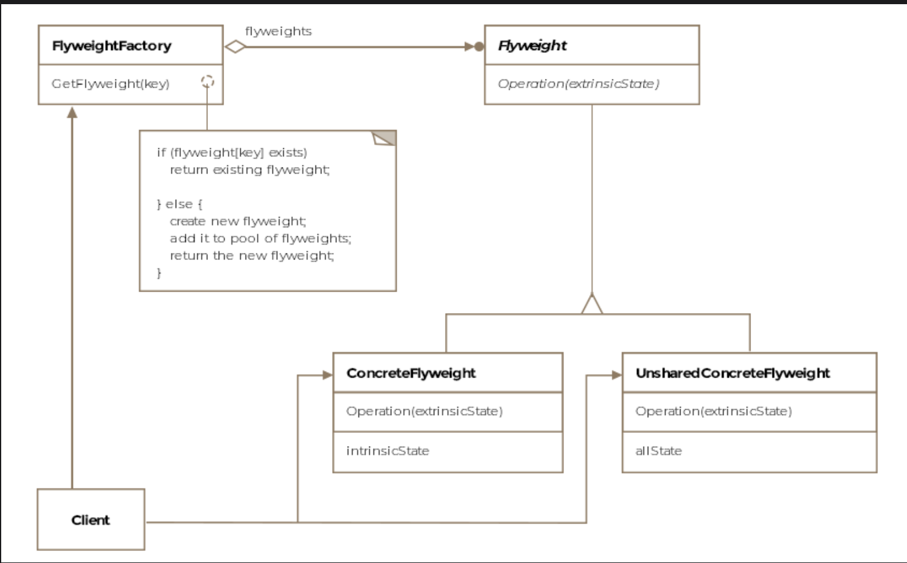

# Flyweight Pattern

> *Share state among a large number of fine-grained objects for efficiency — strip objects down to only what makes them unique.*

The Flyweight is a **Structural** design pattern focused on memory optimization. When a system needs to manage thousands of similar objects, the Flyweight pattern dramatically reduces memory usage by identifying what's shared across those objects and storing it only once.

---

## What Is It?

In boxing, a *flyweight* is the lightest weight class — lean, compact, carrying no excess. The software pattern is true to that spirit: it strips objects down to their lightest possible form by removing all state that can be shared and storing it centrally.

The core insight is that many objects in a system contain **two kinds of state**:

- **Intrinsic state** — data that is the same across all instances of the same type; independent of context; can be shared
- **Extrinsic state** — data that differs per instance; depends on context; must be passed in from outside

The Flyweight pattern keeps only intrinsic state inside the object and moves extrinsic state out, allowing a single object to serve many "logical" instances.

> **Formal definition:** Share state among a large number of fine-grained objects for efficiency.

---

## Intrinsic vs. Extrinsic State

| | Intrinsic State | Extrinsic State |
|---|---|---|
| **Definition** | Shared, context-independent | Unique, context-dependent |
| **Storage** | Inside the flyweight object | Outside — passed in by client |
| **Changes?** | Never (flyweights are immutable) | Changes per instance / per call |
| **F-16 example** | Crew count, dimensions, wingspan, model name | Current coordinates, fuel level, speed |
| **Text editor example** | Font, style, character encoding | Position on the page |

---

## Class Diagram

```
        ┌─────────────────────────────────┐
        │       FlyweightFactory          │  ← manages flyweight pool
        │─────────────────────────────────│
        │ - flyweights: Map<String, F16>  │
        │─────────────────────────────────│
        │ + getFlyweight(type): IAircraft │
        └─────────────────────────────────┘
                        │ creates / returns
                        ▼
        ┌─────────────────────────────────┐
        │    «interface» IAircraft        │  ← Flyweight interface
        │─────────────────────────────────│
        │ + getTimeToDestination(...)     │
        └─────────────────────────────────┘
                        ▲
            ┌───────────┴───────────┐
            │                       │
  ┌──────────────────┐   ┌──────────────────────┐
  │       F16        │   │    Boeing747         │
  │──────────────────│   │──────────────────────│
  │ (intrinsic only) │   │ (intrinsic only)     │  ← Concrete Flyweights
  │ name, personnel  │   │ name, personnel      │     (shared, immutable)
  │ dimensions...    │   │ dimensions...        │
  └──────────────────┘   └──────────────────────┘

  ┌──────────────────────────────┐
  │     Client Context           │  ← Extrinsic state lives here
  │──────────────────────────────│
  │ coordsF16[][]: current pos   │
  │ speed, fuel, destination     │
  └──────────────────────────────┘
```



The pattern consists of five key entities:

| Entity | Role |
|---|---|
| **Flyweight** | Interface for flyweight objects; methods accept extrinsic state as parameters |
| **Concrete Flyweight** | Stores intrinsic state; implements flyweight interface; must be immutable |
| **Unshared Concrete Flyweight** | Not all flyweight subclasses need to be shared — some may have unique state |
| **Flyweight Factory** | Creates and manages the pool of flyweight objects; ensures sharing |
| **Client** | Maintains extrinsic state; passes it into flyweight methods; uses the factory |

---

## Example: Global Aircraft Radar ✈️📡

Imagine a radar system tracking every aircraft currently airborne worldwide — thousands of planes. Naively, each plane would be a separate object in memory, each storing its model specs, crew requirements, dimensions *and* its real-time coordinates and fuel level.

The model specs are the same for every F-16 in the sky. Why store them thousands of times?

### The Problem Without Flyweight

```
10,000 F-16 objects × {
    name: "F16"             ← same in all 10,000
    personnel: 2            ← same in all 10,000
    dimensions: "15m long"  ← same in all 10,000
    wingspan: "33 feet"     ← same in all 10,000
    currentX: varies        ← unique per plane
    currentY: varies        ← unique per plane
    currentSpeed: varies    ← unique per plane
    remainingFuel: varies   ← unique per plane
}
= massive duplication of shared data
```

### Step 1 — The Flyweight Class (intrinsic state only)

```java
public class F16 implements IAircraft {

    // Intrinsic state — shared, immutable, stored once
    private final String name       = "F16";
    private final int    personnel  = 2;
    private final String dimensions = "15m long 3m wide";
    private final String wingspan   = "33 feet";

    // Extrinsic state is NEVER stored — it is passed in per call
    public double getTimeToDestination(
            int currX, int currY,
            int destX, int destY,
            int currSpeed) {

        // Uses only the passed-in extrinsic values — no instance state
        double distance = Math.sqrt(
            Math.pow(destX - currX, 2) + Math.pow(destY - currY, 2)
        );
        return distance / currSpeed;
    }

    public int getPersonnel()  { return personnel; }
    public String getName()    { return name; }
    public String getWingspan(){ return wingspan; }
}
```

### Step 2 — The Flyweight Factory (manages the shared pool)

```java
public class AircraftFlyweightFactory {

    // Pool of shared flyweight objects — one per aircraft type
    private static Map<String, IAircraft> flyweights = new HashMap<>();

    public static IAircraft getFlyweight(String aircraftType) {
        if (!flyweights.containsKey(aircraftType)) {
            switch (aircraftType) {
                case "F16":
                    flyweights.put("F16", new F16());
                    break;
                case "Boeing747":
                    flyweights.put("Boeing747", new Boeing747());
                    break;
                default:
                    throw new IllegalArgumentException("Unknown aircraft: " + aircraftType);
            }
        }
        return flyweights.get(aircraftType);  // return the shared instance
    }
}
```

> Clients should **never** call `new F16()` directly — always use the factory to ensure sharing.

### Step 3 — Client Usage (extrinsic state managed externally)

```java
public class RadarClient {

    public void main(int[][] coordsF16) {

        // ONE shared F-16 object serves ALL airborne F-16s
        IAircraft flyweightF16 = AircraftFlyweightFactory.getFlyweight("F16");

        for (int i = 0; i < coordsF16.length; i++) {
            int currX = coordsF16[i][0];  // extrinsic — unique per plane
            int currY = coordsF16[i][1];  // extrinsic — unique per plane

            // Extrinsic state passed in per call — NOT stored in the flyweight
            System.out.println("Time to destination: " +
                flyweightF16.getTimeToDestination(currX, currY, 10, 10, 200));
        }
    }
}
```

---

## Memory Impact Visualized

```
Without Flyweight (10,000 F-16s):
──────────────────────────────────
Object 1:  [name][personnel][dims][wingspan][x=12][y=45][speed=700][fuel=2000]
Object 2:  [name][personnel][dims][wingspan][x=88][y=12][speed=650][fuel=1800]
...
Object 10000: [name][personnel][dims][wingspan][x=...][y=...][...]
                ↑ duplicated 10,000 times ↑

With Flyweight (10,000 F-16s):
──────────────────────────────────
Shared F16: [name][personnel][dims][wingspan]  ← stored ONCE

Context 1:  [x=12][y=45][speed=700][fuel=2000]
Context 2:  [x=88][y=12][speed=650][fuel=1800]
...
Context 10000: [x=...][y=...]

Memory saved = 10,000 × (size of intrinsic fields)
```

---

## Real-World Examples

### Java — `Integer.valueOf()` and `Boolean.valueOf()`

Java caches `Integer` objects for values in the range −128 to 127. Every call to `Integer.valueOf(5)` returns the **same object**:

```java
Integer a = Integer.valueOf(5);
Integer b = Integer.valueOf(5);
System.out.println(a == b);  // true — same flyweight object

Integer c = Integer.valueOf(500);
Integer d = Integer.valueOf(500);
System.out.println(c == d);  // false — outside the cache range
```

`Boolean.valueOf(true)` and `Boolean.valueOf(false)` always return the same two shared objects — the classic flyweight.

### Text Editor — Characters as Flyweights

A document with 100,000 characters would create 100,000 objects if each character were a separate instance. Instead:

```
Flyweight pool (26 letters × styles = ~100 flyweights):
┌─────┐ ┌─────┐ ┌─────┐
│ 'a' │ │ 'b' │ │ 'c' │ ... (one per character+style combination)
└─────┘ └─────┘ └─────┘
  Intrinsic: encoding, font, style

Context per character occurrence:
  Extrinsic: position on page (x, y), paragraph, line number
```

100,000 character positions share ~100 flyweight objects instead of creating 100,000.

### Game Development — Terrain Tiles

```
Flyweight pool:
  GrassTile  (texture, color, walkable=true)   ← shared
  WaterTile  (texture, color, walkable=false)  ← shared
  RockTile   (texture, color, walkable=false)  ← shared

World map (1,000,000 tiles):
  tile[0][0] → GrassTile, position=(0,0)
  tile[0][1] → WaterTile, position=(0,1)
  ...
  (positions are extrinsic — tiles are shared flyweights)
```

---

## Flyweight vs. Singleton

These patterns are often confused since both involve shared objects — but they are fundamentally different:

| | Flyweight | Singleton |
|---|---|---|
| **Number of instances** | One per *type* (multiple flyweights possible) | Exactly one globally |
| **Mutability** | Immutable — must be | May be mutable |
| **Purpose** | Memory efficiency via sharing | Controlled global access |
| **Factory** | Managed by a Flyweight Factory | Self-managed via `getInstance()` |
| **State** | Only intrinsic (shared); extrinsic passed in | All state lives inside the singleton |

---

## Combining Flyweight with Other Patterns

| Combination | How They Work Together |
|---|---|
| **Flyweight + Composite** | Leaf nodes in a Composite tree are implemented as flyweights — common in UI and scene graphs |
| **Flyweight + Strategy** | Strategy objects (stateless algorithms) are natural flyweights — one instance shared across all users |
| **Flyweight + State** | Stateless State objects can be flyweights — the context object holds the extrinsic state |

---

## Caveats & Gotchas

| Caveat | Details |
|---|---|
| **Identity tests** | Shared flyweight objects mean `==` identity checks between conceptually different instances return `true`. Never rely on reference equality for flyweights. |
| **Thread safety** | Because flyweights are shared, any mutable extrinsic state in methods must be carefully handled in concurrent contexts. Flyweights themselves must be immutable. |
| **Extrinsic state management** | The client now bears responsibility for maintaining and passing extrinsic state correctly. This adds complexity to the client. |
| **Computing vs. storing extrinsic state** | If extrinsic state can be *computed* rather than stored, memory savings increase further — but computation time increases. A classic time/space trade-off. |
| **Not always a win** | If objects don't share much intrinsic state, the overhead of the factory and extrinsic context management may cost more than it saves. Profile before applying. |

---

## When to Use the Flyweight Pattern

✅ The application creates a very large number of objects (thousands or millions)  
✅ Objects consume significant memory and storage cost is a concern  
✅ Most object state can be made extrinsic (passed in rather than stored)  
✅ Many groups of objects can be replaced by relatively few shared flyweights  
✅ The application doesn't depend on object identity (since flyweights are shared)  

❌ Avoid when objects have little shared state — separation adds complexity without savings  
❌ Avoid when the application uses relatively few objects — premature optimization  
❌ Avoid when client code is not prepared to manage and supply extrinsic state