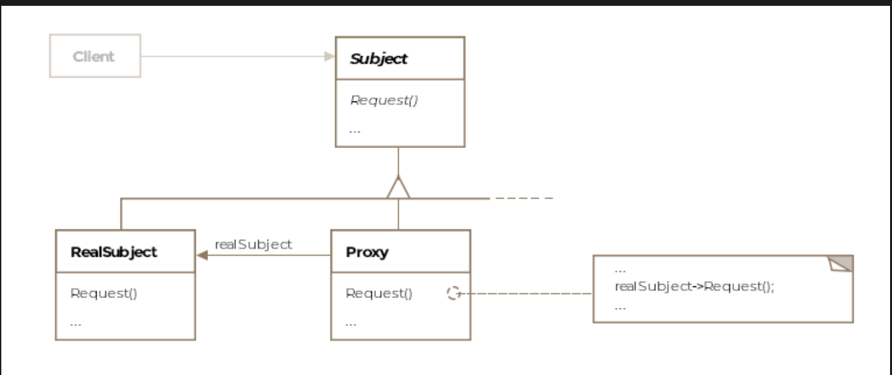

# Proxy Pattern

> *Provide a surrogate or placeholder for another object to control access to it.*

The Proxy is the final **Structural** design pattern — and one of the most versatile. A proxy sits in front of a real object, intercepting requests and deciding how, when, and whether to forward them. The client never knows it's talking to a proxy — it sees only the shared interface.

---

## What Is It?

The word *proxy* means "the authority to represent someone else." In software, a proxy is an object that stands in for another — the **real subject** — and controls all client access to it.

Why would you want a proxy between a client and the real object? Many reasons:

| Proxy Type | Purpose |
|---|---|
| **Remote Proxy** | Represents an object running on a different machine, JVM, or address space |
| **Virtual Proxy** | Delays expensive object creation until the object is actually needed |
| **Protection Proxy** | Controls access based on authorization or permissions |
| **Caching Proxy** | Caches results from the subject to avoid redundant operations |
| **Firewall Proxy** | Protects subjects from hostile clients or vice versa |
| **Synchronization Proxy** | Adds thread-safe access to a subject |

> **Formal definition:** A mechanism to provide a surrogate or placeholder for another object to control access to it.

---

## Class Diagram

```
  ┌──────────┐
  │  Client  │
  └──────────┘
       │
       │ talks only to →
       ▼
  ┌─────────────────────────────────┐
  │         «interface»            │  ← Subject
  │            IDrone              │
  │─────────────────────────────────│
  │ + turnLeft(): void             │
  │ + turnRight(): void            │
  │ + fireMissile(): void          │
  └─────────────────────────────────┘
           ▲                  ▲
           │                  │
  ┌──────────────────┐  ┌──────────────────┐
  │   DroneProxy     │  │      Drone       │
  │──────────────────│  │──────────────────│
  │ + turnLeft()     │  │ + turnLeft()     │
  │   → forwards     │  │   → executes     │
  │ + turnRight()    │  │ + turnRight()    │
  │   → forwards     │  │   → executes     │
  │ + fireMissile()  │  │ + fireMissile()  │
  │   → forwards     │  │   → executes     │
  └──────────────────┘  └──────────────────┘
       (Proxy)              (Real Subject)
           │  forwards over network  ▲
           └────────────────────────┘
```


The pattern consists of three key entities:

| Entity | Role |
|---|---|
| **Subject** | The common interface that both the Proxy and Real Subject implement |
| **Real Subject** | The actual object that does the real work; shielded from direct client access |
| **Proxy** | Implements the Subject interface; controls access to the Real Subject |

---

## The Three Core Proxy Types

### 1. Remote Proxy 🌐

A remote proxy represents an object that lives in a **different JVM, machine, or address space**. The client thinks it's talking directly to the real object — the proxy transparently handles the network communication.

```
Ground Cockpit (Client)
       │
       │ calls turnLeft()
       ▼
  DroneProxy (Remote Proxy)
       │
       │ serializes request + params → sends over wireless network
       ▼
  Drone (Real Subject, running on drone's hardware)
       │
       └── executes turnLeft() physically
```

**Real-world analogy:** An ambassador represents their country in a foreign nation. The host country communicates through the ambassador — it doesn't fly to the home country every time it wants to talk.

---

### 2. Virtual Proxy 💤

A virtual proxy **delays the creation of an expensive object** until it is actually needed. It stands in place of the real subject, providing what it can (metadata, placeholders) until the real object is ready.

```
Instagram on slow connection:
─────────────────────────────
[Loading spinner] ← Virtual Proxy
    │ knows: image dimensions, caption, author
    │ provides placeholder to layout engine
    │ downloads real image in background
    ▼
[Actual Photo] ← Real Subject (created on demand, only when download completes)
```

```java
public class ImageProxy implements IImage {

    private RealImage realImage;        // created lazily
    private String    imageUrl;
    private int       width, height;   // metadata available immediately

    public ImageProxy(String imageUrl, int width, int height) {
        this.imageUrl = imageUrl;
        this.width    = width;
        this.height   = height;
        // RealImage is NOT created yet
    }

    @Override
    public void display() {
        if (realImage == null) {
            realImage = new RealImage(imageUrl);  // created only on first display()
        }
        realImage.display();
    }

    public int getWidth()  { return width; }   // available without loading real image
    public int getHeight() { return height; }
}
```

---

### 3. Protection Proxy 🔒

A protection proxy **controls access based on authorization**. It vets every request before forwarding it, rejecting those that don't meet access criteria.

```java
public class DroneProtectionProxy implements IDrone {

    private Drone realDrone;
    private String pilotClearanceLevel;

    public DroneProtectionProxy(Drone realDrone, String clearanceLevel) {
        this.realDrone           = realDrone;
        this.pilotClearanceLevel = clearanceLevel;
    }

    @Override
    public void turnLeft() {
        realDrone.turnLeft();  // all pilots can steer
    }

    @Override
    public void turnRight() {
        realDrone.turnRight();
    }

    @Override
    public void fireMissile() {
        if ("COMBAT".equals(pilotClearanceLevel)) {
            realDrone.fireMissile();  // only combat-cleared pilots can fire
        } else {
            throw new SecurityException("Insufficient clearance to fire missile.");
        }
    }
}
```

---

## Full Example: Remote Drone Control ✈️🎮

### The Shared Interface

```java
public interface IDrone {
    void turnLeft();
    void turnRight();
    void fireMissile();
}
```

### The Remote Proxy (ground cockpit side)

```java
public class DroneProxy implements IDrone {

    // In a real implementation, this would hold a network connection
    // to the drone's on-board computer

    @Override
    public void turnLeft() {
        // Serialize request → transmit over wireless → await acknowledgment
        System.out.println("[Proxy] Forwarding turnLeft to drone over network...");
    }

    @Override
    public void turnRight() {
        System.out.println("[Proxy] Forwarding turnRight to drone over network...");
    }

    @Override
    public void fireMissile() {
        System.out.println("[Proxy] Forwarding fireMissile to drone over network...");
    }
}
```

### The Real Subject (drone hardware side)

```java
public class Drone implements IDrone {

    @Override
    public void turnLeft() {
        // Receive deserialized request from proxy
        // Actuate physical left-turn mechanism
        System.out.println("[Drone] Turning left.");
    }

    @Override
    public void turnRight() {
        System.out.println("[Drone] Turning right.");
    }

    @Override
    public void fireMissile() {
        System.out.println("[Drone] Missile fired.");
    }
}
```

### The Client (pilot at ground cockpit)

```java
public class Client {

    public void main(DroneProxy droneProxy) {

        Scanner scanner = new Scanner(System.in);

        // Client works with IDrone — has no idea it's a proxy
        while (true) {
            String action = scanner.nextLine();

            switch (action) {
                case "left":  droneProxy.turnLeft();    break;
                case "right": droneProxy.turnRight();   break;
                case "fire":  droneProxy.fireMissile(); break;
                default: System.out.println("Invalid action");
            }
        }
    }
}
```

> **Key insight:** The client calls `droneProxy.turnLeft()` exactly as it would call `drone.turnLeft()`. The proxy and the real subject are interchangeable from the client's perspective — that's the power of the shared interface.

---

## How Remote Proxy Communication Works

```
Client (Ground)                         Drone (Airborne)
─────────────────                       ─────────────────
pilot presses "fire"
    │
    ▼
DroneProxy.fireMissile()
    │
    │ 1. Marshal method name + params
    │ 2. Transmit over wireless network ──────────────────►
    │                                       Helper Entity
    │                                         (receiver)
    │                                            │
    │                                            │ 3. Unmarshal request
    │                                            │ 4. Forward to Drone object
    │                                            ▼
    │                                       Drone.fireMissile()
    │                                            │ executes
    │                                            │
    │◄──────────────────────────────────── 5. Return result
    ▼
DroneProxy returns result to Client
```

This is exactly how Java RMI (`java.rmi.*`) works — the proxy and helper stubs are generated automatically.

---

## Real-World Examples

### Java Reflection — `java.lang.reflect.Proxy`

Java's `Proxy` class lets you create a proxy for any interface at runtime, intercepting all method calls:

```java
IDrone proxy = (IDrone) Proxy.newProxyInstance(
    IDrone.class.getClassLoader(),
    new Class[]{ IDrone.class },
    (proxyObj, method, args) -> {
        System.out.println("Before: " + method.getName());
        Object result = method.invoke(realDrone, args);
        System.out.println("After: " + method.getName());
        return result;
    }
);
```

This is a **dynamic proxy** — the proxy class is generated at runtime rather than written by hand. Used extensively in Spring AOP, Hibernate, and mocking frameworks like Mockito.

### Java RMI — `java.rmi.*`

RMI (Remote Method Invocation) is the canonical remote proxy in Java. It:

- Generates proxy stubs automatically
- Marshals method parameters to transmit over the network
- Unmarshals them back on the remote JVM
- Returns results transparently to the client

### Web Architecture — API Gateway

```
Client ──► API Gateway (Proxy)
               │
               ├── authenticates request       (protection proxy)
               ├── rate-limits calls           (firewall proxy)
               ├── caches common responses     (caching proxy)
               └── forwards to microservice    (remote proxy)
```

An API gateway is a composite proxy — combining protection, caching, firewall, and remote proxy behaviors in one layer.

---

## Proxy vs. Similar Patterns

| Pattern | Key Difference |
|---|---|
| **Proxy** | Same interface as subject; controls *access* to one object; one proxy per subject |
| **Decorator** | Same interface; *adds behavior* to an object; stackable layers |
| **Adapter** | *Changes* the interface to make two incompatible classes work together |
| **Facade** | *Simplifies* a complex multi-object subsystem behind a new higher-level interface |

> The critical distinction between Proxy and Decorator: **Proxy controls access** (may restrict, delay, or redirect). **Decorator adds functionality** (always forwards, then adds something on top).

---

## Caveats & Gotchas

| Caveat | Details |
|---|---|
| **Housekeeping responsibilities** | A proxy may also manage reference counting, encoding/encryption of requests, or cleanup of the subject when no longer needed |
| **Performance overhead** | Remote proxies add network latency; virtual proxies add a null-check on every call; caching proxies add cache management logic. Profile to ensure the benefit outweighs the cost. |
| **Transparency vs. awareness** | The client is designed to be unaware of the proxy — but this can make debugging harder when things go wrong (e.g. a network failure looks like the object is broken) |
| **Dynamic proxies** | `java.lang.reflect.Proxy` requires that the subject is an interface, not a class. For class-based proxying, use libraries like CGLIB or ByteBuddy (as Spring does internally). |

---

## When to Use the Proxy Pattern

✅ You need to access a remote object transparently, as if it were local  
✅ You want to defer expensive object creation until it's actually needed  
✅ You need to control access to an object based on authorization  
✅ You want to add caching, logging, or monitoring without modifying the real subject  
✅ You need thread-safe access to a subject that isn't thread-safe itself  

❌ Avoid when the indirection adds complexity without a clear benefit  
❌ Avoid when you can achieve the same goal by modifying the subject class directly  
❌ Avoid when response time is critical and the proxy's overhead is non-trivial