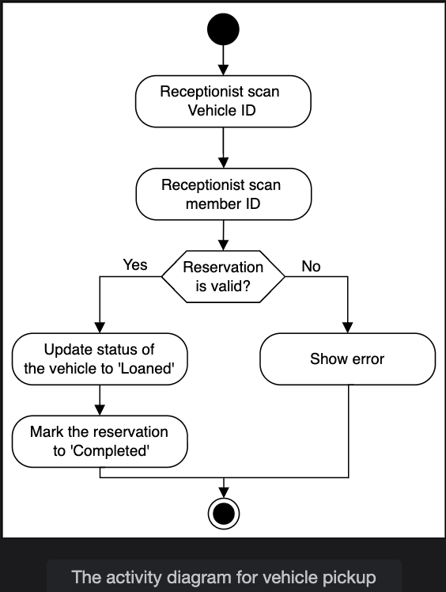
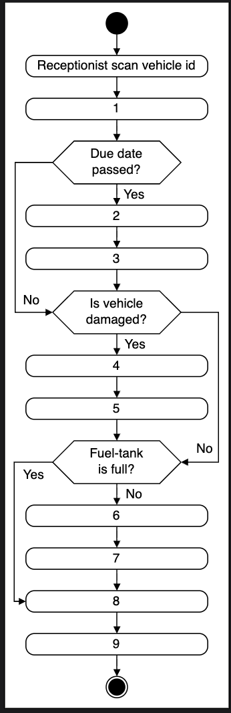
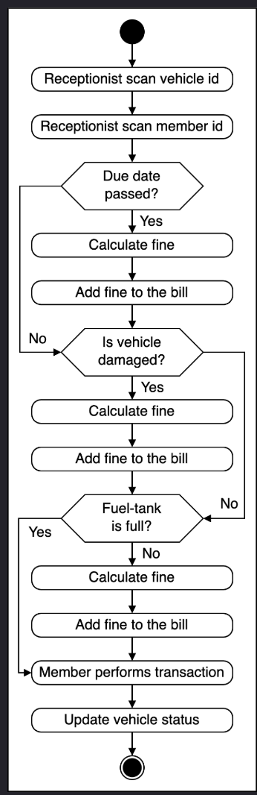

# Activity Diagram for the Car Rental System

Create some activity diagrams for the car rental system problem.

Activity diagrams are a great way to visualize the flow of messages from one activity to another in the system. There can be different activity diagrams that we can create for our car rental system. In this lesson, we will create activity diagrams for the following two activities:

* Vehicle pickup
* Activity challenge: Vehicle return

## Vehicle pickup

The states and actions involved in this activity diagram are given below.

### States

**Initial state:** A member with a vehicle booking comes to the "rent a car" reception to pick up the vehicle.

**Final state:** The guest successfully gets the vehicle, or the system shows a reservation error.

### Actions

When a member with a vehicle reservation arrives at the rent-a-car reception, the receptionist validates the reservation and updates the vehicle status.

Based on the order above, the activity diagram of the vehicle pickup from the car rental facility is given below.

## Activity challenge: Vehicle return
You will help us create an activity diagram of a member who wants to return the vehicle.

Here is the activity diagram structure:

Notice that the actions in the diagram above are numbered from 1 to 9. The slots below represent the activities, and the arrows represent the flow from one activity to another. Can you rearrange the slots below in the correct order they should appear in the activity diagram above?  

<strong>Click to view related requirements</strong>

