# Class Diagram for the Car Rental System
Learn to create a class diagram for the car rental system problem using the bottom-up approach.

Based on the given requirements, we’ll create the class diagram for the car rental system. In the class diagram, we will first identify the system’s classes (concrete, abstract, or associated) and interfaces. Then, we will determine the relationship between them according to the requirements in the previous lesson.

## Components of a car rental system
As mentioned, we’ll design the car rental system using a bottom-up approach.

## Address and person
The `Address` class is a reusable value object representing a physical address within the car rental system. This class standardizes storing and referencing addresses for customers, staff, and branches. It contains attributes such as street address, city, state/province, postal/zip code, and country

The `Person` class is an abstract base class that encapsulates common personal information for all individuals in the system, including customers, receptionists, and workers. This class centralizes attributes and methods shared by everyone in the system, promoting code reuse and maintainability. The class representation of `Address` and `Person` is given below:

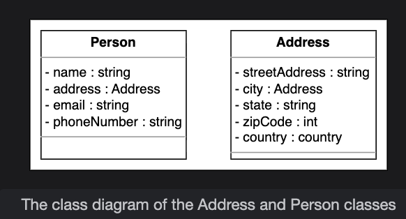

<strong>Click to view related requirements</strong>

**R1:**  The system supports two main user roles: customers and receptionists.  
**R4:**  The system must record every reservation, including the customer details and the date/time a vehicle is issued.  
**R12:**  The system must support the management of multiple branches in different cities and locations  

## Account
The `Account` class represents a person’s login and system access credentials. It is an abstract class because only specific user roles (customer, receptionist, worker) log into the system. The `Account` class manages authentication, authorization, and account state. This class has members like account ID, password, account status, etc.  

The `Customer` class represents customers who can register, log in, make vehicle reservations, manage their bookings, make payments, and receive notifications. The `Receptionist` is responsible for managing vehicles, reservations, and branch operations. Receptionists inherit all `Customer` privileges and can administer inventory and operations for their branch.

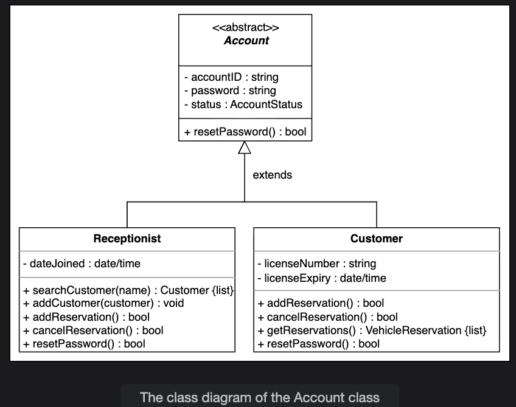

<strong>Click to view related requirements</strong>

**R1:**  The system supports two main user roles: customers and receptionists.  
**R4:**  The system must record every reservation, including the customer details and the date/time a vehicle is issued.  
**R6:**  Customers can cancel their reservations at any time before the pickup date, subject to company policies. 

## Driver
We will have a `Driver` class as we are designing the car rental problem. A customer can request an additional driver at the time of reservation. The class diagram is shown below:

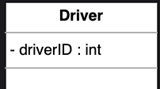

## Vehicle 
Our car rental system should have a vehicle object according to the requirements. The vehicle can be of four types: a car, a truck, a van, or a motorcycle. For this purpose, we’ll create `Vehicle` as an abstract class and `Car`, `Truck`, `Van`, and `Motorcycle` as its subclasses, as shown in the figure below:

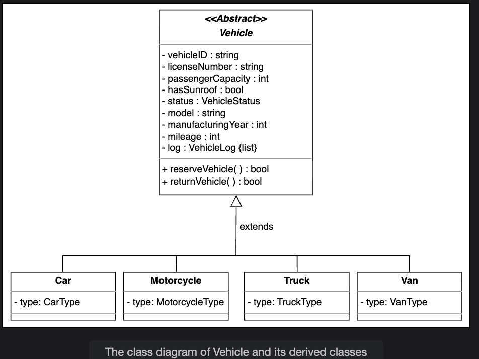

<strong>Click to view related requirements</strong>

**R2:** The system should handle multiple types of vehicles. Initially, it should cater to cars, trucks, vans, and motorcycles.  

## Equipment
`Equipment` is an abstract class that stores information about different types of equipment that can be added to the reservation. For simplicity, we’ll assume three types of equipment, i.e., navigation, child seat, and ski rack. The class diagram for `Equipment` and its subclasses is as follows:

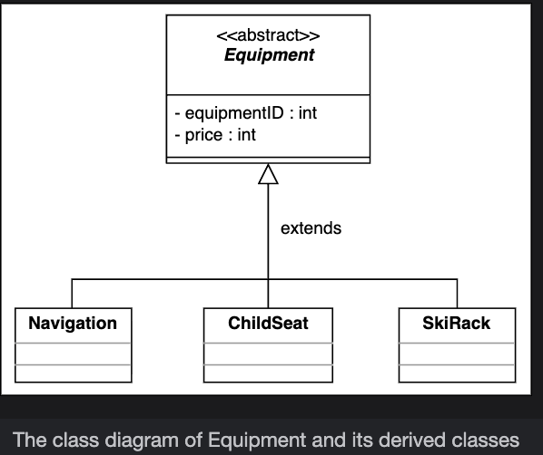

<strong>Click to view related requirements</strong>

**R8:**  The system should allow the users to add equipment to the reservations, like a ski rack, child seat, and navigation. 

## Service
`Service` is an abstract class that represents the services provided to the customers along with the vehicle. While reserving a vehicle, the customers can add a service to their reservation. Every service has its fixed cost. We have three types of services, i.e., driver, roadside assistance, and Wi-Fi. The UML diagram of `Service`, along with its subclasses `DriverService`, `RoadsideAssistance`, and `Wi-Fi`, is given below:

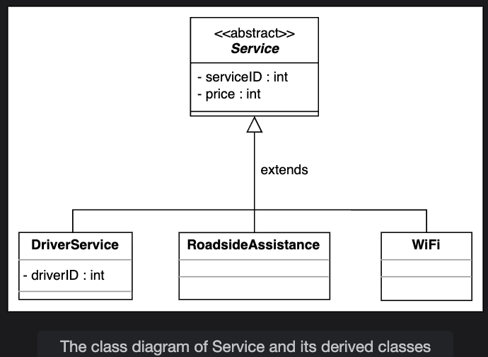

<strong>Click to view related requirements</strong>

**R9:**  The system should allow users to add services to the reservations, like a driver, Wi-Fi, and roadside assistance. 

## Notification
`Notification` is an abstract class responsible for sending notifications to customers. Every notification has an ID, creation date, and content. The notification can either be an SMS notification or an email notification. The `SMSNotification` class requires the customer’s phone number to send a notification, while `EmailNotification` is sent to the customer’s email address. The relationship diagram of these classes is shown below:

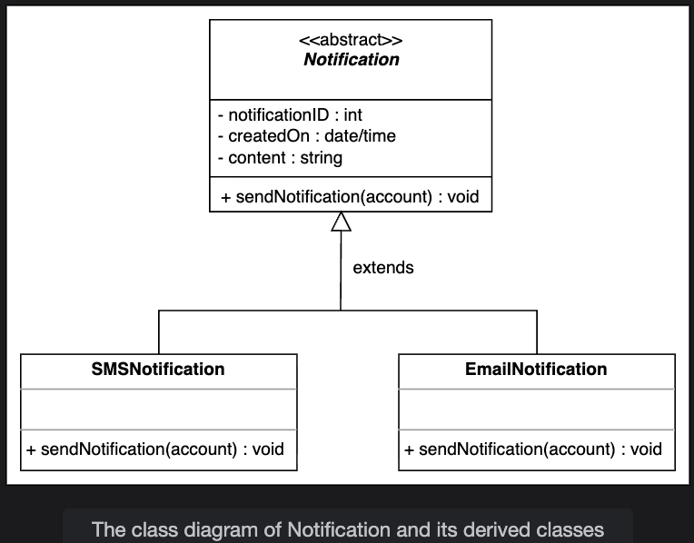

<strong>Click to view related requirements</strong>

**R10:**  The system should send a notification to the customer and generate a fine if the vehicle is not returned within the due date. 

## Parking stall
Each car rental location has parking stalls where the vehicles are parked. Each parking stall is identified by its ID, and a location identifier specifies its location. The representation of the `ParkingStall` class is shown below:

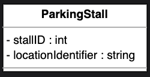

<strong>Click to view related requirements</strong>

**R13:** Every branch of the car rental system should have parking stalls to park the vehicles.

## Vehicle log
`VehicleLog` is a class that is used to keep track of all the events related to a vehicle. Every vehicle log has its ID, log type, description, and creation date, as shown here:

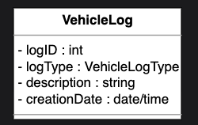

<strong>Click to view related requirements</strong>

**R7:** To keep track of all events related to the vehicle, the system should maintain a vehicle log.

## Vehicle reservation
Vehicle reservation is one of the most important requirements of the car rental system. To fulfill this functionality, we have a `VehicleReservation` class. This class is responsible for managing the vehicle reservation status of vehicles. The customer can also add any equipment or service at the time of reservation. The UML representation of the class is shown below:

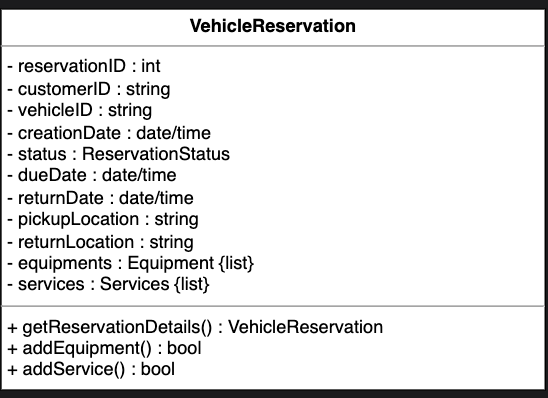

<strong>Click to view related requirements</strong>

**R4:** The system should be able to keep a record of who reserved a particular vehicle and on which date the vehicle was issued.

## Payment
The `Payment` class will be an abstract class with two child classes: `CreditCard` and `Cash`. These represent the two payment methods in the car rental system. The representation of these classes is given below:

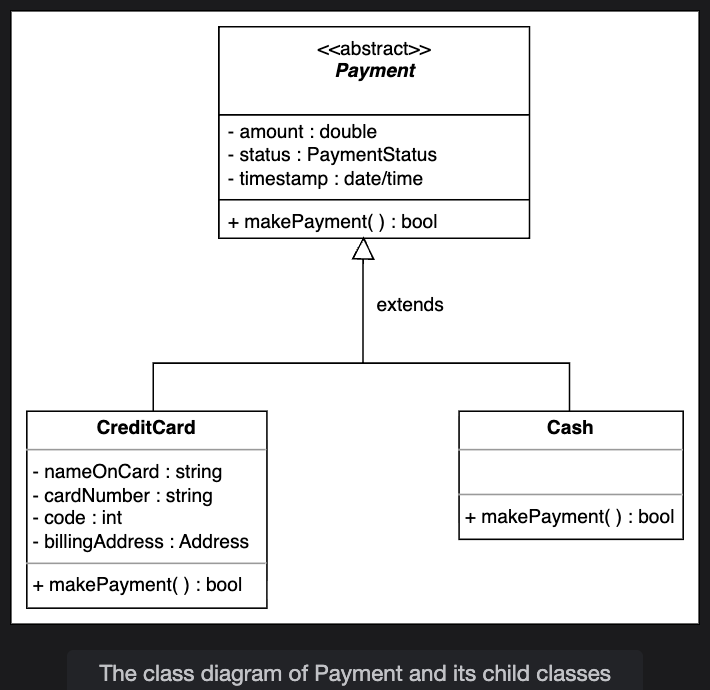

## Fine
The system needs the `Fine` class to calculate the fine on the vehicle reservation in case the customer returns the vehicle after the due date, the fuel in the vehicle is less than the limit value, or there is any damage to the vehicle. The representation of this class is given below:

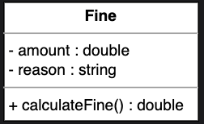

<strong>Click to view related requirements</strong>

**R10:** If the vehicle is not returned by the due date, the system should send a notification to the customer and generate a fine.

## Search interface and vehicle inventory class
`Search` is one of the most important functionalities of the system. It is the interface that allows the user to search for any vehicle and return the list of vehicles upon searching by any of the following methods:  

   - Search for a car by its type  
   - Search for a car by its model  

The `VehicleCatalog` is a class where the search function is implemented. In each catalog, the vehicles are sorted according to one search technique, i.e., vehicle type or model. The following UML diagram shows this relationship:

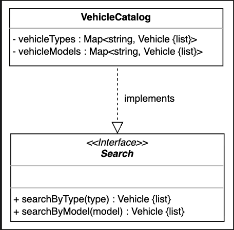

<strong>Click to view related requirements</strong>

**R11:** The system should allow users to search vehicles by type, model, or seat capacity.

## Car rental system and branch
`CarRentalSystem` is the main class of the car rental system and is the central part of the design. There can be multiple branches and locations of the car rental system. The `CarRentalBranch` class will represent each of these branches. The class representation is as follows:

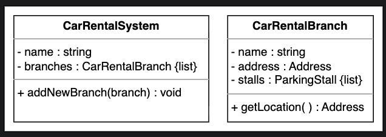

<strong>Click to view related requirements</strong>

**R12:** A system should be able to manage the multiple branches of the car rental system.

## Enumerations

The list of enumerations required in the car rental system is provided below:

- **VehicleStatus**: Describes the status of a particular vehicle, whether it is available, reserved, lost, or serviced.  
- **AccountStatus**: Indicates the user account status, i.e., active, closed, canceled, banned, or blocked.  
- **ReservationStatus**: Represents the reservation state of any vehicle, whether it is in an active, pending, confirmed, completed, or canceled state.  
- **PaymentStatus**: Checks if the customer’s payment status is unpaid, pending, completed, canceled, or refunded.  
- **VanType**: Specifies that the van can only be of two types: passenger or cargo.  
- **CarType**: Describes different types of cars, such as economy, compact, intermediate, standard, full-size, premium, or luxury.  
- **MotorcycleType**: Describes different types of motorcycles, whether standard, cruiser, touring, sports, off-road, or dual-purpose.  
- **TruckType**: Specifies the type of truck, whether it is light-duty, medium-duty, or heavy-duty.  
- **VehicleLogType**: Describes the type of a particular vehicle log, whether it is an accident, fueling, cleaning service, oil change, repair, or other.  

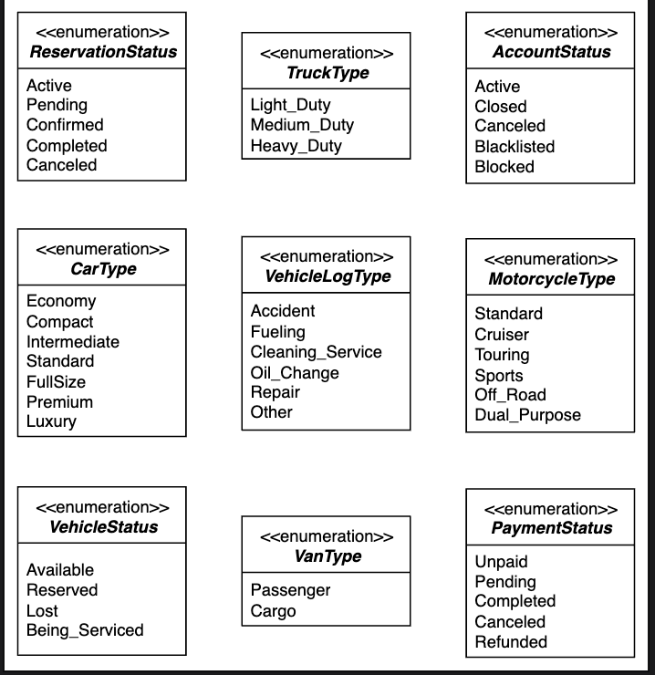

<strong>Click to view related requirements</strong>

**R3:** Vehicles can have multiple subtypes. The car type can be economy, luxury, standard, or compact. The van type can be passenger or cargo type. Moreover, the motorcycle type can be cruiser, touring, or sports. The truck type can be light, medium, or high-duty.

## Relationship between the Classes
Understanding the relationships between classes helps design a maintainable and extensible system.

### Association

Association represents a "uses" or "knows about" relationship between two classes.

#### One-way association:
- The `Account` class has a one-way association with the `VehicleReservation` class.
- The `VehicleReservation` class has a one-way association with the `Vehicle` class, referencing the vehicle but not vice versa.
- The `Fine` class has a one-way association with `Payment`, as fines relate to specific payments but payments do not reference fines.

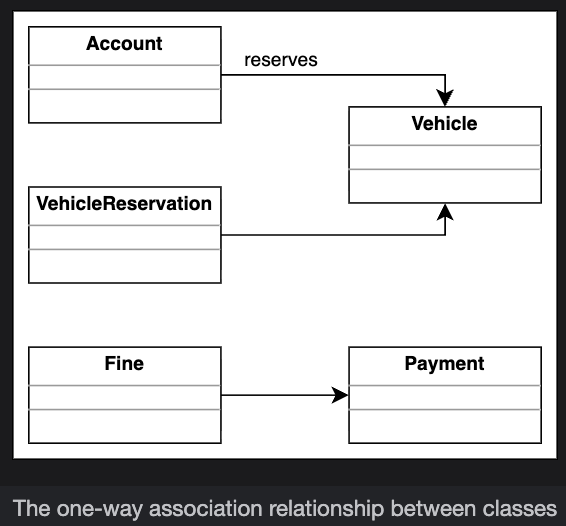

#### Two-way association:
- The `VehicleReservation` class has a two-way association with both `Payment` and `Notification`. Reservations link to payments and notifications, and these entities also reference back to the reservations.
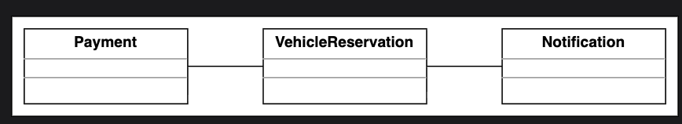

## Composition
Composition represents a strong "has-a" relationship where the lifetime of the part is controlled by the whole.  

- The `CarRentalBranch` class is composed of multiple `ParkingStall` instances. If the branch is deleted, its parking stalls cease to exist.  
- The `Vehicle` class is composed of `VehicleLog` entries. These logs exist only as long as the vehicle exists.
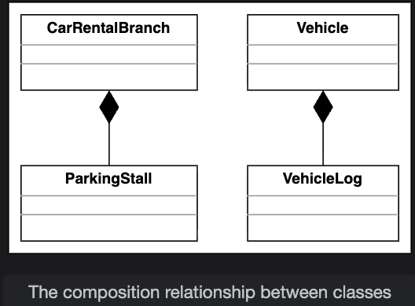

## Aggregation
Aggregation is a weaker “has-a” relationship where the part can exist independently of the whole.

- The `CarRentalSystem` class aggregates multiple `CarRentalBranch` instances, meaning branches can exist independently and could be shared or moved between systems.  
- The `ParkingStall` and `VehicleCatalog` classes aggregate `Vehicle` instances; vehicles can be reassigned or exist elsewhere independently.  
- The `VehicleReservation` class aggregates multiple `Equipment` and `Service` instances; these can be reused across different reservations or elsewhere in the system.
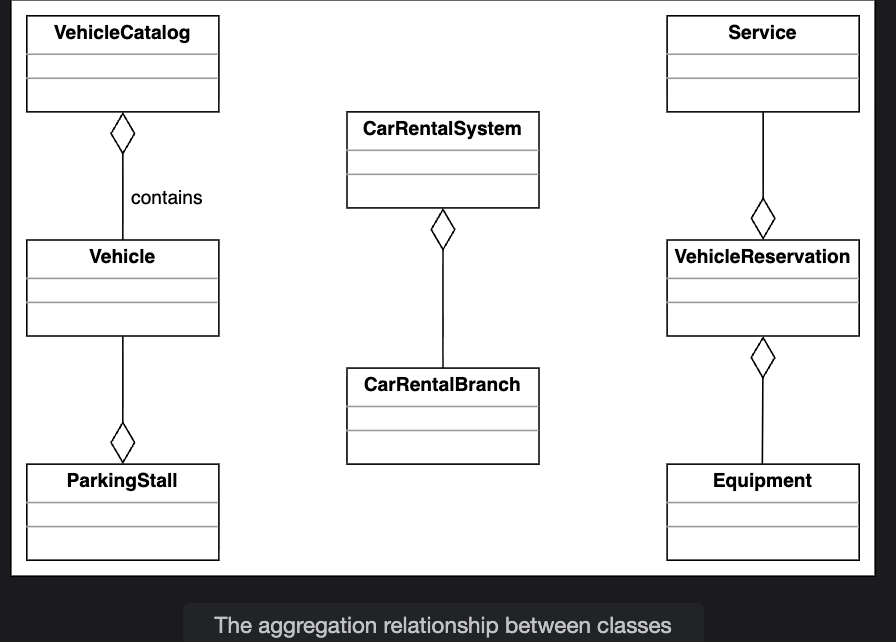

## Inheritance
Inheritance represents an “is-a” relationship. The following classes show inheritance:

- The `Receptionist` and `Customer` classes extend the abstract `Account` class, inheriting its fields and methods.  
- The `Account` class extends the `Person` class, inheriting personal information.  
- The `Car`, `Truck`, `Van`, and `Motorcycle` classes extend the `Vehicle` class, each representing a specialized vehicle type.  
- The `DriverService`, `RoadsideAssistance`, and `WiFi` classes extend the abstract `Service` class.  
- The `Navigation`, `ChildSeat`, and `SkiRack` classes extend the abstract `Equipment` class.  
- The `SmsNotification` and `EmailNotification` classes extend the abstract `Notification` class.  
- The `Cash` and `CreditCard` classes extend the abstract `Payment` class.  
- The `VehicleCatalog` class implements the `Search` interface, enabling searching for vehicles by type or model.  

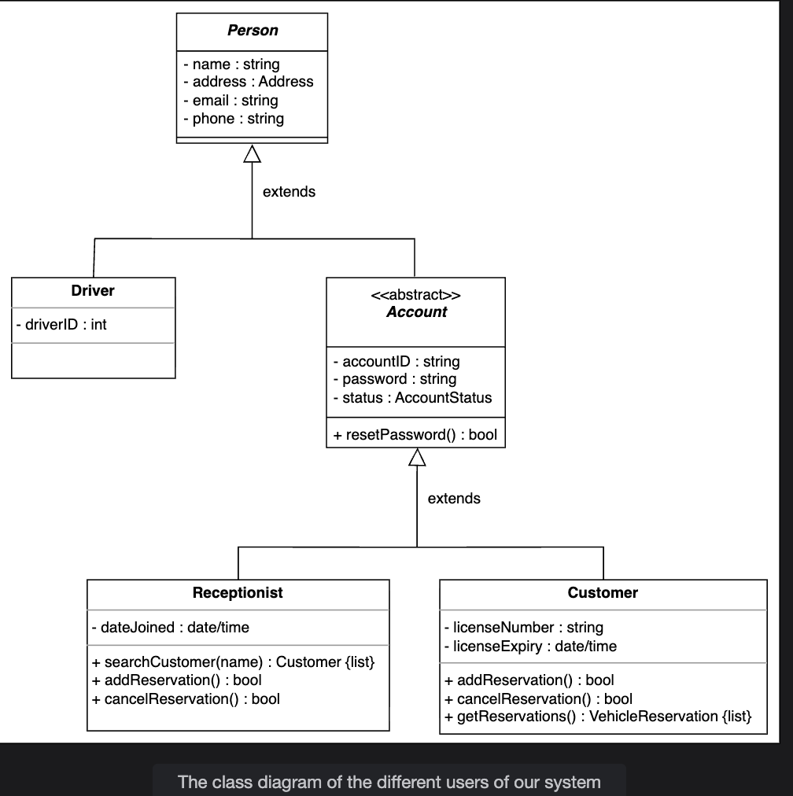

## Class Diagram of the Car Rental System

This section outlines the multiplicity relationships between the main classes in the car rental system, explaining allowed instances and design rationale.

| Source             | Target               | Multiplicity  | Reason                                                                                  |
|--------------------|----------------------|---------------|-----------------------------------------------------------------------------------------|
| CarRentalSystem    | CarRentalBranch      | 1 -- 0..*     | A car rental system manages zero or more branches (locations).                          |
| CarRentalBranch    | ParkingStall         | 1 -- 0..*     | Each branch consists of multiple parking stalls where vehicles are parked.             |
| ParkingStall       | Vehicle              | 0..* -- 1    | Each parking stall can hold one vehicle; vehicles may move between stalls.              |
| Vehicle            | VehicleLog           | 1 -- 0..*     | Each vehicle has zero or more logs to track events (accidents, maintenance, etc.).     |
| VehicleCatalog     | Vehicle              | 1 -- 0..*     | The catalog contains references to all available vehicles for searching.                |
| VehicleReservation | Vehicle              | 1 -- 1       | Each reservation is associated with exactly one vehicle.                               |
| VehicleReservation | Account              | 0..* -- 1    | One customer makes each reservation; customers may have multiple reservations.          |
| VehicleReservation | Equipment            | 1 -- 0..*     | Each reservation can include zero or more equipment (child seat, ski rack, etc.).       |
| VehicleReservation | Service              | 1 -- 0..*     | Each reservation can include zero or more optional services (WiFi, driver, assistance). |
| VehicleReservation | Payment              | 1 -- 1       | Each reservation involves exactly one payment.                                         |
| VehicleReservation | Notification         | 1 -- 0..*     | Each reservation can generate zero or more notifications (confirmation, cancellation).  |
| Fine               | Payment              | 0..1 -- 1    | A fine is linked to one payment if incurred, but not all payments result from fines.   |
| Customer           | Account              | 1 -- 1       | Each customer is associated with exactly one account.                                  |
| Receptionist       | Account              | 1 -- 1       | Each receptionist is associated with exactly one account.                              |
| Account            | Person               | 1 -- 1       | Each account corresponds to a person with contact information.                         |

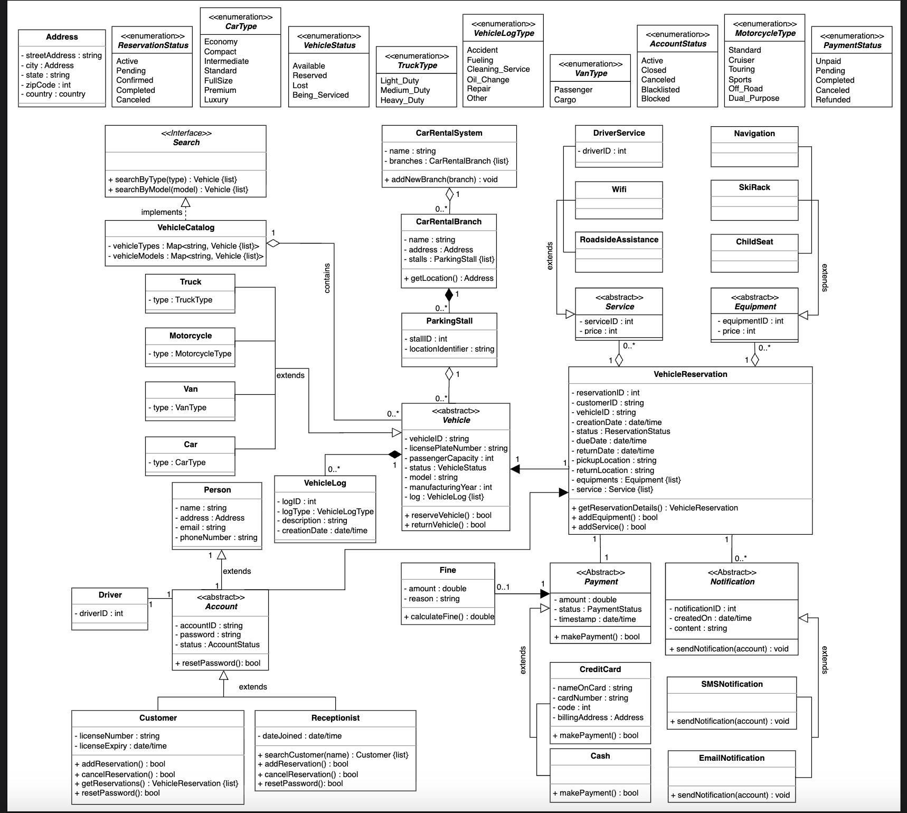

## Design Pattern: Decorator

To promote extensibility and adhere to design principles like SRP (Single Responsibility Principle) and OCP (Open/Closed Principle), the Decorator pattern is used for dynamic fee calculation and feature extension.

- **DiscountDecorator**: Applies discounts to all types of vehicles.
- **PeakSeasonDecorator**: Adjusts pricing during peak demand periods.
- **DamageFineDecorator**: Calculates fines for returned vehicles with damage.
- **FuelFineDecorator**: Calculates fines for vehicles returned with a partially filled fuel tank.

These decorators enable the system to add or modify price-related behaviors without changing the underlying vehicle, reservation, or payment classes. Additional decorators can be introduced as system needs evolve to maintain modularity and flexibility.

## Additional Requirements: Barcode Scanner

The system requires that each vehicle has a unique barcode associated with it. The system should be able to scan the barcode of every vehicle to facilitate identification and tracking.

- This barcode can be used for quick check-in and check-out of vehicles.
- Barcode scanning improves accuracy in vehicle identification and streamlines operational workflows.
- Integration involves adding a barcode attribute to the vehicle class and implementing scanning functionality in the system interface.
- Barcode scanners or mobile scanning apps can be used to read the barcode data linked to vehicle information in the system.

This requirement enhances inventory management and helps automate processes like vehicle tracking and reservation verification.

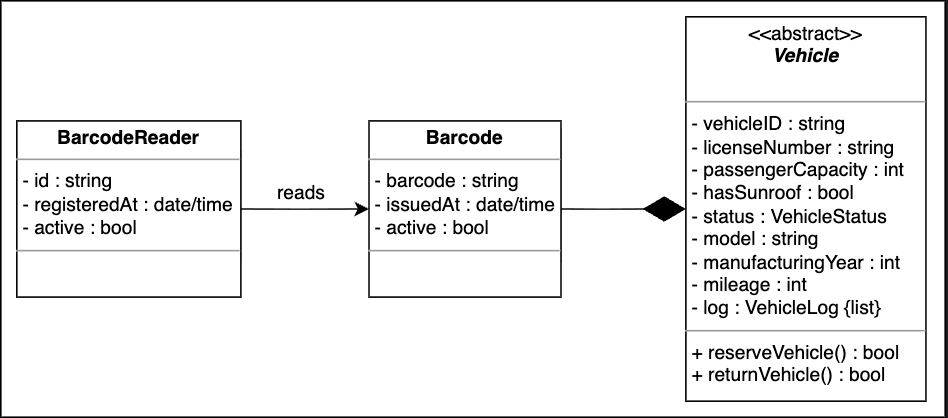

