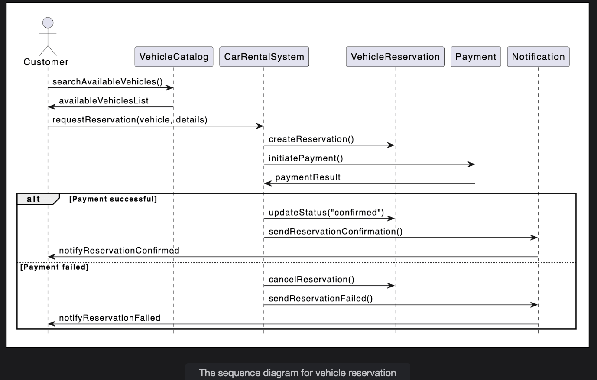
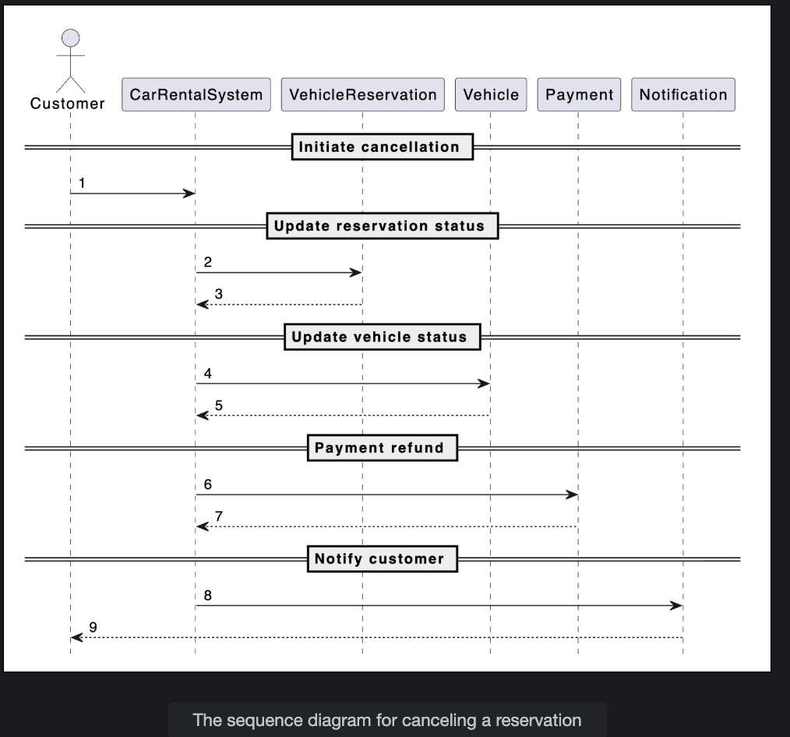
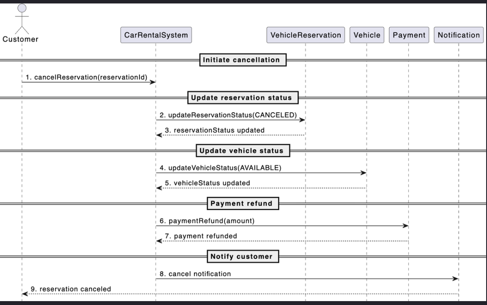

# Sequence Diagram for the Car Rental System

Create a sequence diagram for online vehicle reservation in the car rental system and solve a challenge.

Sequence diagrams illustrate the flow of messages and method calls between various actors and objects in the system as they participate in a business process. They are invaluable for visualizing how objects collaborate to complete key scenarios.

In this lesson, we will create sequence diagrams for two essential interactions in the car rental system:

* Vehicle reservation (the customer reserves a vehicle)
* Reservation cancellation (the customer cancels a reservation)

## Vehicle reservation

The sequence diagram for vehicle reservation should have the following actors and objects that will interact with each other:

### Actors and objects involved:

* Actor: `Customer` (or `Receptionist`, acting on behalf of a customer)
* Objects: `VehicleCatalog`, `CarRentalSystem`, `VehicleReservation`, `Payment`, and `Notification`

### Interaction steps

1. **Search for vehicle:**
   1. `Customer` requests to search available vehicles.
   2. `CarRentalSystem` interacts with the `VehicleCatalog` to retrieve available vehicles.
   3. `VehicleCatalog` returns a list of available vehicles.

2. **Select and reserve vehicle:**
   1. `Customer` selects a vehicle to reserve.
   2. `CarRentalSystem` checks if the vehicle is available.
   3. If available, the `CarRentalSystem` creates a new `VehicleReservation` object.

3. **Payment processing:**
   1. `CarRentalSystem` calculates the reservation fee.
   2. `CarRentalSystem` prompts the `Customer` for payment.
   3. `Customer` initiates the payment (via `Payment` object).
   4. `Payment` is processed.
      1. If successful:
         1. `CarRentalSystem` updates the reservation status to "confirmed."
         2. `CarRentalSystem` triggers a `Notification` to the customer (reservation confirmation).
         3. `Customer` receives confirmation that the reservation is successful.
      2. If unsuccessful:
         1. `CarRentalSystem` deletes/cancels the reservation.
         2. `CarRentalSystem` triggers a `Notification` to the customer (reservation failed).
         3. `Customer` is notified that the reservation is unsuccessful.

4. **Vehicle unavailability:**
   1. If no vehicles are available, the `CarRentalSystem` notifies the `Customer` accordingly.

Based on the order above, the sequence diagram of a vehicle reservation in a car rental system is provided below:

## Sequence challenge: Cancel reservation
You’ll help us complete a sequence diagram for a reservation canceled by the member. A skeleton of the cancel reservation sequence diagram is given below:

Notice that the arrows in the diagram above are numbered from 1 to 9. Below are the messages between the actor(s) and object(s). Can you rearrange the messages below in the correct sequence of order they should appear in the skeleton of the sequence diagram given above?

<strong>Click to view related requirements</strong>

 

