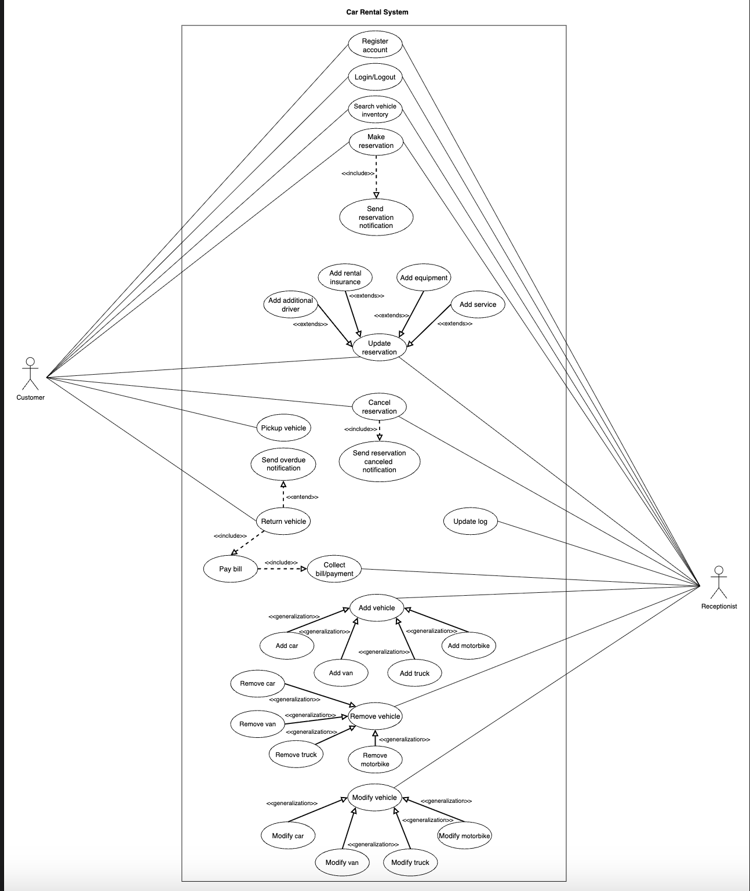

# Use Case Diagram for the Car Rental System

Learn how to define use cases and create the corresponding use case diagram for the car rental system.

Let's build the use case diagram for the car rental system and understand the relationship between its main actors and system functions. First, we'll define the different elements of our system, followed by the complete use case diagram and a detailed breakdown of actors and use cases.

## System

Our system is the **Car Rental system**. It manages automated vehicle reservations, returns, payments, and services for customers across multiple branches.

## Actors

Now, we'll define the main actors of our car rental system.

### Primary Actors

**Customer:** The primary user, able to register, search vehicles, make and manage reservations, pick up and return vehicles, and make payments.

### Secondary Actors

**Receptionist:** The system operator who can perform all customer operations on behalf of a customer (e.g., register a customer, search, make/update/cancel reservations, and process payments), manage vehicle inventory, and update vehicle logs.

## Use Cases

This section defines the use cases for the Car Rental system. We have listed the use cases according to their respective interactions with a particular actor.

> **Note:** You'll see some use cases occurring multiple times because they are shared among different actors in the system.

### Customer

- **Register account:** Create a new customer profile with personal information in the system.
- **Login/Logout:** Securely sign in or out of the system.
- **Search vehicle inventory:** Search and view available vehicles by type, model, location, or availability.
- **Make reservation:** Reserve a vehicle for specific dates and locations, optionally selecting equipment and services.
- **Update reservation:** Request to add additional services such as ski rack, child seat, etc.
- **Cancel reservation:** Cancel an existing reservation before the scheduled pickup time.
- **Pickup vehicle:** Complete check-in and collect a reserved vehicle from the designated branch or location.
- **Return vehicle:** Complete check-out and return a rented vehicle to an authorized branch.
- **Pay bill:** Make payment for rental charges, including any extra services, fines, or late fees.

### Receptionist

The following are a few use cases on behalf of customers:

- **Register account:** Create a new account for customers.
- **Login/Logout:** Securely sign in or out of the system.
- **Search vehicle inventory:** On behalf of a customer, search and view available vehicles by type, model, location, or availability.
- **Make reservation:** Reserve a vehicle for specific dates and locations, optionally selecting equipment and services on behalf of a customer.
- **Update reservation:** Request to add additional services such as ski rack, child seat, etc., on behalf of a customer.
- **Cancel reservation:** Cancel an existing reservation before the scheduled pickup time on behalf of a customer.
- **Add vehicle:** Register a new vehicle in the branch inventory, specifying type and details.
- **Remove vehicle:** Remove a vehicle from the inventory (e.g., for maintenance or decommission).
- **Modify vehicle info:** Update vehicle information or status (e.g., availability, service state).
- **Update reservation:** Change details of an existing reservation, such as dates, vehicle type, or selected services.
- **Update log:** Record or update significant vehicle events, such as maintenance, repairs, or status changes.
- **Collect bill/payment:** Accept and process customer payment upon vehicle return.

### Car Rental System

- **Send reservation notification:** Automatically send reservation confirmations to customers.
- **Send reservation cancellation notification:** Notify customers when a reservation is canceled.
- **Send overdue notification:** Notify customers about overdue vehicle returns and any associated fines.

## Relationships

This section describes and justifies the system's relationships between actors and use cases. Understanding why each relationship is used will help clarify system behaviors, support extensibility, and avoid redundancy in the design.

### Generalization

We'll use the generalization relationship to add, remove, or modify a vehicle. However, each vehicle type (Car, Truck, Van, Motorcycle) may have unique attributes or business rules. By using generalization:

- The system models **Add Vehicle** as the common behavior.
- Each specialized use case (Add Car, Add Truck, etc.) inherits from the general use case and can include additional, type-specific steps.

This approach improves maintainability and scalability; only a new specialized use case must be added if a new vehicle type is introduced.

**Examples:**

- **Add Vehicle** generalizes to Add Car, Add Truck, Add Van, and Add Motorcycle.
- **Remove Vehicle** generalizes to Remove Car, Remove Truck, Remove Van, and Remove Motorcycle.
- **Modify Vehicle** generalizes to Modify Car, Modify Truck, Modify Van, and Modify Motorcycle.

### Associations

The table below shows the association relationship between actors and their use cases.

| Customer | Receptionist | Car Rental System |
|----------|--------------|-------------------|
| Register account | Register account | Send a reservation canceled notification |
| Login/Logout | Login/Logout | Send a reservation notification |
| Search vehicle inventory | Search vehicle inventory | Send overdue notification |
| Make reservation | Make reservation | |
| Update reservation | Update reservation | |
| Cancel reservation | Cancel reservation | |
| Pickup vehicle | Add vehicle | |
| Pay bill | Modify vehicle info | |
| Return vehicle | Remove vehicle | |
| | Update log | |
| | Collect the bill/payment | |

### Include

The "include" relationship is used when a use case always requires the execution of another use case as part of its flow. This avoids duplicating logic and ensures consistency.

For example, whenever a customer returns a vehicle or cancels a reservation, it is always necessary to process payment for the rental, including any outstanding fees (such as late fines, damages, or extra services). By modeling **Pay bill** as an included use case:

- The return and cancellation processes consistently enforce billing.
- Any changes to payment handling are managed in a single place (the included use case).

**Examples:**

- **Return vehicle** includes **Pay bill** (the billing/payment process always occurs as part of returning a vehicle).
- **Make reservation** includes **Send reservation notification** (a confirmation is always sent after successful reservation).
- **Cancel reservation** includes **Send reservation cancellation notification** (notification is always sent on cancellation).
- **Return vehicle** includes **Send overdue notification** (if the vehicle is returned late, an overdue notification is sent).

### Extend

An "extend" relationship allows optional or conditional behavior to be attached to a base use case. The extension use case is only executed if certain criteria are met.

For instance, when making or updating a reservation, customers may add extras—such as rental insurance, an additional driver, WiFi, or a child seat—but these are not always required. Using "extend":

- The base reservation process remains focused and uncluttered.
- Optional features can be added or changed easily, without modifying the main flow.

**Examples:**

**Update reservation** extends to:
- Add rental insurance
- Add additional driver
- Add service (e.g., Wi-Fi, driver, roadside assistance)
- Add equipment (e.g., child seat, ski rack, navigation system)

These extensions are invoked only if the customer requests them during the reservation or update process.

## Use case diagram
Here’s the use case diagram for the car rental system:

 

---

# Use Case Diagram for the Car Rental System — Deep Explanation

This section defines how the system behaves, who interacts with it, and what use cases must exist. An interviewer wants to see whether you understand how to convert **requirements → use cases → behaviors**.

---

## 1. System Boundary

The **"system"** here is **Car Rental System** — a digital platform that automates:

* Searching vehicles
* Creating reservations
* Tracking vehicle logs
* Handling payments
* Managing inventory
* Sending notifications

**Everything we describe must fall inside this boundary.**

---

## 2. Actors

### Primary Actor: Customer

This is your main external user. They:

* Create & manage reservations
* Search vehicles
* Make payments
* Pick/return vehicles
* Add services or equipment

**This is the core business flow.**

### Secondary Actor: Receptionist

A system operator who:

* Gives support to a customer
* Helps them create reservations
* Manages inventory
* Updates vehicle logs
* Accepts payment

**Think of them like an admin user.**

---

## 3. Use Cases

The interviewer wants to know if you can derive use cases directly from requirements. Here's a clean mapping:

### Customer Use Cases

#### Account & Auth
* Register account
* Login/Logout

#### Inventory & Reservation
* Search vehicle
* Make reservation
* Update reservation
* Cancel reservation
* Pick up vehicle
* Return vehicle

#### Billing
* Pay bill

---

### Receptionist Use Cases

#### Customer Support
* Register customer
* Search vehicles
* Make/Update/Cancel reservation
* Pick/Return on behalf of customer
* Collect payment

#### Vehicle Inventory
* Add vehicle
* Remove vehicle
* Modify vehicle info
* Update vehicle log

**They can operate everything the customer can, plus inventory management.**

---

### System (Automated) Use Cases

These are not manually triggered — **system does them automatically**.

* Send reservation confirmation
* Send cancellation notification
* Send overdue notification

**This shows you understand automation.**

---

## 4. Relationships Between Use Cases

This is where **most candidates fail**. If you explain this cleanly, you look senior.

---

### A. Generalization

Used when you have a **common behavior + specialized versions**.

#### Example:

```
Add Vehicle
    ↓ (generalization)
    ├── Add Car
    ├── Add Truck
    ├── Add Van
    └── Add Motorcycle
```

#### Why generalization?

* Each type may require extra fields
* You avoid rewriting logic
* New vehicle type? Just add a new child use case

**Shows scalability.**

---

### B. Association

Simple **"actor ↔ use case"** relationship. Means: this actor participates in this use case.

#### Example:

* Customer ↔ Make Reservation
* Receptionist ↔ Add Vehicle
* System ↔ Send Notification

Nothing complex here — just mapping.

---

### C. Include

Used when a use case **must always include** another use case.

#### Example 1

```
Return Vehicle → includes → Pay Bill
```

**Because payment is always required on return.**

#### Example 2

```
Make Reservation → includes → Send Reservation Notification
```

**Notification must always be sent.**

#### Why use include?

* Avoid duplication
* Keep base use cases clean
* Change logic in one shared place

---

### D. Extend

Used for **optional behaviors**.

**Base:** Update Reservation

**Extensions:**
* Add insurance
* Add additional driver
* Add service (Wi-Fi, driver, roadside assistance)
* Add equipment (child seat, ski rack, GPS)

**These are optional — execution depends on conditions.**

#### Why use extend?

* Base use case stays simple
* Optional logic goes into separate modules
* Easy future expansion

---

## 📊 Complete Use Case Overview

### Customer Use Cases Summary

| **Category** | **Use Cases** |
|-------------|---------------|
| Account | Register, Login, Logout |
| Search & Browse | Search vehicles by criteria |
| Reservation | Make, Update, Cancel reservation |
| Operations | Pickup vehicle, Return vehicle |
| Payment | Pay bill |

### Receptionist Use Cases Summary

| **Category** | **Use Cases** |
|-------------|---------------|
| Customer Support | Register customer, Assist with reservations |
| Inventory Management | Add/Remove/Modify vehicles |
| Operations | Process pickup/return, Collect payment |
| System Maintenance | Update vehicle logs, Manage parking stalls |

### System Automated Use Cases

| **Trigger** | **Action** |
|------------|-----------|
| Reservation created | Send confirmation notification |
| Reservation cancelled | Send cancellation notification |
| Return overdue | Send overdue notification + Generate fine |

---

## 🎯 Use Case Relationship Summary

| **Relationship** | **Symbol** | **When to Use** | **Example** |
|-----------------|-----------|----------------|-------------|
| **Association** | ——— | Actor participates in use case | Customer ——— Make Reservation |
| **Generalization** | ◁——— | Specialized versions of base case | Add Vehicle ◁——— Add Car |
| **Include** | ——«include»→ | Always executes | Return Vehicle ——«include»→ Pay Bill |
| **Extend** | ←——«extend»—— | Optional execution | Update Reservation ←——«extend»—— Add Insurance |

---

## 💡 Interview Tips

### What Interviewers Look For:

1. **Clear actor identification** - Did you identify all user types?
2. **Complete use case coverage** - Did you miss any major functionality?
3. **Proper relationships** - Do you understand include vs extend?
4. **System automation** - Did you identify automated behaviors?
5. **Scalability thinking** - Did you use generalization for extensibility?

### Common Mistakes to Avoid:

❌ Confusing include and extend  
❌ Missing system-triggered use cases  
❌ Not using generalization for vehicle types  
❌ Forgetting receptionist capabilities  
❌ Mixing implementation details with use cases

---
