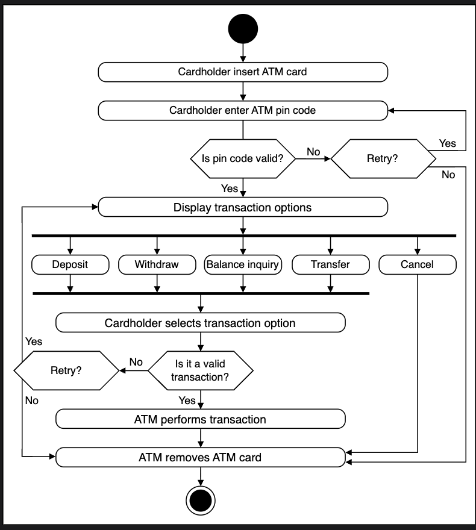
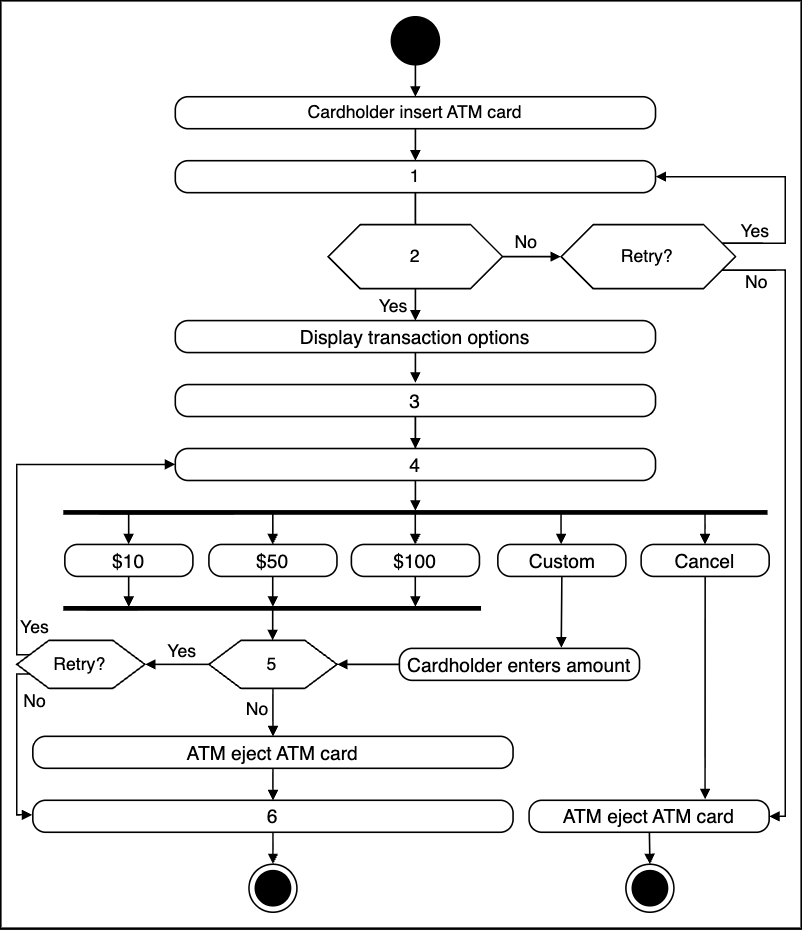
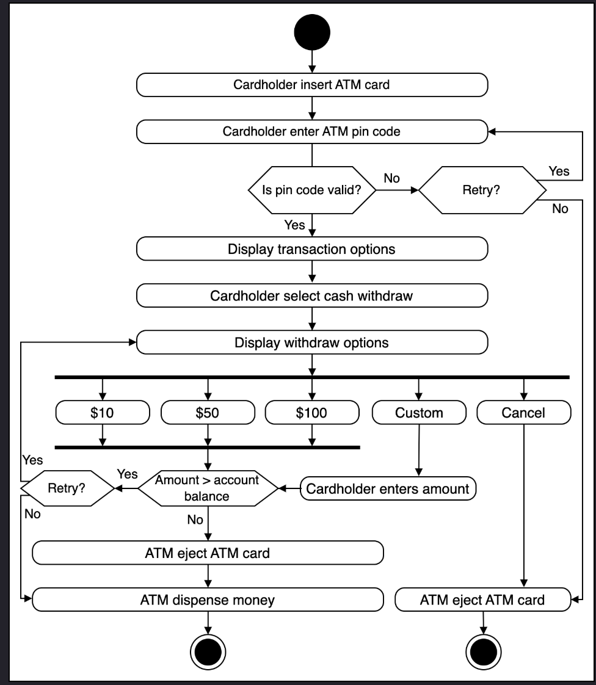

# Activity Diagram for the ATM System

Create activity diagrams for the ATM system.

An activity diagram is a great way to visualize the flow of messages from one activity to another in the system. There can be different activity diagrams that we can create for our ATM. In this lesson, we will create activity diagrams for the following two activities:

* The cardholder performs ATM transactions.
* Activity challenge: The cardholder performs an ATM cash withdrawal.

## The cardholder performs ATM transactions

The following are the states and actions that will be involved in this activity diagram.

### States

**Initial state:** The cardholder inserts an ATM card.

**Final state:** There are two final states in this activity diagram, as shown below:

* The cardholder gets an error message for the wrong ATM PIN.
* The cardholder performs a transaction successfully.

### Actions

The cardholder approaches the ATM, inserts their card, and enters their PIN. If the PIN is correct, they are allowed to perform a transaction. If the PIN is incorrect, the ATM returns the card. The cardholder then has the option to select from four different transactions. After completing their chosen transaction, the cardholder receives their card back from the ATM.

Based on the order above, the activity diagram is given below.

## Activity challenge: The cardholder performs an ATM cash withdrawal
You’ll help us create an activity diagram of a cardholder performing an ATM cash withdrawal.

The skeleton of the activity diagram is shown below.

Notice that the actions in the diagram above are numbered from 1 to 6. The slots below represent the activities, and the arrows represent the flow from one activity to another. Can you rearrange the slots below in the correct order they should appear in the activity diagram above?

<strong>Click to view related requirements</strong>

