# Class Diagram for the ATM System

Learn to create a class diagram for the ATM design using the bottom-up approach.

In this lesson, we'll design the classes and then identify the relationship between classes according to the requirements for the ATM design problem.

## Components of the ATM system

As mentioned earlier, we'll design the class diagram for the ATM using a bottom-up approach.

### User

The `User` class models a bank customer who uses the ATM. It holds the user's `ATMCard` and associated `BankAccount` and initiates ATM sessions and transactions.

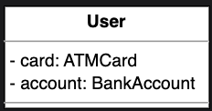

<strong>Click to view related requirements</strong>

**R1:** Each user has a single account at the bank that they can access by inserting their card into the ATM.

### ATM card
The `ATMCard` class encapsulates the details required for card-based authentication and authorization. It uniquely identifies a user’s bank card for ATM operations and secures access through PIN verification.

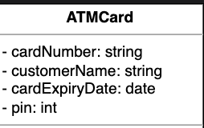

<strong>Click to view related requirements</strong>

**R4:** All transactions are possible after the successful authentication of the ATM card.

### Bank account
The `BankAccount` class represents a user's bank account. Two concrete types extend it: `SavingAccount` and `CurrentAccount`.

* `SavingAccount`: This derived class represents a savings account with a withdrawal limit.
* `CurrentAccount`: This derived class represents a current/checking account with a withdrawal limit.

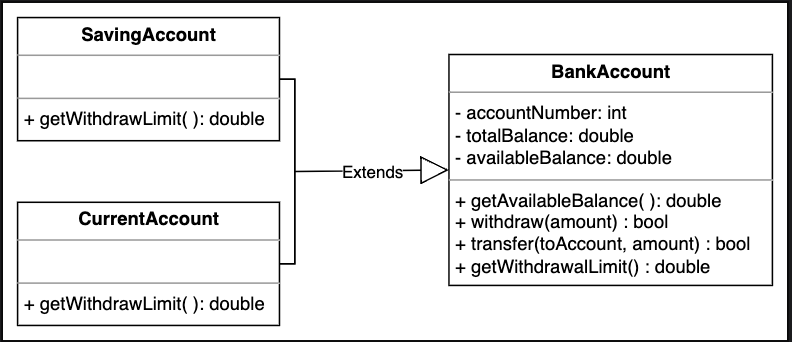

<strong>Click to view related requirements</strong>

**R1:**  Each user has a single account at the bank that they can access by inserting their card into the ATM.
**R5:**  The user can have two types of accounts—current and savings—and can perform the following operations on the ATM:
   - Balance inquiry
   - Cash withdrawal
   - Funds/money transfer

### Bank
The `Bank` class models a financial institution responsible for accounts and cards. It provides account validation and backend transaction processing, and associates the bank code and name with issued cards and accounts.

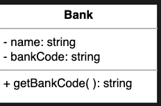

<strong>Click to view related requirements</strong>

**R1:** Each user has a single account at the bank that they can access by inserting their card into the ATM.

### Card reader, cash dispenser, keypad, screen, and printer

* `CardReader`: This class accepts or rejects a card.
* `CashDispenser`: This class provides the required amount specified by the user in cash.
* `Keypad`: This class allows the user to enter the PIN.
* `Screen`: This class represents a screen that displays information upon card insertion.
* `Printer`: This class represents a printer that prints the transaction/withdrawal receipts for the user.

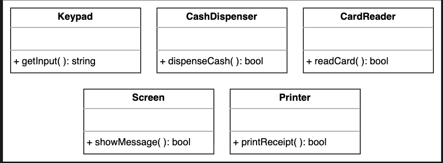

<strong>Click to view related requirements</strong>

**R2:** The main components of the ATM system that facilitate interactions between the user and the machine are listed below:
   - **Card reader:** To read the user’s ATM card
   - **Keypad:** To enter information such as the user’s PIN
   - **Screen:** To display messages to the user, such as prompts or error messages
   - **Cash dispenser:** To dispense cash to the user
   - **Printer:** To print receipts for the user
   - **Network infrastructure:** To connect with the bank’s computer system to access account information and complete transactions

### ATM state
The `ATMState` abstract class and its concrete subclasses implement the State Design pattern for the ATM. Each state handles only those operations valid during the session, enforcing a robust and safe workflow.

* `IdleState`: ATM is waiting for a card; handles card insertion.
* `HasCardState`: Card is inserted. Handles PIN entry/authentication and card return.
* `SelectionOptionState`: User can select an operation (balance inquiry, withdrawal, transfer, change PIN, or cancel).
* `BalanceInquiryState`: Handles the balance inquiry process and returns the user to operation selection.
* `CashWithdrawalState`: Handles withdrawal, including cash dispensing and updating balances.
* `TransferMoneyState`: Handles funds transfers, including validation and updating accounts.
* `ChangePinState`: Handles the process of updating a card's PIN.

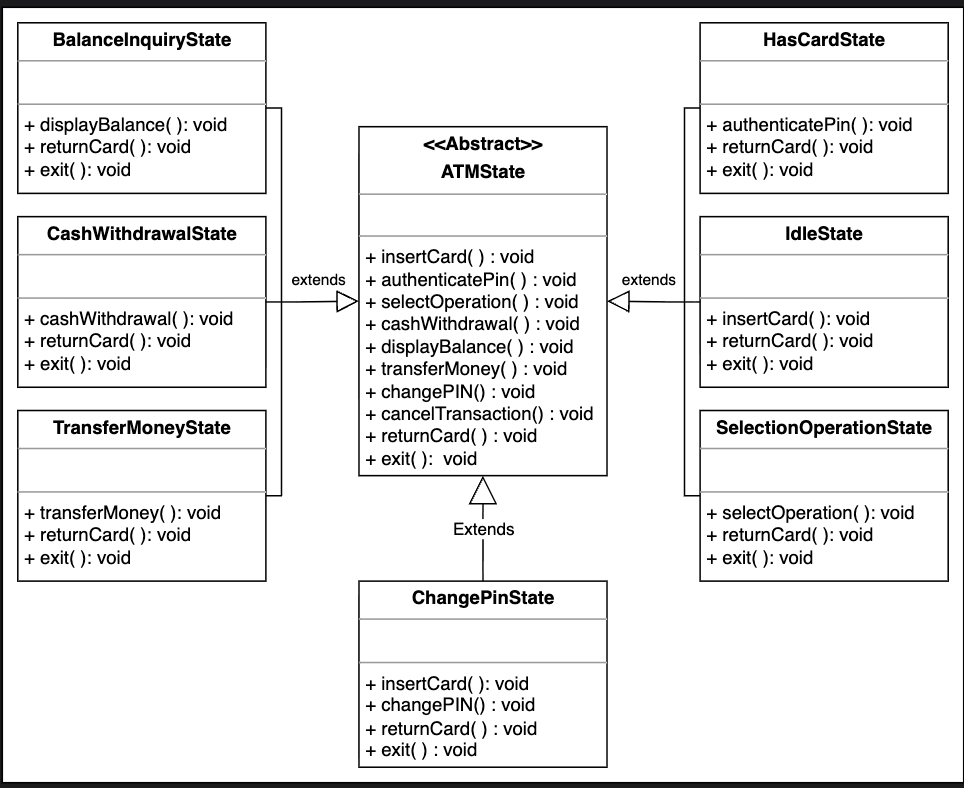

### ATM 
The ATM class models the full automated teller machine, orchestrating every operation. It maintains the current state of operation (`Idle`, `HasCard` , `SelectionOption` transaction states). It also tracks current cash reserves and the count of available bill denominations (hundreds, fifties, tens).

### ATM room
An `ATMRoom` class has an ATM and may or may not have a user.

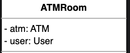

### Enumerations and custom data types
The following overviews the enumerations and custom data types used in this problem.

* `ATMStatus`: This enumeration keeps track of the following states of an ATM:
   * `Idle`
   * `HasCard`
   * `OptionSelected`
   * `CashWithdrawal`
   * `MoneyTransfer`
   * `DisplayBalance`
   * `ChangePIN`
* `TransactionType`: This enumeration represents the following transactions:
   * `BalanceInquiry`
   * `CashWithdrawal`
   * `FundsTransfer`
   * `ChangePIN`
   * `Cancel`

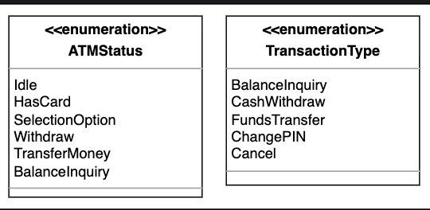

## Relationship between the classes

### Association

The class diagram has the following association relationships:

* `User` is associated with (has a reference to) these objects but does not "own" their life cycle (they can exist without the user object in code).
   * `ATMCard` (one-to-one)
   * `BankAccount` (one-to-one)
* `ATM` is associated with:
   * `Bank` (typically for backend operations or validation; not always a direct attribute in your code, but conceptually, for real transaction validation)
   * `ATMState` (the current session state; owned but could be swapped, so this is a weak composition or aggregation)
   * `User` (the current active user during a session; reference, not strong ownership)
   * `ATMCard` (the currently inserted card in the session)
* `ATMCard` is associated with (via the user) a `BankAccount` (conceptually, not as a direct field).

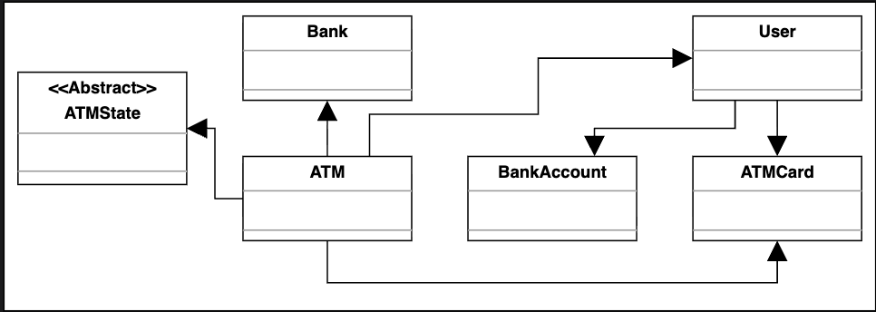

### Composition
The class diagram has the following composition relationships.

* `ATM` is composed of the following hardware components:
   * `CardReader`
   * `CashDispenser`
   * `Keypad`
   * `Screen`
   * `Printer`
* These are usually instantiated and owned by the `ATM` object. If the `ATM` is destroyed, these components cease to exist as well. This is a strong (composition) relationship.

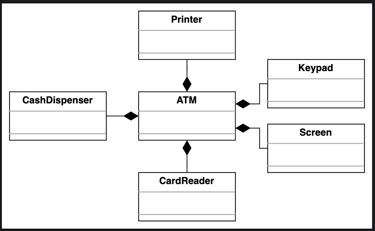

### Inheritance

The following classes show an inheritance relationship:

* `SavingAccount` and `CurrentAccount` both extend the abstract class `BankAccount`.
* All concrete state classes (`IdleState`, `HasCardState`, `SelectionOptionState`, `BalanceInquiryState`, `CashWithdrawalState`, `TransferMoneyState`, `ChangePinState`) extend the abstract class `ATMState`.

> Note: We have already discussed the inheritance relationship between classes in the component section above one by one.

## Class diagram for the ATM System

In this section, we outline the multiplicity (cardinality) relationships between the main classes in our ATM system. We explain the allowed number of instances on each side for each relationship and the real-world or design rationale behind the connection. Understanding these relationships is key to modeling how different entities interact and collaborate to support key workflows in the system.

| Source | Target | Multiplicity | Reason |
|--------|--------|--------------|--------|
| ATM | CardReader | 1--1 | Every ATM has exactly one `CardReader` (composition). |
| ATM | CashDispenser | 1--1 | Every ATM has exactly one `CashDispenser` (composition). |
| ATM | Keypad | 1--1 | Every ATM has exactly one `Keypad` (composition). |
| ATM | Screen | 1--1 | Every ATM has exactly one `Screen` (composition). |
| ATM | Printer | 1--1 | Every ATM has exactly one `Printer` (composition). |
| ATM | ATMState | 1--1 | ATM holds a reference to exactly one current state at any time. |
| ATM | User | 1--0..1 | ATM may have one active user during a session, or none if idle. |
| ATM | ATMCard | 1--0..1 | ATM may have one inserted card during a session, or none if idle. |
| ATM | Bank | 1--1 | ATM belongs to/operates with one bank (assumed in design). |
| User | ATMCard | 1--1 | Each `User` is issued exactly one `ATMCard`. |
| User | BankAccount | 1--1 | Each `User` has exactly one `BankAccount`. |

Here's the complete class diagram for our ATM design:

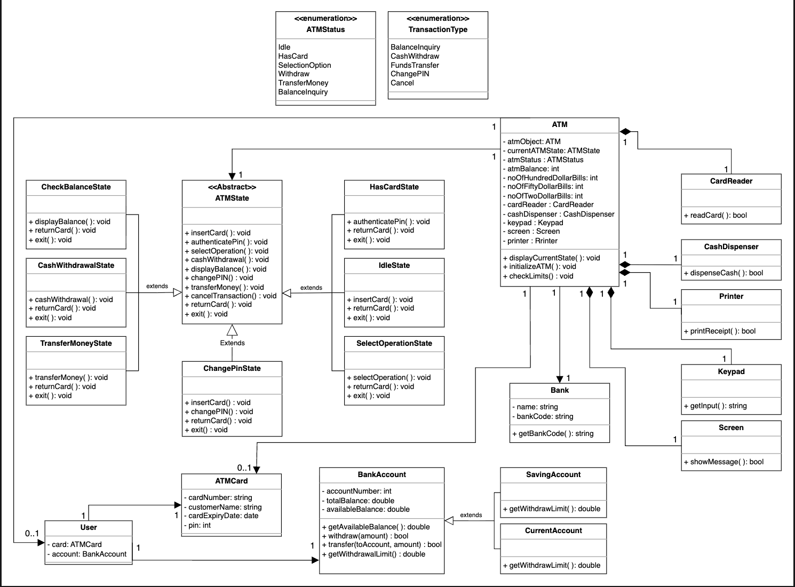

## Design pattern

The following design patterns have been used in the class diagram:

* The Singleton design pattern: This pattern ensures the existence of a single instance of the ATM at a given moment that can be accessed by multiple users, due to the shared nature of the ATM components.
* The State design pattern: This pattern enables the ATM to alter its behavior based on internal changes in the machine. For example, an ATM can transition from one state to another, like switching from an idle state to displaying an account balance or money withdrawal state, and as soon as all the operations have been performed, it can switch back to the initial idle state.

The following design patterns can also be used to design an ATM:

* The Composite design pattern can combine different ATM components and functionalities.
* The Builder design pattern allows the same processes for a complex object to have different representations. In the ATM system, it can help separate different kinds of transactions, such as withdrawals and deposits.

We have completed the class diagram of the ATM system according to the requirements. In the next lesson, let's design its sequence diagram.

## Additional requirements
The interviewer might ask about the workings of the cash withdrawal process. How can it be implemented in our ATM system? This addition is a bit challenging since we need a system that can withdraw the correct combinations of hundred, twenty, and two-dollar bills, respectively, according to the amount specified by the user. The system also needs to work sequentially until the required amount is met.

We will use the Chain of Responsibility design pattern to tackle this addition to our system. This design pattern will ensure the correct division of the dollar bills in the ATM by creating a chain of handlers that forward the requests based on the situation until all the requirements are met. We have created the following classes to implement the Chain of Responsibility design pattern:

* `CashWithdrawProcessor`: This is associated with the `CashWithdrawalState` class. This abstract class is extended by `HundredDollarWithdrawProcessor`, `FiftyDollarWithdrawProcessor`, and `TwoDollarWithdrawProcessor`.
* `HundredDollarWithdrawProcessor`: This class is derived from `CashWithdrawProcessor` and is responsible for withdrawing hundred-dollar bills based on the requirement.
* `FiftyDollarWithdrawProcessor`: This class is derived from `CashWithdrawProcessor` and is responsible for withdrawing twenty-dollar bills based on the requirement.
* `TwoDollarWithdrawProcessor`: This class is derived from `CashWithdrawProcessor` and is responsible for withdrawing two-dollar bills based on the requirement.

**Valid amount:** If the amount entered by the user has a modulus equal to zero with any specified bills that the ATM can withdraw, then the amount is considered valid for the transaction. If the amount is invalid, then the transaction will not be processed.

For example, a user wants to withdraw $548. The `HundredDollarWithdrawProcessor` class will start the cash withdrawal using the `cashWithdrawal()` method by taking out five bills of one hundred dollars. Now that we have $48 to withdraw for the user, less than a hundred dollars, the `FiftyDollarWithdrawProcessor` class will start withdrawing dollar bills. This class will take out two bills of twenty dollars with $8 remaining. Since two dollars is less than twenty, the `cashWithdrawal()` method of the `TwoDollarWithdrawProcessor` will take out four bills of $2 for the user. The withdrawal, in this case, is successful.

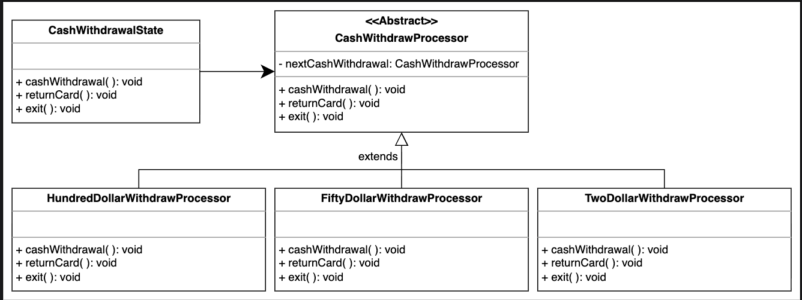