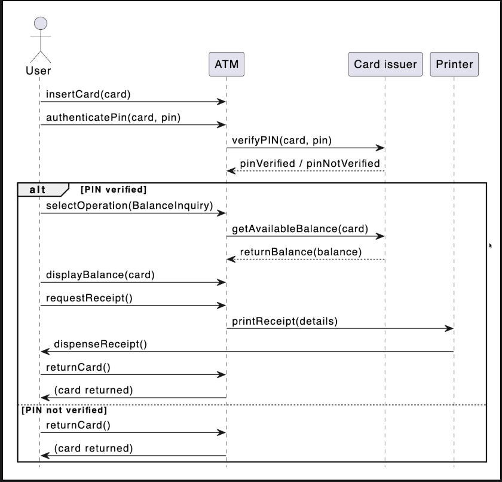

# Sequence Diagram for the ATM System

Create a sequence diagram for how to complete the balance inquiry using an ATM.

A sequence diagram is a great way to understand the interactions between different entities and objects in the system. We can create different sequence diagrams for our ATM. For the sake of this lesson, we will create sequence diagrams for balance inquiry from the ATM.

## Balance inquiry

The sequence diagram for how to complete the balance inquiry using an ATM should have the following actors and objects that will interact with each other:

### Actors and Objects

* Actor: User (the person using the ATM)
* Objects: ATM, Card issuer (Bank), and Printer

### Steps for balance inquiry using an ATM:

1. The user inserts their ATM card into the ATM.
2. The user enters their PIN on the ATM.
   1. The ATM receives the entered PIN and sends a verification request to the card issuer (Bank).
3. The card issuer (Bank) verifies the PIN:
   1. If the PIN is valid, the Bank notifies the ATM that verification was successful.
   2. If the PIN is invalid, the Bank notifies the ATM, which returns the card to the user, ending the session.
4. If the PIN is verified:
   1. The user selects the "Balance Inquiry" operation on the ATM.
   2. The ATM requests the card issuer (Bank) to retrieve the account balance.
   3. The Bank returns the balance information to the ATM.
   4. The ATM displays the balance to the user.
   5. The user requests a printed receipt (optional).
      1. If the user requests a receipt, the ATM instructs the Printer to print the balance details, and the receipt is dispensed to the user.
5. The user ends the session:
   1. The ATM returns the card to the user.

This sequence diagram demonstrates the interactions and method calls between the User, ATM, Bank, and Printer during a balance inquiry transaction.

