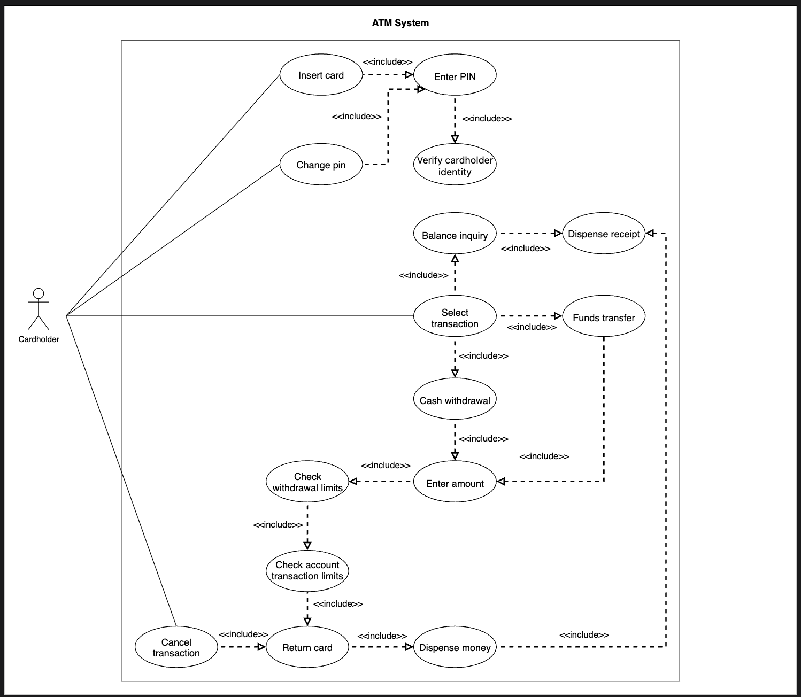

# Use Case Diagram for the ATM System

Learn how to define use cases and create the corresponding use case diagram for the ATM.

Let's build the ATM system's use case diagram and understand the relationship between its main actors and functions. First, we'll define the different elements of our system, followed by the complete use case diagram.

## System

Our system is the ATM system. It manages secure, card-based access for bank customers to perform key banking transactions remotely.

## Actors

Let's define the main actors of our ATM system.

### Primary actor

**Cardholder:** The user who interacts with the ATM to perform banking transactions such as inserting/removing the card, entering PIN, and carrying out account operations.

## Use cases

In this section, we will define the ATM's use cases. We have listed them according to their interactions with a particular actor.

### Cardholder

**Insert card:** To insert the ATM card into the machine.  
**Enter PIN:** To enter their PIN to verify identity.  
**Change PIN:** To change the card's PIN.  
**Select transaction:** To initiate a transaction (generalization of the next four):  
**Balance inquiry:** To check the account balance.  
**Funds transfer:** To transfer money between accounts.  
**Cash withdrawal:** To withdraw the cash.  
**Enter amount:** To enter the amount they want to transfer or withdraw.  
**Cancel transaction:** To cancel a transaction.  

### ATM system  
**Verify cardholder identity:** To validate the card and the cardholder's credentials.  
**Check withdrawal limits:** To validate the ATM's transaction limits and the cardholder's bank limits.  
**Check account transaction limits:** To validate that the transaction is within the account's permissible limits.  
**Return card:** To eject the card after the transaction or cancellation.  
**Dispense money:** To dispense cash during withdrawal.  
**Dispense receipt:** To print and provide a receipt for the transaction.

## Relationships  

This section describes the relationships between and among actors and their use cases.

### Associations

The table below shows the association relationship between actors and their use cases.

| Cardholder | ATM System |
|---|---|
| Insert card | Verify cardholder identity |
| Enter PIN | Check withdrawal limits |
| Change PIN | Check account transaction limits |
| Select transaction | Return card |
| Enter amount | Dispense money |
| Cancel transaction | Dispense receipt |

### Include

When cardholders initiate an ATM session, they must verify their identity by entering their PIN. This process is enforced using "include" relationships in the use case diagram:

* The "Insert card" use case includes the "Enter PIN" use case.
* The "Enter PIN" use case includes the "Verify cardholder identity" use case.

Before a cardholder can change their PIN, the system must authenticate them:  
* The "Change PIN" use case includes the "Enter PIN" use case and then the "Verify cardholder identity" use case.  
When a cardholder chooses to perform a transaction, they must select from the available transaction types:  
* The "Select transaction" use case includes the "Balance inquiry", "Funds transfer", and "Cash withdrawal" use cases.  
For "Funds transfer" and "Cash withdrawal", the cardholder must specify the amount to transfer or withdraw:  
* The "Funds transfer" and "Cash withdrawal" use cases include the "Enter amount" use case.  
When the cardholder enters an amount to withdraw, the system must ensure all limits are respected:  
* The "Enter amount" use case includes the "Check withdrawal limits" use case.
* The "Check withdrawal limits" use case includes the "Check account transaction limits" use case.  
After a transaction (such as a balance inquiry, funds transfer, or cash withdrawal), the system provides a receipt to the cardholder if requested:  
* The "Balance inquiry" and "Cash withdrawal" use cases each include the "Dispense receipt" use case.  
If the cardholder cancels a transaction or ends their session, the ATM must return the card:  
* The "Cancel transaction" use case includes the "Return card" use case.  
At the end of any session, the "Return card" use case is always included to ensure the cardholder retrieves their card.

## Use case diagram

Here's the use case diagram of the ATM design:
