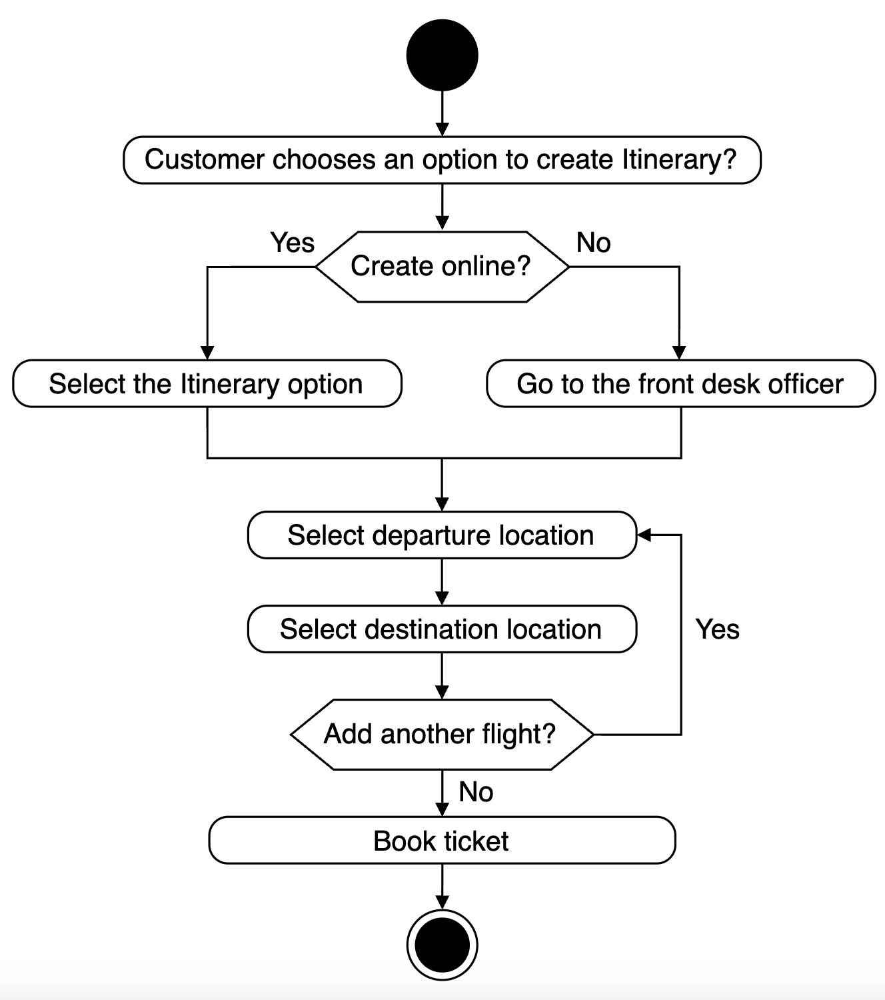
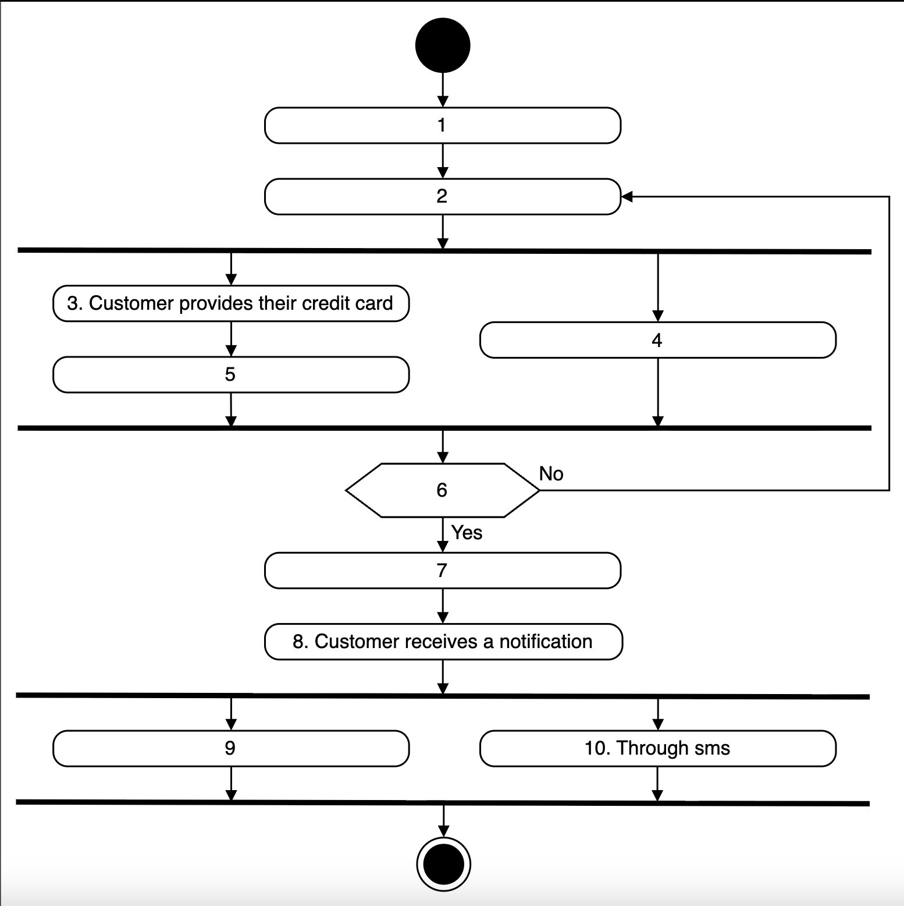
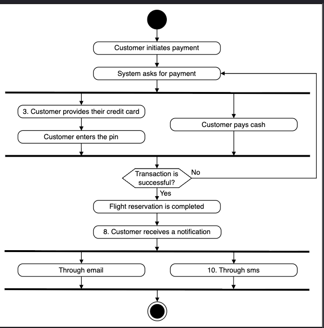

# Activity Diagram for the Airline Management System  
Create some activity diagrams for the airline management system.

Activity diagrams are an effective way to visualize the flow of messages from one activity to another within the system. There can be different activity diagrams that we can create for the airline management system. In this lesson, we will create activity diagrams for the following two activities:

* Creating an itinerary.
* Activity challenge: The user receives a confirmation notification after payment.

## Create an itinerary  
The states and actions involved in this activity diagram are provided below.

### States

**Initial state:** The customer chooses an option to create the itinerary.

**Final state:** A customer books their ticket.

### Actions  
The customer selects an option to create an itinerary online or through the front desk officer. The customer then selects their flights. Finally, the customer books their ticket.

## Activity challenge: The user receives a confirmation notification after payment
Let’s create an activity diagram of a user receiving a confirmation notification after making the payment. A skeleton of the activity diagram is given below:

Notice that the actions in the diagram above are numbered from 1 to 10. The slots below represent the activities, and the arrows indicate the flow from one activity to another. Can you rearrange the slots below in the correct order they should appear in the activity diagram given above?

