# Class Diagram for the Airline Management System
Understand how to create a class diagram for an airline management system using the bottom-up approach.

In the class diagram, we will first design and create the system’s classes, abstract classes, and interfaces. Then, we’ll identify the relationship between classes by all the requirements of the airline management system.

## Components of an airline management system
In this section, we’ll define the classes for an airline management system. As mentioned earlier, we will design the system using a bottom-up approach. First, we will create the classes of small components. Next, we will integrate these components and create the class diagram for the entire system.

### Account
The `Account` class identifies the username and ID of an airline management system user. The class definition is represented below:

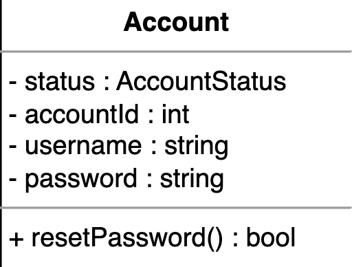

### Person
A Person is an abstract class used to store information related to a person, such as a name, email, phone number, etc. In this class, the Address object type specifies the person’s address. There can be four types of accounts in the system:

* `Admin`: This class manages the overall system, including flight and aircraft records.  
* `Crew`: This class views assigned flights in the system.  
* `FrontDeskOfficer`: This class manages passenger reservations.  
* `Customer`: This class displays flight schedules and allows users to reserve or cancel flight reservations.

The relationship diagram for these classes is shown below:

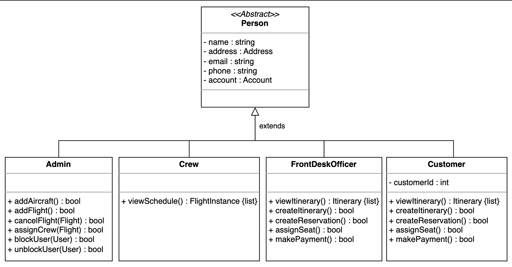

<strong>Click to view related requirements</strong>

**R4:** The system should allow customers to check flight details, such as available seats, flight schedules, and departure/arrival times.  
**R5:** The system admin should be able to add new flights and aircraft. The admin should be able to cancel previous flights.  
**R11:** The front desk officer should be able to reserve tickets, create itineraries, and make flight payments for the customer.  
**R12:** The flight crew should be able to view the schedule for their assigned flights.  

### Airline, airport, and aircraft
The `Airline` class has attributes such as a name and an airline code to distinguish it from other airlines. It is a crucial component of the airline management system.

Each airline operates out of different airports. Therefore, we need the `Airport` class to keep track of all the airports in the system.

Airlines own or hire aircraft to carry out their flights. The `Aircraft` class has attributes such as name, model, and manufacturing year, among others.

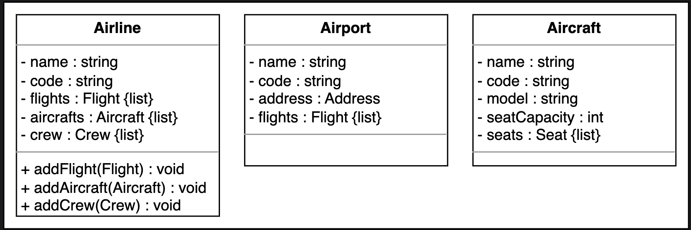

<strong>Click to view related requirements</strong>

**R6:**  An airline should be able to own multiple aircraft, and the admin should be able to add these aircraft to the system.  
**R7:** An airline should be able to operate its flights from different airports.   

### Seat and flight seat
The `Seat` class represents a physical seat in the aircraft. It contains basic information, such as seat number, seat type, and class. The `FlightSeat` class is derived from the `Seat` class and represents the seat assigned to a specific flight instance. It contains the fare for that particular seat and its reference number.

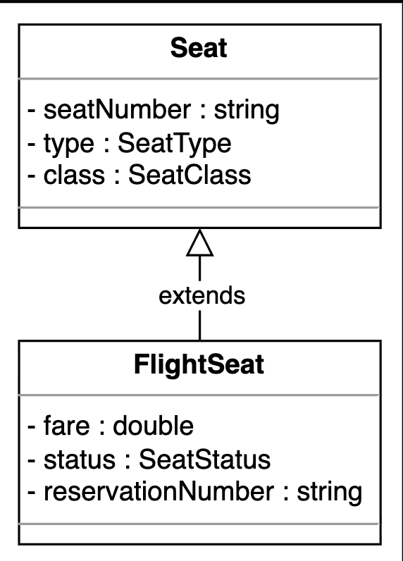

### Flight and flight instance
The `Flight` class contains information about a particular flight, including the flight number, departure and arrival airports, and the duration of the flight. The `FlightInstance` class represents a single occurrence of a flight, since a flight can fly multiple days in a week.

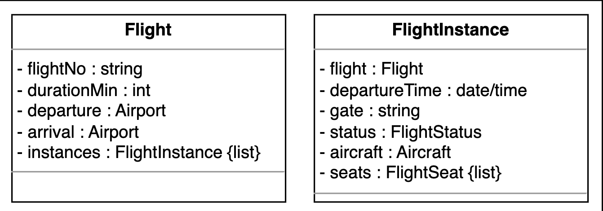

<strong>Click to view related requirements</strong>

**R1:**  A customer should be able to search for flights by date, departure, and destination airport.  
**R4:** The system should allow customers to check flight details, such as available seats, flight schedule, and departure/arrival times.  

### Flight reservation
The `FlightReservation` class manages reservations made by customers against a specific flight instance. It has attributes like a unique reservation number, passengers and their assigned seats, and the reservation status.

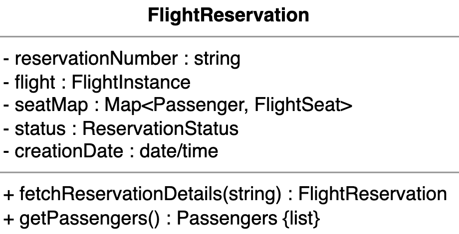

<strong>Click to view related requirements</strong>

**R2:**  Customers should be able to reserve tickets for available flights and book multiple flights at once.

### Itinerary and passenger
Customers create an itinerary for their travel that contains flight reservations. The `Itinerary` class keeps track of all the reservations made, the list of passengers, and the departure/arrival airport.

The `Passenger` class maintains a record of all individuals with reservations. It also includes the basic travel information of the passenger. 

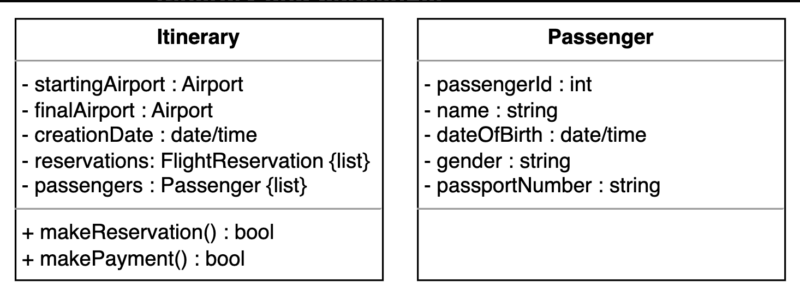

<strong>Click to view related requirements</strong>

**R2:**  Customers should be able to reserve tickets for available flights and book multiple flights at once.

### Search and catalog
The `Search` interface allows customers to search for any flight using the following criteria:

* Departure and arrival date and time  
* Source and destination airports  

The `SearchCatalog` implements the search functionality and contains a list of all flights of the airline. The two classes are shown below:

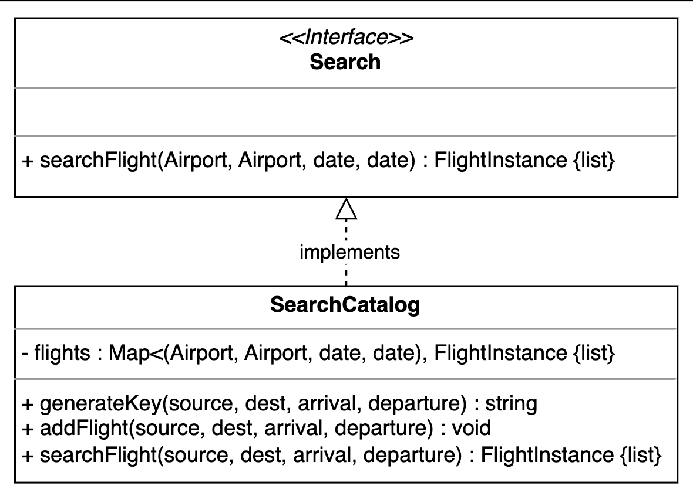

<strong>Click to view related requirements</strong>

**R1:** Customers should be able to search for flights by date, departure, and destination airport.

### Payment
The `Payment` class will be an abstract class and will have two child classes: `CreditCard`, and `Cash`.

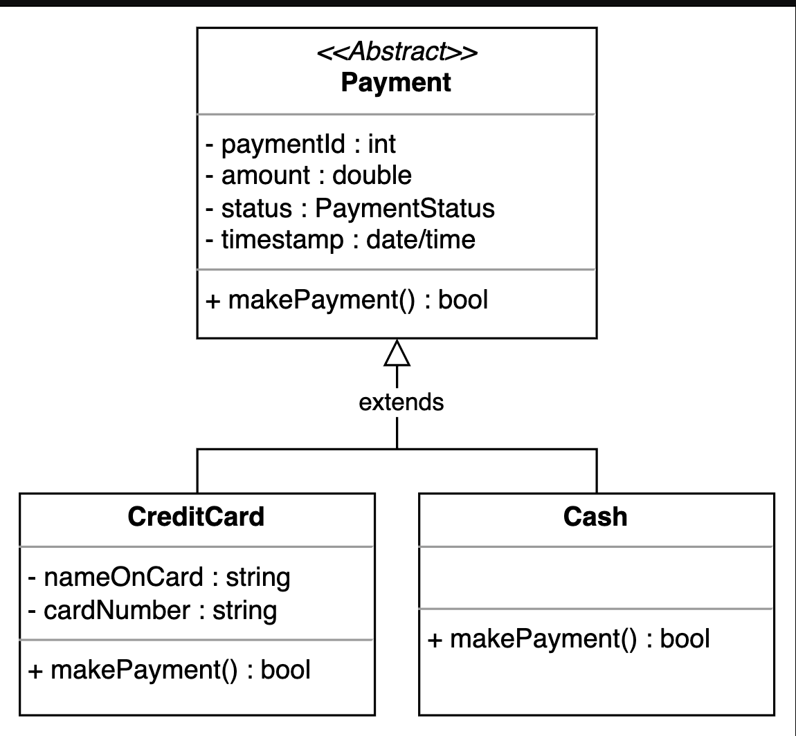

<strong>Click to view related requirements</strong>

**R9:** The customer should be able to make payments against their flight reservations.

### Notification
`Notification` is an abstract class, since it can send a notification via email or SMS. It is primarily responsible for sending notifications as needed.

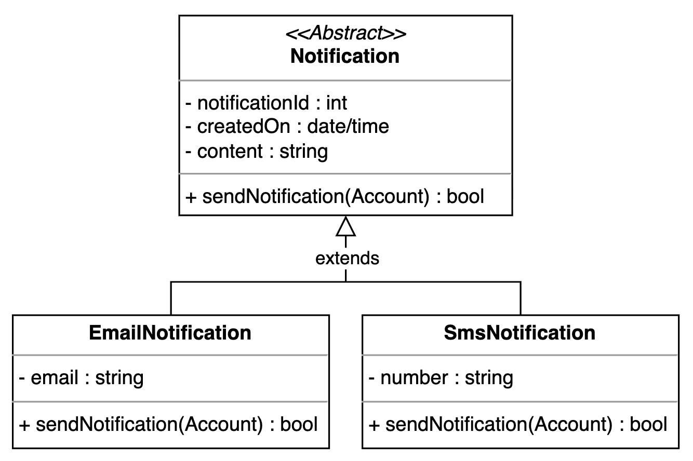

<strong>Click to view related requirements</strong>

**R13:** The system should notify the customer whenever a reservation is made or canceled, or when there is an update regarding their flight.

### Enumerations
The enumerations required in the airline management system design are listed below:

* `AccountStatus`: The account status indicates the current status of a customer’s account—whether it is active, deactivated, closed, or blocked.  
* `SeatStatus`: The seat status tells us whether the seat is available, booked, or a chance seat.  
* `SeatType`: The seat type indicates whether the seat is of a regular, accessible, emergency exit, or extra-legroom type.  
* `SeatClass`: The seat class indicates whether the seat is in Economy, Economy Plus, Business, or First Class.  
* `FlightStatus`: The flight status tracks the flight instance, indicating whether it is active, scheduled, delayed, departed, landed, canceled, diverted, or unknown.  
* `ReservationStatus`: The reservation status indicates the current status of the reservation—whether it is requested, pending, confirmed, checked in, or canceled.  
* `PaymentStatus`: The payment status indicates the current status of the payment—whether it is pending, completed, canceled, failed, declined, or refunded.

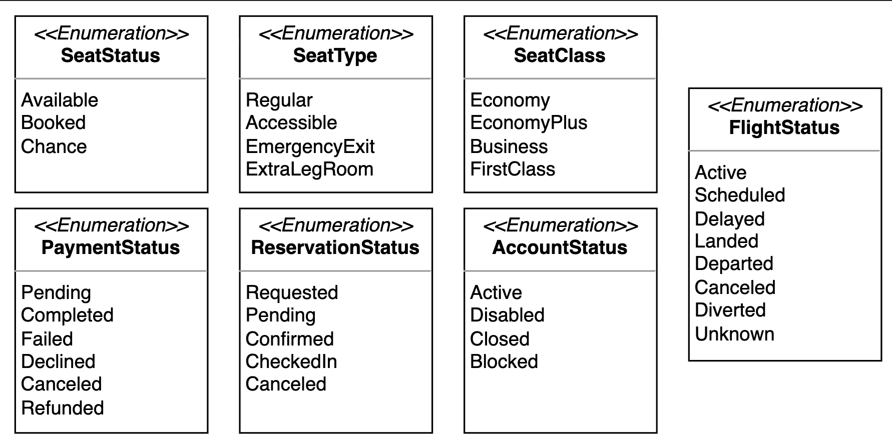

### Custom data type
We need to create a custom data type, `Address`, that will store the physical location of any place.

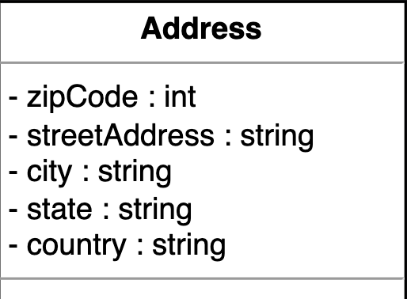

## Relationship between classes
Now, we’ll discuss the relationships between the classes we have defined in our airline management system above.

### Association
The class diagram has the following association relationships:

#### One-way association
* Both `FrontDeskOfficer` and `Customer` classes have a one-way association with the `Itinerary` class.  
* The `FlightReservation` class has a one-way association with the `FlightInstance`, `Payment`, and `Notification` classes.  
* The `FlightSeat` class has a one-way association with the `FlightReservation` class.  
* The `Person` class has a one-way association with the `Search` interface.

#### Two-way association
* The `Airport` class has a two-way association with the `Flight` class.  
* Both the `Aircraft` and `Crew` classes have a two-way association with the `FlightInstance` class.  
* The `Airline` class has a two-way association with the `Crew` class. 

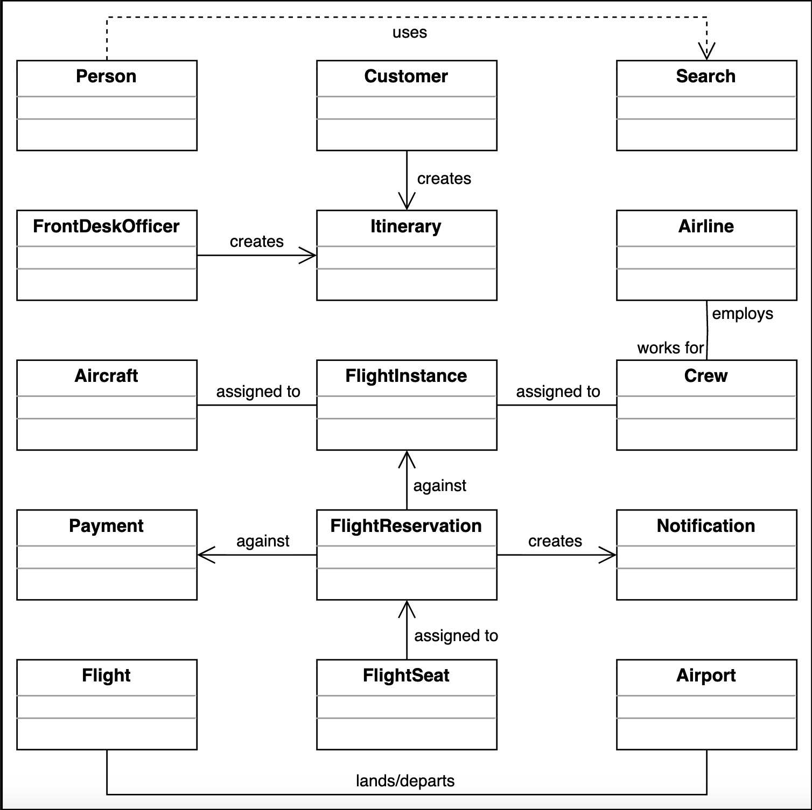

### Aggregation
The class diagram has the following aggregation relationship:

The `Itinerary` class contains the Passenger class.

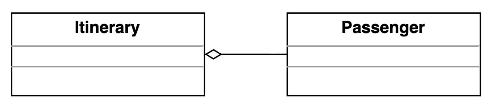

### Composition
The class diagram has the following composition relationships:

* The `Person` class is composed of the `Account` class.  
* The `Airline` class is composed of the `Aircraft` and `Flight` classes.  
* The `Aircraft` class is composed of the `Seat` class.  
* The `Flight` class is composed of the `FlightInstance` class.  
* The `FlightInstance` class is composed of the `FlightSeat` class.  
* The `Itinerary` class is composed of the `FlightReservaion` class. 

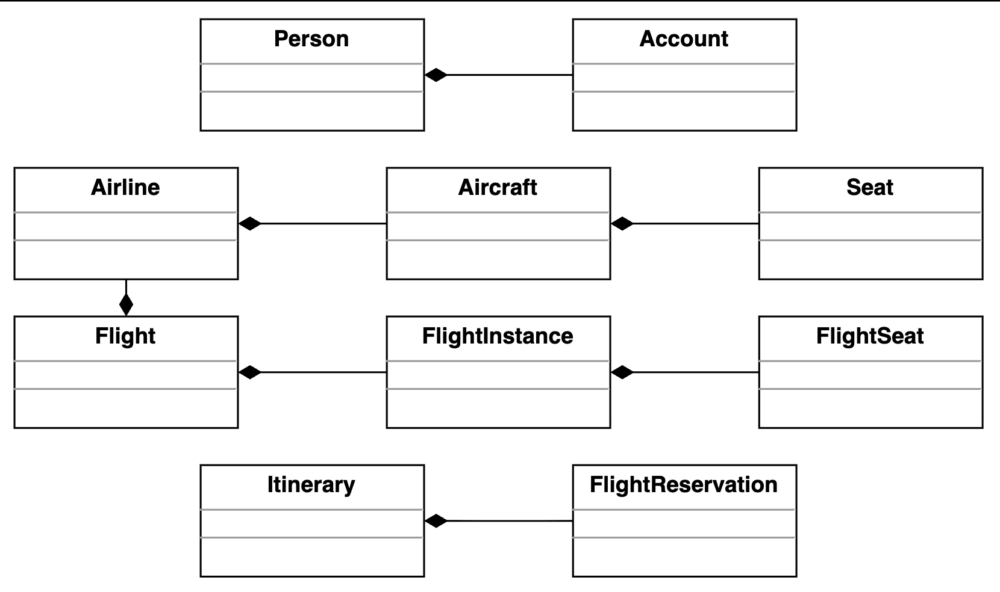

### Inheritance
The following classes show an inheritance relationship:

* The `Admin`, `Crew`, `FrontDeskOfficer`, and `Customer` classes extend the `Person` class.  
* The `FlightSeat` class extends the `Seat` class.  
* The `CreditCard` and `Cash` classes extend the `Payment` class.  
* The `EmailNotification` and `SmsNotification` classes extend the `Notification` class.  

## Class Diagram of the Airline Management System

In this section, we outline the multiplicity (cardinality) relationships between the main classes in our airline management system. For each relationship, we explain the allowed number of instances on each side and the real-world or design rationale behind the connection. Understanding these relationships is key to modeling how different entities interact and collaborate to support key workflows in the system.

### Class Relationships

| Source                | Target                  | Multiplicity | Description                                      |
|-----------------------|-------------------------|--------------|--------------------------------------------------|
| Person                | Account                 | 1 – 1        | Each person has one account                      |
| Customer              | Person                  | 1 – 1        | Customer inherits from Person                    |
| Crew                  | Person                  | 1 – 1        | Crew inherits from Person                        |
| FrontDeskOfficer      | Person                  | 1 – 1        | FrontDeskOfficer inherits from Person            |
| Passenger             | Person                  | 1 – 1        | Passenger inherits from Person                   |
| Flight                | Airport (departure)     | 1 – 1        | Each flight departs from one airport             |
| Flight                | Airport (arrival)       | 1 – 1        | Each flight arrives at one airport               |
| Flight                | FlightInstance          | 1 – 0..*     | A flight has multiple instances                  |
| FlightInstance        | FlightSeat              | 1 – 0..*     | A flight instance has multiple flight seats      |
| FlightInstance        | Flight                  | 0..* – 1     | Multiple flight instances relate to one flight   |
| FlightInstance        | Aircraft                | 1 – 1        | Each flight instance uses one aircraft           |
| FlightInstance        | Crew                    | 0..* – 0..*  | Each flight instance can have multiple crew members |
| Aircraft              | FlightSeat              | 1 – 0..*     | Each aircraft has multiple flight seats          |
| Aircraft              | FlightInstance          | 1 – 0..*     | An aircraft is used in multiple flight instances |
| FlightSeat            | Seat                    | 1 – 1        | Flight seat is based on one seat                 |
| Seat                  | Aircraft                | 0..* – 1     | A seat belongs to one aircraft                   |
| Airline               | Flight                  | 1 – 0..*     | An airline operates multiple flights             |
| Airline               | Aircraft                | 1 – 0..*     | An airline owns multiple aircrafts               |
| Airline               | Crew                    | 1 – 0..*     | An airline has multiple crew members             |
| Itinerary             | Airport (starting)      | 1 – 1        | Itinerary starts at one airport                  |
| Itinerary             | Airport (final)         | 1 – 1        | Itinerary ends at one airport                    |
| Itinerary             | FlightReservation       | 1 – 0..*     | An itinerary includes multiple flight reservations |
| Itinerary             | Passenger               | 1 – 0..*     | An itinerary includes multiple passengers        |
| FlightReservation     | Passenger               | 1 – 0..*     | A flight reservation includes multiple passengers |
| FlightReservation     | FlightInstance          | 1 – 1        | Each reservation is for one flight instance      |
| FlightReservation     | FlightSeat              | 1 – 1        | Each reservation includes one flight seat        |
| FlightReservation     | Payment                 | 1 – 1        | Each reservation is paid with one payment        |
| Payment               | CreditCard              | 1 – 0..*     | Payments can be made via credit card             |
| Payment               | Cash                    | 1 – 0..*     | Payments can be made via cash                    |
| Notification          | EmailNotification       | 1 – 0..*     | Notification via email                           |
| Notification          | SmsNotification         | 1 – 0..*     | Notification via SMS                             |

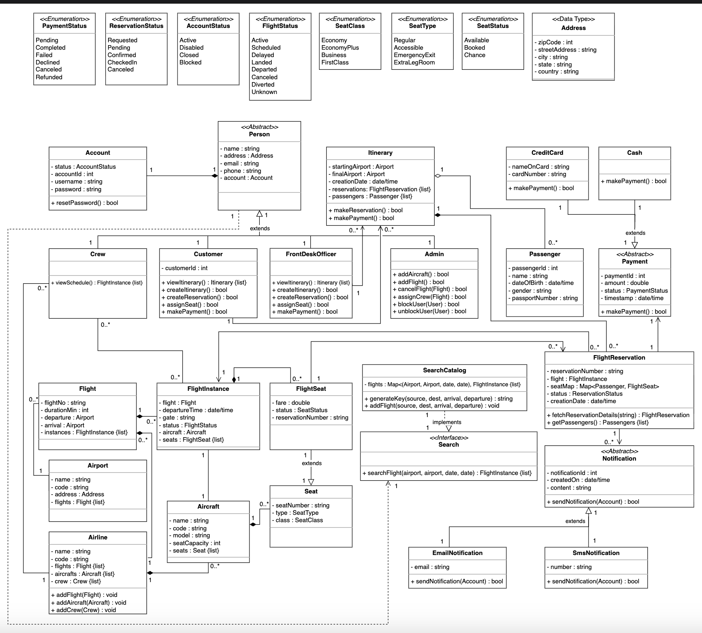

## Design pattern
To implement the airline management system’s core features in a flexible and scalable manner, we apply object-oriented design patterns based on the system's behavior.

* We know that the system sends notifications to users via email or SMS when a reservation is confirmed or a flight is delayed. To model this behavior, we can use the Observer design pattern.  

* We know that the system allows customers to pay using various methods, such as credit cards or cash. To handle these different payment processes, we can use the Strategy design pattern.  

* We know that notifications follow a common structure but differ in the way they are delivered (email vs. SMS). To enforce this structure while allowing specific implementations, we can use the Template Method design pattern.  

* We know that only one instance of the search catalog is needed to manage the flight search system-wide. To ensure this, we can use the Singleton design pattern.  

* We know that an itinerary may contain multiple flight reservations, and a reservation may include multiple passengers. To treat these collections uniformly, we can use the Composite design pattern.  

* We know that creating an itinerary involves setting flights, passengers, and payments step by step. To simplify and manage this construction process, we can use the Builder design pattern.  

* We know that actions like making a reservation, assigning a seat, or processing a payment need to be handled as discrete, trackable tasks. To encapsulate these actions, we can use the Command design pattern.  

* We are aware that the system generates various types of notifications and payment objects. To manage this object creation logic cleanly, we can use the Factory design pattern.